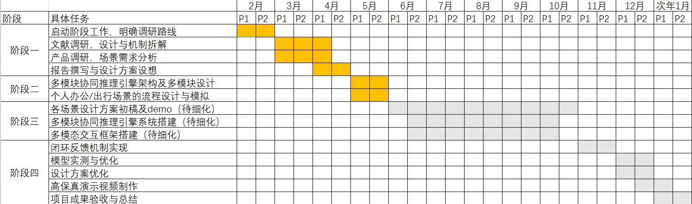
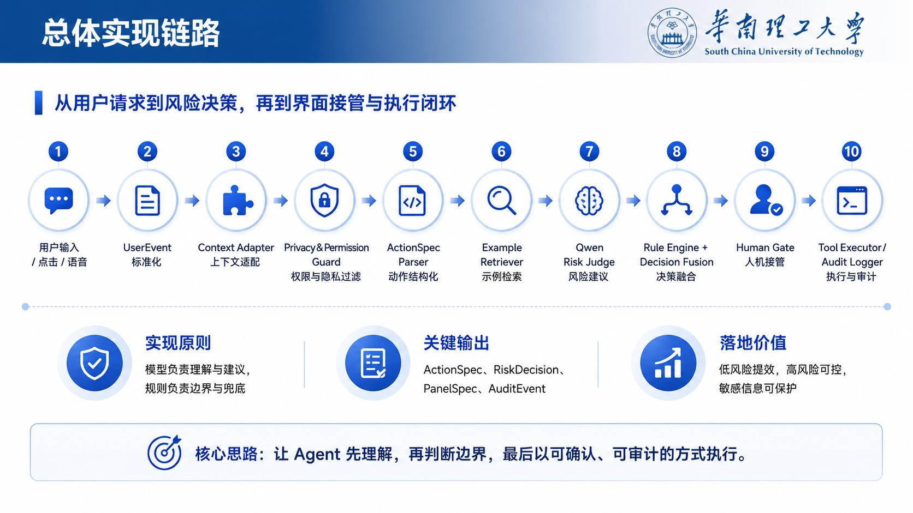
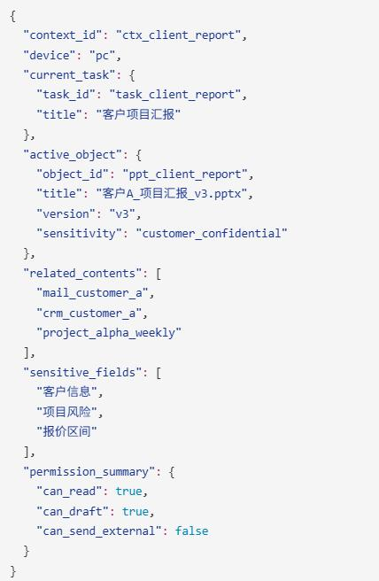
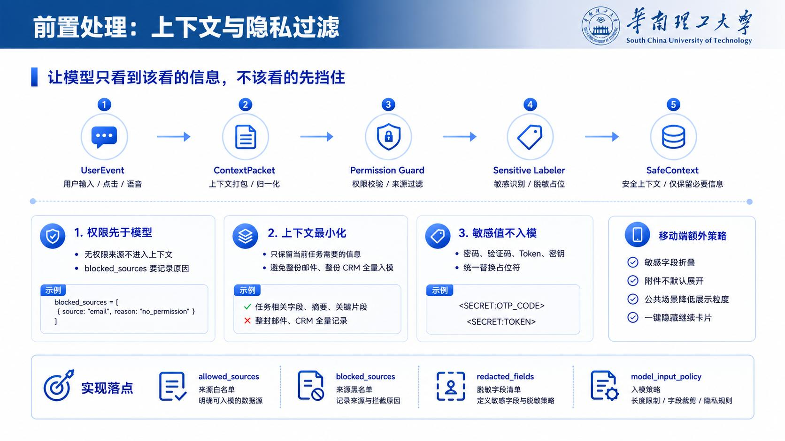
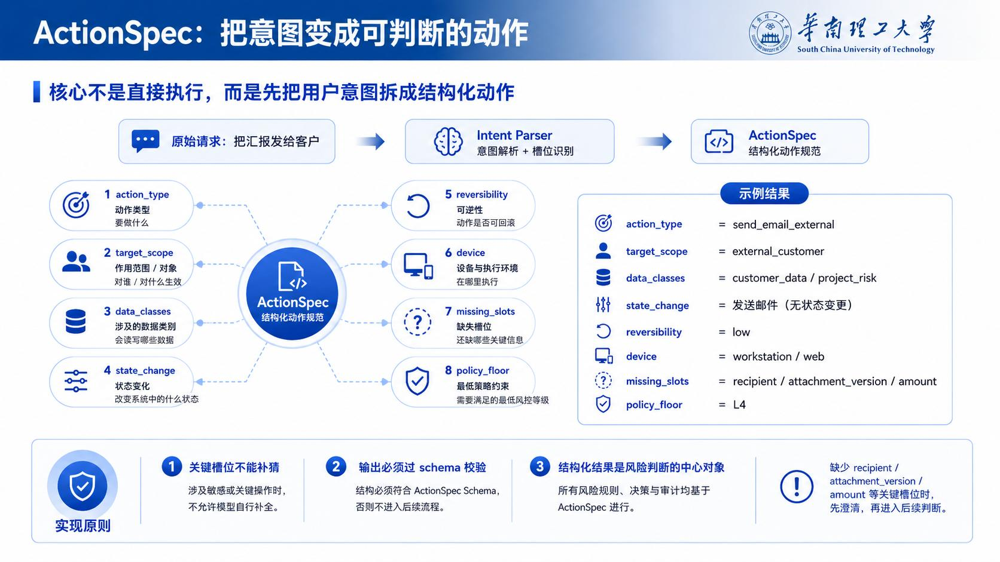
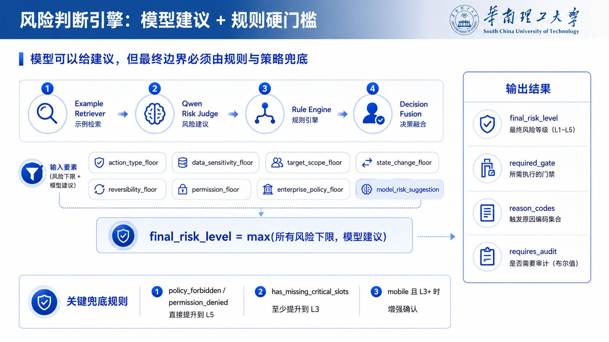
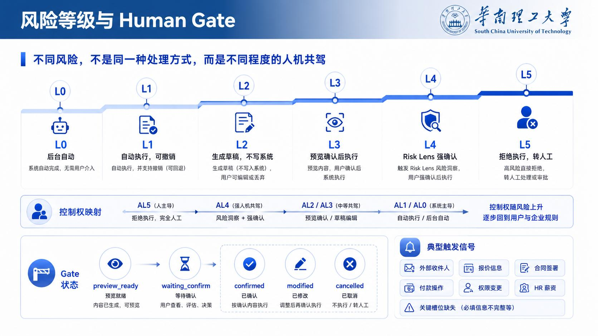
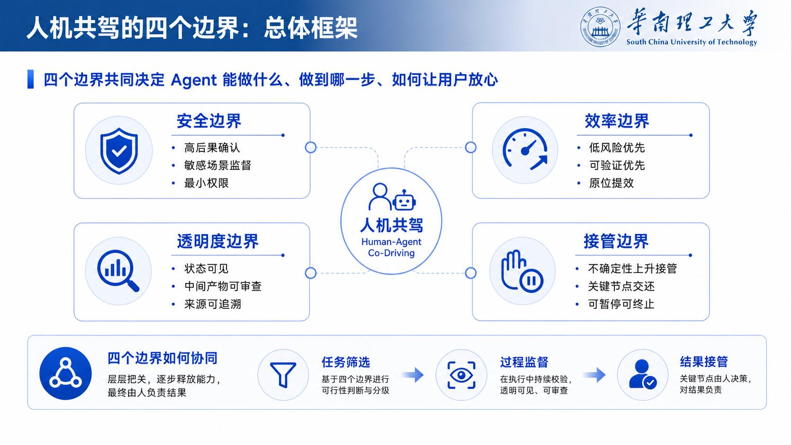
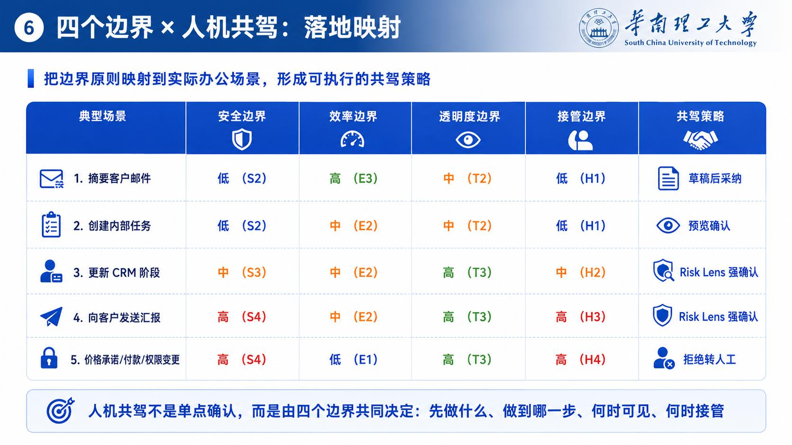
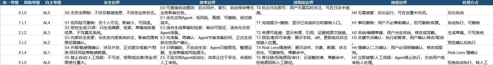

**未来技术学院**

**FUTURE TECH**

## **AI Agent 交互研究 季度汇报**

**汇报人：刘琦教授团队**

**单位：华南理工大学 未来技术学院**

**2025年6月8日**

**提纲**

**01 时间节点及完成情况汇总**

**02 产出汇报：前沿办公AIAgent系统设计方案**

**03  产出汇报：系统技术路线**

## **合同时间节点**

**AI Agent交互研究课题规划**

**2026.1.31-2026.4.30**

**阶段一：交互调研与定义 明确技术路线与场景边界，完成人机协同与多模态交互现状调研，定义核心交互模型**

**2026.5.1-2026.5.31**

**2026.6.1-2026.10.31**

**阶段二：智能体多模块设计 设计多模块协同推理引擎架构，完成任务意图槽位建模，输出场景流程设计与模拟**

**阶段三：多模态&HOI框架实现 构建多模态融合框架，实现动态调度逻辑，完成原型Demo开发**

**2026.11.1-2027.1.30**

**阶段四：闭环验证与成果交付 搭建闭环反馈机制，完成模型校准与测试，制作高保真演示视频，完成项目验收**

**《AI Agent交互趋势报告》 场景需求分析书**

**推理引擎系统设计方案 用户流程图与需求说明**

**多模态交互机制说明 协同推理引擎原型Demo**

**整体成果产出规划**

**3个高保真Demo演示视频 项目验收报告与总结**

**…**

## **合同时间节点**

**AI Agent交互研究课题规划**

**目前进展**

## **合同时间节点**

<table>
  <tr>
    <th>技术模块分类</th>
    <th>Phase 1: 交互调研(2026.1 - 4) 🔴 当前阶段</th>
    <th>Phase 2: 多模块设计(2026.5)</th>
    <th>Phase 3: 多模态与HOI实现(2026.6 - 10)</th>
    <th>Phase 4: 闭环与交付(2026.11 - 27.1)</th>
  </tr>
  <tr>
    <td colspan="5">1. 调研与需求分析</td>
  </tr>
  <tr>
    <td>交互趋势与前沿拆解</td>
    <td>启动工作与路线明确 ☑
文献调研设计与机制拆解  ☑
产品调研场景需求分析  ☑
报告撰写☑</td>
    <td></td>
    <td></td>
    <td></td>
  </tr>
  <tr>
    <td>办公/出行场景建模</td>
    <td>个人办公及出行场景需求分析 ☑</td>
    <td>场景需求说明书定稿 ☑</td>
    <td></td>
    <td></td>
  </tr>
  <tr>
    <td colspan="5">2. 算法引擎与感知</td>
  </tr>
  <tr>
    <td>模块化协同推理引擎</td>
    <td></td>
    <td>多模块解耦架构设计(规划/检索/异常处理) ☑</td>
    <td>原型系统Demo发布 ☐</td>
    <td>逻辑闭环验收模型校准与质控落地 ☐</td>
  </tr>
  <tr>
    <td>意图理解与多模态感知</td>
    <td></td>
    <td>意图槽位填充机制构建 ☑</td>
    <td>多模态动态调度与置信度融合（待细化）☐</td>
    <td>模型实测与优化 ☐</td>
  </tr>
  <tr>
    <td>视觉-语言模型 (VLM) 集成</td>
    <td></td>
    <td></td>
    <td>基于VLM的通用HOI感知模块集成（待细化） ☐</td>
    <td></td>
  </tr>
  <tr>
    <td colspan="5">3. 交互设计与体验评估</td>
  </tr>
  <tr>
    <td>个人办公与出行场景设计</td>
    <td></td>
    <td>用户流程图设计与模拟 ☐</td>
    <td>3个场景的交互原型图 ☐</td>
    <td>场景设计定稿 (Figma + PDF文档) ☐</td>
  </tr>
  <tr>
    <td>量化用户体验指标 (KPIs)</td>
    <td></td>
    <td></td>
    <td>多模态呈现机制说明及示例 ☐</td>
    <td>操作步骤 ≤ 5 步 ☐
完成时间 ≤ 3 分钟 ☐</td>
  </tr>
  <tr>
    <td colspan="5">4. 原型系统集成与演示</td>
  </tr>
  <tr>
    <td>场景实测与视频制作</td>
    <td></td>
    <td></td>
    <td>办公/出行初步Demo展示 ☐</td>
    <td>3个高保真Demo演示视频交付 ☐</td>
  </tr>
  <tr>
    <td>核心技术展示要求</td>
    <td></td>
    <td></td>
    <td>创新点/技术路径说明 ☐</td>
    <td>涵盖: 多模态输入+协同+结果+异常处理 ☐</td>
  </tr>
</table>

**提纲**

**01 时间节点及完成情况汇总**

**02 产出汇报：前沿办公AIAgent系统设计方案**

**03  产出汇报：系统技术路线**

**提纲**

**01 时间节点及完成情况汇总**

**02 产出汇报：前沿办公AIAgent系统设计方案**

**03  产出汇报：系统技术路线**

## **总体实现链路**

## **Context Adapter**

### **不是把整屏内容塞给模型，而是把当前任务、对象、来源和权限整理成 ContextPacket**

**输入侧**

模型到底该看哪些上下文

**核心问题**

当前任务、文档、邮件、CRM 引用

**来源**

通过读取当前用户的操作，提取对应的可用上下文

**核心**

把拟真页面中的可读字段，统一转换成 Agent 能理解的上下文包。

避免Agent读了不该读的干扰内容，也确保Agent能读到需要的内容。

## **上下文与隐私过滤**

**ActionSpec：把意图变为动作**

**个人办公及出行场景需求分析**

## **人机共驾的四个边界**

## **四个边界 X 人机共驾：落地映射**

## **四个边界 X 人机共驾：落地映射**

