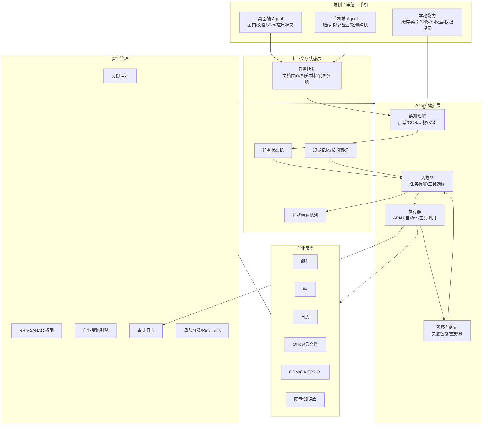
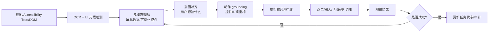
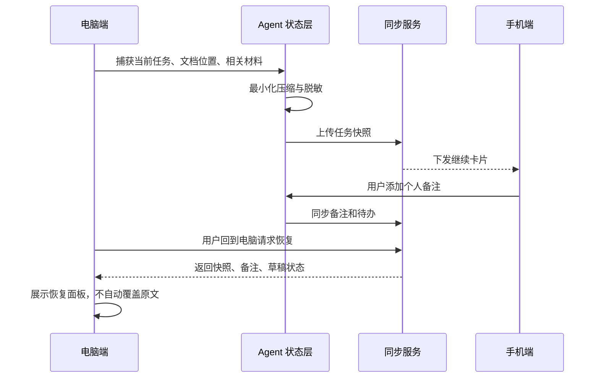
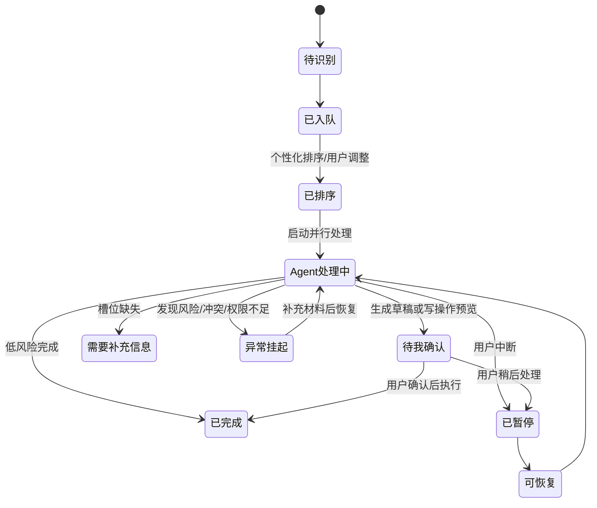
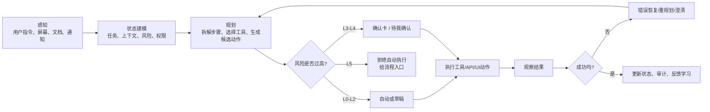
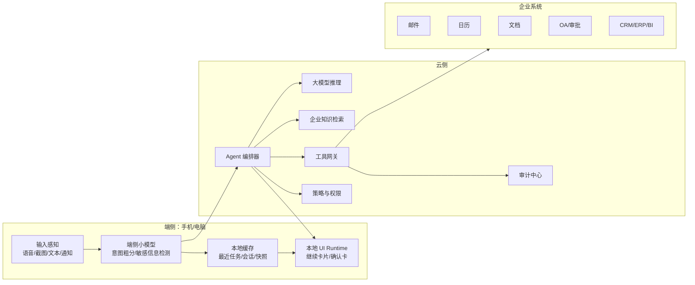
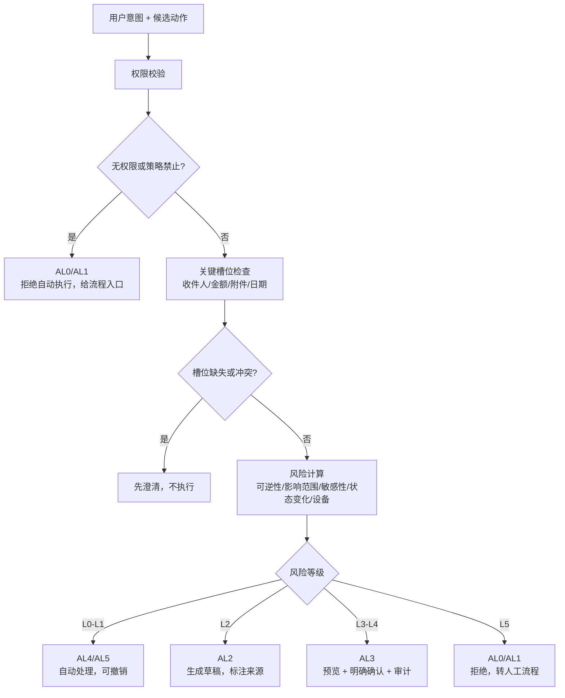
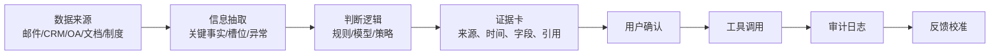

> **版本说明：** 本文用于理解总体架构、任务快照、多任务状态机、端云协同和 HITL。涉及 L/AL 映射时，不采用本文早期示意，统一以 2026-06-08“自主等级修正版”为准：`L0→AL5、L1→AL4、L2→AL3、L3→AL2、L4→AL1、L5→AL0`。

# 企业个人办公与移动办公 AI Agent 技术学习文档

来源文档：`office_mobile_scenarios_v3_pre.md`  
定位：把原场景需求稿改写为一份技术学习材料，帮助读者理解办公/移动端 Agent 背后的感知、规划、执行、端云协同、权限治理和安全评测。  
学习目标：读完后能把“跨设备延续、多任务驾驶舱、Risk Lens”翻译成可落地的技术架构。

---

## 0. 先把原文档翻译成技术问题

原文档表面上是三个产品场景：

1. 跨设备深度工作流延续。
2. 个性化多任务驾驶舱。
3. 动态风险边界与 Risk Lens。

从技术角度看，它们其实对应三类核心能力：

| 产品场景 | 技术问题 | 关键技术 |
|---|---|---|
| 跨设备延续 | 如何捕获、压缩、同步和恢复工作上下文 | 屏幕/窗口感知、任务快照、端云同步、本地缓存、隐私脱敏 |
| 多任务驾驶舱 | 如何聚合任务、排序、并行推进、暂停恢复 | 任务建模、状态机、个性化排序、Agent 编排、工具调用 |
| Risk Lens | 如何决定 Agent 能做、该问、必须停、不能做 | 风险分级、权限校验、HITL、审计日志、策略引擎 |

所以这份学习文档的主线不是“办公产品怎么设计”，而是“企业移动办公 Agent 如何做可信执行”。

---

## 1. 总体架构：一个企业办公 Agent 由哪些层组成



这张图可以作为学习总纲。后面的所有技术都可以归入五层：端侧感知、上下文状态、Agent 编排、企业系统连接、安全治理。

---

## 2. 自主等级 AL0-AL5：自动化不等于自动执行

原文档的 AL0-AL5 是理解办公 Agent 的第一把钥匙。

| 等级 | 技术含义 | 例子 |
|---|---|---|
| AL0 仅观察 | 只读状态，不给建议，不执行 | 显示合同审批状态 |
| AL1 建议 | 输出风险提示或下一步建议 | 建议法务确认外发条款 |
| AL2 草稿/模拟 | 生成草稿，不改变真实系统 | 邮件草稿、PPT 大纲、报销摘要 |
| AL3 确认后执行 | 用户确认后调用真实工具 | 创建日程、发送邮件、提交审批 |
| AL4 可撤销自动执行 | 低风险动作自动做，可撤销 | 自动保存、格式统一、个人待办 |
| AL5 静默后台 | 后台维护状态 | 本地索引、低风险缓存清理 |

学习重点：模型能生成答案，不代表系统应该执行动作。执行权限必须由风险、权限、可逆性和用户确认共同决定。

---

## 3. 风险等级 L0-L5：Risk Lens 的基础

| 风险等级 | 技术判断 | 默认策略 |
|---|---|---|
| L0 无业务影响 | 不读敏感内容，不改变状态 | 可静默 |
| L1 低风险可逆 | 仅个人可见，可撤销 | 可自动执行并提示 |
| L2 中低风险 | 内容生成、摘要、草稿 | 生成草稿，标注来源 |
| L3 中风险内部动作 | 改变内部系统状态 | 确认后执行 |
| L4 高风险外部/敏感动作 | 外发、审批、客户/财务/人事 | 强确认、证据链、审计 |
| L5 极高风险/受限动作 | 付款、权限、合同签署、批量删除 | 拒绝自动执行，给流程入口 |

Risk Lens 不是一个视觉效果，而是一个决策系统：它把用户意图、候选动作、上下文、权限、设备环境和企业策略映射到风险等级和执行策略。

---

## 4. 端侧感知：Agent 怎么“看见”屏幕和任务

办公移动 Agent 需要理解用户正在做什么。这里涉及几类“扫描/识别/感知”技术：

| 技术 | 作用 | 优点 | 局限 |
|---|---|---|---|
| Accessibility Tree | 读取按钮、输入框、列表、文本等结构化 UI 元素 | 准确、可定位、可执行动作 | 依赖系统/应用暴露可访问性信息 |
| DOM / Web UI Tree | 理解网页结构和控件 | Web 场景强 | 只覆盖浏览器或 WebView |
| OCR | 从截图中识别文字 | 对任何界面都有一定适用性 | 位置、表格、图标语义可能不稳定 |
| Screenshot + VLM | 用视觉语言模型理解屏幕布局和语义 | 能处理图标、图片、复杂界面 | 成本高，定位精度和稳定性需评测 |
| UI Grounding | 把“点击确认按钮”映射到坐标或控件 ID | 执行动作必需 | 易受布局变化、弹窗、滚动影响 |
| 系统 API / UIAutomation | 注入点击、键盘、滚动，读取窗口状态 | 可跨应用自动化 | 需要权限，风险高，必须治理 |

Android 官方 `UiAutomation` 可以通过平台可访问性 API 内省屏幕内容，并注入输入事件；这类能力适合测试和自动化，但放到真实 Agent 中必须加权限、确认和审计。

### 移动端 UI 感知闭环



移动 Agent 论文 Mobile-Agent 的关键点就是“用视觉感知工具识别和定位移动应用界面中的视觉与文本元素，再基于视觉上下文规划并执行操作”。后续的 Agent-SAMA 进一步强调用有限状态机表示 App 导航状态，以支持验证和错误恢复。

---

## 5. 任务快照：跨设备延续的技术核心

场景一的“刚才做到哪里，手机还能继续，回来一键恢复”，背后不是简单同步文件，而是任务快照。

任务快照至少包含：

| 快照字段 | 例子 | 注意事项 |
|---|---|---|
| 当前任务 | 季度经营分析报告 | 需要从窗口、文档、用户指令中推断 |
| 文档位置 | 第 3 节、第 2 段、光标位置 | 不能覆盖用户后续修改 |
| 相关材料 | BI 看板、Excel、历史 PPT | 只记录任务相关材料，不记录完整浏览历史 |
| 待核实项 | 华东区渠道变化原因 | 用作恢复提示，不自动写入正文 |
| 个人备注 | 用户在手机输入的想法 | 默认个人可见 |
| 草稿状态 | 已生成但未插入的段落 | 需要版本和来源 |
| 风险标记 | 是否含客户/财务/人事数据 | 手机端默认更谨慎 |

### 跨设备快照同步



关键原则：快照是“帮助用户恢复上下文”，不是“偷录用户所有行为”。高质量系统必须有最小化、可删除、可解释和权限控制。

---

## 6. 任务建模：多任务驾驶舱不是待办列表

场景二的“今日工作驾驶舱”需要把分散在邮件、IM、日历、OA、CRM、项目系统里的事项，统一建模成可执行任务。

任务卡片推荐字段：

| 字段 | 技术意义 |
|---|---|
| 任务来源 | 邮件、IM、OA、CRM、日历、项目系统 |
| 任务对象 | 客户、项目、同事、供应商、审批单 |
| 截止/时效 | SLA、会议时间、审批截止 |
| 业务影响 | 客户影响、项目阻塞、财务风险 |
| 风险等级 | L0-L5 |
| Agent 可做 | 可整理、可生成草稿、需确认、只能建议 |
| 当前状态 | 待处理、处理中、待确认、挂起、暂停、完成 |
| 个性化理由 | 为什么对这个用户重要 |
| 下一步动作 | 确认发送、修改草稿、通知补材料、恢复 PPT |

### 多任务状态机



这个状态机比“待办列表”更重要。因为 Agent 不是只显示事项，而是要持续管理任务从识别、排序、执行、确认、挂起到恢复的生命周期。

---

## 7. Agent 感知、规划、执行闭环



这里有几个工程关键点：

- Planner 负责拆任务，不直接越权执行。
- Executor 负责调用工具，但必须先经过权限、风险和槽位检查。
- Observer 负责确认动作是否真的成功。
- Reflector 负责失败恢复，例如页面变了、工具超时、权限不足、用户改了字段。
- 所有 L3-L5 动作必须进入审计。

---

## 8. 工具调用：办公 Agent 真正连接哪些系统

办公 Agent 的价值来自跨系统执行，而不是只会聊天。

| 系统 | 常见工具调用 | 风险 |
|---|---|---|
| 邮件 | 读邮件、生成草稿、发送邮件 | 外发 L4，必须确认 |
| 日历 | 查空闲时间、创建会议、改期 | 内部状态 L3 |
| IM | 摘要消息、生成回复、发通知 | 可能外发/群发，需分级 |
| 文档/PPT | 摘要、生成草稿、插入页面 | 草稿 L2，覆盖文件可能 L3 |
| CRM | 查询客户、更新商机状态 | 客户数据 L3-L4 |
| OA/审批 | 查流程、生成意见、提交审批 | 审批 L4-L5 |
| ERP/财务 | 查发票、供应商、报销异常 | 财务高敏 L4-L5 |
| 云盘/知识库 | 检索资料、创建文件、移动文件 | 权限和泄露风险 |

工具调用前要做槽位校验，例如收件人、附件版本、金额、客户名、审批对象、截止时间。如果关键槽位不确定，必须澄清，不能猜测执行。

---

## 9. 端云协同：手机端和云端分别做什么

移动办公场景里，端云分工非常重要。



端侧适合做低延迟、隐私敏感、轻量判断和 UI 展示。云侧适合做复杂推理、跨系统编排、企业知识检索和审计治理。

关键不是“所有数据都上云”，而是“只把任务必要、经过脱敏和结构化的上下文传给云端”。

---

## 10. 个性化：能优化体验，不能降低安全门槛

场景二强调 Agent 要懂用户，但个性化有边界。

| 个性化信号 | 用途 | 不允许做什么 |
|---|---|---|
| 优先级偏好 | 任务排序、提醒顺序 | 不能让高风险动作自动执行 |
| 沟通风格 | 邮件/IM 草稿更像用户 | 不能编造承诺、价格、合同条款 |
| 工作节奏 | 推荐处理时段、批量确认时机 | 不能跳过高风险确认 |
| 协作关系 | 推荐负责人、群组、审批链 | 不能绕过组织权限 |
| 自动化边界 | 减少低风险打扰 | 不能覆盖企业硬策略 |

可以用一个排序模型表示多任务驾驶舱：

```text
PriorityScore =
  w1 * 截止紧急度
+ w2 * 业务影响
+ w3 * 客户/项目重要性
+ w4 * 依赖阻塞程度
+ w5 * 用户历史偏好
- w6 * 风险与不确定性
```

排序结果必须可解释。比如“客户 A 邮件排第一”应展示 SLA、客户级别、会议依赖和用户历史偏好，而不是只给一个神秘分数。

---

## 11. Risk Lens：风险决策流程

Risk Lens 的输入包括：

- 用户意图 I。
- 候选动作 A。
- 当前上下文 C。
- 企业策略 P。
- 用户权限 U。
- 历史反馈 H。
- 设备与环境 D。

### Risk Lens 决策图



Risk Lens 的输出不是一个分数，而是一个交互策略：自动、草稿、确认、澄清、拒绝。

---

## 12. HITL：Human-in-the-loop 怎么落工程

HITL 的本质不是“最后放一个确认按钮”，而是在敏感工具调用前暂停执行，把动作、参数、影响范围和证据展示给用户。

一个高风险确认卡应该包含：

| 字段 | 例子 |
|---|---|
| 即将执行动作 | 发送客户汇报邮件 |
| 风险等级 | L4 高风险外发 |
| 关键参数 | 收件人、附件、版本、金额、截止时间 |
| 敏感提示 | 包含报价区间、客户数据、项目延期原因 |
| 证据来源 | CRM 记录、项目周报、当前文档 |
| 用户选择 | 确认、修改、取消、转人工 |
| 审计信息 | 谁确认、何时确认、确认方式 |

OpenAI Agents SDK 的 HITL 机制支持在敏感工具调用前暂停运行，并在批准或拒绝后恢复。这类模式适合映射到原文档里的 AL3 “确认后执行”。

---

## 13. 证据链与审计

企业办公 Agent 不能只告诉用户“我建议这样做”，还要能说明“基于什么这样做”。

### 证据链



审计日志至少记录：

- 用户原始指令。
- Agent 识别出的意图和候选动作。
- 风险等级与判断依据。
- 检索到的数据来源。
- 工具调用参数。
- 用户确认或拒绝。
- 执行结果、失败原因、撤销信息。

审计不是事后合规装饰，而是 Agent 系统可运营、可追责、可改进的基础设施。

---

## 14. 移动端为什么默认更谨慎

原文档强调“移动端默认更谨慎”，这是很工程化的判断。

手机端风险更高的原因：

| 原因 | 影响 |
|---|---|
| 屏幕小 | 用户难以完整检查附件、收件人、金额和上下文 |
| 环境复杂 | 通勤、会议、客户现场容易误触或被旁人看到 |
| 输入成本高 | 用户不容易精细编辑和核查 |
| 多任务干扰 | 通知、电话、弱网会打断流程 |
| 权限暴露 | 手机常处于公共网络或个人设备环境 |

因此建议：

- 手机端 L3 以上动作增加二次确认。
- 默认隐藏敏感字段，可点开查看。
- 外发、审批、权限、合同、付款类动作尽量引导回电脑端处理。
- 所有确认卡保持短、清楚、可取消。

---

## 15. 评测体系：怎么知道 Agent 真的可靠

| 能力 | 指标 | 目标 |
|---|---|---|
| 任务识别 | 关键待办召回率 | 高优先任务不漏掉 |
| 排序 | 排序可解释率、用户调整率 | 排序理由清楚，调整率逐步下降 |
| 屏幕感知 | OCR 准确率、控件定位成功率 | 能稳定识别文本和按钮 |
| 执行 | 工具调用成功率、幂等命中率 | 不重复执行，不漏执行 |
| 恢复 | 快照恢复成功率 | 能恢复状态和下一步 |
| 风险 | 风险识别准确率、高风险漏确认率 | L4-L5 漏确认应为 0 |
| 安全 | 越权拦截率、敏感信息泄露率 | 禁止越权访问和外泄 |
| 审计 | 审计完整率、Trace 覆盖率 | L3-L5 必须可追溯 |
| 移动体验 | 误触率、确认后撤销率 | 误触升高时自动降级 |

移动 Agent 还需要专门做屏幕基准测试，包括不同分辨率、深色模式、语言、字体缩放、弱网、弹窗、滚动列表和跨 App 跳转。

---

## 16. 推荐学习路径

### 第一阶段：理解 Agent 基础

- 学 LLM、prompt、结构化输出、function calling。
- 学工具调用和幂等设计。
- 学短期记忆、长期记忆、任务状态。

### 第二阶段：学习移动端感知

- 学 Accessibility Tree、DOM、UIAutomation。
- 学 OCR 和截图理解。
- 学 UI grounding：坐标、控件 ID、点击区域。
- 读 Mobile-Agent，理解视觉感知到动作规划。

### 第三阶段：学习任务状态机

- 给办公任务建模：来源、对象、截止、风险、下一步。
- 实现待识别、处理中、待确认、挂起、暂停、完成。
- 加快照、恢复和错误重试。

### 第四阶段：学习企业系统连接

- 邮件、日历、文档、IM、CRM、OA、ERP 的工具接口。
- RAG 检索制度、知识库、项目资料。
- 写操作前加入确认和审计。

### 第五阶段：学习安全治理

- RBAC / ABAC / 最小权限。
- 数据最小化和脱敏。
- HITL、Risk Lens、策略引擎。
- 审计、回放、红队测试。

---

## 17. 小型实践项目

| 项目 | 目标 | 技术点 |
|---|---|---|
| 手机继续卡片原型 | 从桌面任务生成手机摘要 | 快照压缩、脱敏、端云同步 |
| 今日工作驾驶舱 | 聚合邮件/日历/任务并排序 | 任务建模、个性化排序 |
| 待我确认队列 | 所有写操作进入统一队列 | HITL、确认卡、状态机 |
| Risk Lens Demo | 输入动作后输出风险等级和策略 | 风险模型、规则引擎 |
| OCR + UI Grounding | 从截图识别按钮并生成动作 | OCR、VLM、坐标定位 |
| 审计回放工具 | 重放一次 Agent 操作链路 | trace、日志、调试 |

---

## 18. 配图与图像材料

### Microsoft Research：Magentic-UI 主界面截图


用途：理解 human-centered agent 如何同时展示计划、进度和被控制的浏览器。  
来源：[Microsoft Research: Magentic-UI](https://www.microsoft.com/en-us/research/blog/magentic-ui-an-experimental-human-centered-web-agent/)

### Microsoft Research：协同规划示例


用途：理解 co-planning，即用户在执行前修改 Agent 计划。  
来源：[Microsoft Research: Magentic-UI](https://www.microsoft.com/en-us/research/blog/magentic-ui-an-experimental-human-centered-web-agent/)

### Microsoft Research：Action Guard 示例


用途：理解高风险动作前的人工批准机制，和本文 Risk Lens / AL3 对应。  
来源：[Microsoft Research: Magentic-UI](https://www.microsoft.com/en-us/research/blog/magentic-ui-an-experimental-human-centered-web-agent/)

---

## 19. 参考资料

- Android UiAutomation：[Android Developers API reference](https://developer.android.com/reference/android/app/UiAutomation)
- Mobile-Agent：[Autonomous Multi-Modal Mobile Device Agent with Visual Perception](https://arxiv.org/abs/2401.16158)
- Agent-SAMA：[State-Aware Mobile Assistant](https://arxiv.org/abs/2505.23596)
- Mobile-Agent-v3.5：[Multi-platform Fundamental GUI Agents](https://arxiv.org/abs/2602.16855)
- Magentic-UI：[Microsoft Research blog](https://www.microsoft.com/en-us/research/blog/magentic-ui-an-experimental-human-centered-web-agent/)
- OpenAI Agents SDK HITL：[Human-in-the-loop](https://openai.github.io/openai-agents-python/human_in_the_loop/)
- Microsoft Agent Framework tool approval：[Using function tools with human in the loop approvals](https://learn.microsoft.com/en-us/agent-framework/agents/tools/tool-approval)
- Microsoft agentic AI security：[Secure autonomous agentic AI systems](https://learn.microsoft.com/en-us/security/zero-trust/sfi/secure-agentic-systems)
- NIST AI RMF：[AI Risk Management Framework](https://www.nist.gov/itl/ai-risk-management-framework)
- Microsoft 365 Copilot connectors：[Connectors overview](https://learn.microsoft.com/en-us/microsoft-365/copilot/extensibility/overview-copilot-connector)

---

## 20. 一句话总结

办公移动 Agent 的核心不是“让大模型帮你点手机”，而是构建一套可信执行系统：它能看懂屏幕和上下文，能把任务建成状态机，能跨系统调用工具，能在端云之间同步和恢复，更重要的是能在高风险动作前停下来、解释清楚、等待确认，并留下完整证据链。
