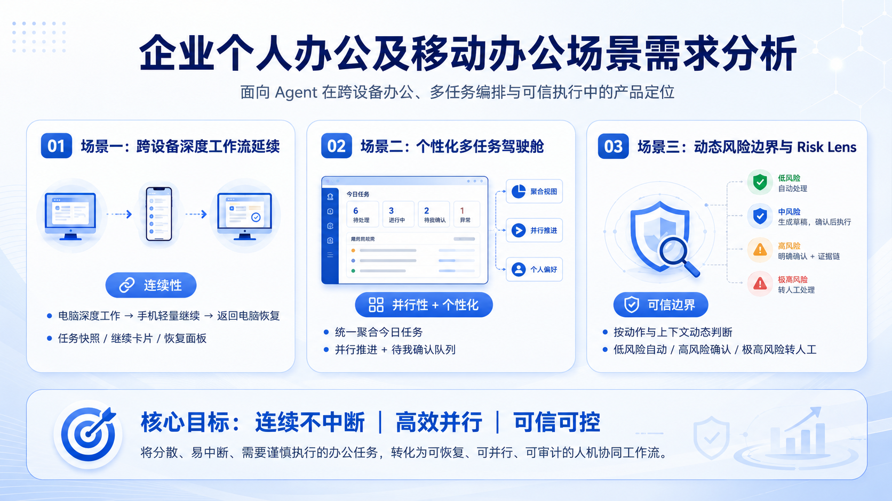
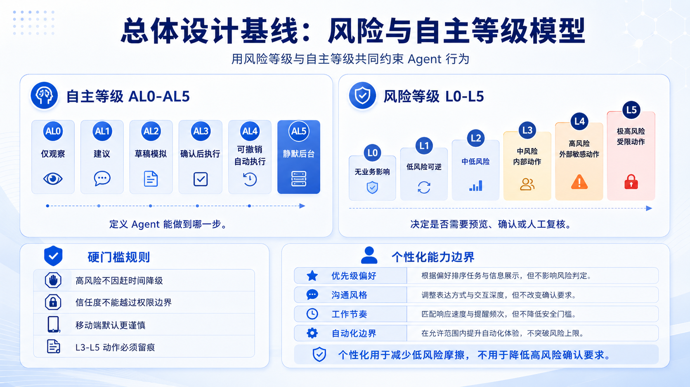
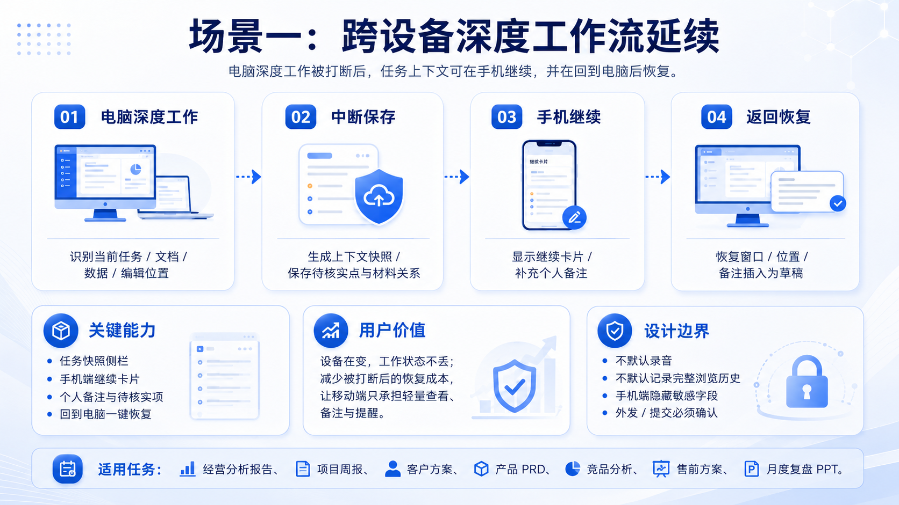
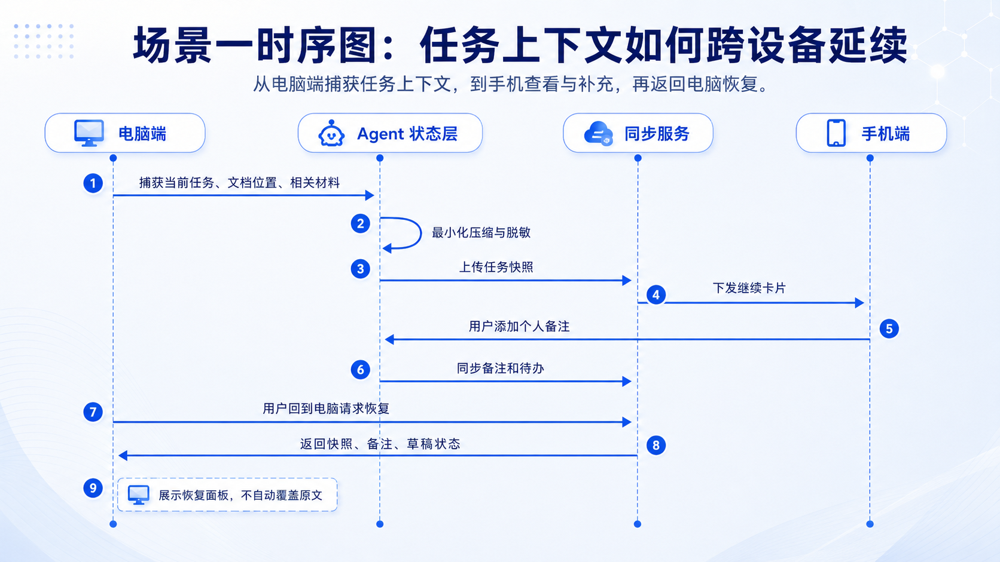
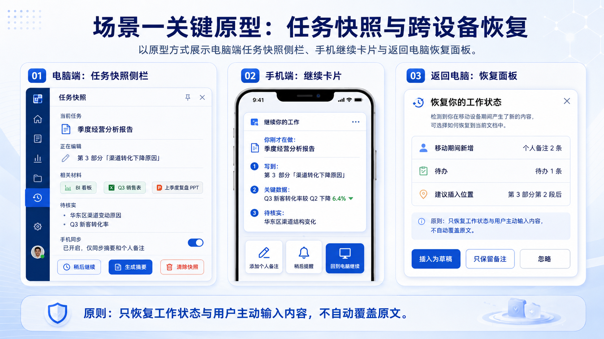
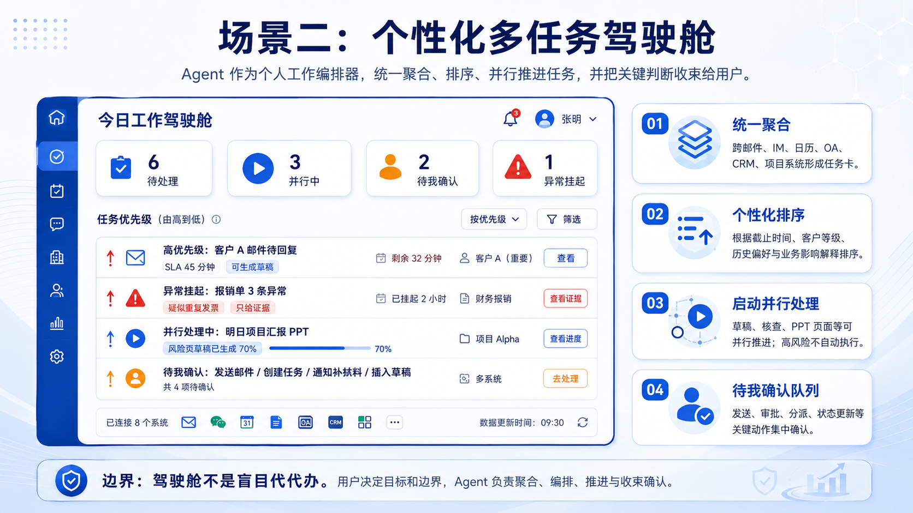
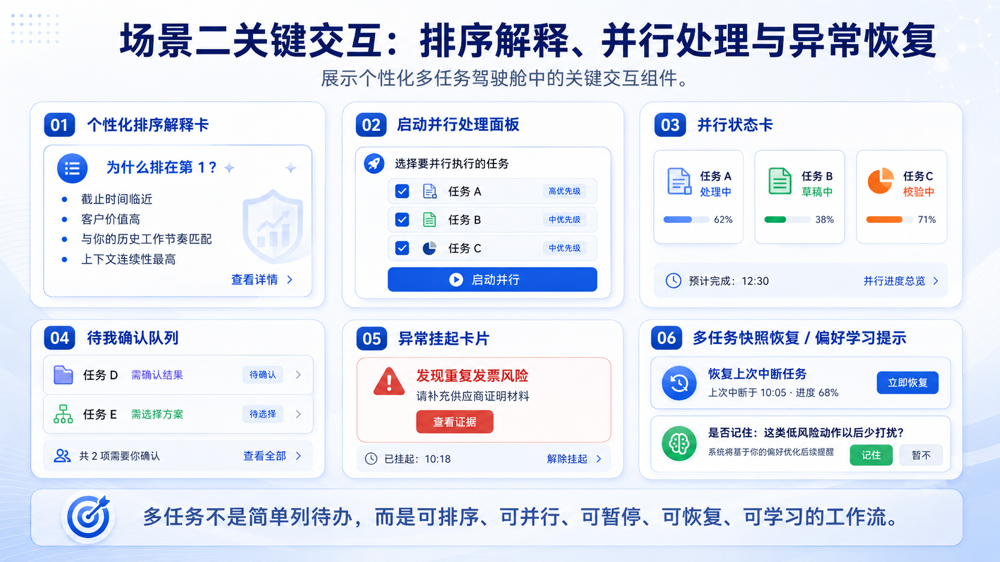
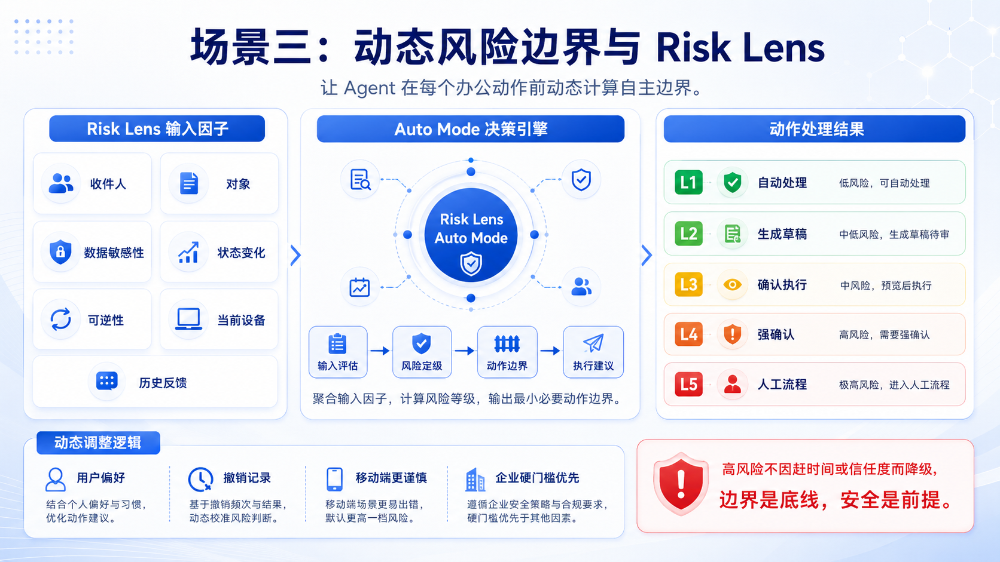
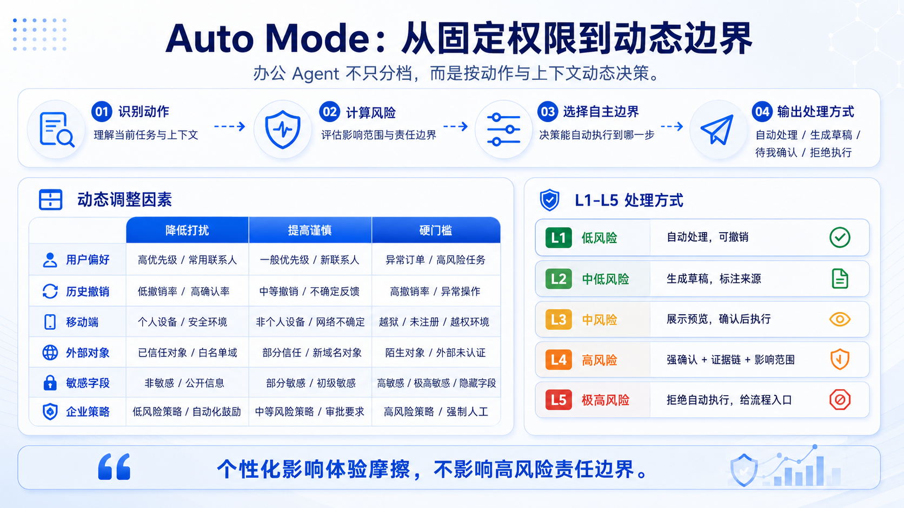
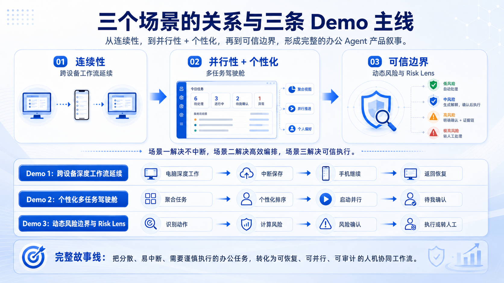

> **现行口径提示（2026-06-08 修正）：** 本可编辑副本已将文中的风险/自主等级映射统一为 `L0→AL5、L1→AL4、L2→AL3、L3→AL2、L4→AL1、L5→AL0`。场景内容沿用 V7；等级规则以“自主等级修正版”规则资产为最终依据。

**企业个人办公及移动办公场景需求分析**

面向 Agent 在跨设备办公、多任务编排与可信执行中的产品定位

<em>图 1：总体场景总览与核心目标</em>

<table>
<colgroup>
<col style="width: 100%" />
</colgroup>
<thead>
<tr class="header">
<th>
<strong>核心定位</strong>

本报告面向后续 Demo
与原型设计，聚焦三类可落地场景：跨设备工作连续性、个性化多任务编排、动态风险边界。报告不追求覆盖所有企业办公自动化能力，而是保留能够形成清晰演示闭环的核心功能。
</th>
</tr>
</thead>
<tbody>
</tbody>
</table>

**章节导览**

| **章节**         | **阅读目的**                                                   |
|------------------|----------------------------------------------------------------|
| 1\. 整体框架     | 先理解三大场景为什么这样组织，以及每个场景在产品叙事中的位置。 |
| 2\. 共同设计基线 | 统一风险等级、自主等级和硬门槛，避免三个场景各说各话。         |
| 3\. 目标用户     | 说明主要用户类型和需求分层，为场景定位提供依据。               |
| 4-6. 三个场景    | 每个场景按定位、流程、核心功能、Demo 范围、风险边界展开。      |
| 7-8. Demo 与落地 | 把内容收束为可执行的 Figma / Demo 主线和优先级清单。           |

**1. 整体框架：从连续性到可信边界**

企业个人办公与移动办公的真实痛点，通常不是单一工具能力不足，而是三个问题叠加：第一，员工在电脑、手机、会议和通勤之间切换时，工作状态容易中断；第二，任务散落在邮件、IM、日历、OA、CRM
和项目系统中，用户需要不断判断优先级；第三，当 Agent
能够调用工具执行动作时，企业必须明确它什么时候可以自动、什么时候必须确认、什么时候不能做。

因此，本报告将产品定位组织为一条递进式叙事：**场景一讲连续性，场景二讲并行性与个性化，场景三讲可信边界**。三者之间不是功能堆叠，而是从“工作流不中断”到“多任务可编排”，再到“高风险可控执行”的完整产品逻辑。

**1.1 三大场景的产品定位**

| **场景**                         | **核心问题**                                                     | **产品定位**                   | **演示焦点**                                      |
|----------------------------------|------------------------------------------------------------------|--------------------------------|---------------------------------------------------|
| 场景一：跨设备深度工作流延续     | 用户被打断后，如何快速知道刚才做到哪里，并在手机和电脑之间继续。 | Agent 作为跨设备上下文延续层。 | 任务快照、手机继续卡片、返回电脑恢复面板。        |
| 场景二：个性化多任务驾驶舱       | 任务很多且来源分散，用户如何知道先做什么、哪些能并行推进。       | Agent 作为个人工作编排器。     | 今日驾驶舱、排序解释、并行状态、待我确认队列。    |
| 场景三：动态风险边界与 Risk Lens | Agent 能力增强后，如何知道它在每个动作上能做到哪一步。           | Agent 作为信任与风险管理层。   | Risk Lens、Auto Mode 决策、高风险确认、越权拒绝。 |

**1.2 本阶段 Demo 范围收敛**

| **场景** | **保留的核心功能**                                                                   | **暂不作为第一轮 Demo 重点**                                    |
|----------|--------------------------------------------------------------------------------------|-----------------------------------------------------------------|
| 场景一   | 任务快照、手机继续卡片、个人备注、返回电脑恢复。                                     | 默认录音、完整浏览历史记录、手机端复杂编辑、自动覆盖原文。      |
| 场景二   | 今日驾驶舱、排序解释、启动并行、并行状态、待我确认、异常挂起。                       | 完整长期画像后台、全量系统集成、复杂自动审批、完整指标看板。    |
| 场景三   | 边界状态条、Risk Lens、L1-L5 处理规则、动态调整规则、高风险确认、L5 拒绝、审计记录。 | 另起 C0-C5 确认强度体系、完整企业策略后台、复杂评分公式可视化。 |

<table>
<colgroup>
<col style="width: 100%" />
</colgroup>
<thead>
<tr class="header">
<th>
<strong>一句话对外叙事</strong>

把分散、易中断、需要谨慎执行的办公任务，转化为可恢复、可并行、可审计的人机协同工作流。
</th>
</tr>
</thead>
<tbody>
</tbody>
</table>

**2. 共同设计基线：风险与自主等级模型**

三个场景都需要统一的设计基线，否则容易出现“场景一强调自动保存，场景二强调并行推进，场景三强调风险控制”之间互相冲突的问题。本文档保留两条共同约束：自主等级定义
Agent 能做到哪一步，风险等级定义这个动作是否需要预览、确认或人工复核。

<em>图 2：风险与自主等级模型</em>

**2.1 自主等级 AL0-AL5**

| **等级**           | **含义**                                       | **典型动作**                             | **用户控制方式**       |
|--------------------|------------------------------------------------|------------------------------------------|------------------------|
| AL0 仅观察         | 只显示状态，不推荐、不执行。                   | 权限审批、合同签署等必须人工处理的动作。 | 用户完全手动。         |
| AL1 建议           | 给出提醒、风险提示和下一步选项。               | 客户承诺风险、审批异常提示。             | 用户决定是否采纳。     |
| AL2 草稿/模拟      | 生成草稿、预览或模拟结果，不改变真实系统状态。 | 邮件草稿、PPT 大纲、报销核查摘要。       | 用户编辑或采纳。       |
| AL3 确认后执行     | 准备执行方案，用户明确确认后调用工具。         | 发送邮件、创建会议、更新 CRM/OA 状态。   | 点击、语音或二次确认。 |
| AL4 可撤销自动执行 | 低风险、可撤销动作自动执行并通知。             | 自动保存、格式统一、个人待办生成。       | 事后撤销或恢复。       |
| AL5 静默后台       | 无业务影响的后台维护。                         | 本地索引更新、状态同步心跳。             | 可在设置中关闭。       |

**2.2 风险等级 L0-L5**

| **等级**               | **判断标准**                                       | **默认处理方式**               |
|------------------------|----------------------------------------------------|--------------------------------|
| L0 无业务影响          | 不读取敏感内容，不改变业务状态。                   | 静默后台或自动处理。           |
| L1 低风险可逆          | 仅个人可见、可撤销、影响范围小。                   | 自动处理，并提供撤销。         |
| L2 中低风险            | 涉及内容生成或信息提取，但不外发、不提交。         | 生成草稿，标注来源。           |
| L3 中风险内部动作      | 改变内部系统状态，但影响范围有限且可追踪。         | 展示预览，确认后执行。         |
| L4 高风险外部/敏感动作 | 对外发送、正式提交、审批或涉及客户/财务/人事数据。 | 强确认 + 证据链 + 影响范围。   |
| L5 极高风险/受限动作   | 不可逆、批量、权限、安全或法律责任重大。           | 拒绝自动执行，给人工流程入口。 |

**2.3 硬门槛与个性化边界**

| **规则**               | **说明**                                                                                  |
|------------------------|-------------------------------------------------------------------------------------------|
| 高风险不因赶时间降级   | 紧急状态只能减少低风险提醒，不能跳过外发、审批、权限、合同等确认。                        |
| 信任度不能越过权限边界 | 用户历史采纳率高，只能减少低风险打扰，不能让 Agent 自动执行财务、合同、权限、外发等动作。 |
| 移动端默认更谨慎       | 手机屏幕小、上下文少、环境干扰多，涉及 L3 及以上动作应增加预览和确认。                    |
| 低置信度先澄清         | 收件人、文件、金额、日期、客户名、审批对象等关键槽位不确定时，必须追问，不得猜测执行。    |
| L3-L5 动作必须留痕     | 记录用户指令、Agent 建议、证据链、确认方式、执行结果、撤销/失败信息。                     |

<table>
<colgroup>
<col style="width: 100%" />
</colgroup>
<thead>
<tr class="header">
<th>
<strong>设计原则</strong>

个性化可以影响排序、提醒、草稿风格和低风险打扰频率；但不能降低外发、审批、合同、权限、财务、人事等高风险动作的确认要求。
</th>
</tr>
</thead>
<tbody>
</tbody>
</table>

**2.4 Auto Mode 判断流程**

| **步骤**         | **系统判断**                                        | **输出**                                     |
|------------------|-----------------------------------------------------|----------------------------------------------|
| 识别动作         | 用户到底要 Agent 做哪个真实动作，是否改变系统状态。 | 候选动作列表。                               |
| 检查权限与硬门槛 | 用户是否有权限，企业策略是否禁止。                  | 允许继续 / 需确认 / 转人工。                 |
| 检查关键槽位     | 收件人、金额、文件版本、客户名、日期是否明确。      | 缺失时先澄清。                               |
| 计算风险等级     | 综合敏感性、影响范围、可逆性、设备环境和历史反馈。  | L0-L5 风险标签与理由。                       |
| 输出边界         | 根据风险和策略选择自主等级。                        | 自动处理 / 草稿 / 确认执行 / 强确认 / 拒绝。 |

**3. 目标用户与需求分层**

企业个人办公不是单一人群。更适合的理解方式是“角色 + 任务 +
风险”的组合：同一个员工可能既是深度知识工作者，也是项目管理者或移动办公者。下面的角色库主要用于判断每个场景的目标用户、典型任务和风险敏感点。

| **角色**           | **典型任务**                         | **主要痛点**                 | **Agent 价值**                           | **风险关注**                       |
|--------------------|--------------------------------------|------------------------------|------------------------------------------|------------------------------------|
| 深度知识工作者     | 写报告、做方案、整合数据、产出 PPT。 | 材料分散，中断后恢复慢。     | 保存任务上下文、整理证据链、跨设备延续。 | 数据引用准确性、涉密资料泄露。     |
| 项目/团队管理者    | 分派任务、跟进进度、准备汇报。       | 待办分散，优先级混乱。       | 聚合任务、排序建议、并行推进草稿。       | 误分派、越权审批、遗漏高优事项。   |
| 销售/客户成功/售前 | 客户跟进、报价、方案、会议纪要。     | 客户信息分散，移动办公频繁。 | 客户上下文补全、移动端摘要、下一步建议。 | 对外承诺、价格/合同、客户隐私。    |
| 行政/财务/采购     | 报销、采购申请、会议安排、资料归档。 | 流程重复，异常项多。         | 自动核查、异常提醒、批量草稿。           | 财务审批、发票重复、供应商信息。   |
| HR/法务/合规       | 员工信息处理、合同审查、权限控制。   | 内容敏感，错误影响大。       | 规则检索、风险标注、审查摘要。           | 员工隐私、法律责任、权限变更。     |
| 高管/决策者        | 掌握关键事项、决策、授权、对外沟通。 | 信息密度高，时间碎片化。     | 高层摘要、风险提示、决策备忘。           | 越权执行、对外表态、战略信息泄露。 |

**3.1 场景选择原则**

| **原则**                             | **说明**                                                                         |
|--------------------------------------|----------------------------------------------------------------------------------|
| 按任务链路组织，而不是按岗位孤立组织 | 每个场景都选择能跨岗位复用的高频任务链路，例如写报告、处理多任务、对外发送材料。 |
| 按 Demo 可视化程度取舍功能           | 优先保留用户能看懂、能操作、能形成画面记忆的功能；复杂后台逻辑只保留必要解释。   |
| 按风险边界约束自动化                 | 任何场景都不能因为效率诉求而跳过高风险确认，尤其是外发、审批、权限、合同、付款。 |

**4. 场景一：跨设备深度工作流延续**

场景一解决的是“设备在变，工作状态不丢”。它不是让手机替代电脑做完整办公，而是让手机成为深度工作被打断后的轻量承接端。电脑端负责深度编辑和正式提交，手机端负责查看上下文、补充个人备注、设置提醒，回到电脑后由
Agent 恢复工作状态并把移动端内容插入为草稿。

<em>图 3：场景一跨设备深度工作流延续流程</em>

**4.1 场景定位**

| **一句话定位** | 设备在变，工作状态不丢。                                                             |
|----------------|--------------------------------------------------------------------------------------|
| **目标用户**   | 业务分析师、产品经理、运营经理、销售/售前、经常外出或开会的移动办公者。              |
| **典型任务**   | 经营分析报告、项目周报、客户方案、产品 PRD、竞品分析、售前方案、月度复盘 PPT。       |
| **核心痛点**   | 文档、数据、会议和消息分散；中断后不知道刚才做到哪里；手机端难以快速定位关键上下文。 |
| **核心功能**   | 任务快照、手机继续卡片、个人备注、返回电脑恢复、插入为草稿。                         |
| **不做什么**   | 不默认录音；不默认记录完整浏览历史；不在手机端执行复杂审批或对外承诺。               |

**4.2 本场景保留的核心功能**

| **优先级** | **功能**              | **能力描述**                                       | **Demo 作用**                  |
|------------|-----------------------|----------------------------------------------------|--------------------------------|
| P0         | 任务快照              | 识别当前任务、文档位置、相关材料、待核实点。       | 让用户回到电脑后能恢复上下文。 |
| P0         | 手机继续卡片          | 展示刚才在做什么、写到哪里、关键数据和待核实事项。 | 让手机端承担轻量查看和备注。   |
| P0         | 返回恢复面板          | 恢复窗口、文档位置、手机备注和待办。               | 让恢复动作可控，不覆盖原文。   |
| P1         | 隐私屏蔽/敏感字段隐藏 | 手机端默认折叠敏感数据，必要时一键隐藏。           | 支持移动办公安全感。           |
| P2         | 会议录音/完整浏览历史 | 暂不作为核心 Demo。                                | 避免场景发散和合规风险。       |

**4.3 任务链路**

| **阶段**         | **用户动作**                   | **Agent 行为**                               | **输出**              | **边界**          |
|------------------|--------------------------------|----------------------------------------------|-----------------------|-------------------|
| 1\. 开始深度工作 | 打开报告、数据看板和历史材料。 | 建立当前任务工作区，只索引授权且相关的信息。 | 任务上下文卡片。      | L1-L2 / AL4-AL3。     |
| 2\. 识别材料关系 | 在多个材料之间切换。           | 识别引用来源、待核实数字和材料关系。         | 证据链草稿。          | L2 / AL3。        |
| 3\. 临时中断     | 点击“稍后继续”或离开工位。     | 保存桌面任务快照，生成手机继续卡片。         | 手机继续卡片。        | L1-L2 / AL4-AL3。     |
| 4\. 手机继续     | 在路上查看摘要并补充想法。     | 展示进展、待核实点和个人备注入口。           | 个人备注和提醒。      | L2 / AL3。        |
| 5\. 返回电脑     | 点击“继续上次任务”。           | 恢复窗口、文档位置、备注和待核实项。         | 恢复面板。            | L1-L2 / AL4-AL3。     |
| 6\. 插入或分享   | 选择插入备注或发送报告。       | 备注插入为草稿；外发前展示确认卡。           | 草稿插入 / 发送确认。 | L2-L4 / AL3-AL1。 |

<em>图 4：任务上下文跨设备延续时序图</em>

**4.4 关键原型**

<em>图 5：任务快照、继续卡片与恢复面板原型</em>

| **组件**           | **信息内容**                                                 | **设计重点**                                         |
|--------------------|--------------------------------------------------------------|------------------------------------------------------|
| 电脑端任务快照侧栏 | 当前任务、编辑位置、相关材料、待核实点、手机同步状态。       | 侧栏是场景一的主入口，强调“可保存、可清除、可恢复”。 |
| 手机端继续卡片     | 刚才在做什么、写到哪里、关键数据、待核实事项、添加个人备注。 | 手机端不做复杂编辑，只做轻量查看与补充。             |
| 返回电脑恢复面板   | 移动期间新增备注、待办、建议插入位置。                       | 恢复的是状态和草稿，不自动覆盖正式文档。             |

**4.5 风险边界**

| **Agent 动作**                       | **主要风险**                 | **等级**    | **交互要求**                                 |
|--------------------------------------|------------------------------|-------------|----------------------------------------------|
| 记录窗口布局、光标位置、最近编辑段落 | 个人可见且可删除。           | L1 / AL4    | 默认本地优先，提供“清除快照”。               |
| 读取当前打开文档并生成摘要           | 涉及企业内容和未发布数据。   | L2 / AL3    | 显示来源，不默认外发。                       |
| 手机端展示关键数据                   | 公共空间被旁人看到。         | L2-L3 / AL3-AL2 | 默认隐藏敏感字段。                           |
| 将备注插入报告正文                   | 可能影响正式材料。           | L2-L3 / AL3-AL2 | 插入为草稿，不直接覆盖正文。                 |
| 对外发送报告                         | 可能泄露敏感信息或发错版本。 | L4 / AL1    | 展示收件人、附件、版本、敏感提示，明确确认。 |

<table>
<colgroup>
<col style="width: 100%" />
</colgroup>
<thead>
<tr class="header">
<th>
<strong>场景一 Demo 记忆点</strong>

电脑端保存任务快照，手机端轻量查看和补充备注，回到电脑后恢复位置并插入为草稿。
</th>
</tr>
</thead>
<tbody>
</tbody>
</table>

**5. 场景二：个性化多任务驾驶舱**

场景二的核心价值是并行性与个性化。用户每天面对的不是一个待办，而是来自邮件、IM、日历、OA、CRM、项目系统的一组任务。Agent
的价值不是“全自动代办”，而是把任务聚合成可排序、可并行、可暂停、可恢复、可确认的工作流，让用户只在关键判断点介入。

<em>图 6：个性化多任务驾驶舱</em>

**5.1 场景定位**

| **一句话定位** | 任务很多，但用户只处理关键判断点。                                                    |
|----------------|---------------------------------------------------------------------------------------|
| **目标用户**   | 项目/团队管理者、销售经理、客户成功经理、行政/财务/采购支持、高管/决策者。            |
| **典型任务**   | 客户邮件、项目任务分派、报销/采购异常核查、汇报 PPT 准备、会议创建、CRM/OA 状态更新。 |
| **核心痛点**   | 任务来源分散，优先级不清；用户频繁切换应用；多任务被打断后难以恢复。                  |
| **核心功能**   | 今日工作驾驶舱、个性化排序解释、启动并行处理、并行状态卡、待我确认队列、异常挂起。    |
| **不做什么**   | 不自动发送外部邮件，不自动通过异常审批，不自动做客户承诺，不自动修改高风险系统状态。  |

**5.2 本场景保留的核心功能**

| **优先级** | **功能**                          | **能力描述**                                                             | **Demo 作用**        |
|------------|-----------------------------------|--------------------------------------------------------------------------|----------------------|
| P0         | 今日工作驾驶舱                    | 统一聚合邮件、IM、日历、OA、CRM、项目系统中的相关事项。                  | 形成 Demo 主界面。   |
| P0         | 个性化排序解释                    | 解释为什么某任务优先：截止时间、客户等级、历史偏好、业务影响。           | 体现“懂用户”。       |
| P0         | 启动并行处理                      | 用户选择任务后，Agent 只并行推进草稿、核查、摘要、PPT 页面等可准备事项。 | 体现“并行但不越权”。 |
| P0         | 待我确认队列                      | 发送、审批、分派、状态更新等动作集中确认。                               | 降低多任务切换成本。 |
| P1         | 异常挂起 / 多任务恢复             | 发现缺材料或异常时挂起；被打断后恢复多任务状态。                         | 增强完整性。         |
| P2         | 长期偏好学习 / 全量跨系统自动执行 | 长期模型和深层后台治理暂不作为核心 Demo。                                | 避免复杂化。         |

**5.3 任务卡片字段**

| **字段**       | **含义**                     | **示例**                                         |
|----------------|------------------------------|--------------------------------------------------|
| 任务来源       | 来自哪个系统。               | 邮件、IM、OA、CRM、日历、项目系统。              |
| 任务对象       | 围绕谁或哪个业务对象。       | 客户 A、项目 Alpha、王工、报销单 \#BX-0412。     |
| 时效与影响     | 为什么现在重要。             | SLA 剩余 45 分钟，影响续约或项目上线。           |
| 风险与可做范围 | Agent 能做什么，不能做什么。 | 可生成草稿，不自动发送；可核查异常，不自动审批。 |
| 当前状态       | 任务当前推进到哪一步。       | 待处理、处理中、待我确认、异常挂起、已暂停。     |
| 排序理由       | 为什么排在这个位置。         | 重点客户、截止临近、历史偏好、业务影响。         |

**5.4 典型任务链路**

| **阶段**             | **用户动作**                 | **Agent 行为**                                     | **边界**          |
|----------------------|------------------------------|----------------------------------------------------|-------------------|
| 1\. 打开驾驶舱       | 说“看看今天重点”。           | 聚合各系统任务并生成今日工作驾驶舱。               | L1-L2 / AL4-AL3。     |
| 2\. 查看排序         | 问“为什么客户 A 排第一”。    | 展示排序理由：SLA、客户等级、历史偏好、业务影响。  | L2 / AL3。        |
| 3\. 调整优先级       | 拖拽任务或说“PPT 先放后面”。 | 更新队列，并询问是否仅本次生效。                   | L1-L2 / AL4-AL3。     |
| 4\. 启动并行         | 选择前三项开始并行处理。     | 展示每项可做范围和风险等级。                       | L2-L4 / AL3-AL1。 |
| 5\. 生成客户邮件草稿 | 允许 Agent 生成回复。        | 根据邮件、CRM、历史沟通生成草稿，不自动发送。      | L2-L4 / AL3-AL1。     |
| 6\. 核查报销异常     | 点击“查看异常项”。           | 提取重复发票、缺附件、金额异常和制度依据。         | L3-L4 / AL2-AL1。     |
| 7\. 准备 PPT 草稿    | 说“生成风险页草稿”。         | 生成一页草稿并标注数据来源，不覆盖原文件。         | L2-L3 / AL3-AL2。     |
| 8\. 待我确认         | 打开待我确认队列。           | 收束邮件发送、任务创建、异常通知、PPT 插入等动作。 | L2-L4 / AL3-AL1。     |

**5.5 关键交互**

<em>图 7：排序解释、并行处理与异常恢复关键交互</em>

| **组件**         | **解决的问题**                   | **设计要点**                                             |
|------------------|----------------------------------|----------------------------------------------------------|
| 个性化排序解释卡 | 解释为什么排第一。               | 展示截止时间、客户价值、历史工作节奏、上下文连续性。     |
| 启动并行处理面板 | 选择哪些任务交给 Agent 先准备。  | 必须说明每项只生成草稿/核查/预览，不自动执行高风险动作。 |
| 并行状态卡       | 展示多个任务各自的进度和下一步。 | 用户可以随时查看、暂停、接管或进入确认。                 |
| 待我确认队列     | 把需要用户判断的动作集中起来。   | 避免多系统弹窗分散确认。                                 |
| 异常挂起卡       | 发现异常或缺材料时停下。         | 只给证据和建议，不自动通过异常审批。                     |
| 多任务快照恢复   | 用户被打断后恢复多任务流。       | 恢复任务状态和下一步，不重新计算所有上下文。             |

**5.6 风险边界**

| **动作类型**      | **示例**                       | **等级**    | **设计要求**                                 |
|-------------------|--------------------------------|-------------|----------------------------------------------|
| 聚合待办          | 汇总任务标题和元数据。         | L1-L2 / AL4-AL3 | 只聚合有权限的数据，敏感标题可脱敏。         |
| 个性化排序        | 调整 Top 队列。                | L2 / AL3    | 必须展示排序理由，允许用户拖拽调整。         |
| 生成邮件/IM 草稿  | 回复客户或同事。               | L2-L4 / AL3-AL1 | 默认草稿，不自动发送，标注引用来源。         |
| 内部分派任务      | 创建任务给同事。               | L3 / AL2    | 显示负责人、截止时间、任务内容，确认后创建。 |
| 报销/采购异常核查 | 重复发票、缺附件、金额异常。   | L4 / AL1    | 只能给核查意见和证据，不自动通过异常项。     |
| 更新 CRM/OA 状态  | 商机推进、审批状态、项目进度。 | L3-L4 / AL2-AL1 | 展示更新前后状态，留审计日志。               |

**6. 场景三：动态风险边界与 Risk Lens**

场景三的核心价值是可信边界。它不是简单给 Agent 选择“只读 / 自动 /
全权限”某个固定档位，而是让 Agent
在每个具体办公动作前判断：这个动作是什么、影响谁、涉及什么数据、会改变什么系统状态、能否撤销、当前设备是否适合、企业策略是否允许。

这也是本报告中最需要细化的 Auto Mode：**Auto Mode
不是放权模式，而是动作级决策模式**。同一个用户、同一句话，在不同上下文下可能对应不同风险等级和不同处理方式。

<em>图 8：动态风险边界与 Risk Lens</em>

**6.1 场景定位**

| **一句话定位** | Agent 越能干，越知道边界在哪里。                                                          |
|----------------|-------------------------------------------------------------------------------------------|
| **产品隐喻**   | 信任与风险管理层。                                                                        |
| **目标用户**   | 所有企业办公角色，重点覆盖项目/团队管理者、财务/采购、HR/法务/合规、高管/决策者。         |
| **典型任务**   | 文本润色、数据引用、邮件发送、会议创建、任务分派、审批建议、报价/合同/权限/客户资料处理。 |
| **核心功能**   | 风险状态条、Risk Lens、证据链、动作预览、高风险确认卡、越权拒绝、审计记录。               |
| **不做什么**   | 不因赶时间、信任度或历史采纳率自动执行外发、审批、合同、付款、权限等高风险动作。          |

**6.2 本场景保留的核心功能**

| **优先级** | **功能**           | **能力描述**                                                 | **Demo 作用**               |
|------------|--------------------|--------------------------------------------------------------|-----------------------------|
| P0         | 风险状态条         | 在当前任务中提示低/中/高风险动作的默认处理方式。             | 让用户知道 Agent 当前边界。 |
| P0         | Risk Lens 风险镜头 | 展示动作、对象、数据、状态变化、可逆性、设备环境、企业策略。 | 第三场景主视觉符号。        |
| P0         | 高风险确认卡       | 展示收件人、附件、敏感内容、证据来源、影响范围。             | 高风险动作必须停下来。      |
| P0         | 极高风险拒绝卡     | 说明不能自动执行的原因，并给审批/人工流程入口。              | 体现边界感。                |
| P1         | 审计记录           | 记录 L3-L5 动作的判断、确认和执行结果。                      | 增强可信和可追溯。          |
| P2         | 完整策略中心后台   | 可作为管理端概念，不作为第一轮 Demo 主界面。                 | 避免复杂化。                |

**6.3 Risk Lens 展示维度**

| **维度**     | **展示问题**                                   | **示例**                                 |
|--------------|------------------------------------------------|------------------------------------------|
| 动作是什么   | Agent 准备做哪一个真实动作。                   | 发送邮件、创建任务、提交审批、修改权限。 |
| 影响谁       | 仅本人、团队内部、跨部门还是客户/外部。        | 外部客户、供应商、全项目组。             |
| 涉及什么数据 | 是否包含客户、财务、人事、合同、价格、权限。   | 报价区间、员工薪酬、合同条款。           |
| 改变什么状态 | 是否改变真实系统记录。                         | 邮件已发出、审批已通过、CRM 阶段已更新。 |
| 能否撤销     | 出错后能不能恢复。                             | 格式可撤销，外发邮件不可完全撤销。       |
| 意图是否明确 | 收件人、文件、金额、日期是否缺失或冲突。       | “发给客户”但客户联系人不明确。           |
| 当前环境     | 手机、公共网络、会议中是否增加误触或泄露风险。 | 手机端 L3 以上动作增强确认。             |
| 企业策略     | 是否被权限、制度或合规策略限制。               | 权限变更、付款、合同签署禁止自动执行。   |

**6.4 Auto Mode 运行管线**

Auto Mode
要做到“自动但不越界”，关键在于把用户话术转成结构化动作，再对动作级风险做判断。

| **步骤**             | **系统判断**                                                                                                          | **输出**                     |
|----------------------|-----------------------------------------------------------------------------------------------------------------------|------------------------------|
| 1\. 解析用户意图     | 例如“把汇报发给客户”会被拆成发送邮件、选择收件人、附加文件、外发材料。                                                | 候选动作列表。               |
| 2\. 结构化动作规格   | 记录 action_type、target_system、recipients、data_classes、state_change、reversibility、missing_slots、policy_floor。 | ActionSpec。                 |
| 3\. 检查权限与硬门槛 | 无权限、企业策略禁止或高风险受限动作，直接进入建议或人工流程。                                                        | 允许继续 / 强确认 / 转人工。 |
| 4\. 检查关键槽位     | 收件人、文件版本、金额、客户名、审批对象等不明确时，必须先澄清。                                                      | 澄清问题。                   |
| 5\. 评估风险等级     | 根据数据敏感性、影响范围、状态变化、可逆性、设备环境和历史反馈映射到 L0-L5。                                          | 风险等级 + 原因。            |
| 6\. 输出处理方式     | 选择自动处理、生成草稿、确认后执行、强确认、拒绝并转人工。                                                            | 对应界面组件。               |
| 7\. 记录审计与反馈   | L3-L5 记录用户指令、Agent 建议、证据链、确认方式和执行结果。                                                          | 审计记录与策略校准。         |

<em>图 9：Auto Mode 动态调整规则与处理方式</em>

**6.5 动态调整规则**

| **规则类型**     | **触发信号**                                                                | **系统处理**                                   | **例子**                         |
|------------------|-----------------------------------------------------------------------------|------------------------------------------------|----------------------------------|
| 可降低低风险打扰 | 用户显式说“以后这类不用问”；同类低风险动作连续采纳且无撤销。                | 仅对 L0-L2 生效，减少重复确认，保留撤销入口。  | 格式统一、个人备注、低风险摘要。 |
| 可提高谨慎       | 用户说“这类永远问我”；近期撤销率上升；手机端/公共环境/新对象/敏感字段出现。 | 提高确认强度，先预览或先澄清。                 | 新客户外发、移动端附件发送。     |
| 不可突破硬门槛   | 外发、审批、付款、合同、权限、批量删除、员工隐私、客户报价。                | 不能因赶时间、信任度或历史采纳率降低确认要求。 | 报价折扣、权限变更、异常审批。   |

**6.6 场景化动作样例**

| **用户话术**                 | **上下文**                               | **风险** | **推荐响应**                                         |
|------------------------------|------------------------------------------|----------|------------------------------------------------------|
| “帮我把格式统一一下”         | 文档格式整理，可撤销且仅个人可见。       | L1       | 自动执行，并提示可撤销。                             |
| “总结一下客户问题”           | 涉及客户信息，但只生成内部草稿。         | L2       | 生成摘要草稿并标注来源。                             |
| “提醒王工今天补方案”         | 创建内部协作任务，改变项目系统状态。     | L3       | 展示任务卡，确认后创建。                             |
| “把汇报发给客户”             | 对外发送，附件可能含客户数据和项目风险。 | L4       | 展开 Risk Lens，展示收件人、附件、敏感字段，强确认。 |
| “直接把价格按最低折扣发过去” | 涉及价格承诺和授权边界。                 | L5       | 拒绝自动执行，生成审批草稿或打开审批入口。           |

**6.7 Demo 镜头建议**

| **镜头** | **用户指令**              | **画面重点**                               | **Agent 表现**    |
|----------|---------------------------|--------------------------------------------|-------------------|
| 1        | “帮我把 PPT 格式统一一下” | PPT 自动对齐，右上角出现“可撤销”提示。     | L1 自动处理。     |
| 2        | “总结一下客户问题”        | 右侧出现摘要草稿和来源标签。               | L2 生成草稿。     |
| 3        | “提醒王工补技术方案”      | 任务创建卡出现，负责人和截止时间可编辑。   | L3 确认后执行。   |
| 4        | “把汇报发给客户”          | Risk Lens 展开，显示外发、附件、敏感内容。 | L4 强确认。       |
| 5        | “直接把最低折扣也写进去”  | 红色风险提示和审批入口出现。               | L5 拒绝自动执行。 |
| 6        | “查看刚才做了什么”        | 审计时间线展开。                           | 全流程可追溯。    |

**6.8 UX 与安全指标**

| **指标**       | **定义**                                    | **建议目标** |
|----------------|---------------------------------------------|--------------|
| 风险识别准确率 | 动作风险等级与企业策略/人工评估一致的比例。 | ≥ 95%        |
| 高风险漏确认率 | L4-L5 动作未进入确认或复核的比例。          | 0            |
| 越权拦截率     | 被策略禁止的动作被拦截并给出原因的比例。    | 100%         |
| 低风险打扰率   | L1 操作中仍需用户确认的比例。               | ≤ 10%        |
| 审计完整率     | L3-L5 动作记录完整日志的比例。              | 100%         |

**7. 三场景关系与 Demo 主线**

三个场景可以被组织成连续的对外叙事：场景一证明 Agent
能保持工作连续，场景二证明 Agent 能提升多任务效率，场景三证明 Agent
具备可信执行边界。

<em>图 10：三个场景的关系与三条 Demo 主线</em>

**7.1 三场景差异化边界**

| **维度**   | **场景一：连续性**                 | **场景二：并行性 + 个性化**                | **场景三：可信边界**                         |
|------------|------------------------------------|--------------------------------------------|----------------------------------------------|
| 核心问题   | 中断后如何继续。                   | 多任务如何排序、并行推进和恢复。           | 什么时候自动、什么时候确认、什么时候不能做。 |
| 产品隐喻   | 跨设备工作 OS。                    | 个人工作控制塔 / 多任务驾驶舱。            | 信任与风险管理层。                           |
| 典型输出   | 任务快照、手机继续卡片、恢复面板。 | 今日驾驶舱、并行状态卡、待我确认队列。     | Risk Lens、确认卡、证据链、审计记录。        |
| 个性化作用 | 记住任务上下文和移动端展示偏好。   | 学习优先级、沟通风格、工作节奏和协作关系。 | 减少低风险打扰，但不突破硬门槛。             |
| 记忆点     | 设备在变，工作状态不丢。           | 任务很多，但用户只处理关键判断点。         | Agent 越能干，越知道边界在哪里。             |

**7.2 Demo 展示顺序**

| **Demo** | **一句话卖点**                     | **镜头主线**                                                                   | **核心画面**                                 |
|----------|------------------------------------|--------------------------------------------------------------------------------|----------------------------------------------|
| Demo 1   | 设备在变，工作状态不丢。           | 电脑深度工作 → 中断保存 → 手机继续 → 返回恢复 → 插入为草稿。                   | 任务快照侧栏、手机继续卡片、恢复面板。       |
| Demo 2   | 任务很多，但用户只处理关键判断点。 | 聚合任务 → 个性化排序 → 启动并行 → 状态推进 → 待我确认 → 异常挂起。            | 今日驾驶舱、排序解释、并行状态卡、确认队列。 |
| Demo 3   | Agent 越能干，越知道边界在哪里。   | 自动格式 → 摘要草稿 → 内部分派确认 → 外发 Risk Lens → L5 越权拒绝 → 审计记录。 | Risk Lens、高风险确认卡、拒绝卡、审计记录。  |

**8. 设计落地清单**

为了保证后续设计工作不发散，建议第一轮原型只围绕 P0
组件出图，先证明三个场景的主线闭环。P1 组件可作为补充状态或二级页面，P2
组件暂不进入第一轮 Demo。

**8.1 页面与组件优先级**

| **优先级** | **页面/组件**                 | **场景**  | **说明**                                         |
|------------|-------------------------------|-----------|--------------------------------------------------|
| P0         | 电脑端任务快照侧栏            | 场景一    | 展示当前任务、相关材料、待核实项、手机同步状态。 |
| P0         | 手机端继续卡片                | 场景一    | 移动端轻量继续，不暴露过多敏感内容。             |
| P0         | 返回电脑恢复面板              | 场景一    | 恢复窗口、位置、备注和待核实项，不覆盖原文。     |
| P0         | 今日工作驾驶舱                | 场景二    | 场景二主界面，展示任务聚合和状态分类。           |
| P0         | 个性化排序解释卡              | 场景二    | 解释为什么某任务排在前面。                       |
| P0         | 启动并行处理面板              | 场景二    | 展示每项任务可做范围和风险边界。                 |
| P0         | 并行状态卡 / 待我确认队列     | 场景二/三 | 展示多任务推进和关键动作收束确认。               |
| P0         | Risk Lens 风险镜头            | 场景三    | 第三场景主视觉符号。                             |
| P0         | 高风险确认卡 / 极高风险拒绝卡 | 场景三    | 展示外发、审批、附件、敏感内容和人工流程入口。   |
| P1         | 异常挂起卡                    | 场景二    | 展示报销、采购、审批等异常停顿。                 |
| P1         | 审计记录                      | 场景三    | 在 Demo 结尾展示可追溯。                         |
| P1/P2      | 策略中心                      | 场景三    | 作为管理能力留存，不进入主线操作。               |

**8.2 第一轮 Demo 建议顺序**

- 先画核心页面：任务快照侧栏、今日工作驾驶舱、Risk Lens 风险镜头。

- 再补闭环页面：手机继续卡片、返回电脑恢复面板、启动并行处理、待我确认队列。

- 最后补风险页：高风险确认卡、极高风险拒绝卡、审计记录。

- 暂缓复杂配置：策略中心、完整偏好学习中心、会议录音/纪要、完整浏览历史。

**8.3 总体指标体系**

| **指标组** | **关键指标**                                                 | **目标含义**                             |
|------------|--------------------------------------------------------------|------------------------------------------|
| 连续性     | 恢复成功率、快照清除可达性、移动端误触率。                   | 证明跨设备任务延续可靠且可控。           |
| 并行性     | 关键待办召回率、排序可解释率、并行任务完成率、待确认收束率。 | 证明驾驶舱提升效率而不是制造更多待办。   |
| 可信边界   | 风险识别准确率、高风险漏确认率、越权拦截率、审计完整率。     | 证明 Agent 能在高风险处停下来并留痕。    |
| 个性化     | 偏好采纳率、低风险打扰率、用户调整率。                       | 证明系统逐步适配用户，但不突破安全边界。 |

**9. 参考依据**

以下参考用于支撑人机协作边界、跨设备任务延续、多任务状态管理和企业 Agent
安全治理的设计原则。对外汇报时可作为附录保留，也可根据篇幅进一步压缩。

| **主题**                 | **参考方向**                                                                       |
|--------------------------|------------------------------------------------------------------------------------|
| 自动化等级与人机协作     | Parasuraman, Sheridan & Wickens 的自动化等级模型；Horvitz 的 mixed-initiative UI。 |
| Human-in-the-loop Agent  | OpenAI Agents SDK HITL；Magentic-UI 对行动审批、答案验证、多任务和记忆的研究。     |
| 企业 Agent 安全治理      | Microsoft agentic AI 安全建议；NIST AI Risk Management Framework。                 |
| 跨设备与任务恢复         | Apple Handoff / Continuity；信息工作者任务切换与中断研究。                         |
| 跨系统工具调用与状态管理 | Gorilla、Mind2Web、WebArena、Agent-SAMA 等关于工具调用和状态感知的研究。           |
