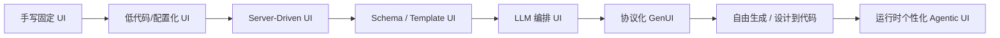
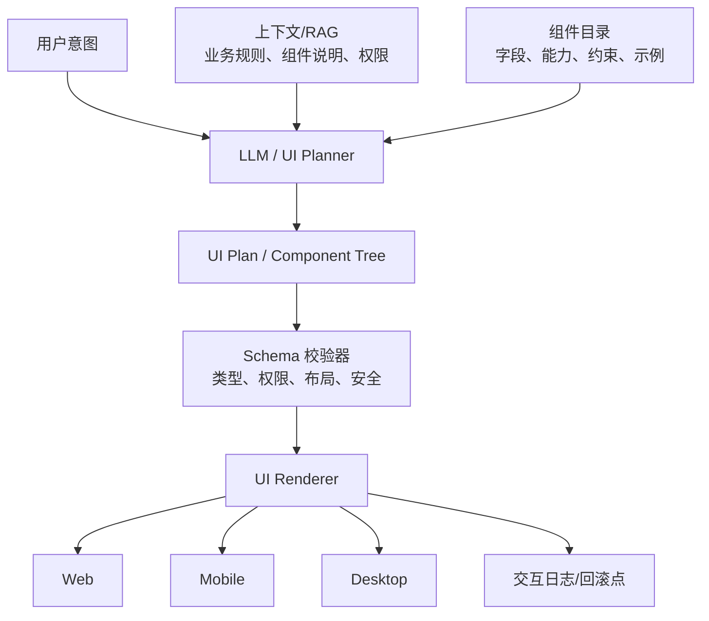
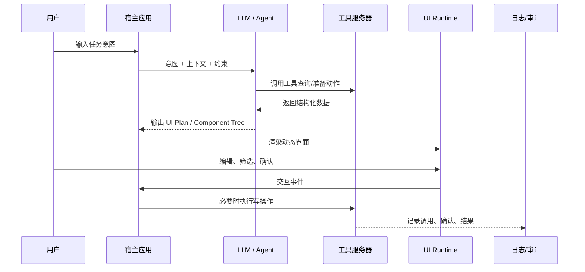
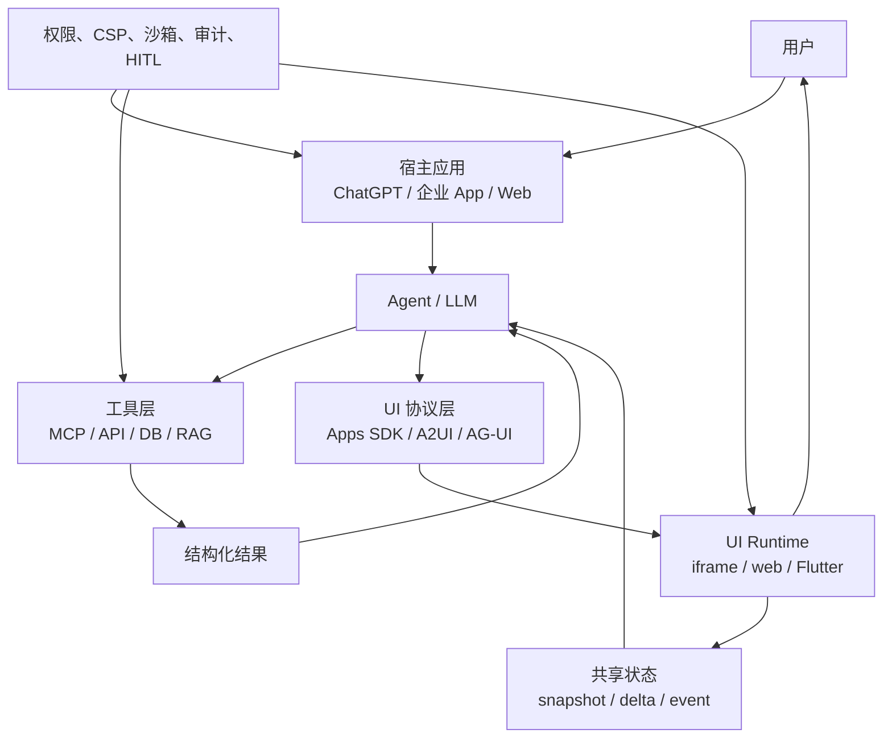
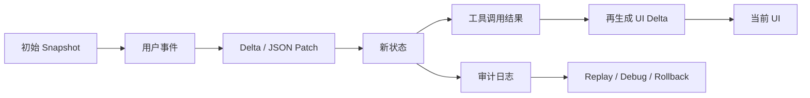
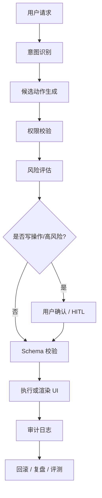
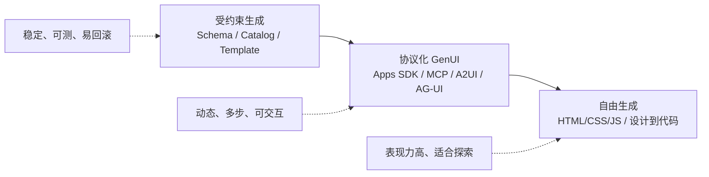

# 生成式 UI 技术学习文档

来源文档：`genui_report_direct_url_citations.docx`  
定位：把原汇报稿中的路线判断，改写为一份面向产品、前端、平台、Agent 架构同学的技术学习材料。  
学习目标：读完后能解释生成式 UI 的发展脉络、核心技术栈、工程边界、生态路线和企业落地风险。

---

## 0. 先建立一张技术地图

生成式 UI 不是“让 AI 随便画一个页面”。更准确的理解是：

> 生成式 UI 是一个由大模型、组件目录、声明式协议、状态同步、工具调用、权限治理、运行时渲染和评测体系共同组成的动态交互工程栈。

如果只看模型，会误以为 GenUI 的关键是“生成 HTML/CSS/JS”。但从企业落地看，真正关键的是：模型能否在受控组件和业务约束下，把用户意图转成稳定、可解释、可回滚、可审计的交互界面。

### 技术演进路线图



这条线不是替代关系，而是能力叠加关系。越往右，生成自由度越高；但稳定性、可测试性、安全治理成本也越高。

---

## 1. 从传统 UI 到 GenUI：每一代解决什么问题

| 阶段 | 典型技术 | 解决的问题 | 局限 |
|---|---|---|---|
| 手写固定 UI | React、Vue、Flutter、原生 App | 交互稳定、性能可控、测试成熟 | 灵活性低，需求变化靠人工开发 |
| 配置化 UI | 低代码平台、表单配置、CMS 配置 | 业务人员可改一部分页面 | 配置能力受平台限制，复杂交互难表达 |
| SDUI | Server-Driven UI、后端下发 UI JSON | 服务端动态决定界面结构，多端复用 | 决策通常仍由规则和后端逻辑驱动 |
| Schema UI | JSON Schema、JSON Forms、rjsf、模板引擎 | 用结构化 schema 生成表单/卡片/流程 | 创造性有限，但稳定可测 |
| LLM 编排 UI | 结构化输出、函数调用、RAG、组件选择 | 模型根据意图和上下文选择界面 | 需要强约束，防止幻觉和漂移 |
| 协议化 GenUI | Apps SDK、MCP Apps、A2UI、AG-UI、Flutter GenUI | 模型、工具、宿主、前端运行时通过协议协作 | 协议、状态、权限、兼容性成本高 |
| 自由生成 | Google Generative UI、Stitch、运行时代码生成 | 高度个性化、探索型、创意型体验 | 延迟、稳定性、安全、调试难度高 |

学习 GenUI 时，建议先从 SDUI 和 Schema UI 开始，因为它们是“受控生成”的基础。没有这一层，直接进入自由生成，很容易做出 demo 很炫、生产不可用的系统。

---

## 2. SDUI：GenUI 的前身

SDUI 的核心思想是：客户端不再把每个页面都写死，而是接收服务端返回的 UI 描述，再由客户端 renderer 渲染。

一个极简 SDUI 数据结构可能长这样：

```json
{
  "type": "form",
  "title": "报销申请",
  "fields": [
    { "type": "text", "name": "reason", "label": "报销事由" },
    { "type": "number", "name": "amount", "label": "金额" },
    { "type": "file", "name": "invoice", "label": "发票附件" }
  ],
  "actions": [
    { "id": "submit", "label": "提交审批", "risk": "L3" }
  ]
}
```

SDUI 解决的是“界面由谁下发”的问题。GenUI 进一步解决“界面应该如何根据意图生成或选择”的问题。

在 GenUI 里，服务端规则不再是唯一决策者。LLM 可以根据用户输入、当前任务、权限、业务数据和历史行为，生成 UI plan，再让前端运行时渲染。

---

## 3. Schema / Template / Component Catalog：企业落地的第一层

原文档的核心判断之一是：企业级核心流程不应该第一阶段就追求完全自由生成，而应该先建设“受约束生成”底座。

这一层由四个部分组成：

| 部分 | 作用 | 技术例子 |
|---|---|---|
| Schema | 描述数据结构、字段、校验规则 | JSON Schema、Zod、OpenAPI Schema |
| Template | 描述常见交互模板 | 表单、审批卡、搜索结果、对比表、确认卡 |
| Component Catalog | 可被模型选择的组件目录 | `DataTable`、`RiskCard`、`ApprovalPanel` |
| Renderer | 把 schema/component tree 渲染为真实 UI | React renderer、Flutter renderer、Web Component |

### 组件目录与 Renderer 架构



这一层的关键价值是“把模型能力限制在正确的空间里”。模型可以选择组件、填充参数、组织流程，但不能任意创建危险控件、绕过权限、执行不可逆操作。

---

## 4. LLM 在 GenUI 中到底做什么

LLM 不应该被理解为“前端替代者”。更合理的分工是：

| 模块 | 应该由谁负责 | 原因 |
|---|---|---|
| 意图理解 | LLM | 自然语言、模糊任务、上下文归纳是模型强项 |
| 组件选择 | LLM + 规则 | 模型可选方案，规则负责边界 |
| 布局细节 | Renderer + Design System | 保证一致性、响应式、可访问性 |
| 数据校验 | Schema / 后端 | 不能靠模型保证正确性 |
| 写操作执行 | 工具层 + 权限系统 | 需要鉴权、确认、审计 |
| 高风险动作确认 | 宿主应用 + 人类 | 防止越权、误操作和责任不清 |

一个稳妥的 GenUI prompt 通常不会要求模型“生成完整页面代码”，而是要求它输出结构化计划：

```json
{
  "surface": "task_dashboard",
  "components": [
    {
      "type": "PriorityTaskList",
      "props": {
        "title": "今日待处理",
        "sortReasonVisible": true
      }
    },
    {
      "type": "ApprovalQueue",
      "props": {
        "requiresExplicitConfirmation": true
      }
    }
  ]
}
```

这种方式牺牲了一部分自由度，但换来可测、可审计、可回滚。

---

## 5. RAG 在 GenUI 中的作用

RAG 不是只用来回答问题，也可以用于生成 UI。它在 GenUI 中主要检索四类知识：

| 检索对象 | 为什么需要 |
|---|---|
| 组件文档 | 让模型知道有哪些组件、字段、限制和示例 |
| 设计规范 | 保证按钮、表格、间距、颜色、可访问性符合系统规范 |
| 业务规则 | 决定哪些字段必填、哪些动作需要确认、哪些流程禁止自动执行 |
| 用户/设备上下文 | 根据用户角色、设备尺寸、当前任务选择合适 UI |

RAG 的输出不应直接展示给用户，而应作为 UI planner 的上下文输入。比如用户说“帮我做一个报销异常处理界面”，系统先检索报销制度、异常类型、组件目录和权限规则，再让模型生成一个受控 UI plan。

---

## 6. 工具调用与 UI 返回

GenUI 经常和工具调用一起出现。典型流程是：

1. 用户提出任务。
2. 模型判断需要调用工具。
3. 工具返回结构化数据。
4. 宿主把工具结果渲染成可交互 UI。
5. 用户在 UI 中修改、确认或继续操作。
6. 新事件回到 Agent 或工具层。



在 OpenAI Apps SDK 中，ChatGPT 内的 UI 组件可以通过 `window.openai` 与宿主交互；官方文档也强调这些能力要做特性检测和兼容处理。类似地，MCP Apps、A2UI、AG-UI 都在尝试把“工具结果变成可交互 UI”协议化。

---

## 7. 协议化 GenUI：从 demo 走向平台

原文档列出了几个重要生态方向。可以这样理解它们的职责：

| 方向 | 技术定位 | 适合学习的重点 |
|---|---|---|
| OpenAI Apps SDK / ChatGPT UI | 在 ChatGPT 宿主内渲染工具型 UI | 组件资源、工具结果、宿主桥接、CSP、安全 |
| MCP Apps | 让 MCP 工具返回交互式界面 | 工具协议、iframe 沙箱、权限与生命周期 |
| A2UI | JSON-based streaming UI protocol | server 到 client 的 UI 消息流、渐进渲染 |
| Flutter GenUI | 原生 Flutter widget catalog + JSON 编排 | 多端原生组件、DataModel、实验性 alpha 状态 |
| AG-UI | Agent 与前端之间的事件协议 | state、events、tools、interrupts、human-in-the-loop |
| Vercel AI SDK UI | Web 上的 AI UI 流式交互 | message parts、多步工具调用、UI 状态 |

### 协议化 GenUI 架构



协议化的意义是把不确定的模型输出变成可治理的系统行为。它不保证模型一定正确，但能让错误被限制、被发现、被回滚。

---

## 8. 自由生成与设计到代码：上限高，边界也高

Google Research 的 Generative UI 展示了一类更自由的路线：模型可以根据任意 prompt 动态创建完整交互页面、工具、模拟器或小游戏。Google 的公开说明中提到，这类实现会结合工具访问、系统指令和后处理，让模型输出可在浏览器中运行的界面。

这条路线非常适合：

- 学习、科普、探索性解释。
- 产品原型和创意发散。
- 设计初稿、营销活动页、低风险交互实验。
- “一个用户一个体验”的个性化探索。

但它不适合直接承载：

- 支付、审批、权限变更、合同、财务、人事等高风险动作。
- 高频关键操作，例如固定位置的提交、删除、外发按钮。
- 需要稳定肌肉记忆和严格回归测试的核心业务系统。

可以把它理解为“体验上限”，而不是“生产默认路径”。

---

## 9. 状态同步：GenUI 最容易被低估的技术

传统 UI 里，状态通常由前端框架管理。GenUI 中，状态会跨越用户、模型、工具、前端 runtime、后端系统和审计日志。

需要处理的状态包括：

| 状态类型 | 例子 | 技术要求 |
|---|---|---|
| UI 状态 | 当前展开的卡片、表单字段、筛选条件 | 前端本地状态、可恢复 |
| Agent 状态 | 当前任务、计划步骤、工具结果 | 可序列化、可重放 |
| 工具状态 | 查询结果、执行中、失败原因 | 幂等、可观察 |
| 用户确认状态 | 已确认、拒绝、待补充 | 与具体动作绑定 |
| 审计状态 | 谁在何时基于什么执行了什么 | 不可篡改、可追溯 |

### Snapshot + Delta + Replay



如果没有状态同步基础设施，GenUI 会出现很多难排查问题：界面重绘后用户输入丢失、模型重复调用工具、确认按钮对应的动作变了、不同端展示不一致、回滚失败。

---

## 10. 安全治理：模型可提议，系统必须确认

GenUI 会把“看信息”和“执行动作”放到同一个界面里，因此安全边界必须前置。

生产系统至少需要这些机制：

| 机制 | 作用 |
|---|---|
| Least privilege | 模型和工具只能拿到完成任务所需的最小权限 |
| Consent / Approval | 敏感工具调用前必须用户批准 |
| Sandbox iframe | 动态 UI 在受限容器运行，隔离宿主环境 |
| CSP | 限制脚本、网络、资源和 iframe 来源 |
| Prompt injection 防护 | 防止网页/文档中的恶意指令劫持 Agent |
| Audit log | 记录输入、检索、工具调用、确认和执行结果 |
| Rollback / Undo | 低风险动作可撤销，高风险动作执行前预览 |
| Policy engine | 用企业规则决定哪些动作可自动、需确认或禁止 |

### 安全门禁图



这也是原文档“受约束生成 + 协议化扩展 + 强回滚与审计”主线的核心原因。

---

## 11. 三类路线怎么选

| 判断问题 | 推荐路线 | 说明 |
|---|---|---|
| 是否涉及支付、审批、删除、权限、合同、财务、人事？ | 受约束生成 | 高风险动作优先稳定和确认 |
| 是否需要跨工具、多步流程、动态卡片？ | 协议化 GenUI | 用协议管理工具结果、状态和 UI |
| 是否是学习、探索、原型、创意生成？ | 自由生成 | 允许更高表现力和更大不确定性 |
| 是否依赖固定肌肉记忆？ | 固定 UI / 受约束生成 | 不宜让关键按钮位置随机变化 |
| 是否只需要字段驱动表单？ | Schema UI | 最稳、最易测 |
| 是否要根据用户上下文动态生成交互？ | LLM 编排 + 组件目录 | 模型选组件，系统控边界 |

可以把三条路线放在一张图里：



---

## 12. 生产化评测指标

原文档提出的稳定性门禁很重要。建议把评测拆成五组：

| 指标组 | 具体指标 | 说明 |
|---|---|---|
| UI 稳定性 | Anchor Stability、Layout Stability Score、UI Tree Edit Distance | 同一任务下界面结构不能大幅漂移 |
| 任务成功 | Task Completion Rate、Step Success Rate、Tool Success Rate | 不只是生成好看，还要完成任务 |
| 安全 | 高风险漏确认率、越权拦截率、敏感数据泄露率 | 企业核心指标，漏确认应接近 0 |
| 用户控制 | Undo Rate、Rollback Success、Interrupt Success | 用户能随时撤销、暂停、接管 |
| 可观测性 | Trace Coverage、Audit Completeness、Replay Success | 出错后能复盘和重放 |

学习时要特别注意：GenUI 的评测不能只看“界面是否漂亮”。对于企业场景，更关键的是“交互是否稳定、动作是否正确、风险是否被控制”。

---

## 13. 推荐学习路径

### 第一阶段：前端和结构化 UI 基础

- 学组件化 UI：React/Vue/Flutter 任一套。
- 学状态管理：local state、server state、event sourcing。
- 学 JSON Schema：字段、类型、校验、默认值。
- 做一个 schema-driven 表单 renderer。

### 第二阶段：受控 GenUI

- 给组件目录写机器可读描述。
- 让 LLM 根据用户意图输出 component tree。
- 加 schema validation，错误时让模型修正。
- 加 design tokens 和固定布局约束。

### 第三阶段：工具调用与 RAG

- 用 RAG 检索组件文档和业务规则。
- 让 Agent 查询真实数据，再返回动态 UI。
- 对写操作加确认卡。
- 记录工具调用日志。

### 第四阶段：协议化与状态同步

- 学 Apps SDK / MCP / A2UI / AG-UI 的基本思想。
- 实现 snapshot、delta、replay、rollback。
- 处理用户中断、工具失败、重复调用和冲突。

### 第五阶段：安全、评测与自由生成

- 加 least privilege、CSP、sandbox、审计。
- 建 UI 稳定性和高风险动作评测集。
- 在低风险场景尝试自由生成或设计到代码。

---

## 14. 小型实践项目

| 项目 | 目标 | 你会学到 |
|---|---|---|
| JSON Schema 表单生成器 | 根据 schema 渲染表单 | Schema UI、校验、renderer |
| 组件目录驱动的任务卡 | LLM 输出任务卡 component tree | 结构化输出、组件约束 |
| RAG + 组件选择 | 检索组件说明后生成 UI | RAG 在 GenUI 中的作用 |
| 工具结果动态 UI | 查询数据后渲染表格/图表/确认卡 | tool call 到 UI 的链路 |
| 状态回放 demo | 记录用户事件并重放 UI | snapshot、delta、debug |
| 风险确认卡 | 写操作前必须确认 | HITL、安全、审计 |

---

## 15. 配图与图像材料

下面这些图适合放进 PPT 或学习材料里，帮助建立直观理解。

### Google Research：GenUI 示例拼图


用途：说明自由生成路线的表现力，模型可以按 prompt 生成不同形态的交互体验。  
来源：[Google Research: Generative UI](https://research.google/blog/generative-ui-a-rich-custom-visual-interactive-user-experience-for-any-prompt/)

### Google Research：GenUI 高层流程图


用途：说明自由生成系统通常包含 prompt、系统指令、工具访问、后处理和浏览器运行。  
来源：[Google Research: Generative UI](https://research.google/blog/generative-ui-a-rich-custom-visual-interactive-user-experience-for-any-prompt/)

---

## 16. 参考资料

- OpenAI Apps SDK / ChatGPT UI：[Build your ChatGPT UI](https://developers.openai.com/apps-sdk/build/chatgpt-ui)
- OpenAI Apps SDK 安全与隐私：[Security & privacy](https://developers.openai.com/apps-sdk/guides/security-privacy)
- MCP Apps：[MCP Apps announcement](https://blog.modelcontextprotocol.io/posts/2026-01-26-mcp-apps/)
- MCP 安全最佳实践：[Security best practices](https://modelcontextprotocol.io/docs/tutorials/security/security_best_practices)
- Google Research GenUI：[Generative UI: A rich, custom, visual interactive user experience for any prompt](https://research.google/blog/generative-ui-a-rich-custom-visual-interactive-user-experience-for-any-prompt/)
- A2UI v0.9：[A2UI Protocol v0.9 Draft](https://a2ui.org/specification/v0.9-a2ui/)
- Flutter GenUI：[GenUI SDK for Flutter](https://docs.flutter.dev/ai/genui)
- AG-UI：[Agent User Interaction Protocol](https://docs.ag-ui.com/introduction)
- Vercel AI SDK RSC / UI：[Migrating from RSC to UI](https://ai-sdk.dev/docs/ai-sdk-rsc/migrating-to-ui)
- JSON Forms：[JSON Forms docs](https://jsonforms.io/docs/)
- React JSON Schema Form：[rjsf docs](https://rjsf-team.github.io/react-jsonschema-form/docs/)

---

## 17. 一句话总结

学习生成式 UI 时，不要从“AI 能不能画页面”开始，而要从“如何把用户意图转成受控、稳定、可执行、可审计的交互结构”开始。短期看，组件目录和 schema 是根；中期看，协议和状态同步是骨架；长期看，自由生成和个性化是上限。
