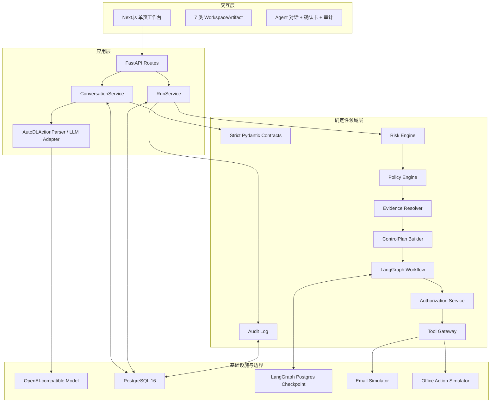
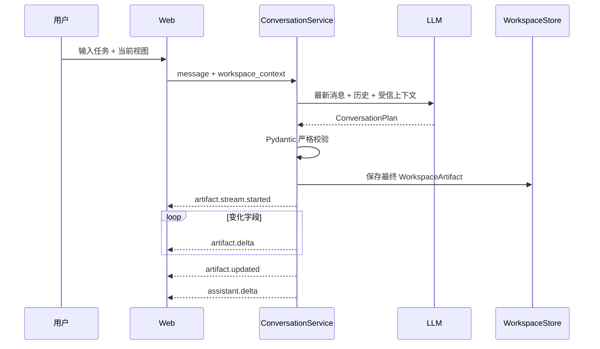
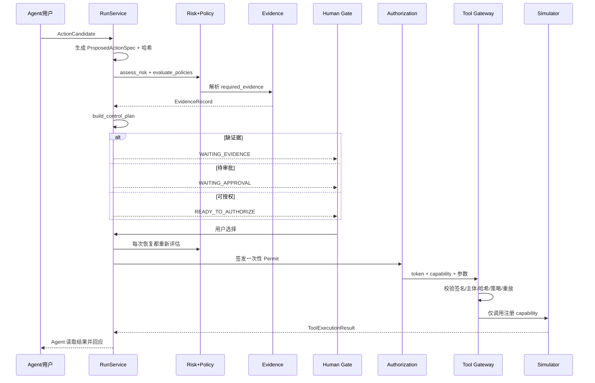

# 系统架构与技术路线

## 1. 架构目标

Office Agent V0.1 采用“工作区优先、Agent 协作、执行受控”的架构。它要解决的不是单次文本生成，而是以下组合问题：

- 用户在真实形态的办公界面中持续编辑，Agent 必须理解当前可见和未保存内容。
- Agent 应直接修改工作区，而不是把邮件、文档或日程全部堆在聊天消息中。
- 读取、起草、内部写入、外部发送和受限操作必须有不同的治理强度。
- LLM 输出不可信且可能不稳定，风险、权限、审批与执行不能依赖自然语言承诺。
- 用户确认后仍要防止参数被替换、授权重放、策略版本漂移和越权调用。

V0.1 的非目标是：接入真实企业系统、构建完整邮箱/文档管理系统、提供生产级身份与多租户能力、让模型自主决定策略。

## 2. 总体分层



### 2.1 交互层

`apps/web/app/page.tsx` 是 V0.1 的主要前端应用，`styles.css` 提供简约浅色视觉系统和少量磨砂玻璃点缀。布局固定为：

- 左侧：视图工具栏与工作区。
- 中间：可拖动分隔条。
- 右侧：持续对话、底部输入框和非阻塞确认卡。

前端不拥有风险决策、审批状态或 Permit；它只渲染服务端 Snapshot 并提交用户选择。

### 2.2 应用层

| 组件 | 代码位置 | 职责 |
| --- | --- | --- |
| FastAPI Routes | `services/api/app/api/routes.py` | 身份头解析、REST/SSE 接口、错误映射 |
| ConversationService | `services/api/app/application/conversations.py` | Thread、受信上下文、通识路由、工作区合并、SSE、动作与对话闭环 |
| RunService | `services/api/app/application/runs.py` | Run 生命周期、重评估、审批、授权、执行、持久化、审计 |
| LLM Adapter | `services/api/app/application/llm.py` | 对话计划、动作抽取、执行后自然语言回应、Schema 修复 |
| Storage | `services/api/app/application/storage.py` | Run 与 Workspace 的内存/PostgreSQL 实现 |

### 2.3 领域层

`packages/` 不依赖前端展示：

- `contracts`：模型与代码之间唯一允许的结构化协议。
- `risk_core`：风险评分、策略匹配、ControlPlan 合成。
- `evidence`：将外部事实解析为可审计 `EvidenceRecord`。
- `agent_runtime`：LangGraph interrupt/resume 编排。
- `authorization`：签发参数绑定的一次性 Permit。
- `tool_gateway`：在工具边界重新验证 Permit。
- `audit`：记录与推送不可变执行事件。

### 2.4 基础设施层

V0.1 使用 PostgreSQL 16 保存 Workspace、Run Snapshot 和审计事件，并使用官方 `AsyncPostgresSaver` 保存 LangGraph checkpoint。LLM 使用 OpenAI-compatible `/chat/completions`。所有工具调用落到 `simulators/`，不连接真实办公系统。

## 3. 两条核心数据路径

### 3.1 对话与工作区编辑



模型生成的是最终目标内容；后端把最终内容拆成可视增量事件。数据库只保存最终一致版本，不保存每个动画帧。

### 3.2 受控动作执行



## 4. 信任边界

### 4.1 可由 LLM 产生

- `assistant_response` 自然语言。
- `ArtifactDraft` 的表达性内容。
- `ActionCandidate` 中的业务候选字段：动作类型、目标、资源、数据类别、状态变化类型等。

所有字段必须通过严格枚举与 Schema 校验。LLM 输出只表示“候选事实”，不是授权结论。

### 4.2 只能由确定性服务产生

- `trace_id`、`action_id`、`payload_digest`、`idempotency_key`。
- 风险等级和原因码。
- 策略命中、capability verdict、证据要求、审批角色。
- Evidence 的状态、来源、摘要和检查时间。
- Action/参数哈希、Permit、执行结果和审计事件。

### 4.3 企业事实边界

模型只能从 `trusted_context` 使用内部事实。V0.1 的 `trusted_context` 来自确定性 Demo Fixture 和当前工作区；没有来源的企业金额、报价、发票、权限和客户记录必须标注待查询或待确认。通识问答可直接调用模型，但不能据此声称知道企业内部数据。

## 5. 状态与持久化

| 数据 | 默认内存模式 | 配置 PostgreSQL 后 | 重启恢复 |
| --- | --- | --- | --- |
| ConversationThread / ChatMessage | 内存 | 仍为内存 | 否 |
| WorkspaceArtifact | 内存 | `workspace_artifacts` | 是 |
| RunSnapshot / submitted evidence | 内存 | `runs` | 是 |
| AuditEvent | 内存 | `audit_events` | 是 |
| LangGraph checkpoint | `InMemorySaver` | PostgresSaver 表 | 是 |
| Permit 已使用集合 | 进程内存 | 进程内存 | 否 |

配置 `LANGGRAPH_CHECKPOINT_DSN` 后，FastAPI lifespan 会同时初始化 Run、Workspace、Audit 和 checkpoint 存储，并恢复 Run Snapshot。对话持久化和分布式 Permit 重放存储属于后续版本工作。

## 6. 运行时与部署拓扑

```text
Browser :3000  ──REST/SSE──>  FastAPI :8010
                                 │
                                 ├── OpenAI-compatible LLM endpoint
                                 ├── PostgreSQL :5432
                                 └── in-process Simulators
```

`start-demo.ps1` 负责启动 Docker Desktop、PostgreSQL、API 和 Web，并把日志写入 `.runtime/`。Windows 使用 Selector event loop 以兼容 psycopg 异步连接。

## 7. 扩展路线

### 7.1 替换真实 Connector

保留 `ActionCandidate → ControlPlan → Permit → Gateway` 主链，只替换：

- `MockEvidenceResolver` 为通讯录、DLP、文件、CRM、OA、日历适配器。
- `EmailSimulator` / `OfficeActionSimulator` 为真实工具适配器。
- Tool Gateway 的 capability registry 与凭据代理。

真实工具不得绕过 Gateway，Connector 不应自行接受自然语言授权。

### 7.2 生产化优先级

1. SSO/JWT、租户隔离和服务端 RBAC。
2. Thread/Message 与多 Artifact 列表持久化。
3. Alembic、领域拆表、Outbox 和后台任务。
4. Permit 使用记录的共享持久化与多实例一致性。
5. Connector 凭据托管、限流、超时、补偿和告警。
6. 策略配置中心、版本发布和离线评测资产。
7. 真实 DLP/内容分类、来源血缘和字段级权限。

## 8. 代码索引顺序

后续 Agent 或开发者建议按以下顺序阅读：

1. `README.md`：范围与边界。
2. `packages/contracts/models.py`：协议词汇表。
3. `services/api/app/application/conversations.py`：工作区与对话主链。
4. `services/api/app/application/runs.py`：动作执行主链。
5. `packages/risk_core/`：风险与策略真值。
6. `packages/agent_runtime/workflow.py`：人工 Gate。
7. `packages/authorization/` 与 `packages/tool_gateway/`：执行安全边界。
8. `apps/web/app/page.tsx`：前端交互状态机。
9. `tests/`：预期行为与回归边界。
