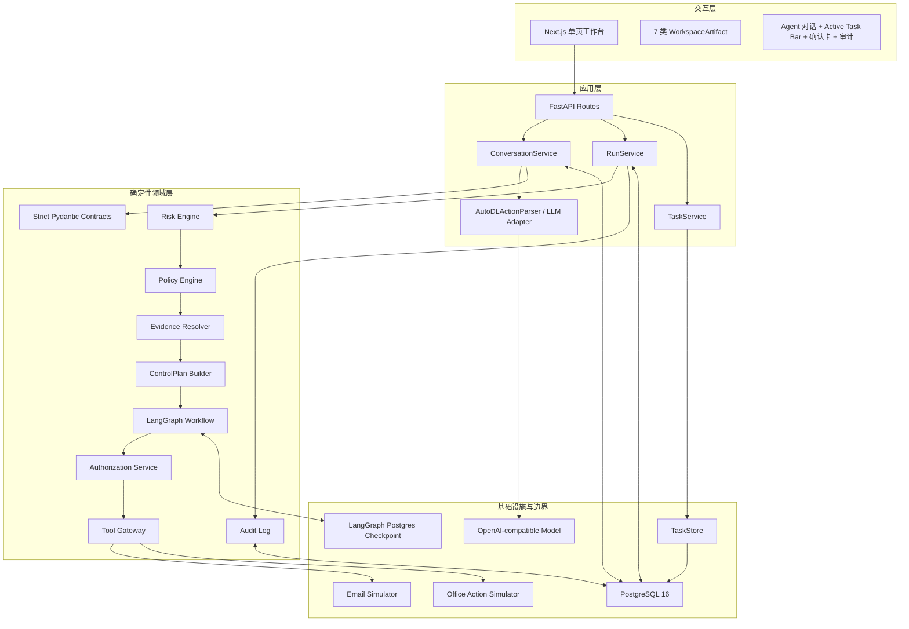
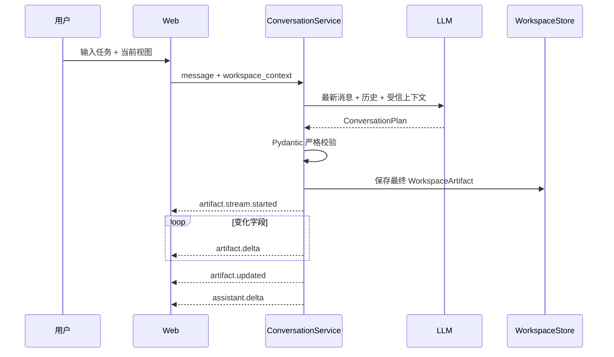
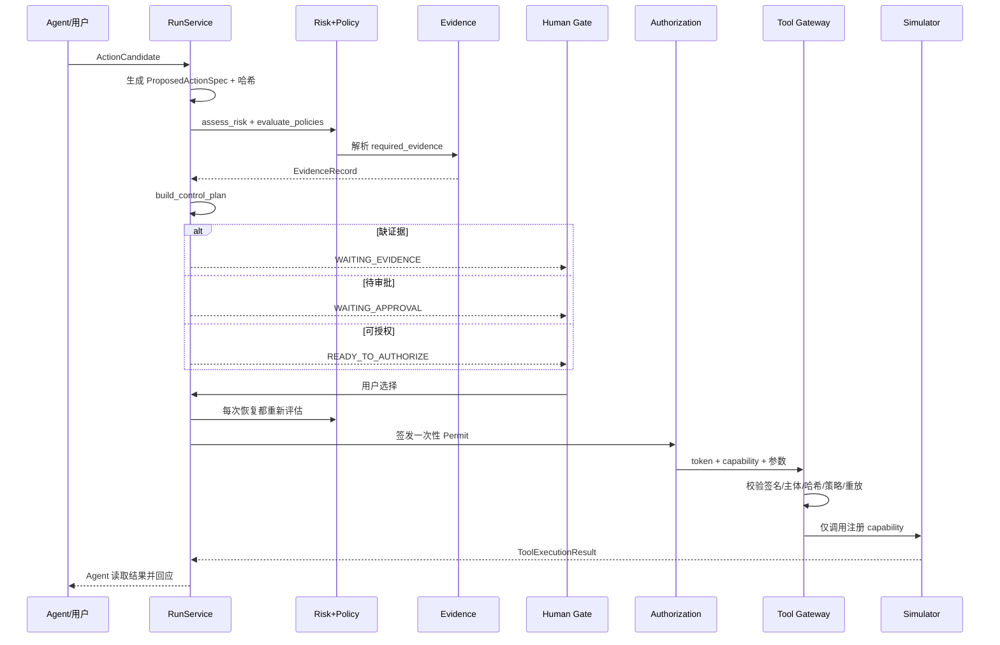
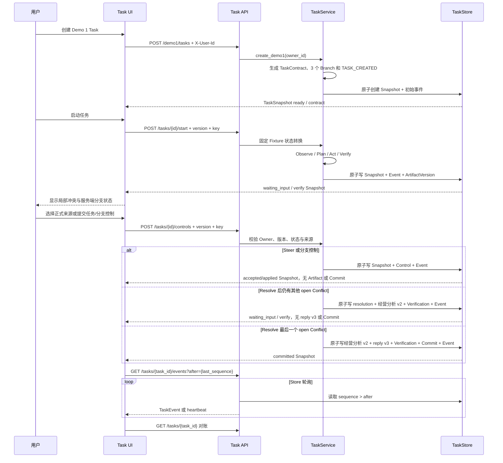

# 系统架构与技术路线

## 1. 架构目标

Office Agent V0.1 采用“工作区优先、Agent 协作、执行受控”的架构。它要解决的不是单次文本生成，而是以下组合问题：

- 用户在真实形态的办公界面中持续编辑，Agent 必须理解当前可见和未保存内容。
- Agent 应直接修改工作区，而不是把邮件、文档或日程全部堆在聊天消息中。
- 读取、起草、内部写入、外部发送和受限操作必须有不同的治理强度。
- LLM 输出不可信且可能不稳定，风险、权限、审批与执行不能依赖自然语言承诺。
- 用户确认后仍要防止参数被替换、授权重放、策略版本漂移和越权调用。

V0.1 的非目标是：接入真实企业系统、构建完整邮箱/文档管理系统、提供生产级身份与多租户能力、让模型自主决定策略。

## 2. 总体分层



### 2.1 交互层

`apps/web/app/page.tsx` 是 V0.1 的主要前端应用，`styles.css` 提供简约浅色视觉系统和少量磨砂玻璃点缀。布局固定为：

- 左侧：视图工具栏与工作区。
- 中间：可拖动分隔条。
- 右侧：持续对话、底部输入框和非阻塞确认卡。
- 右侧顶部：Active Task Bar，从 TaskSnapshot 展示 Task ID、状态、阶段、预算、版本和连接同步状态。
- Active Task 下方：Branch、Conflict、Control 和最近 Commit 明细；其业务状态全部来自服务端 Snapshot 或 SSE 后的 Snapshot 对账。
- 左侧 Tasks 视图：PR 4 用“长期任务工件 / 工作台待办”两个 tab 同时保留服务端 Task Artifact Workspace 与原手工待办。Task 面板的分支 head 可直接打开对应工件。

`TaskArtifactWorkspace` 只投影 `TaskSnapshot`：以 `branches[].artifact_heads` 选择 head，以 `artifact_versions[].parent_version_id` 构建 lineage，以 `verification_reports[]` 和 `conflicts[]` 显示验证/冲突，以 `last_commit` 显示最终提交与 state hash。没有服务端 head、验证或 Commit 时，前端显示缺失状态而不是补造事实。来源和验证检查默认折叠。固定 Fixture 的 `analysis/risk_brief/reply_draft` 使用字段 allowlist，未知 kind/字段默认隐藏；`source_ref` 只显示契约中的四个已知 Demo 1 Fixture 引用，其他标识显示隐藏占位。这只是前端第二道投影：服务端尚未提供通用字段可见性 Schema/display projection，allowlist 字段中的任意文本仍不能视为天然安全。

前端不拥有风险决策、审批状态或 Permit；它只渲染服务端 Snapshot 并提交用户选择。

Action Gate 打开时，Active Task Bar 保留，Gate 占用独立网格行。TaskRuntimePanel 继续挂载以保留未提交 Steer 草稿，但其容器视觉隐藏并带 `aria-hidden`；Task Runtime 控制与 Task Bar 的创建、重连和立即对账均因 Gate 状态被禁用。Gate 收起后该行缩至 58px，把空间归还给对话。这样避免任务控制与副作用确认同时抢占用户决策，但目前只是交互互斥：Task Artifact 尚未绑定到 ActionCandidate/Run，Task Artifact 改变也尚不会自动触发现有 Action 失效。

### 2.2 应用层

| 组件 | 代码位置 | 职责 |
| --- | --- | --- |
| FastAPI Routes | `services/api/app/api/routes.py` | 身份头解析、REST/SSE 接口、错误映射 |
| ConversationService | `services/api/app/application/conversations.py` | Thread、受信上下文、通识路由、工作区合并、SSE、动作与对话闭环 |
| RunService | `services/api/app/application/runs.py` | Run 生命周期、重评估、审批、授权、执行、持久化、审计 |
| TaskService | `services/api/app/application/tasks.py` | 创建和恢复 TaskSnapshot、固定 Demo 1 start、Verifier/Conflict/Commit、任务控制、Owner scope、mutation 幂等与事件轮询 |
| LLM Adapter | `services/api/app/application/llm.py` | 对话计划、动作抽取、执行后自然语言回应、Schema 修复 |
| Storage | `services/api/app/application/storage.py` | Run 与 Workspace 的内存/PostgreSQL 实现 |
| Task Storage | `services/api/app/application/task_storage.py` | Task Snapshot、TaskEvent 与 ArtifactVersion 原子 mutation 的内存/PostgreSQL 实现 |

### 2.3 领域层

`packages/` 不依赖前端展示：

- `contracts`：动作治理与 Task Runtime 的严格结构化协议。
- `risk_core`：风险评分、策略匹配、ControlPlan 合成。
- `evidence`：将外部事实解析为可审计 `EvidenceRecord`。
- `agent_runtime`：LangGraph interrupt/resume 编排。
- `authorization`：签发参数绑定的一次性 Permit。
- `tool_gateway`：在工具边界重新验证 Permit。
- `audit`：记录与推送不可变执行事件。

### 2.4 基础设施层

V0.1 使用 PostgreSQL 16 保存 Workspace、Run Snapshot 和审计事件，并使用官方 `AsyncPostgresSaver` 保存 LangGraph checkpoint。Demo 1 TaskStore 另用 `agent_tasks`、`agent_task_events` 和 `agent_task_artifact_versions` 保存 Task 投影、事件和追加式工件版本。PR 5 已在本机 PostgreSQL 16.14 上用三个顺序 API 进程验证 waiting-input 与 committed 两个恢复点，以及跨重启幂等零重复；这不等于 Conversation、多实例或数据库故障恢复。LLM 使用 OpenAI-compatible `/chat/completions`；固定 Demo 1 Task start 不调用 LLM。所有工具调用落到 `simulators/`，不连接真实办公系统。

## 3. 两条核心数据路径

### 3.1 对话与工作区编辑



模型生成的是最终目标内容；后端把最终内容拆成可视增量事件。数据库只保存最终一致版本，不保存每个动画帧。

### 3.2 受控动作执行



### 3.3 Demo 1 固定 Fixture 受控纵切（PR 3 后端，PR 4 前台）



Task ID、Owner、版本、状态和时间均由服务端产生。读取、列表、控制和订阅都按 Owner 过滤；所有 mutation 使用预期 Task 版本和幂等键，前端只在收到服务端 Snapshot 后更新业务状态。

`start` 中的 Observe、Plan、Act、Verify 是一次请求内的固定 Fixture 轨迹，数据和工件内容由确定性代码提供，不来自 LLM 或真实 Connector。事务提交前没有对外可见的中间 Snapshot，因此该路径不能表述为通用后台持续运行器。Steer 当前若只进入 `accepted`，服务端只证明指令已持久记录；重新规划和 `CONTROL_APPLIED` 仍需后续循环。Task SSE 通过当前 API 进程轮询 Store，不是跨实例通知系统；Active Task Bar 的“已同步”仅代表 Snapshot 对账完成。

前端在 mutation 结果未知时把原始 `idempotency_key`、intent 和预期版本保存到当前标签页的 `sessionStorage` 并冻结新控制；pending 状态提供同 key 对账入口。同 key 重放返回首次响应，因此前端确认后还会 GET 当前 Task 的最新 Snapshot，避免用历史响应回滚当前界面。PR 4 浏览器 E2E 已覆盖 start 请求发送前 abort、reload 后入口可达、同 key 重试和无重复 ArtifactVersion；由于 abort 发生在请求交给服务端之前，它不证明“服务端已经提交但响应丢失”的浏览器恢复。

PR 4 E2E 使用 system Edge 访问 Next.js `3011`，由页面调用真实本地 FastAPI `8011` 与内存 TaskStore。主路径断言服务端创建、冲突、Steer accepted、resolve、Commit 和交付物终态；移动 viewport 断言被测区域无横向 overflow、被测可见操作目标至少 44px。该拓扑不包含 PostgreSQL、API 进程重启、多实例或真实 Connector，也未覆盖 Task SSE 断线回放。

PR 5 增加独立 opt-in system test：每次创建随机 PostgreSQL 16 数据库，API A 写入 v2 后退出，API B 逐字段恢复 v2 并形成 v3 Commit 后退出，API C 逐字段恢复 v3，再重放旧 start/resolve key；数据库保持 `1 task / 45 events / 7 artifacts / 1 TASK_COMMITTED`。同页 system Edge 运行还验证 API 停止时保留最后 Snapshot、禁用控制并显示恢复中，新进程启动后再 GET 同一 Task。该浏览器证据没有在停机期间写入事件，因此不证明 `after` 缺口回放。

## 4. 信任边界

### 4.1 可由 LLM 产生

- `assistant_response` 自然语言。
- `ArtifactDraft` 的表达性内容。
- `ActionCandidate` 中的业务候选字段：动作类型、目标、资源、数据类别、状态变化类型等。

所有字段必须通过严格枚举与 Schema 校验。LLM 输出只表示“候选事实”，不是授权结论。

### 4.2 只能由确定性服务产生

- `trace_id`、`action_id`、`payload_digest`、`idempotency_key`。
- 风险等级和原因码。
- 策略命中、capability verdict、证据要求、审批角色。
- Evidence 的状态、来源、摘要和检查时间。
- Action/参数哈希、Permit、执行结果和审计事件。
- Task/Branch 状态、ArtifactVersion 身份与摘要、VerificationReport、ConflictRecord、ControlEvent、TaskCommit 和 TaskEvent sequence。

### 4.3 企业事实边界

模型只能从 `trusted_context` 使用内部事实。V0.1 的 `trusted_context` 来自确定性 Demo Fixture 和当前工作区；没有来源的企业金额、报价、发票、权限和客户记录必须标注待查询或待确认。通识问答可直接调用模型，但不能据此声称知道企业内部数据。

## 5. 状态与持久化

| 数据 | 默认内存模式 | 配置 PostgreSQL 后 | 重启恢复 |
| --- | --- | --- | --- |
| ConversationThread / ChatMessage | 内存 | 仍为内存 | 否 |
| WorkspaceArtifact | 内存 | `workspace_artifacts` | 是 |
| RunSnapshot / submitted evidence | 内存 | `runs` | 是 |
| AuditEvent | 内存 | `audit_events` | 是 |
| LangGraph checkpoint | `InMemorySaver` | PostgresSaver 表 | 是 |
| TaskSnapshot / TaskEvent | `InMemoryTaskStore` | `agent_tasks` / `agent_task_events` | PostgreSQL 16.14 下已验证顺序 API 进程恢复 v2/v3；内存模式进程退出即丢失 |
| Task ArtifactVersion | `InMemoryTaskStore` 追加列表 | `agent_task_artifact_versions` mutation 路径 | PostgreSQL 16.14 下已验证 5/7 个版本跨进程恢复及幂等零新增 |
| Permit 已使用集合 | 进程内存 | 进程内存 | 否 |

TaskStore 优先使用 `DATABASE_DSN`，没有时回退到 `LANGGRAPH_CHECKPOINT_DSN`；两者都不存在时使用进程内存。内存测试中的服务重建只能证明同一个 Store 对象仍可读取投影，不能证明 API 进程重启恢复。PR 5 的 PostgreSQL 证据将 TaskStore 单独设为 postgres、checkpoint 保持 memory，以隔离证明 Task 表；本机完整演示配置两条 DSN 时健康接口显示两者均为 postgres。配置 `LANGGRAPH_CHECKPOINT_DSN` 后，FastAPI lifespan 还会初始化 Run、Workspace、Audit 和 checkpoint 存储，并恢复 Run Snapshot。已有库迁移、数据库进程故障、对话持久化、跨实例 Task 通知和分布式 Permit 重放存储属于后续工作。

## 6. 运行时与部署拓扑

```text
Browser :3000  ──REST/SSE──>  FastAPI :8010
                                 │
                                 ├── OpenAI-compatible LLM endpoint
                                 ├── PostgreSQL :5432
                                 └── in-process Simulators
```

当前 Task SSE 是每个 API 进程对 TaskStore 的轮询，没有 PostgreSQL `LISTEN/NOTIFY`、消息代理或跨实例广播；多实例的通知延迟、连接迁移和一致性尚未实现或验证。

`scripts/start-demo.ps1` 负责启动 Docker Desktop、PostgreSQL、API 和 Web，并把日志写入 `.runtime/`。Windows 使用 Selector event loop 以兼容 psycopg 异步连接。

## 7. 扩展路线

### 7.1 替换真实 Connector

保留 `ActionCandidate → ControlPlan → Permit → Gateway` 主链，只替换：

- `MockEvidenceResolver` 为通讯录、DLP、文件、CRM、OA、日历适配器。
- `EmailSimulator` / `OfficeActionSimulator` 为真实工具适配器。
- Tool Gateway 的 capability registry 与凭据代理。

真实工具不得绕过 Gateway，Connector 不应自行接受自然语言授权。

### 7.2 生产化优先级

1. SSO/JWT、租户隔离和服务端 RBAC。
2. Thread/Message 与多 Artifact 列表持久化。
3. Alembic、领域拆表、Outbox 和后台任务。
4. Permit 使用记录的共享持久化与多实例一致性。
5. Connector 凭据托管、限流、超时、补偿和告警。
6. 策略配置中心、版本发布和离线评测资产。
7. 真实 DLP/内容分类、来源血缘和字段级权限。

## 8. 代码索引顺序

后续 Agent 或开发者建议按以下顺序阅读：

1. `README.md`：范围与边界。
2. `packages/contracts/models.py`：协议词汇表。
3. `packages/contracts/task_models.py`：Demo 1 Task Runtime 协议。
4. `services/api/app/application/tasks.py` 与 `task_storage.py`：Task 创建、读取、Owner scope、幂等和 Store。
5. `services/api/app/application/conversations.py`：工作区与对话主链。
6. `services/api/app/application/runs.py`：动作执行主链。
7. `packages/risk_core/`：风险与策略真值。
8. `packages/agent_runtime/workflow.py`：人工 Gate。
9. `packages/authorization/` 与 `packages/tool_gateway/`：执行安全边界。
10. `apps/web/app/page.tsx`：前端交互状态机与 Active Task Bar。
11. `tests/`：预期行为与回归边界。
