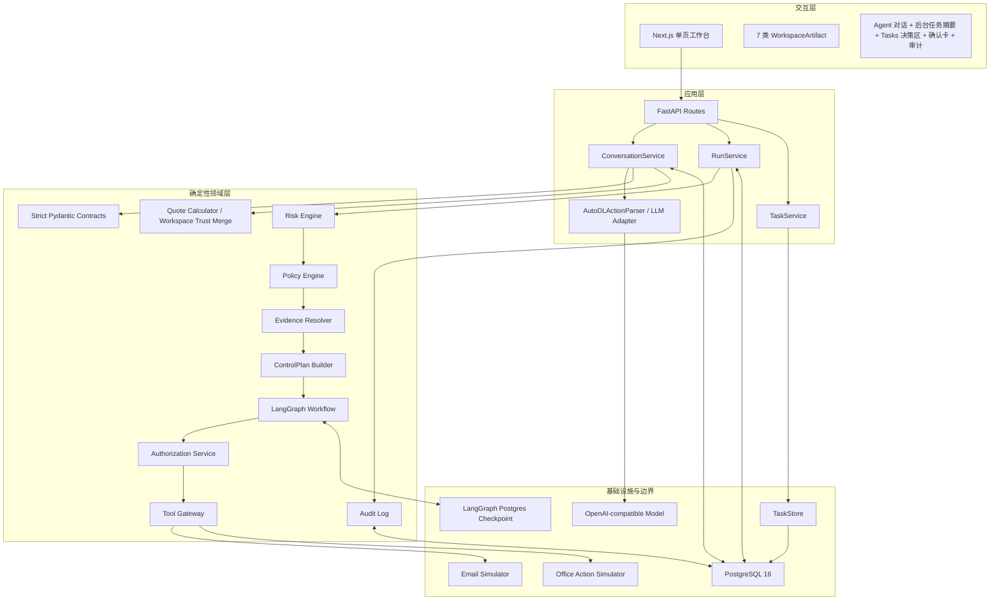
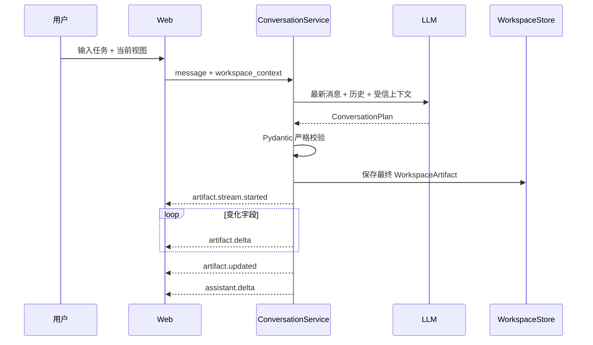
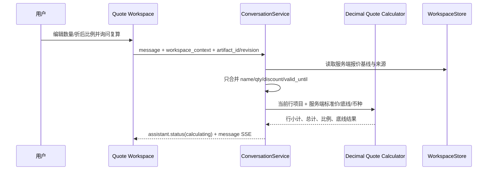
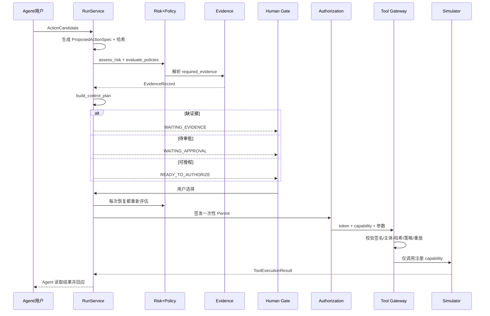
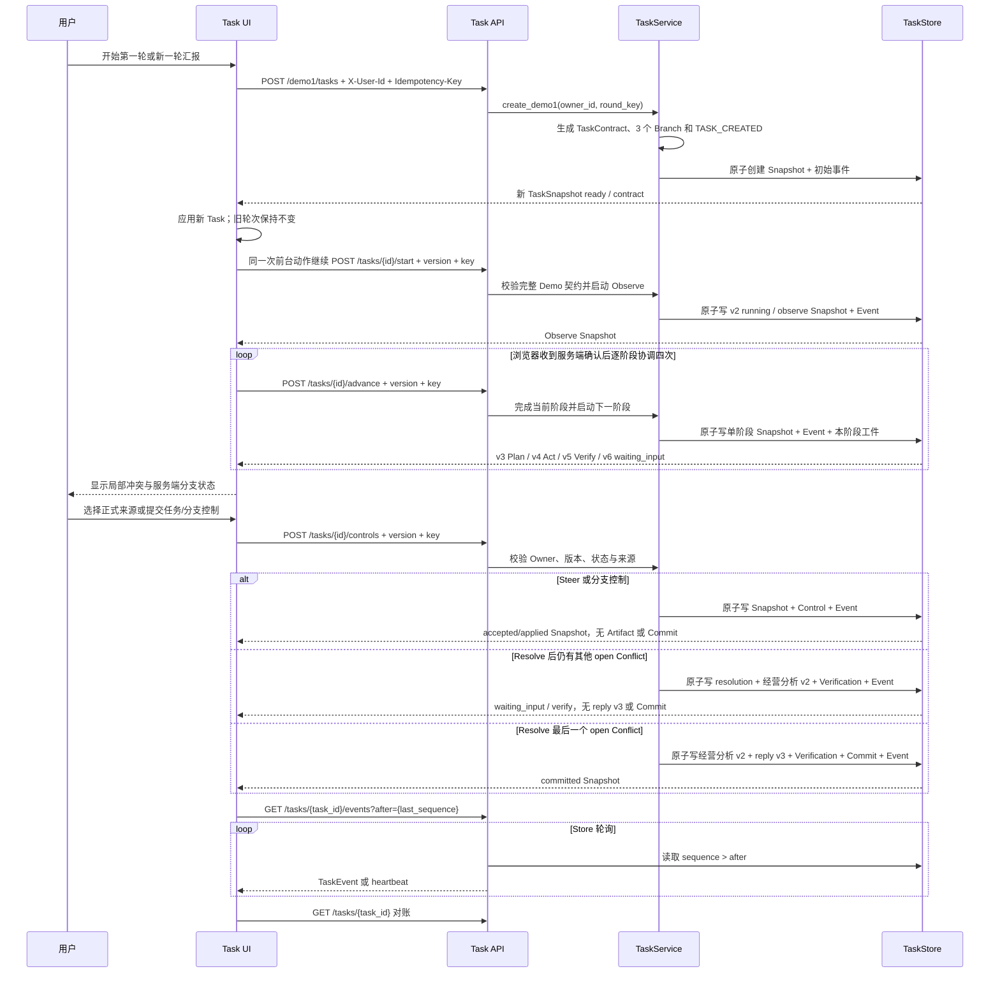
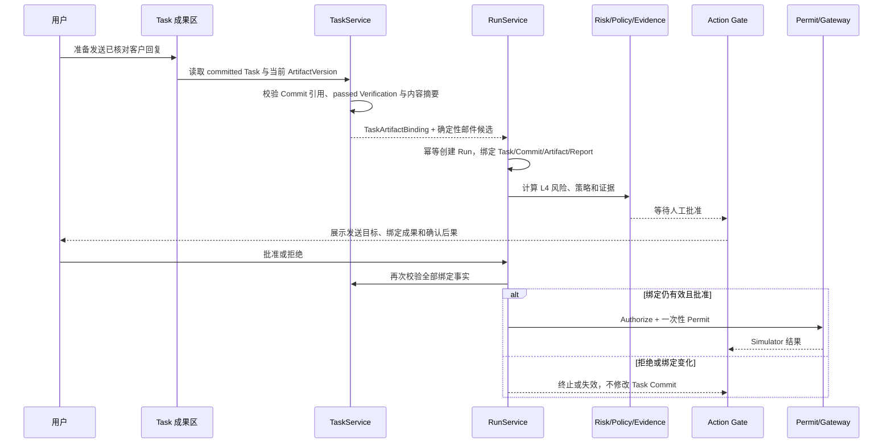
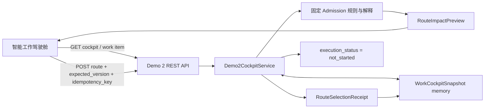

# 系统架构与技术路线

## 1. 架构目标

Office Agent V0.1 采用“工作区优先、Agent 协作、执行受控”的架构。它要解决的不是单次文本生成，而是以下组合问题：

- 用户在真实形态的办公界面中持续编辑，Agent 必须理解当前可见和未保存内容。
- Agent 应直接修改工作区，而不是把邮件、文档或日程全部堆在聊天消息中。
- 读取、起草、内部写入、外部发送和受限操作必须有不同的治理强度。
- LLM 输出不可信且可能不稳定，风险、权限、审批与执行不能依赖自然语言承诺。
- 用户确认后仍要防止参数被替换、授权重放、策略版本漂移和越权调用。

V0.1 的非目标是：接入真实企业系统、构建完整邮箱/文档管理系统、提供生产级身份与多租户能力、让模型自主决定策略。

## 2. 总体分层



### 2.1 交互层

`apps/web/app/page.tsx` 是 V0.1 的主要前端应用，`styles.css` 提供暖纸底色、墨黑正文、靛蓝全局强调和工作区身份色组成的浅色视觉系统。布局固定为：

- 左侧：视图工具栏与工作区。
- 中间：可拖动分隔条。
- 右侧：持续对话、底部输入框和非阻塞确认卡。
- 右侧顶部：后台任务摘要，从 `TaskSnapshot.contract/status/phase` 和客户端同步状态显示当前或上一轮经营汇报。邮件、文档等非 Tasks 工作区只提供“打开任务 / 前往处理 / 查看任务 / 查看汇报”跳转，不渲染 Branch、Conflict 或 Control。
- 右侧 Tasks 专属区：在“待我决定 / Agent 对话”之间切换；Conflict、候选依据、控制和恢复只在 Tasks 中出现，其业务状态全部来自服务端 Snapshot 或 SSE 后的 Snapshot 对账。
- 左侧 Tasks 视图：用“进度 / 成果 / 执行记录”三个模式分别承载 Task Director、只读 Task Artifact Workspace 和原手工待办。手工待办按状态分栏显示为可编辑看板，Task 分支 head 可直接打开对应工件。

`TaskArtifactWorkspace` 只投影 `TaskSnapshot`：以 `branches[].artifact_heads` 选择 head，以 `artifact_versions[].parent_version_id` 构建 lineage，以 `verification_reports[]` 和 `conflicts[]` 显示验证/冲突，以 `last_commit` 显示最终提交与 state hash。没有服务端 head、验证或 Commit 时，前端显示缺失状态而不是补造事实。来源和验证检查默认折叠。固定 Fixture 的 `analysis/risk_brief/reply_draft` 使用字段 allowlist，未知 kind/字段默认隐藏；四个已知 `source_ref` 投影为带“演示数据”前缀的业务标签，普通业务 DOM 只接收标签和序号 key，不接收原始 `fixture:` 值，其他标识显示隐藏占位。服务端 Snapshot 仍保留原始标识用于控制校验与审计。这只是前端第二道投影：服务端尚未提供通用字段可见性 Schema/display projection，allowlist 字段中的任意文本仍不能视为天然安全。

前端不拥有风险决策、审批状态或 Permit；它只渲染服务端 Snapshot 并提交用户选择。

Action Gate 打开时，后台任务摘要保留，Gate 占用独立网格行；Tasks 决策区退出交互，任务跳转、创建、重连和立即对账均被禁用。Gate 收起后把空间归还给对话。这样避免任务控制与副作用确认同时抢占用户决策。`DR-0007` 又为固定客户回复补上一条窄绑定：只有 `TaskCommit` 中已通过验证的当前 `reply_draft` 才能准备 `email.send` Run，Gate 展示绑定成果版本并明确“准备动作不等于发送”；通用 Task Artifact 动作、附件和真实 Connector 仍未实现。

### 2.2 应用层

| 组件 | 代码位置 | 职责 |
| --- | --- | --- |
| FastAPI Routes | `services/api/app/api/routes.py` | 身份头解析、REST/SSE 接口、错误映射 |
| ConversationService | `services/api/app/application/conversations.py` | Thread、受信上下文、通识路由、工作区合并、SSE、动作与对话闭环 |
| Quote Calculator | `services/api/app/application/quote_calculator.py` | 报价字段所有权合并、Decimal 逐行核算、最低折后比例检查、来源/核算确定性回答 |
| RunService | `services/api/app/application/runs.py` | Run 生命周期、重评估、审批、授权、执行、持久化、审计，以及 Task Artifact binding 的创建幂等与门前重校验 |
| TaskService | `services/api/app/application/tasks.py` | 创建和恢复 TaskSnapshot、固定 Demo 1 start、Verifier/Conflict/Commit、任务控制、Owner scope、mutation 幂等、事件轮询，以及已提交工件的受控读取与动作绑定校验 |
| LLM Adapter | `services/api/app/application/llm.py` | 对话计划、动作抽取、执行后自然语言回应、Schema 修复 |
| Storage | `services/api/app/application/storage.py` | Run 与 Workspace 的内存/PostgreSQL 实现 |
| Task Storage | `services/api/app/application/task_storage.py` | Task Snapshot、TaskEvent 与 ArtifactVersion 原子 mutation 的内存/PostgreSQL 实现 |

### 2.3 领域层

`packages/` 不依赖前端展示：

- `contracts`：动作治理与 Task Runtime 的严格结构化协议。
- `risk_core`：风险评分、策略匹配、ControlPlan 合成。
- `evidence`：将外部事实解析为可审计 `EvidenceRecord`。
- `agent_runtime`：LangGraph interrupt/resume 编排。
- `authorization`：签发参数绑定的一次性 Permit。
- `tool_gateway`：在工具边界重新验证 Permit。
- `audit`：记录与推送不可变执行事件。

### 2.4 基础设施层

V0.1 使用 PostgreSQL 16 保存 Workspace、Run Snapshot 和审计事件，并使用官方 `AsyncPostgresSaver` 保存 LangGraph checkpoint。Demo 1 TaskStore 另用 `agent_tasks`、`agent_task_events` 和 `agent_task_artifact_versions` 保存 Task 投影、事件和追加式工件版本。PR 5 已在本机 PostgreSQL 16.14 上用三个顺序 API 进程验证 waiting-input 与 committed 两个恢复点，以及跨重启幂等零重复；这不等于 Conversation、多实例或数据库故障恢复。LLM 使用 OpenAI-compatible `/chat/completions`；固定 Demo 1 Task start 不调用 LLM。所有工具调用落到 `simulators/`，不连接真实办公系统。

## 3. 两条核心数据路径

### 3.1 对话与工作区编辑



模型生成的是最终目标内容；后端把最终内容拆成可视增量事件。数据库只保存最终一致版本，不保存每个动画帧。

#### 报价核算旁路（DR-0006）

报价数值或来源问题沿用 Conversation SSE 外壳，但不让 LLM 生成金额：



前端 `apps/web/app/quote-calculator.ts` 用整数分与 BigInt 实现相同的逐行半入舍入，负责未保存编辑时的即时反馈；它不拥有报价身份、标准价、审批或来源。显式未保存上下文绑定当前 `artifact_id/revision`，保存绑定 `expected_artifact_id/expected_revision`。服务端忽略旧 `subtotal/total` 并规范化保存；任一必需字段无效、越界、超限或行数与基线不一致时，两端都 fail closed。用户要求写入或发送时退出核算旁路，继续 LLM 规划与确定性治理链路。

Workspace revision 采用当前进程内的乐观并发检查。同一用户的 Workspace 写入由进程内锁串行；旧 revision 保存返回 409，Conversation 流中的旧 revision 或规划期间目标 Artifact 变化产生 `workspace.conflict`，且不写 Artifact、不创建 Run。Web 保留本地草稿并读取最新 Artifact，可选择直接查看最新版本，或用编辑起点、本地草稿、最新版本做有界三方重应用；同字段双改和行结构变化拒绝自动合并。请求发出后用户又编辑时，前端用请求时 Artifact 和 edit token 识别晚到的 Agent Artifact，不同字段保留双方修改，同字段进入同一冲突恢复。这还不是数据库原子 compare-and-swap、多实例锁或通用协作文档合并。

### 3.2 受控动作执行



在 `ActionCandidate` 进入 RunService 之前，ConversationService 会按注册 capability 将它重新绑定到当前可见 WorkspaceArtifact。邮件收件人、附件、主题和正文来自 Artifact；目标范围、数据分类、状态变化类型、可逆性和 `artifact_id/revision/content` 由确定性代码重建，模型自报的参数与 `source_refs` 不进入可执行动作。ArtifactDraft 的 `sources` 同样被忽略：已有 Artifact 保留服务端来源，新 Artifact 使用服务端默认来源。内容/capability 不匹配或规划期间 Artifact 改变时 fail closed。纯文本姓名、畸形邮箱或附件无法按固定演示规则分类时，额外确定性策略直接 deny；Mock Evidence 不再用 Action 自身值伪造“已满足”，用户自报姓名/哈希也不能解锁。格式合法的邮箱与已分类报价附件继续正常评估。

Conversation 创建 Run 时保留真实对话 `thread_id`，而 LangGraph checkpoint 另用 `thread_id:run_id` 隔离同一对话中的多个 Run。动作达到终态后，continue stream 先校验 Run 属于 URL 中的 Thread，跨 Thread 续写即使同一用户也被拒绝。生成前的暂时失败可由前端“重新读取结果”；生成成功后，同一 API 进程按 `(thread_id, run_id)` 重放同一个 `message.completed`，前端按 `message_id` upsert。该缓存不跨进程持久化，工具仍全部落到 Simulator。

### 3.3 Demo 1 固定 Fixture 受控纵切（PR 3 后端，PR 4 前台）



每个用户显式发起的新一轮汇报使用新的 round key，因此得到新的服务端 Task ID；同一 round key 的网络重试返回该 Task 当前已持久化的 Snapshot，不回退已经发生的 start/control 变更。未提供 `Idempotency-Key` 时保留旧客户端兼容行为，仍按 Owner 使用稳定默认键。刷新只从 `/tasks` 恢复最近活动 Task，否则显示最近终态 Task，不会重置旧任务。终态“开始新一轮汇报”是 Web 组合动作：创建独立 Task 后立即启动到 v2 `running / observe`，随后只在服务端确认后逐次协调 `advance`；它不是把旧 Task 设置回可启动状态。服务端保留多轮 Task，但前端尚无历史轮次选择器。

Task ID、Owner、版本、状态和时间均由服务端产生。读取、列表、控制和订阅都按 Owner 过滤；所有 mutation 使用预期 Task 版本和幂等键，前端只在收到服务端 Snapshot 后更新业务状态。

Observe、Plan、Act、Verify 现在由 `start + 4 x advance` 形成独立 Snapshot。Observe/Verify/Commit 和所有身份、来源、验证、冲突、状态仍由确定性代码提供；Plan/Act 可以调用当前模型，但只接受服务端批准文字。浏览器关闭会让任务停在最后一个已持久化阶段，所以该路径仍不能表述为通用后台持续运行器。Steer 当前若只进入 `accepted`，服务端只证明指令已持久记录；重新规划和 `CONTROL_APPLIED` 仍需后续循环。Task SSE 通过当前 API 进程轮询 Store，不是跨实例通知系统；后台任务摘要的“状态已更新”仅代表 Snapshot 对账完成。

前端在 mutation 结果未知时把原始 `idempotency_key`、intent 和预期版本保存到当前标签页的 `sessionStorage` 并冻结新控制；pending 状态提供同 key 对账入口。同 key 重放返回首次响应，因此前端确认后还会 GET 当前 Task 的最新 Snapshot，避免用历史响应回滚当前界面。PR 4 浏览器 E2E 已覆盖 start 请求发送前 abort、reload 后入口可达、同 key 重试和无重复 ArtifactVersion；由于 abort 发生在请求交给服务端之前，它不证明“服务端已经提交但响应丢失”的浏览器恢复。

PR 4 E2E 使用 system Edge 访问 Next.js `3011`，由页面调用真实本地 FastAPI `8011` 与内存 TaskStore。主路径断言服务端创建、冲突、Steer accepted、resolve、Commit 和交付物终态；移动 viewport 断言被测区域无横向 overflow、被测可见操作目标至少 44px。该拓扑不包含 PostgreSQL、API 进程重启、多实例或真实 Connector，也未覆盖 Task SSE 断线回放。

PR 5 增加独立 opt-in system test：每次创建随机 PostgreSQL 16 数据库，API A 写入第一轮 v2 后退出，API B 逐字段恢复 v2、重放同一轮次 key、用不同 key 创建第二个 `ready` Task，再为原 Task 形成 v3 Commit 后退出；API C 恢复两个 Task 并重放轮次、start 与 resolve key。数据库最终保持 `2 tasks`，其中原 Task 严格保持 `45 events / 7 artifacts / 1 TASK_COMMITTED`，第二个 Task 仅有初始创建事件。同页 system Edge 运行还验证 API 停止时保留最后 Snapshot、禁用控制并显示恢复中，新进程启动后再 GET 同一 Task。该浏览器证据没有在停机期间写入事件，因此不证明 `after` 缺口回放。

后续来源与新一轮语义修订的完整浏览器 E2E 为 `12 passed (44.5s)`，并保存 `1440 x 900` Mail 后台任务摘要截图。证据见 [`DEMO1-ROUND-AND-SOURCE-CLARITY-EVIDENCE-20260811.md`](evidence/DEMO1-ROUND-AND-SOURCE-CLARITY-EVIDENCE-20260811.md)。自动化只证明指定 DOM、create/start 调用与 Snapshot 列表一致，不证明用户已经理解，也不补上历史轮次选择器。

### 3.4 Demo 1 成果到 Demo 3 治理动作的窄桥（DR-0007）



准备接口不调用 LLM 生成目标或正文，当前目标固定为演示地址；`TaskArtifactBinding` 将 Task 版本、Commit 身份与状态指纹、ArtifactVersion 内容摘要、Deliverable 和 VerificationReport 一起进入 `ProposedActionSpec`。RunService 在证据、审批、授权和执行推进前重新调用 TaskService 校验，因此 Action Gate 不能把已变化的 Task 成果当成原批准对象。绑定失败、用户拒绝或 Simulator 失败都只改变 Run，不回滚已验证的 Task。这条桥只证明一个固定 `reply_draft -> email.send` 纵切，不证明通用工件动作编排或真实邮件发送。验证见 [`DR-0007`](decisions/DR-0007-task-artifact-action-bridge.md) 与对应 [`Evidence`](evidence/DEMO1-DEMO3-TASK-ARTIFACT-ACTION-BRIDGE-EVIDENCE-20260813.md)。

### 3.5 Demo 2 可解释 Admission 纵切（DR-0008）



`Demo2CockpitService` 为每个 Owner 生成四项固定演示工作。服务端拥有队列顺序、业务事实、允许模式、推荐理由、规则预测、选择来源、版本和事件序号；浏览器只负责投影与提交本次选择。供应商邮件、周报、报销核查分别固定为 Single Agent、Fixed Workflow、Tool Call；客户 A 允许 Single Agent、Fixed Workflow、Adaptive Swarm。

路由 mutation 使用工作项 `version` 乐观并发和命令级幂等。接受推荐写入 `selection_source=admission`；选择其他允许方式写入 `selection_source=user_override` 与 `override_scope=this_run`。无论哪种选择，服务端都只返回 `execution_status=not_started`，不创建 Worker、共享工件、Verifier 或外部动作。

`RouteProfile.impact_preview` 是选择前的服务端策略事实，按工作分配、协调、人工介入、预测、执行边界和外部动作组织；浏览器切换本地模式草稿时只投影对应 preview。选择提交后，服务端创建独立 `RouteSelectionReceipt`，写入 cockpit/item 版本前后、选择来源、范围与实际记录变化，并随 `WorkItemSnapshot` 和幂等结果返回；`selection_receipts[]` 连续追加改选历史，旧 latest-only 快照会归一化。同模式新请求、缺 profile/preview 和版本过期都 fail closed 且不增加版本。preview 不能被复制成完成回执，receipt 也只证明选择已记录；两者都固定保持 `not_started` 与无外部副作用。

当前 Snapshot 与幂等结果只保存在单 API 进程内。没有 Demo 2 SSE、PostgreSQL Store、跨进程恢复、动态调度、真实 Connector 或成本/时延测量；`route_profiles[].forecast` 仅是固定规则预测。该边界使第一纵切能够验证“用户是否看得懂和能否作出受限选择”，但不能证明 Adaptive Swarm Runtime 或用户价值。

## 4. 信任边界

### 4.1 可由 LLM 产生

- `assistant_response` 自然语言。
- `ArtifactDraft` 的表达性内容。
- `ActionCandidate` 中的业务候选字段：动作类型、目标、资源、数据类别、状态变化类型等；这些字段在可执行 capability 上仍需由当前 Artifact 重新绑定。

所有字段必须通过严格枚举与 Schema 校验。LLM 输出只表示“候选事实”，不是授权结论。

### 4.2 只能由确定性服务产生

- `trace_id`、`action_id`、`payload_digest`、`idempotency_key`。
- 风险等级和原因码。
- 策略命中、capability verdict、证据要求、审批角色。
- Evidence 的状态、来源、摘要和检查时间。
- Action/参数哈希、Permit、执行结果和审计事件。
- Task Artifact 与治理动作之间的 `TaskArtifactBinding`、创建幂等摘要和每次推进前的绑定重校验结果。
- Task/Branch 状态、ArtifactVersion 身份与摘要、VerificationReport、ConflictRecord、ControlEvent、TaskCommit 和 TaskEvent sequence。
- 报价的规范化行小计、标准总价、折后总价、优惠金额、综合折后比例、优惠率、最低折后比例检查，以及保存后的 `needs_review` / `requires_recheck`。
- WorkspaceArtifact `revision`、可执行 Action 的 Artifact 绑定字段，以及服务端保留/生成的 Artifact 来源。

### 4.3 企业事实边界

模型只能从 `trusted_context` 使用内部事实。V0.1 的 `trusted_context` 来自确定性 Demo Fixture 和当前工作区；没有来源的企业金额、报价、发票、权限和客户记录必须标注待查询或待确认。通识问答可直接调用模型，但不能据此声称知道企业内部数据。报价中 `quote_id/customer/currency/approved_floor/unit_price/sources` 由服务端基线拥有，未保存的 `name/qty/discount/valid_until` 可由当前浏览器视图提供；客户端 `subtotal/total/approval` 和历史对话金额都不是权威输入。当前来源仍是固定演示数据，不代表访问真实 CRM。

## 5. 状态与持久化

| 数据 | 默认内存模式 | 配置 PostgreSQL 后 | 重启恢复 |
| --- | --- | --- | --- |
| ConversationThread / ChatMessage | 内存 | 仍为内存 | 否 |
| WorkspaceArtifact（含 `revision`） | 内存 | `workspace_artifacts` | 是；当前写入 CAS 仍只在单 API 进程内校验 |
| RunSnapshot / submitted evidence | 内存 | `runs` | 是 |
| AuditEvent | 内存 | `audit_events` | 是 |
| LangGraph checkpoint | `InMemorySaver` | PostgresSaver 表 | 是 |
| TaskSnapshot / TaskEvent | `InMemoryTaskStore` | `agent_tasks` / `agent_task_events` | PostgreSQL 16.14 下已验证顺序 API 进程恢复 v2/v3；内存模式进程退出即丢失 |
| Task ArtifactVersion | `InMemoryTaskStore` 追加列表 | `agent_task_artifact_versions` mutation 路径 | PostgreSQL 16.14 下已验证 5/7 个版本跨进程恢复及幂等零新增 |
| Permit 已使用集合 | 进程内存 | 进程内存 | 否 |

TaskStore 优先使用 `DATABASE_DSN`，没有时回退到 `LANGGRAPH_CHECKPOINT_DSN`；两者都不存在时使用进程内存。内存测试中的服务重建只能证明同一个 Store 对象仍可读取投影，不能证明 API 进程重启恢复。PR 5 的 PostgreSQL 证据将 TaskStore 单独设为 postgres、checkpoint 保持 memory，以隔离证明 Task 表；本机完整演示配置两条 DSN 时健康接口显示两者均为 postgres。配置 `LANGGRAPH_CHECKPOINT_DSN` 后，FastAPI lifespan 还会初始化 Run、Workspace、Audit 和 checkpoint 存储，并恢复 Run Snapshot。Workspace 的 `revision` 会随保存写入 Store，但读取、比较与写入尚未形成数据库单语句 CAS；两个 API 实例仍可能各自基于旧缓存写入。已有库迁移、数据库进程故障、对话持久化、跨实例 Task/Workspace 协调和分布式 Permit 重放存储属于后续工作。

## 6. 运行时与部署拓扑

```text
Browser :3000  ──REST/SSE──>  FastAPI :8010
                                 │
                                 ├── OpenAI-compatible LLM endpoint
                                 ├── PostgreSQL :5432
                                 └── in-process Simulators
```

当前 Task SSE 是每个 API 进程对 TaskStore 的轮询，没有 PostgreSQL `LISTEN/NOTIFY`、消息代理或跨实例广播；多实例的通知延迟、连接迁移和一致性尚未实现或验证。

`scripts/start-demo.ps1` 负责启动 Docker Desktop、PostgreSQL、API 和 Web，并把日志写入 `.runtime/`。Windows 使用 Selector event loop 以兼容 psycopg 异步连接。

## 7. 扩展路线

### 7.1 替换真实 Connector

保留 `ActionCandidate → ControlPlan → Permit → Gateway` 主链，只替换：

- `MockEvidenceResolver` 为通讯录、DLP、文件、CRM、OA、日历适配器。
- `EmailSimulator` / `OfficeActionSimulator` 为真实工具适配器。
- Tool Gateway 的 capability registry 与凭据代理。

真实工具不得绕过 Gateway，Connector 不应自行接受自然语言授权。

### 7.2 生产化优先级

1. SSO/JWT、租户隔离和服务端 RBAC。
2. Thread/Message 与多 Artifact 列表持久化。
3. Alembic、领域拆表、Outbox 和后台任务。
4. Permit 使用记录的共享持久化与多实例一致性。
5. Connector 凭据托管、限流、超时、补偿和告警。
6. 策略配置中心、版本发布和离线评测资产。
7. 真实 DLP/内容分类、来源血缘和字段级权限。

## 8. 代码索引顺序

后续 Agent 或开发者建议按以下顺序阅读：

1. `README.md`：范围与边界。
2. `packages/contracts/models.py`：协议词汇表。
3. `packages/contracts/task_models.py`：Demo 1 Task Runtime 协议。
4. `services/api/app/application/tasks.py` 与 `task_storage.py`：Task 创建、读取、Owner scope、幂等和 Store。
5. `services/api/app/application/conversations.py`：工作区与对话主链。
6. `services/api/app/application/runs.py`：动作执行主链。
7. `packages/risk_core/`：风险与策略真值。
8. `packages/agent_runtime/workflow.py`：人工 Gate。
9. `packages/authorization/` 与 `packages/tool_gateway/`：执行安全边界。
10. `apps/web/app/page.tsx`：前端交互状态机、非 Tasks 后台任务摘要与 Tasks 组合视图。
11. `tests/`：预期行为与回归边界。

## 9. Demo 1 渐进 Runtime 当前事实（2026-08-17）

Demo 1 的调用链是 `Browser start -> Snapshot(v2 observe) -> Browser advance loop -> Snapshot(v3/v4/v5/v6) -> resolve_evidence -> v7 commit`。浏览器只有在收到并应用当前 Snapshot 后才请求下一阶段；关闭浏览器不会让服务端继续执行，重新打开后从持久化阶段继续。Task SSE 只回放有序事件并触发 GET 对账，不是后台调度器。

v6 Conflict 现在同时携带服务端批准的 `resolution_options[].expected_impact`。它是决定前的预期影响，不是完成事实；浏览器用它渲染材料与外部动作的逐项差异。`resolve_evidence` 应用后，TaskService 把本次实际新增的 ArtifactVersion、VerificationReport、Commit、版本跨度和外部副作用写入 `ControlEvent.impact_receipt`，并与 Snapshot/TaskEvent 原子提交。完成态回执只读取该字段，不能从绿色样式、preview 或最终文案反推。当前只覆盖固定 Demo 1 选项，不是通用作用模拟器。

Observe、Verify、Commit 是确定性服务逻辑。Plan/Act 通过 `services/api/app/application/task_stage_agent.py` 的严格 `TaskStageAgent` 请求/响应调用当前配置 `deepseek-v4-pro`；适配器与 TaskService 都只接受和服务端批准模板逐字段一致的面向用户文字，否则返回 `template_fallback`，所以模型不能把思维链、内部 ID、来源引用、状态或新事实写入阶段记录。Task/Branch/Artifact 身份、来源、状态、冲突、验证和 Commit 始终由服务端决定。模型调用在 Store CAS 之前，若 version 冲突则丢弃结果。`stage_records` 与 Snapshot 一起持久化阶段状态、摘要、详情、工件 ID、generation source 和时间。

预算是步骤数、工具调用数和运行时长的运行时预算，不是 token 成本；同进程同幂等 key 有锁避免重复模型调用，跨进程只有数据库 CAS/marker，没有分布式 LLM lease。PostgreSQL 保存 Snapshot、Event、ArtifactVersion 和 stage records；现有恢复证据限于顺序 API 进程和已覆盖版本，数据库崩溃、迁移、跨实例通知仍未证明。

## 10. Demo 3 动作影响账本（DR-0012 Verified 限定范围）

Demo 3 的影响账本位于 Run 治理链，而不是 Conversation 文本或前端本地状态：

```text
ActionCandidate
  -> ProposedActionSpec
  -> RiskAssessment + PolicyEffect + EvidenceRecord
  -> ControlPlan
  -> RunSnapshot.impact_preview
  -> Approval / Permit
  -> ToolGateway
  -> Simulator
  -> RunSnapshot.execution_receipt + AuditEvent
```

`impact_preview` 由服务端依据当前动作、风险、策略、证据和 Artifact Binding 生成；`execution_receipt` 只由治理事件和 `ToolExecutionResult` 生成。两者均使用 `ImpactItem(item_id/change_kind/label/before/after)`，并固定映射 `target-change→will_change`、`binding-recheck→will_recheck`、`task-preserved→unchanged`、`real-connector-not-called→no_external_action`；前端不得把 preview 复制成实际回执。

四类影响的业务投影是“会改变 / 会重新核对 / 保持不变 / 不会发生”。拒绝、绑定失效、参数篡改、Permit 重放或 Simulator 失败只改变 Run/审计事实，不回写已提交 Task、ArtifactVersion 或 VerificationReport。当前边界是内存 RunStore 与五个受控 Simulator capability；真实 Connector、生产身份、跨进程执行幂等/Permit replay、多实例/数据库恢复和用户理解仍不在 Verified 范围。

## 11. Demo 身份与处理来源投影（DR-0013 Verified 限定范围）

Demo 1/2/3 的名称与目标是客户端产品级信息架构，不依赖服务端 Demo descriptor；页面中的当前状态副标题仍由对应的 Task、WorkCockpit 或 Run Snapshot 提供。工程没有新增通用 `call_trace` 协议，前端按既有事实投影统一的业务语义：Demo 1 读取 `TaskStageRecord.processing`，Demo 2 读取 `RouteSelectionReceipt.processing`，Demo 3 复用 `RunSnapshot` 的治理字段、影响预演和执行回执。Proposal 或 Task-derived action 出现时，前端全局切换到 Demo3/审计视图，避免身份错位。

Demo 1 的 `processing.path/model_called/model/elapsed_ms/output_used` 区分确定性路径、模型调用和模板回退；通用完成状态显示“已运行”，只有 `model_called=true` 显示“模型已调用”；旧 v>1 Snapshot 缺少 `stage_records`，或旧 Plan/Act 缺少 `processing` 时只能显示模型调用待核对。`TaskStageProcessing` 的跨字段 validator 拒绝确定性路径携带模型调用/模型输出，也拒绝语言模型路径缺失观测调用或模型名。Demo 2 的 Receipt 当前是 `policy_engine` 且 `model_called=false`，`execution_status=not_started` 仍表示未启动 Worker/Connector。Demo 3 只有确定成功的 `RunSnapshot.tool_result` 与对应治理事件能支持“受控演示工具已运行”；unknown 必须显示“工具结果待核对”，Simulator 不等于真实外部写入。

普通业务 UI 只显示业务标签和服务端摘要；“执行许可服务”“受控演示工具”“已运行”“工具结果待核对”等业务状态可以显示，但 Permit/Gateway/Simulator 只作为二级技术元信息出现。Prompt、CoT、原始事件 payload、密钥、Permit token/内容/permit_id/签名、内部 ID、Worker 对话和供应商原始响应留在 API/服务端审计边界。完整工程验证与截图见 [`DEMO-IDENTITY-AND-CALL-TRACE-EVIDENCE-20260820`](evidence/DEMO-IDENTITY-AND-CALL-TRACE-EVIDENCE-20260820.md)。
