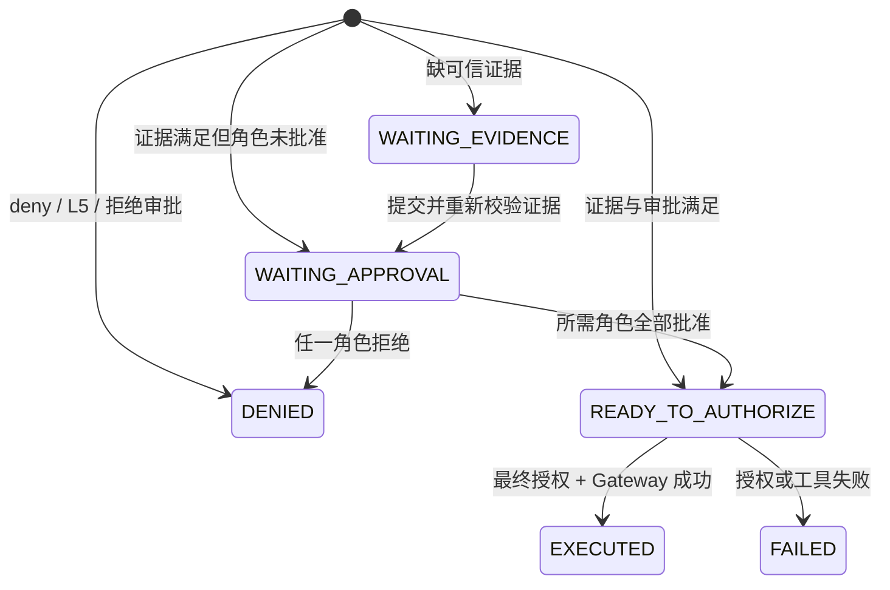

# ActionSpec、风险、策略与授权

## 1. 为什么需要 ActionSpec

自然语言适合表达意图，但不适合作为授权对象。V0.1 把一次办公动作拆成两层：

- `ActionCandidate`：LLM 提取的业务候选事实，不包含任何风险或授权结论。
- `ProposedActionSpec`：服务端补齐身份、Trace、哈希和幂等字段后形成的不可歧义动作。

后续风险评估、策略匹配、证据、审批、Permit 和工具参数全部绑定 `ProposedActionSpec`。模型没有接口可以直接把动作标记为安全或已批准。

## 2. ActionSpec 协议

### 2.1 ActionCandidate 字段

| 字段 | 含义 | 约束 |
| --- | --- | --- |
| `action_type` | 业务动作类型 | 25 个严格枚举之一 |
| `capability` | 最小工具能力 | 严格枚举；策略和 Permit 的授权粒度 |
| `target_scope` | 影响范围 | self / internal / external / public / batch |
| `recipients` | 收件人、与会人或目标主体 | 字符串列表 |
| `resources` | 文件、Artifact 或业务对象 | 字符串列表 |
| `data_classes` | 涉及的数据类别 | public、pricing、financial、credentials 等枚举 |
| `state_change_type` | 状态变化强度 | read_only、draft_only、internal_system_write、external_effect 等 |
| `reversibility` | 可逆性 | high / medium / low |
| `source_refs` | 受信来源引用 | 仅允许引用受信上下文中的标识 |
| `missing_slots` | 缺失的业务字段 | 会增加不确定性，但普通动作最高仍为 L4 |
| `parameters` | capability 特定参数 | 进入参数哈希并绑定 Permit |

### 2.2 服务端补充字段

`ProposedActionSpec` 额外包含：

| 字段 | 生成方 | 用途 |
| --- | --- | --- |
| `schema_version` | 服务端 | 协议演进 |
| `trace_id` | 服务端 | 端到端审计关联 |
| `action_id` | 服务端 | 动作身份与 API 路径 |
| `actor_id` | 已认证用户上下文 | Permit subject 和资源隔离 |
| `payload_digest` | canonical hash | 记录候选动作摘要 |
| `idempotency_key` | 服务端 | 执行去重 |
| `task_artifact_binding` | TaskService + RunService | 可选；把已验证 Task 成果的 Task/Commit/ArtifactVersion/Verification 身份绑定到动作 |

示例：

```json
{
  "action_type": "send_email",
  "capability": "email.send",
  "target_scope": "external_customer",
  "recipients": ["buyer@example.com"],
  "resources": ["Q-991-V3.pdf"],
  "data_classes": ["customer_data", "pricing"],
  "state_change_type": "external_effect",
  "reversibility": "low",
  "source_refs": ["crm:quote/991:v3"],
  "missing_slots": [],
  "parameters": {
    "subject": "报价确认",
    "body": "请查收已批准报价。"
  }
}
```

## 3. 动作目录与实现程度

“协议支持”表示 Schema 可以表达该动作；“端到端执行”表示已经注册 Gateway + Simulator；“工作区/对话”表示 V0.1 只完成读取、排序、计算或草稿展示；“策略拒绝”表示保留为高风险反例。

| 领域 | action_type | capability | V0.1 状态 |
| --- | --- | --- | --- |
| 邮件 | `mail_search` | `mail.search` | 工作区/对话 |
| 邮件 | `draft_email` | `email.draft` | 工作区草稿 |
| 邮件 | `send_email` | `email.send` | **端到端 Simulator** |
| 文档 | `document_search` | `document.search` | 工作区/对话 |
| 文档 | `generate_summary` | `document.summarize` | 工作区草稿 |
| 文档 | `draft_document` | `document.draft` | 工作区草稿 |
| 文档 | `insert_document` | `document.insert` | 协议预留；无 Gateway 适配器 |
| 报价 | `quote_lookup` | `quote.read` | 工作区/对话 |
| 报价 | `quote_compare` | `quote.compare` | 工作区/对话 |
| 报价 | `quote_calculate` | `quote.calculate` | 工作区计算/展示 |
| 报价 | `quote_draft` | `quote.draft` | 工作区草稿 |
| 任务 | `rank_tasks` | `task.rank` | 工作区排序/展示 |
| 任务 | `create_internal_task` | `task.create` | **端到端 Simulator** |
| 日历 | `find_calendar_slots` | `calendar.read` | 工作区/对话 |
| 日历 | `create_calendar_invite` | `calendar.invite` | **端到端 Simulator** |
| 报销 | `expense_inspect` | `expense.read` | 工作区核查 |
| 报销 | `expense_request_evidence` | `expense.request_evidence` | **端到端 Simulator** |
| CRM | `crm_customer_read` | `crm.customer.read` | 工作区/对话 |
| CRM | `update_crm_stage` | `crm.opportunity.update` | **端到端 Simulator** |
| 受限 | `approve_expense` | `expense.approve` | 策略拒绝 |
| 受限 | `make_payment` | `finance.pay` | 策略拒绝 |
| 受限 | `sign_contract` | `contract.sign` | 策略拒绝 |
| 受限 | `change_permission` | `iam.permission.change` | 策略拒绝 |
| 受限 | `read_credential` | `credential.read` | 策略拒绝 |
| 受限 | `bulk_delete` | `data.bulk_delete` | 策略拒绝 |

`document.insert` 已进入协议但没有 V0.1 Tool Gateway 适配器，不应在演示或文档中声称可执行。

## 4. 风险模型

风险由 `packages/risk_core/risk.py` 计算，LLM 不参与评分。

### 4.1 普通风险因子

| 条件 | 分值 | reason_code |
| --- | ---: | --- |
| 外部客户、外部供应商或批量外部目标 | +2 | `EXTERNAL_RECIPIENT` |
| 公开发布 | +2 | `PUBLIC_SCOPE` |
| credentials / personal_sensitive / financial / pricing / contract / hr / permission | +1 | `SENSITIVE_DATA` |
| 涉及 pricing | 不额外加分 | `PRICING_DATA` |
| 可逆性 low | +1 | `LOW_REVERSIBILITY` |
| 存在 missing_slots | +1 | `ACTION_INFORMATION_MISSING` |

普通业务动作的累计分数封顶为 **L4**。因此外发报价、低可逆并且信息不完整仍然是 L4，可通过证据和人工审批继续处理，不会因简单叠加误变为 L5。

### 4.2 L5 的严格边界

只有以下情况直接进入 L5：

- public 目标同时包含 credentials：`CREDENTIAL_EXPOSURE`。
- capability 属于受限能力集合：`RESTRICTED_OPERATION`。
- `state_change_type == restricted_execution`：`RESTRICTED_EXECUTION`。

Policy Engine 对 L5 追加 `critical_risk_v1` deny。L5 的语义是“V0.1 不允许进入人工放行”，不是“普通高风险动作”。

### 4.3 风险维度

`RiskAssessment` 同时记录：

- `impact`：L0-L1 low、L2-L3 medium、L4-L5 high。
- `data_sensitivity`：是否命中敏感数据集合。
- `blast_radius`：self / internal / external_customer / public。
- `reversibility`：继承动作字段。
- `uncertainty`：存在 missing_slots 时为 high。

确认前的 Agent 消息只输出一次风险等级和简短规则；确认卡仍保留结构化风险信息。执行后只输出结果，避免重复三次风险描述。

## 5. 策略规则

策略代码位于 `packages/risk_core/policy.py`，采用 effect 合并而不是让单条规则覆盖全部上下文。

| policy_id | 命中条件 | 结果 |
| --- | --- | --- |
| `baseline_v1` | 所有动作 | 默认 capability allow |
| `external_email_v1` | `email.send` 且 scope 为 `external_*` | 阻塞发送；要求收件人身份、附件哈希、DLP、当前用户确认 |
| `<capability>_v1` | task/calendar/CRM/expense 内部写入 | 阻塞写入；要求领域权限证据与当前用户确认 |
| `external_calendar_invite_v1` | 外部日历邀请 | 追加收件人身份与当前用户确认 |
| `pricing_data_v1` | data_classes 包含 pricing | 追加批准报价来源、销售经理审批和价格一致性约束 |
| `unmanaged_device_v1` | 非受管设备执行状态变化 | 目标 capability deny |
| `restricted_office_actions_v1` | 受限 capability | deny，要求走人工线下流程 |
| `critical_risk_v1` | L5 | deny |

V0.1 的 `external_*` 条件覆盖 `external_customer` 和 `external_supplier`；`batch_external` 已进入协议与风险模型，但尚未进入专门外发策略和 Simulator 演示，应视为预留能力。

Capability 合并优先级为 `allow < blocked < deny`。多条 blocked 规则会合并证据、审批和约束；任何 deny 都使 ControlPlan 进入 `DENIED`。

## 6. 证据模型

用户只能提供业务引用，不能手工填写“DLP 已通过”之类的安全结论。Mock Resolver 将需求转换成带来源和摘要的 `EvidenceRecord`。

| requirement | 模拟来源 | 用户动作 |
| --- | --- | --- |
| `recipient_identity` | 企业通讯录 | 自动获取 |
| `attachment_hash` | 文件服务 | 选择资源后自动计算 |
| `dlp_result` | DLP 服务 | 自动扫描 |
| `pricing_source` | CRM 报价库 | 选择已批准报价版本 |
| `project_write_access` | 项目管理系统 | 自动校验 |
| `calendar_availability` | 企业日历 | 自动校验 |
| `crm_write_access` | CRM | 自动校验 |
| `expense_case_access` | OA 报销系统 | 自动校验 |

当前批准报价白名单是 `crm:quote/991:v3` 和 `crm:quote/2026-demo:v1`。这是 Demo Fixture，不是生产策略。

## 7. ControlPlan 状态机



实际 LangGraph 使用三个 interrupt：

1. `evidence_submitted`
2. `approval_submitted`
3. `authorization_requested`

每次 resume 后都会重新计算风险、策略、证据和 ControlPlan，而不是直接相信旧状态。

## 8. Permit 与 Tool Gateway

Authorization Service 仅在 `READY_TO_AUTHORIZE` 且 capability verdict 为 allow 时签发 Ed25519 JWT Permit。Permit 包含：

- subject / capability
- action hash
- 每组工具参数的 canonical hash
- policy version
- approval IDs
- `max_uses = 1`
- iat / exp / jti
- idempotency key

Tool Gateway 在执行边界重新验证：

1. EdDSA 签名和有效期。
2. subject、capability、action hash。
3. recipients、resources、source_refs、action_type、parameters 的参数哈希。
4. 当前策略版本。
5. Permit 是否已使用、是否只允许一次。
6. capability 是否注册了工具适配器。

任何参数替换都会得到 `PARAMETER_HASH_MISMATCH`，过期、重放、主体变化和策略漂移也会被拒绝。

## 9. Artifact 与 Action 一致性

受控动作会把 `artifact_id` 和完整 `artifact_content` 写入 action parameters，并在 WorkspaceArtifact 上记录 `linked_action_id` / `linked_run_id`。

- 用户在动作完成前修改内容：旧动作被标记 `FAILED`，reason code 包含 `ARTIFACT_CONTENT_CHANGED`。
- 新建邮件：创建新 Artifact，清空旧动作绑定；如旧动作仍存在则先作废。
- 已完成 Run 和审计历史保持不可变。

这条规则防止“批准了 A 内容，却执行 B 内容”。

### 9.1 已验证 Task Artifact 的动作绑定

`DR-0007` 为固定 Demo 1 客户回复增加一条窄桥。准备 `email.send` 前，TaskService 必须同时证明：

- Task 属于当前用户且状态为 `committed`；
- `last_commit` 引用请求的 `ArtifactVersion`；
- Artifact kind 是 `reply_draft`，主题和正文完整；
- Commit 引用的 VerificationReport 对该 ArtifactVersion 为 `passed`；
- Task version、Commit ID/state hash、Artifact content digest、Deliverable 和 VerificationReport ID 与绑定完全一致。

上述事实写入 `TaskArtifactBinding`，并进入 Run 创建摘要与 `ProposedActionSpec`。相同用户、相同创建 key 和相同绑定重放同一 Run；同 key 指向不同事实时冲突。Run 在补证据、审批、授权和执行前都会重校验绑定，任何事实变化都会让旧动作失效，不能沿用审批或 Permit。

前台“准备发送”只是创建治理 Run。它必须先显示动作目标、绑定成果版本、风险原因和确认后果，再由用户批准并最终授权。拒绝、绑定失效或 Simulator 失败不得修改 Task Commit。当前只支持固定演示客户回复到固定演示邮箱，不支持通用 Artifact 类型、联系人选择、附件、批量动作或真实 Connector。

## 10. 审计事件

主要事件类型：

```text
RUN_CREATED
ACTION_PARSED
EVIDENCE_SUBMITTED
APPROVAL_RECORDED
CONTROL_PLAN_UPDATED
ACTION_INVALIDATED
PERMIT_ISSUED
TOOL_EXECUTED
TAMPER_BLOCKED
```

事件包含 sequence、run_id、trace_id、action_id、actor_id、payload 和 occurred_at，可从 Run SSE 或 Trace API 读取。
