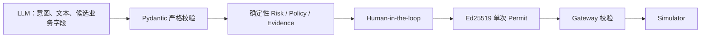

# Office Agent V0.1 · Presentation Brief

本文用于后续 Agent 生成汇报材料。内容只陈述 V0.1 已实现且可由代码或演示验证的事实；制作 PPT 前应以当前 README、源码和自动化测试再次核对。

本文只覆盖当前 V0.1 实现汇报。面向后续 Loop、Adaptive Swarm 和长期任务 Runtime 的战略汇报，以 [`TARGET_ARCHITECTURE.md`](TARGET_ARCHITECTURE.md) 为路线基线；两者不得混写为同一实现状态。

## 0. 汇报硬门槛

所有阶段汇报、方案评审、Demo 说明和进展结论必须遵守 [`DECISION_AND_REPORTING_GOVERNANCE.md`](DECISION_AND_REPORTING_GOVERNANCE.md)。每个汇报项必须形成下面这条完整链路：

```text
用户场景与问题 → 可追溯来源 → 技术或产品决策
               → 后端事实与事件 → 前台状态、动作和反馈
               → 验证证据、限制与当前状态
```

每个汇报项至少回答：

1. 谁在什么条件下遇到什么问题，当前流程与关键异常是什么？
2. 这个判断来自哪条用户反馈、访谈、竞品实践、论文、官方文档、源码或运行证据？具体版本、日期、支持范围和局限是什么？
3. 用户在前台看见什么、可以做什么、等待或失败时得到什么反馈，哪些内部细节不会暴露？
4. 每个 UI 状态由哪个服务端实体、字段、`Snapshot` 或 SSE 事件产生，状态如何转换并保持版本、权限和幂等？
5. 哪个测试、Trace、截图、录像、指标或用户研究结果证明它成立？当前属于已实现、目标设计、静态原型、推断还是待验证假设？

缺少“场景与来源”“前台交互影响”“后端事实映射”“验证证据”任一项时，该内容只能标为 `Draft` 或“待验证”，不得进入汇报结论、完成清单或对外能力描述。每次汇报必须附上或链接治理文档中的决策记录、UI—服务端事实映射和来源台账。

## 1. 一句话叙事

Office Agent V0.1 把 AI 放在可独立工作的邮件、文档、报价、任务、日历、报销和 CRM 工作区旁边：模型负责理解与辅助编辑，确定性服务负责风险、证据、审批、授权和工具执行，从而让“会做事的 Agent”保持可控、可确认、可追溯。

## 2. 核心价值

本版本要证明的不是“接了多少办公系统”，而是三种可复用能力：

1. **协同方式**：Agent 不只在聊天框回答，而是读取用户正在编辑的内容，并以渐进动效写回工作区。
2. **自动化边界**：草稿和查询可低摩擦完成，真实副作用必须经过 ActionSpec、Risk、Policy、Evidence、Approval、Permit 与 Gateway。
3. **可审计闭环**：用户确认后不是前端直接宣布完成，而是继续运行工具，再由 Agent 根据执行结果回复。

## 3. 可用于封面或摘要的数字

| 指标 | V0.1 实际值 | 代码依据 |
| --- | ---: | --- |
| 办公工作区 | 7 类 | `WorkspaceArtifact.kind` |
| ActionSpec 候选动作 | 25 类 | `packages/contracts/models.py` |
| 端到端 Simulator capability | 5 个 | `simulators/` 与 Tool Gateway 注册 |
| Evidence requirement | 8 类 | `application/evidence_catalog.py` |
| 确定性治理演示场景 | 4 个 | `application/demo3.py` |
| Python 自动化收集 | 59 项（58 passed，1 个 PostgreSQL opt-in skip） | `uv run pytest -q` 的当前可理解性修订回归 |

7 类工作区为邮件、文档、报价表、任务、日历、报销和 CRM；审计是独立观察视图，不计入可编辑 WorkspaceArtifact。

## 4. 建议的 10 页汇报结构

### 第 1 页：为什么需要 Workspace-first Agent

表达重点：传统聊天机器人把结果留在对话里，用户还要复制、核验、切系统；本项目让工作区保持主位，Agent 是协作层。

建议画面：全屏产品总览，左侧工作区、右侧 Agent、底部非模态确认卡。不要使用早期版本“对话在左、审批在右”的截图。

### 第 2 页：产品交互范式

展示：工具栏切换七类工作区；对话不消失；分隔条可拖动；双方独立滚动；来源/权限/修改记录在底部折叠区。

关键措辞：用户可以独立编辑和保存，Agent 能读取浏览器中尚未保存的活动内容。

### 第 3 页：Agent 如何真正进入工作流

展示：从空白邮件开始，请 Agent 撰写，主题和正文渐进出现；或者从月历选择日期后让 Agent 创建邀请。

关键措辞：流式不仅发生在对话气泡，也发生在业务产物；数据库保存最终 Artifact，动画只是增量呈现。

### 第 4 页：模型与治理的职责分离

使用下图：



关键措辞：模型不能自己决定风险、审批是否通过、证据是否可信，也不能直接调用副作用工具。

### 第 5 页：风险分级不是“什么都是 L5”

展示普通累积分级与硬触发的区别：外部联系人、敏感数据、低可逆和字段缺失增加风险，普通累积最高 L4；只有受限 capability、受限执行或公开泄露凭据等硬条件进入 L5。

可用案例：外发普通客户邮件通常需要确认但不必是 L5；外发报价及低可逆因素可到 L4；付款、签约、权限变更、凭据读取和批量删除直接拒绝。

### 第 6 页：人工确认是流程节点，不是文字提示

展示确认卡的状态变化：`WAITING_EVIDENCE → WAITING_APPROVAL → READY_TO_AUTHORIZE → EXECUTED`。

关键措辞：卡片不完全遮挡对话；用户仍可继续交流；批准后系统继续执行，最终结果由 Agent 回答。风险说明在确认前文本中只出现一次，卡片保留结构化字段便于操作。

### 第 7 页：Permit 和参数绑定

展示 Permit 绑定 subject、capability、action hash、参数哈希、policy version、approval ids、TTL、单次使用和 idempotency key。

可用演示：对 `pricing` 场景完成前置条件后运行 tamper-check，证明更换收件人或附件时 Gateway 拦截，而不是“已批准就任意执行”。

### 第 8 页：可追溯与可恢复

展示审计视图中的 `RUN_CREATED`、`ACTION_PARSED`、`CONTROL_PLAN_UPDATED`、`APPROVAL_RECORDED`、`PERMIT_ISSUED`、`TOOL_EXECUTED`。

准确边界：配置 PostgreSQL 时，Workspace、Run、Audit 与 LangGraph checkpoint 可恢复；Conversation Thread/Message 和 Permit replay set 当前仍在进程内存中。

Demo 1 的 TaskStore 另有独立证据：固定 Fixture 已在同一个 PostgreSQL 16.14 数据库、三个顺序 API 进程之间逐字段恢复 v2 冲突态和 v3 Commit，并验证旧 mutation key 重放不新增事件、工件或 Commit。前台只显示“连接中断，正在恢复”、最后确认的 Snapshot 和恢复后的同一 Task，不展示数据库类型、DSN 或内部重试日志。该证据不等于整个工作区会话无损恢复，也不覆盖数据库进程故障、多实例并发或断线事件缺口。

### 第 9 页：V0.1 工程实现

展示技术栈：Next.js 16、React 19、TypeScript；FastAPI、Pydantic、LangGraph；PostgreSQL 16；Ed25519 JWT；OpenAI-compatible LLM；三条 SSE 前台流。

强调三条流：Conversation SSE 服务文字与工作区增量，Run SSE 服务有序审计与确认卡刷新，Task SSE 通知持久 Task 的事件推进并触发完整 Snapshot 对账。三者是不同事实链，Task SSE 也不能被描述为 Conversation 持久化。

前台截图不能只证明技术结构存在。Demo 1 应按“准备哪三项材料 → 为什么此刻需要人 → 确认会改变什么 → 最后得到什么”的业务顺序展示。非 Tasks 截图只能显示后台任务摘要与前往处理，不应把冲突决定铺在邮件等当前工作区旁；来源标签必须明确写“演示数据”，不得展示原始 `fixture:` ID。来源与新一轮语义修订的完整浏览器工程代理为 `12 passed (44.5s)`，但 `DR-0005` 仍是 `Draft`，5 人无引导任务测试未运行。

### 第 10 页：阶段结论与下一步

阶段结论：V0.1 已验证 workspace-first、人机共编、确定性治理、人工 Gate、最小权限 Permit、Simulator 执行与 Agent 结果闭环；固定 Demo 1 TaskStore 还完成了有边界的 PostgreSQL 顺序 API 进程恢复验证。

下一步优先级：先完成至少 5 人的无引导任务测试并修复理解/误点问题 → 真实 SSO/RBAC → Connector SDK 与沙箱 → 对话和 replay 持久化 → 多实例一致性/任务队列 → 历史版本和多人协同 → 评测与可观测性。不要把“增加更多模型自治权”列为首要路线。

## 5. 推荐演示流程

### 流程 A：从空白邮件到 Agent 共编

1. 打开邮件工作区，点击“新邮件”，确认收件人、主题和正文为空。
2. 在右侧输入：“根据客户 A 最新来信和已批准报价，起草一封方案确认邮件，先不要发送。”
3. 观察 Agent 状态、对话流式输出和邮件字段渐进写入。
4. 展开底部“上下文与治理”，展示邮箱、CRM 和报价库来源，以及权限和修改记录。
5. 手动再改一行并保存，说明用户与 Agent 在同一业务对象上协作，而不是复制聊天文本。

演示点：workspace-first、未保存上下文、来源可见、流式 Artifact、独立保存。

### 流程 B：外发报价邮件治理闭环

1. 基于当前邮件要求 Agent “保存并发送”。
2. Agent 在文本中说明风险等级、简要规则、所需 capability 和确认条件。
3. 底部确认卡显示结构化风险、证据状态和角色审批；对话仍可滚动和继续输入。
4. 选择已批准报价来源并完成 `current_user`、`sales_manager` 确认。
5. 点击最终执行；展示 Permit、Simulator 执行和 Agent 最终“发送成功”回复。
6. 打开审计视图，按事件序列解释整个闭环。

演示点：L4 而非泛化 L5、自动取证、逐角色审批、一次性授权、结果回到 Agent、单次风险说明。

### 流程 C：月历与受控邀请

1. 打开日历，展示全宽月历一级视图和日期格内的日程条目。
2. 点击 7 月 14 日，卡片就地切换为当日安排视图，展示全部日程与翻日导航。
3. 让 Agent “明天下午 3 点安排一小时报价会议，并邀请外部客户”。
4. 观察日历工作区被更新以及外部邀请的确认卡。
5. 确认后展示 `calendar.invite` Simulator 结果和 Agent 收尾。

演示点：真实日历一级界面、按日浏览、Agent 编辑工作区、外部影响受控。

### 可选流程 D：参数篡改拦截

使用 `pricing` 固定场景完成证据与审批，再调用 `/v1/demo3/actions/{action_id}/tamper-check`。展示 `TAMPER_BLOCKED`，说明 Permit 绑定具体参数而非只绑定“允许发邮件”。

### 可选流程 E：后台汇报与独立新一轮

1. 在客户 A 经营汇报停在收入冲突后切到邮件工作区，只展示“后台任务”摘要、状态、阶段和“前往处理”，不展示冲突卡或分支控制。
2. 点击“前往处理”回到 Tasks 并聚焦待确认标题，展开“查看演示数据来源”，展示“演示数据 · CRM 正式收入记录（v3）”与“演示数据 · 收入预测表（v2）”，不展示原始 `fixture:` ID。
3. 完成本轮并点击“开始新一轮汇报”，说明系统创建并启动独立新 Task，不重置上一轮。
4. 明确当前边界：旧轮次已在服务端保留，但尚无历史轮次选择入口。

## 6. 建议截图与视觉素材

- 产品总览：1280×720 或 16:9，完整显示工作区、拖动分隔和 Agent。
- 邮件共编：空白态一张、渐进写入中一张、确认卡一张。
- 日历：全宽月历和当日安排视图各一张。
- 确认卡：优先展示 L4 报价案例，确保风险、规则、证据、审批和执行按钮同时可读。
- 审计：截取从 `RUN_CREATED` 到 `TOOL_EXECUTED` 的连续事件。
- 架构图：直接根据 `docs/ARCHITECTURE.md` 的 Mermaid 重绘，避免在一页堆满类名。

截图前清理旧 Thread 与旧 Workspace 数据，统一浏览器缩放为 100%，窗口最大化，并使用不含真实个人或企业信息的 Demo 地址。

## 7. 可说与不可说

### 可以明确陈述

- “实现了 OpenAI-compatible 对话与结构化规划适配器及严格 Schema 校验。”
- “当前配置的 `deepseek-v4-pro` 已实测通用问答与 Conversation SSE 文本连通；该 smoke 不证明结构化规划、Action 或工具调用。”
- “实现了 7 类可编辑办公工作区和 SSE 流式人机协作。”
- “实现了确定性风险/策略/证据/审批/Permit/Gateway 闭环。”
- “实现了 5 个 Simulator capability 的端到端受控执行。”
- “配置 PostgreSQL 时可持久化 Workspace、Run、Audit 与 checkpoint。”
- “固定 Demo 1 TaskStore 已在 PostgreSQL 16.14 和三个顺序 API 进程上验证 v2/v3 Snapshot、Artifact、Commit 恢复与幂等零重复。”
- “固定客户 A 场景已用浏览器自动化验证业务首屏、单次开始、决定后果、完成成果和被测响应式路径；这是工程代理证据，不是用户理解结论。”
- “来源与新一轮修订已用浏览器自动化验证：非 Tasks 只显示摘要，来源明确为演示数据，终态创建并启动独立新 Task 且旧 Task 保留；当前没有历史轮次选择器。”

### 不可夸大

- 不说“已经接入并发送真实企业邮件”；当前是 Email Simulator。
- 不说“已经连接真实 CRM、OA、知识库和日历”；当前是 Fixture/Mock Resolver。
- 不说“已经具备生产级权限系统”；身份头是 P0 占位。
- 不说“用户已经看懂”或“可用性问题已经解决”；当前只有 Stakeholder 反馈与工程代理回归，没有目标用户任务数据。
- 不说“开始新一轮汇报会重置上一轮”或“用户可随时切换所有历史轮次”；当前是创建独立新 Task，旧数据保留但历史轮次选择入口未实现。
- 不说“所有 ActionSpec 都能执行”；25 类是协议目录，只有 5 个 capability 注册了端到端 Simulator。
- 不说“全量会话长期保存”；Thread/Message 重启后丢失。
- 不说“整个工作区会话已无损恢复”或“已具备高可用”；PR 5 只证明固定 Demo 1 Task 在同一数据库、顺序 API 进程下的恢复，不包含数据库故障/迁移、多实例、事件缺口和响应丢失。
- 不说“L5 操作经审批可以执行”；当前策略对受限能力和 L5 直接 deny。
- 不把前端打字动效描述成模型 token 直接写数据库；数据库保存的是最终 Artifact。

## 8. 常见问答

**为什么不用 LLM 直接判断风险？**  风险和权限属于可验证控制面，需要稳定、可测试和可审计；LLM 只提供业务候选事实。

**既然要确认，Agent 还自动化吗？**  草稿、查询、取证和低风险准备由 Agent 自动完成；确认只出现在产生外部影响或系统写入的最小边界，批准后链路自动继续。

**为什么最终只是 Simulator？**  V0.1 先验证治理协议和产品交互。真实 Connector 可替换工具适配器，而不改变上层 ActionSpec、Permit 和审计模型。

**如何避免审批后参数被替换？**  Permit 同时绑定动作哈希与逐参数哈希，Gateway 在调用工具前重新计算并比对。

**现在最大的生产化缺口是什么？**  真实身份和 Connector、分布式 replay/幂等、Conversation 持久化、后台任务、多实例一致性和生产评测。

## 9. 术语表

| 术语 | 含义 |
| --- | --- |
| WorkspaceArtifact | 用户或 Agent 正在编辑的持久化办公产物 |
| ActionCandidate | LLM 只能填写的候选业务事实 |
| ProposedActionSpec | 服务端补齐身份、Trace、哈希和幂等键后的动作 |
| RiskAssessment | 确定性风险等级、维度和 reason code |
| PolicyEffect | 策略对 capability 的 allow/blocked/deny 及前置条件 |
| EvidenceRecord | 由受信系统解析的证据状态与摘要 |
| ControlPlan | 当前动作的统一控制状态和 UI 面板规格 |
| ApprovalRecord | 与 Action 和角色绑定的人工决策记录 |
| Permit | 短时、单次、参数绑定的 Ed25519 JWT 授权票据 |
| Tool Gateway | Permit 校验、重放保护和工具路由边界 |
| Simulator | 不接触真实办公系统的副作用模拟器 |
