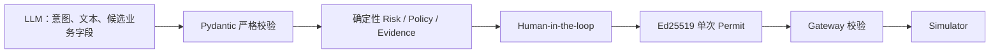

# Office Agent V0.1 · Presentation Brief

本文用于后续 Agent 生成汇报材料。已实现结论只陈述可由代码或演示验证的事实；标为 `Draft` 的目标设计必须与已验证事实分开。制作 PPT 前应以当前 README、源码、Evidence 和自动化测试再次核对。

本文只覆盖当前 V0.1 实现汇报。面向后续 Loop、Adaptive Swarm 和长期任务 Runtime 的战略汇报，以 [`TARGET_ARCHITECTURE.md`](TARGET_ARCHITECTURE.md) 为路线基线；两者不得混写为同一实现状态。

## 0. 汇报硬门槛

所有阶段汇报、方案评审、Demo 说明和进展结论必须遵守 [`DECISION_AND_REPORTING_GOVERNANCE.md`](DECISION_AND_REPORTING_GOVERNANCE.md)。每个汇报项必须形成下面这条完整链路：

```text
用户场景与问题 → 可追溯来源 → 技术或产品决策
               → 后端事实与事件 → 前台状态、动作和反馈
               → 验证证据、限制与当前状态
```

每个汇报项至少回答：

1. 谁在什么条件下遇到什么问题，当前流程与关键异常是什么？
2. 这个判断来自哪条用户反馈、访谈、竞品实践、论文、官方文档、源码或运行证据？具体版本、日期、支持范围和局限是什么？
3. 用户在前台看见什么、可以做什么、等待或失败时得到什么反馈，哪些内部细节不会暴露？
4. 每个 UI 状态由哪个服务端实体、字段、`Snapshot` 或 SSE 事件产生，状态如何转换并保持版本、权限和幂等？
5. 哪个测试、Trace、截图、录像、指标或用户研究结果证明它成立？当前属于已实现、目标设计、静态原型、推断还是待验证假设？

缺少“场景与来源”“前台交互影响”“后端事实映射”“验证证据”任一项时，该内容只能标为 `Draft` 或“待验证”，不得进入汇报结论、完成清单或对外能力描述。每次汇报必须附上或链接治理文档中的决策记录、UI—服务端事实映射和来源台账。

## 1. 一句话叙事

Office Agent V0.1 把 AI 放在可独立工作的邮件、文档、报价、任务、日历、报销和 CRM 工作区旁边：模型负责理解、表达与辅助编辑，确定性服务负责可验证数值、风险、证据、审批、授权和工具执行，从而让“会做事的 Agent”保持可控、可确认、可追溯。

## 2. 核心价值

本版本要证明的不是“接了多少办公系统”，而是三种可复用能力：

1. **协同方式**：Agent 不只在聊天框回答，而是读取用户正在编辑的内容，并以渐进动效写回工作区。
2. **自动化边界**：草稿和查询可低摩擦完成，真实副作用必须经过 ActionSpec、Risk、Policy、Evidence、Approval、Permit 与 Gateway。
3. **可审计闭环**：用户确认后不是前端直接宣布完成，而是继续运行工具，再由 Agent 根据执行结果回复。

报价错误修复增加了一条同等重要的表达边界：可复算的业务数值不由模型自由生成。当前报价由前端 BigInt 与服务端 Decimal 采用同一逐行舍入规则；模型仍可解释结果，但不能覆盖报价基线字段或从历史对话补造金额。`DR-0006` 只在固定演示报价、当前公式、revision 协议、Artifact/Action 绑定和被测恢复路径内为 `Verified`；汇报时必须把“限定工程事实”和“生产报价/用户可用性尚未验证”放在同一页。

## 3. 可用于封面或摘要的数字

| 指标 | V0.1 实际值 | 代码依据 |
| --- | ---: | --- |
| 办公工作区 | 7 类 | `WorkspaceArtifact.kind` |
| ActionSpec 候选动作 | 25 类 | `packages/contracts/models.py` |
| 端到端 Simulator capability | 5 个 | `simulators/` 与 Tool Gateway 注册 |
| Evidence requirement | 8 类 | `application/evidence_catalog.py` |
| 确定性治理演示场景 | 4 个 | `application/demo3.py` |
| Python 自动化结果 | 178 passed，1 个 PostgreSQL opt-in skip（6.31s） | 当前 `uv run pytest -q`；历史证据分别保留当时提交和数字 |
| 完整浏览器路径 | 41 passed（2.0m） | 当前 system Edge 全量；各历史 Evidence 保留当时数字 |

7 类工作区为邮件、文档、报价表、任务、日历、报销和 CRM；审计是独立观察视图，不计入可编辑 WorkspaceArtifact。

## 4. 建议的 10 页汇报结构

### 第 1 页：为什么需要 Workspace-first Agent

表达重点：传统聊天机器人把结果留在对话里，用户还要复制、核验、切系统；本项目让工作区保持主位，Agent 是协作层。

建议画面：全屏产品总览，左侧工作区、右侧 Agent、底部非模态确认卡。不要使用早期版本“对话在左、审批在右”的截图。

### 第 2 页：产品交互范式

展示：工具栏切换七类工作区；对话不消失；分隔条可拖动；双方独立滚动；来源/权限/修改记录在底部折叠区。

关键措辞：用户可以独立编辑和保存，Agent 能读取浏览器中尚未保存的活动内容。

### 第 3 页：Agent 如何真正进入工作流

展示：从空白邮件开始，请 Agent 撰写，主题和正文渐进出现；或者从月历选择日期后让 Agent 创建邀请。

关键措辞：流式不仅发生在对话气泡，也发生在业务产物；数据库保存最终 Artifact，动画只是增量呈现。

### 第 4 页：模型与治理的职责分离

使用下图：



关键措辞：模型不能自己决定风险、审批是否通过、证据是否可信，也不能直接调用副作用工具。

### 第 5 页：风险分级不是“什么都是 L5”

展示普通累积分级与硬触发的区别：外部联系人、敏感数据、低可逆和字段缺失增加风险，普通累积最高 L4；只有受限 capability、受限执行或公开泄露凭据等硬条件进入 L5。

可用案例：外发普通客户邮件通常需要确认但不必是 L5；外发报价及低可逆因素可到 L4；付款、签约、权限变更、凭据读取和批量删除直接拒绝。

### 第 6 页：人工确认是流程节点，不是文字提示

展示确认卡的状态变化：`WAITING_EVIDENCE → WAITING_APPROVAL → READY_TO_AUTHORIZE → EXECUTED`。

关键措辞：卡片不完全遮挡对话；用户仍可继续交流；批准后系统继续执行，最终结果由 Agent 回答。风险说明在确认前文本中只出现一次，卡片保留结构化字段便于操作。

### 第 7 页：Permit 和参数绑定

展示 Permit 绑定 subject、capability、action hash、参数哈希、policy version、approval ids、TTL、单次使用和 idempotency key。

可用演示：对 `pricing` 场景完成前置条件后运行 tamper-check，证明更换收件人或附件时 Gateway 拦截，而不是“已批准就任意执行”。

### 第 8 页：可追溯与可恢复

技术审计视图可展示 `RUN_CREATED`、`ACTION_PARSED`、`CONTROL_PLAN_UPDATED`、`APPROVAL_RECORDED`、`PERMIT_ISSUED`、`TOOL_EXECUTED`；普通业务审计工作台只展示业务标签与服务端摘要，可以显示“Permit Service”“Permit 已签发/未签发”等业务状态，但不渲染 raw event/payload/trace、`email_simulator`、`email.send`、`PERMIT_ISSUED`、Permit token/内容/permit_id 或签名。

准确边界：配置 PostgreSQL 时，Workspace、Run、Audit 与 LangGraph checkpoint 可恢复；Conversation Thread/Message 和 Permit replay set 当前仍在进程内存中。

Demo 1 的 TaskStore 另有独立证据：固定 Fixture 已在同一个 PostgreSQL 16.14 数据库、三个顺序 API 进程之间逐字段恢复 v2 冲突态和 v3 Commit，并验证旧 mutation key 重放不新增事件、工件或 Commit。前台只显示“连接中断，正在恢复”、最后确认的 Snapshot 和恢复后的同一 Task，不展示数据库类型、DSN 或内部重试日志。该证据不等于整个工作区会话无损恢复，也不覆盖数据库进程故障、多实例并发或断线事件缺口。

### 第 9 页：V0.1 工程实现

展示技术栈：Next.js 16、React 19、TypeScript；FastAPI、Pydantic、LangGraph；PostgreSQL 16；Ed25519 JWT；OpenAI-compatible LLM；三条 SSE 前台流。

强调三条流：Conversation SSE 服务文字与工作区增量，Run SSE 服务有序审计与确认卡刷新，Task SSE 通知持久 Task 的事件推进并触发完整 Snapshot 对账。三者是不同事实链，Task SSE 也不能被描述为 Conversation 持久化。

在报价案例中补充“模型职责之外的确定性计算”：用户未保存的数量/折后比例先与服务端报价身份、标准价和最低折后比例合并，前端即时重算，服务端独立重算并通过 Conversation SSE 解释。基线可复算为标准总价 272000 元、折后总价 253400 元、优惠金额 18600 元、综合折后比例 93.16%（约 9.32 折）、优惠率 6.84%。必须同时说明这是假数据，不是 CRM 实时查询。

前后端一致性不能只讲金额：显式工作区上下文和保存都携带 Artifact/revision；旧版本不覆盖新版本，页面保留草稿并让用户查看最新或三方重应用，同字段双改必须人工处理。请求等待期间的新编辑还由 request epoch 保护，并以请求发出时实际发送的草稿作为三方 base，不同字段只保留等待期新增修改，同字段显式冲突。进入发送等副作用动作后，模型自报的来源、payload 和治理字段不直接执行，服务端从当前 Artifact 重建；未解析姓名、畸形邮箱或不透明附件固定 deny，且自报 evidence/审批不能解锁。Run 绑定真实 Conversation Thread，跨 Thread 续写拒绝；终态说明暂时失败可重新读取，已完成结果按同一消息重放。

前台截图不能只证明技术结构存在。Demo 1 应按“准备哪三项材料 → 为什么此刻需要人 → 提交前逐项预演会改变什么 → 服务端回执实际改变了什么 → 最后得到什么”的业务顺序展示。预演来自 `ConflictRecord.resolution_options`，实际回执来自 `ControlEvent.impact_receipt`，不能把前端动画或静态说明当作已发生变化。非 Tasks 截图只能显示后台任务摘要与前往处理；来源标签必须明确写“演示数据”，不得展示原始 `fixture:` ID。用户理解仍需至少 5 人无引导任务测试。

### 第 10 页：阶段结论与下一步

阶段结论：V0.1 已验证 workspace-first、人机共编、确定性治理、人工 Gate、最小权限 Permit、Simulator 执行与 Agent 结果闭环；固定 Demo 1 TaskStore 还完成了有边界的 PostgreSQL 顺序 API 进程恢复验证。DR-0007 又把 Demo 1 的已验证客户回复与 Demo 3 治理链连接成一条窄纵切：准备动作绑定 Task/Commit/ArtifactVersion/Verification，确认后仍只进入受控 Simulator。

下一步优先级：先完成至少 5 人的无引导任务测试并修复理解/误点问题 → 真实 SSO/RBAC → Connector SDK 与沙箱 → 对话和 replay 持久化 → 多实例一致性/任务队列 → 历史版本和多人协同 → 评测与可观测性。不要把“增加更多模型自治权”列为首要路线。

## 5. 推荐演示流程

### 流程 A：从空白邮件到 Agent 共编

1. 打开邮件工作区，点击“新邮件”，确认收件人、主题和正文为空。
2. 在右侧输入：“根据客户 A 最新来信和已批准报价，起草一封方案确认邮件，先不要发送。”
3. 观察 Agent 状态、对话流式输出和邮件字段渐进写入。
4. 展开底部“上下文与治理”，展示邮箱、CRM 和报价库来源，以及权限和修改记录。
5. 手动再改一行并保存，说明用户与 Agent 在同一业务对象上协作，而不是复制聊天文本。

演示点：workspace-first、未保存上下文、来源可见、流式 Artifact、独立保存。

### 流程 B：外发报价邮件治理闭环

1. 基于当前邮件要求 Agent “保存并发送”。
2. Agent 在文本中说明风险等级、简要规则、所需 capability 和确认条件。
3. 底部确认卡显示结构化风险、证据状态和角色审批；对话仍可滚动和继续输入。
4. 选择已批准报价来源并完成 `current_user`、`sales_manager` 确认。
5. 点击最终执行；展示 Permit、Simulator 执行和 Agent 最终“发送成功”回复。
6. 打开审计视图，按事件序列解释整个闭环。

演示点：L4 而非泛化 L5、自动取证、逐角色审批、一次性授权、结果回到 Agent、单次风险说明。

### 流程 C：月历与受控邀请

1. 打开日历，展示全宽月历一级视图和日期格内的日程条目。
2. 点击 7 月 14 日，卡片就地切换为当日安排视图，展示全部日程与翻日导航。
3. 让 Agent “明天下午 3 点安排一小时报价会议，并邀请外部客户”。
4. 观察日历工作区被更新以及外部邀请的确认卡。
5. 确认后展示 `calendar.invite` Simulator 结果和 Agent 收尾。

演示点：真实日历一级界面、按日浏览、Agent 编辑工作区、外部影响受控。

### 可选流程 D：参数篡改拦截

使用 `pricing` 固定场景完成证据与审批，再调用 `/v1/demo3/actions/{action_id}/tamper-check`。展示 `TAMPER_BLOCKED`，说明 Permit 绑定具体参数而非只绑定“允许发邮件”。

### 可选流程 E：后台汇报、文件冲突与独立新一轮

1. 在客户 A 经营汇报停在收入冲突后切到邮件工作区，只展示“后台任务”摘要、状态、阶段和“前往处理”，不展示冲突卡或分支控制。
2. 点击“前往处理”回到 Tasks 并聚焦待确认标题，展开“查看演示数据来源”，展示仓库演示文件的文件名、业务系统、记录时间和字段依据：`customer-a-revenue-close-v3.csv` 与 `customer-a-revenue-forecast-v2.csv`；明确这是项目生成的演示数据，不是真实 CRM。页面不展示原始 `fixture:` ID、绝对路径或完整摘要。
3. 完成本轮并点击“开始新一轮汇报”，说明系统创建并启动独立新 Task，不重置上一轮。
4. 明确当前边界：旧轮次已在服务端保留，但尚无历史轮次选择入口。

### 可选流程 F：报价核算与来源一致性

1. 打开报价工作台，指出“折后比例”和“优惠率”是两个不同指标。
2. 展示基线的标准总价 272000 元、折后总价 253400 元、优惠金额 18600 元、综合折后比例 93.16%（约 9.32 折）和优惠率 6.84%。
3. 修改第一行数量或折后比例，不保存，观察行小计、四项汇总和最低折后比例状态一起变化。
4. 询问“再算一次”和“数据从哪里来”，确认 Agent 使用当前屏幕值，并明确回答是固定演示数据、没有访问真实 CRM。
5. 输入非法字段，确认总计统一变为“待核对”、Agent 拒绝回退到历史金额；修正后恢复。保存修改后展示“需要重新复核”。
6. 在另一窗口更新不同字段后尝试保存，展示草稿保留与“重新应用我的修改”；再用同字段双改展示系统停止自动合并，而不是静默覆盖。
7. 发送 Agent 请求后立即继续编辑数量，展示晚到 Agent 有效期更新与本地数量修改同时保留；同字段晚到结果则进入冲突卡。

演示点：前台即时反馈与服务端事实同公式、服务端字段不可由客户端覆盖、错误 fail closed、模型不承担财务计算、未保存编辑可被 Agent 感知。

### 可选流程 G：从已验证汇报成果到受控外发

1. 完成客户 A 汇报，确认页面列出经营分析、风险页和“客户回复草稿”，并明确尚未发送。
2. 在客户回复成果上点击“准备发送”，说明这一步只创建治理 Run，不产生外部副作用。
3. Action Gate 核对绑定成果版本、固定演示收件人、L4 风险和“为什么需要确认”；先批准，再点击“确认执行”。
4. 展示 Simulator 结果与 Agent 收尾，同时回到 Tasks 确认原 Task 仍为已提交、三项成果未被修改。
5. 重新准备一次新意图会得到新的 Run；请求结果未知时才复用同一创建 key。拒绝路径同样保留 Task Commit。

演示点：Demo 1 的成果不是停在静态展示，而是可以作为 Demo 3 的受控动作输入；绑定与重校验防止“核对 A、执行 B”，同时“准备、批准、执行”在前台是三个不同承诺。当前只覆盖固定回复草稿、演示收件人与 Email Simulator。

## 6. 建议截图与视觉素材

- 产品总览：1280×720 或 16:9，完整显示工作区、拖动分隔和 Agent。
- 邮件共编：空白态一张、渐进写入中一张、确认卡一张。
- 日历：全宽月历和当日安排视图各一张。
- 确认卡：优先展示 L4 报价案例，确保风险、规则、证据、审批和执行按钮同时可读。
- 审计：截取从 `RUN_CREATED` 到 `TOOL_EXECUTED` 的连续事件。
- 架构图：直接根据 `docs/ARCHITECTURE.md` 的 Mermaid 重绘，避免在一页堆满类名。

截图前清理旧 Thread 与旧 Workspace 数据，统一浏览器缩放为 100%，窗口最大化，并使用不含真实个人或企业信息的 Demo 地址。

## 7. 可说与不可说

### 可以明确陈述

- “实现了 OpenAI-compatible 对话与结构化规划适配器及严格 Schema 校验。”
- “当前配置的 `deepseek-v4-pro` 已分别实测通用问答/Conversation SSE 连通，以及 Demo 1 Plan/Act 返回服务端批准的严格结构；这些 smoke 不证明模型质量、Action、工具调用、成本或 SLA。”
- “实现了 7 类可编辑办公工作区和 SSE 流式人机协作。”
- “实现了确定性风险/策略/证据/审批/Permit/Gateway 闭环。”
- “实现了 5 个 Simulator capability 的端到端受控执行。”
- “配置 PostgreSQL 时可持久化 Workspace、Run、Audit 与 checkpoint。”
- “固定 Demo 1 TaskStore 已在 PostgreSQL 16.14 和三个顺序 API 进程上验证 v2/v3 Snapshot、Artifact、Commit 恢复与幂等零重复。”
- “固定客户 A 场景已用浏览器自动化验证业务首屏、单次开始、决定后果、完成成果和被测响应式路径；这是工程代理证据，不是用户理解结论。”
- “来源与新一轮修订已用浏览器自动化验证：非 Tasks 只显示摘要，来源明确为演示数据，终态创建并启动独立新 Task 且旧 Task 保留；当前没有历史轮次选择器。”
- “在固定客户 A 演示报价与当前公式内，行小计、总计、综合折后比例、优惠率和最低折后比例检查已由前后端同规则确定性重算，Agent 数值回答不依赖模型猜测；旧 revision、晚到 Agent 结果、恶意 Action/source、Run/Thread 绑定与结果重试已有自动化回归。”
- “固定客户 A 的已提交、已验证回复草稿可以按 Task/Commit/ArtifactVersion/Verification 精确绑定到治理 Run；准备、批准和执行在前台分开，绑定在治理门前重校验，拒绝或失败不回滚 Task。”

### 不可夸大

- 不说“已经接入并发送真实企业邮件”；当前是 Email Simulator。
- 不说“已经连接真实 CRM、OA、知识库和日历”；当前是 Fixture/Mock Resolver。
- 不说“已经具备生产级权限系统”；身份头是 P0 占位。
- 不说“用户已经看懂”或“可用性问题已经解决”；当前只有 Stakeholder 反馈与工程代理回归，没有目标用户任务数据。
- 不说“开始新一轮汇报会重置上一轮”或“用户可随时切换所有历史轮次”；当前是创建独立新 Task，旧数据保留但历史轮次选择入口未实现。
- 不说“所有 ActionSpec 都能执行”；25 类是协议目录，只有 5 个 capability 注册了端到端 Simulator。
- 不说“全量会话长期保存”；Thread/Message 重启后丢失。
- 不说“整个工作区会话已无损恢复”或“已具备高可用”；PR 5 只证明固定 Demo 1 Task 在同一数据库、顺序 API 进程下的恢复，不包含数据库故障/迁移、多实例、事件缺口和响应丢失。
- 不说“L5 操作经审批可以执行”；当前策略对受限能力和 L5 直接 deny。
- 不把前端打字动效描述成模型 token 直接写数据库；数据库保存的是最终 Artifact。
- 不说“模型已经学会准确计算报价”；模型仍为 `deepseek-v4-pro`，当前报价数值由确定性代码计算，模型只负责其他自然语言与候选内容。
- 不说“已连接真实报价库/CRM”或“适用于所有商业计价”；当前是固定演示数据，只覆盖数量 × 标准价 × 单行折后比例，不含税费、汇率、阶梯价、套餐依赖或真实审批政策。
- 不说“已支持多人实时协作/多实例一致写入”；Workspace 锁、revision 比较和动作完成消息重放都只在单 API 进程内，尚无数据库 CAS 或跨实例验证。
- 不说“可以由用户补证所有未知收件人/附件”；当前未解析纯文本姓名或不透明附件直接 deny，使用的是固定演示识别规则，不是企业通讯录或附件扫描服务。
- 不说“所有 Task 成果都能直接执行”或“已完成真实邮件发送”；当前桥只支持固定客户回复草稿到固定演示地址的 `email.send` Simulator，也没有跨进程 Run 创建幂等证据。
- 不说“Demo 2 已实现通用 Adaptive Swarm”或“可跨进程后台运行”；`DR-0015` 只在固定客户 A、单 API 进程 memory、项目仿真文件内实现受控模型 Worker、固定事实冲突增派和内部完成回执。路由选择仍先保持 `not_started`，必须由独立启动动作进入执行。
- 不说“Demo 2 已经调度三类简单任务”或“实现了拖拽调序”；三项简单任务只是 Admission 的固定演示选择，拖拽调序与长期排序偏好留待后续。
- 不说“Demo 2 降低了成本/时延”；`route_profiles[].forecast.source_type=fixture_policy_forecast`，live `elapsed_ms` 只是本轮观测，没有真实账单、对照基线、生产 SLA 或效果评估。

## 8. Demo 2 第一纵切的汇报口径（限定范围 Verified）

现场应先讲清楚：驾驶舱是用户入口，Adaptive Swarm 只是复杂任务的一种待选择执行方式。四项固定演示工作由服务端 `WorkCockpitSnapshot` 提供；供应商邮件、周报格式统一、报销异常分别固定选择 Single Agent、Fixed Workflow、Tool Call；客户 A 保持待决定并允许三种模式。

用户可以查看六类业务条件、比较预测代价，接受 Admission 推荐或把客户 A 改成其他允许模式，范围只在 `this_run`。选择推荐时 `selection_source=admission`，其他允许选择为 `selection_source=user_override`。无论哪种选择，路由 mutation 都先停在 `execution_status=not_started`。本节对应 [`DR-0008`](decisions/DR-0008-demo2-explainable-admission.md)，在单进程固定演示范围内为 `Verified`：已有 API、前台、版本/幂等、409 草稿保留、移动端、完整回归和截图工程证据，但不代表执行已经自动开始。

第一纵切的前台记忆点不是“多个 Agent 头像”，而是“工作组织影响地图”：在右侧切换 Single Agent、Fixed Workflow 或 Adaptive Swarm，左侧立即用服务端预览显示任务怎么分、哪里并行和等待、什么时候需要人、哪些外部动作不会发生；确认后同一区域变为服务端选择回执，并继续显示尚未执行。现场可以说“用户先预演 Agent 的工作组织影响，再确认本次路由”；不能把这一选择回执说成 Swarm 已启动或实测提速。本节对应 [`DR-0011`](decisions/DR-0011-demo2-route-impact.md)。

### Demo 2 第二纵切的汇报口径（Limited Verified）

用户确认 Adaptive Swarm 后，需要再点击独立“启动协作”。服务端校验 Owner、版本、幂等键与项目仿真来源，创建 `Demo2ExecutionSnapshot`；三个初始 `deepseek-v4-pro` 工作单元并行核对收入事实、项目风险和客户要求，文件中的确认收入/预测收入冲突触发 sequence 9 `DYNAMIC_REPLAN` 与 sequence 10 `WORKER_ADDED`，增派收入口径核验。sequence 15 完成时显示 4 个 Worker、5 个共享工件和 `ExecutionReceipt.external_side_effect=none`。

前台重点不是“有四个 Agent”，而是用户能看见：已选择尚未启动、谁在处理哪类业务事实、真实模型调用与耗时、为什么增派、共享工件如何收敛、完成后哪些外部动作没有发生。模型不拥有 Worker 身份、来源、状态、Artifact 版本/digest 或回执；普通 UI 不展示 Prompt、思维链、Worker 对话或底层日志。

第一轮 live 模型运行整轮 8799 ms、4/4 模型输出采用，四个请求 4956/4268/3590/3665 ms；该轮仅有交互式文字记录。第二轮浏览器 manifest 为主要可复核证据，记录 4 workers、5 artifacts、seq 9/10/15、`external_side_effect=none` 和六张截图。封口为 Python `178 passed, 1 skipped in 6.31s`、浏览器 `41 passed (2.0m)`，Ruff、lint、build、governance 与 diff-check 通过。实现提交为 `252f8d02725f341137f1580d4230003d2477ecca`，对应 [PR #22](https://github.com/Dickey007s/lenovo_agent/pull/22)；精确证据见 [`DEMO2-CONTROLLED-EXECUTION-20260821`](evidence/DEMO2-CONTROLLED-EXECUTION-EVIDENCE-20260821.md)。该结论不覆盖 API 重启/跨进程恢复、后台队列、真实 Connector、生产身份、通用动态调度、成本/质量效果或用户研究。

## Demo 3 动作影响账本（DR-0012，Verified 限定范围）

Demo 3 的前台不只展示风险等级和确认按钮，还展示动作影响账本。固定顺序是：先看“会改变 / 会重新核对 / 保持不变 / 不会发生”，再进入补证、审批、授权和执行。提交前使用服务端 `impact_preview`，治理或执行事实确认后才使用 `execution_receipt`；每项统一为 `item_id/change_kind/label/before/after`，并固定映射四个 `item_id` 与四类 `change_kind`。

建议演示口径：

1. “准备发送”只创建治理 Run，不代表邮件已经发送。
2. “批准”只记录人工决策；“确认执行”才进入一次性 Permit 和 Gateway。
3. `ToolExecutionResult.succeeded` 只说明 Email/Office Simulator 返回成功，不说明真实邮箱、CRM、OA、日历或任务系统发生写入。
4. 拒绝、绑定变化、参数篡改、Permit 重放和模拟器失败都保留已完成 Task、Commit、ArtifactVersion 和 VerificationReport 不变。

当前这一节在固定 Demo 3 工程纵切内已 Verified：Python `151 passed, 1 skipped in 3.69s`、完整浏览器 `37 passed (2.2m)`，Ruff、governance `4 passed in 0.02s`、lint、build 通过，视觉终验无 P0/P1，四张截图及 hash 见 Evidence。不能将其表述为用户理解改善、真实 Connector、生产身份、跨进程执行幂等/Permit replay、多实例或数据库恢复；也不能用 DR-0007 的既有证据替代本轮账本证据。实现提交为 `9335470`，文档提交为 `34aee71`，对应 [PR #18](https://github.com/Dickey007s/lenovo_agent/pull/18)。

## Demo 身份导航与调用轨迹（DR-0013，Verified 限定范围）

汇报时先让观众看到客户端产品级的 Demo 1“长任务与分支”、Demo 2“工作组织与路由”、Demo 3“风险与动作治理”业务身份，再说明当前状态副标题对应的服务端事实。调用展示只使用“已运行 / 未调用 / 未执行 / 待核对”四种前台语义，只有模型来源显示“模型已调用”；不新增通用 `call_trace` 协议：Demo 1 读取 `TaskStageRecord.processing`，Demo 2 的路由读取 `RouteSelectionReceipt.processing`、内部执行读取 `Demo2WorkerSpec.processing/events/receipt`，Demo 3 复用 `RunSnapshot` 治理字段。

演示口径：

1. Demo 1 的阶段推进和模型调用以 `TaskSnapshot.stage_records[].processing` 为准；阶段完成说“已运行”，只有 `model_called=true` 说“模型已调用”，不把阶段动画或模型名当成调用成功；v>1 旧记录缺少 `processing` 时说“模型调用待核对”，不说“未调用”。
2. Demo 2 的模式选择只记录本轮路由时，明确“未启动协作”；独立启动后按 execution Snapshot/SSE 展示模型 Worker、动态增派和内部完成，并始终依据 receipt 说明“未触发外部动作”。
3. Demo 3 使用“执行许可服务”“受控演示工具”等业务词；Permit、Gateway 和 Simulator 只作为二级技术元信息，不说明真实邮箱、CRM、OA 或日历写入。工具结果 unknown 时说“工具结果待核对”，不能说未调用或未执行。
4. Proposal 或 Task-derived action 出现时，前端全局切换到 Demo3/审计视图，避免仍以 Demo1/2 身份展示。普通业务审计工作台只展示业务标签与服务端摘要，可以展示业务级许可/工具状态，但不展示 Prompt、CoT、raw event/payload/trace、密钥、内部 ID、Permit token/内容/permit_id 或签名；原始值只进入受控技术审计视图。

固定 Demo 1/2/3 工程路径已完成限定验证：Python `154 passed, 1 skipped in 4.32s`，浏览器 `38 passed (2.3m)`，Ruff、governance、lint、build 通过；`TaskStageProcessing` 跨字段一致性校验已纳入回归。截图和 hash 见 [`DEMO-IDENTITY-AND-CALL-TRACE-EVIDENCE-20260820`](evidence/DEMO-IDENTITY-AND-CALL-TRACE-EVIDENCE-20260820.md)。这不证明真实用户理解、真实 Connector/Worker、后台无人值守、生产持久化、跨进程幂等或多实例恢复。

## 9. 常见问答

**为什么不用 LLM 直接判断风险？**  风险和权限属于可验证控制面，需要稳定、可测试和可审计；LLM 只提供业务候选事实。

**既然要确认，Agent 还自动化吗？**  草稿、查询、取证和低风险准备由 Agent 自动完成；确认只出现在产生外部影响或系统写入的最小边界，批准后链路自动继续。

**为什么最终只是 Simulator？**  V0.1 先验证治理协议和产品交互。真实 Connector 可替换工具适配器，而不改变上层 ActionSpec、Permit 和审计模型。

**如何避免审批后参数被替换？**  Permit 同时绑定动作哈希与逐参数哈希，Gateway 在调用工具前重新计算并比对。

**现在最大的生产化缺口是什么？**  真实身份和 Connector、分布式 replay/幂等、Conversation 持久化、后台任务、多实例一致性和生产评测。

## 10. 术语表

| 术语 | 含义 |
| --- | --- |
| WorkspaceArtifact | 用户或 Agent 正在编辑的持久化办公产物 |
| ActionCandidate | LLM 只能填写的候选业务事实 |
| ProposedActionSpec | 服务端补齐身份、Trace、哈希和幂等键后的动作 |
| RiskAssessment | 确定性风险等级、维度和 reason code |
| PolicyEffect | 策略对 capability 的 allow/blocked/deny 及前置条件 |
| EvidenceRecord | 由受信系统解析的证据状态与摘要 |
| ControlPlan | 当前动作的统一控制状态和 UI 面板规格 |
| ApprovalRecord | 与 Action 和角色绑定的人工决策记录 |
| Permit | 短时、单次、参数绑定的 Ed25519 JWT 授权票据 |
| Tool Gateway | Permit 校验、重放保护和工具路由边界 |
| Simulator | 不接触真实办公系统的副作用模拟器 |

## Demo 1 当前讲解口径（2026-08-20，文件驱动修订）

演示时先展示 `start` 返回的 Observe，再让浏览器在每次服务端确认后推进四次 `advance`：Plan、Act、Verify、等待决定。此顺序对应 v2、v3、v4、v5、v6 Snapshot，而不是延时动画。v6 的可复核事实是 5 个工件、1 个冲突、2 个已验证工件；用户解决冲突后才到 v7 Commit。

Plan/Act 当前通过严格适配器调用 `deepseek-v4-pro`，但只有与服务端批准模板逐字段一致的用户文字才被接受，否则显式回退；Observe/Verify/Commit 确定性完成。模型 smoke 只证明接口连通和响应符合契约，不应讲成“模型质量已验证”。预算是步骤、工具调用和运行时长，不是 token 成本。关闭浏览器会暂停在已保存阶段，重新打开后继续；当前没有无人值守后台调度器，也没有跨实例 LLM lease。

对外叙事必须把阶段状态、来源标签、冲突和 Commit 映射到服务端 Snapshot/stage_records；不要展示原始 `fixture:`、绝对路径、完整文件摘要、prompt、思维链、内部日志或供应商账单。当前 Demo 1 的来源链是仓库 `demo-enterprise-data/customer-a/` 仿真文件 → manifest allowlist/哈希 → 结构化解析 → `TaskSnapshot.source_documents[]` 冻结 → `ConflictRecord.operation_context` → Tasks 文件证据卡。讲解“CRM 正式收入记录”和“收入预测”冲突时，要同时说明这些是项目生成的演示数据，不是 Lenovo、真实客户数据库、实时 CRM 或 Connector。文件缺失、篡改、解析失败或版本变化时，前台显示“待核对”并停止推进，不用旧常量或模型猜测补齐。该修订已由实现 `5b07702`、PR #21、全量自动化与桌面/移动截图按限定工程范围封口，精确耗时和 hash 见 [`DEMO1-FILE-BACKED-SOURCES-EVIDENCE-20260820`](evidence/DEMO1-FILE-BACKED-SOURCES-EVIDENCE-20260820.md)；该证据不证明真实 Connector、真实企业数据或用户价值。

## 11. 汇报新增故事板：从“Agent 能做什么”到“用户看见改变什么”（Draft）

本节是 2026-08-21 汇报准备稿，依据 `DR-0015` 和 [`USER-FEEDBACK-20260821-07`](sources/USER-FEEDBACK-20260821-07-reporting-comparison-and-eight-modules.md)。Demo 2 固定受控执行可按 Evidence 标为 `Limited Verified`；主流差异、用户价值和未覆盖能力仍必须标 `Design claim / Draft`。

### 第 11 页：主流方案已经解决了什么

并列 OpenClaw、Codex、Claude Code 的官方能力：Gateway/路由、终端/代码循环、subagent/background、权限/sandbox、session/task 恢复和开发者可观察性。明确这些产品定位不同，官方资料不是竞品实测，也不能说它们“做不到”企业治理。

### 第 12 页：我们不再把基础能力当创新

用一张对照表把差异落到用户流程：主流方案的中心是 Gateway、代码仓库、终端或 session；Office Agent 的目标中心是 Task、Branch、Artifact、ControlEvent。用户因此从“批准一条命令/查看一个线程”变成“确认哪项业务材料、依据哪个版本、会产生什么影响”。

### 第 13 页：八个常驻模块和当前缺口

展示统一八模块：Scenario Pack & Workspace Catalog、Task Contract、Planner、Admission & Plan Validator、Scheduler & Worker Manager、Tool Gateway、Artifact Workspace & Verifier、Checkpoint/Event/Governance Control。每个模块旁边只标“已有固定纵切/目标 Draft/缺少验证”，不再并列展示旧八模块命名，也不把目标架构冒充成完成清单。

### 第 14 页：Demo 1、Demo 2、Demo 3 如何形成一条链

Demo 1 处理长任务、分支和文件事实冲突；Demo 2 组织复杂任务并汇总共享工件；Demo 3 对下一步外部动作做 Risk/Evidence/Approval/Permit。强调三者共享 Task/Artifact/ControlEvent 语义，但 Demo 2 不直接写外部系统。

### 第 15 页：Demo 2 从 Admission 到受控执行（Limited Verified）

左侧先展示今日工作和路由影响预演；用户确认 Adaptive Swarm 后仍是“已选择、尚未启动”，再由独立动作启动。页面依次展示三个初始业务工作单元、真实模型处理、共享工件、文件事实冲突导致的动态增派、验证和汇总；seq 9/10/15 与完成回执均来自服务端。每一步显示来源与版本，不显示 Prompt、思维链或内部日志。仅固定客户 A、单进程 memory、无外部动作范围为 `Limited Verified`。

### 第 16 页：双时态影响反馈

展示同一动作的两张事实卡：提交前 `impact_preview` 说“会改变/会重新核对/保持不变/不会发生”，提交后 `execution_receipt` 只说明服务端实际发生。预演不是回执，动画不是事实，结果未知显示“待核对”。

### 第 17 页：场景、来源、前台、后端和证据如何留痕

用五列矩阵回答：谁在什么场景遇到什么问题；设计判断来自哪条官方材料、研究、用户反馈或源码；用户看见什么并能做什么；对应哪个 Snapshot/Artifact/Event；由哪份测试、截图或用户研究封口。没有一列时，结论只能标 `Draft`。

### 第 18 页：下一阶段验证而不是继续堆功能

展示三个验证门：同任务四路由对照、至少 5 人无引导理解测试、异常/恢复/版本冲突回归。结尾明确当前边界：仿真数据和 Simulator、无真实 Connector、无生产身份和无用户效果结论。

## 12. Demo 2 现场讲法（已实现纵切与边界）

现场先说：“前一版 Demo 2 只证明系统能解释并记录路由；这一版把选择和启动分开，让内部协作真实发生，而且每一步都能回到服务端事实。”随后按以下顺序演示：

1. 看客户 A 的来源范围和 Admission 依据；
2. 查看 Adaptive Swarm 的工作组织影响预演；
3. 确认本次协作方式，看到服务端 `RouteSelectionReceipt`，此时仍未启动；
4. 显式启动，观察三个初始业务工作单元和真实模型调用；
5. 由文件收入口径冲突触发 seq 9 重排、seq 10 增派第四个核验单元；
6. 查看 5 个共享工件、验证和 seq 15 完成回执；
7. 明确“内部成果包已完成，但外部邮件/CRM/日历没有发生”，下一步业务动作需进入 Demo 3。

现场不得把固定冲突触发扩写为通用动态调度，不得把 memory 单进程扩写为后台/跨进程恢复，也不得使用静态动画、固定延时或多个头像冒充执行。模型耗时只讲本轮观测，不讲成本节省或生产 SLA；主流官方材料不是竞品实测，不能说竞品做不到。

## 13. FORTE Workspace + 统一 Harness 汇报故事板（2026-08-24，规划纵切 Limited Verified）

这一轮的叙事从“我们又做了三个 Demo”改为：“同一个 Harness 如何面对三个不同的办公文件夹，并让用户看见 Agent 使用了什么、为什么这样计划、哪些事实已经发生。”来源、架构、前台和证据必须在同一组页面出现。

### 第 1 页：问题不是缺少动画，而是缺少可信工作现场

展示 Stakeholder 原反馈：数据和流程像写死系统。对应场景是评审者打开演示后，无法判断资料从哪里来、计划是否由 Agent 动态形成、模型是否真的调用、按钮后是否已经执行。该反馈只代表一位 Stakeholder，不是用户研究。

### 第 2 页：来源先于能力

展示 FORTE 官方仓库固定 commit `345c1ec1487139db9dd319787fa9405ba85d1869`、顶层 MIT、本地 11 个原始文件/`115352` bytes 与逐文件 SHA-256。明确 8 个 input 是公开办公 benchmark，3 个 raw `task.md` 只作 provenance；不导入 `solution/`、`skills/`。不能写“真实客户资料”或“企业数据库”。

### 第 3 页：隐私边界不是前端隐藏

画两条数据流：raw `task.md` 原字节留在 provenance；Prompt 净化文本只进入内部 Planner。公共 REST、SSE 和普通 UI 不出现 `task_instruction`、rubric、solution 或 grading 内容。公开场景只显示业务目标、交付物、数据边界和安全文件标签；若 API 泄漏这些字段，即使 DOM 没渲染也算失败。

### 第 4 页：统一八模块，不再三套脚本

用一条横向链展示唯一八模块：Scenario Pack & Workspace Catalog → Task Contract → Planner → Admission & Plan Validator → Scheduler & Worker Manager → Tool Gateway → Artifact Workspace & Verifier → Checkpoint/Event/Governance Control。第一纵切只点亮 Catalog、Contract、Planner、Validator 和 memory Snapshot/SSE 子集；后三 Demo 执行迁移保持灰色 `Draft`。

### 第 5 页：前台先回答三个问题

用产品实图而不是架构占位：左侧来源工作区回答“Agent 能看什么”；中间渐进阶段与动态 Plan 回答“Agent 准备怎么做”；右侧活动回执回答“模型是否调用、输出是否采用、执行是否发生”。页面按读取、规划、校验、准备执行逐步展开，不直接跳到第四步，也不显示 Prompt、CoT、Worker 对话或内部日志。

### 第 6 页：模型调用、采纳、校验是三件事

并列 `HarnessModelReceipt.called`、`output_used` 和 `HarnessRun.status/event`。可复核 live manifest：Finance-018 为 3 files/10 units/17112 ms，pm-014 为 4 files/6 units/13577 ms，Operations-008 为 1 file/4 units/10243 ms；三者均 v6/seq 5、`called=true`、`output_used=true`、`validation_errors=[]`、`execution_started=false`。强调这些是三次本轮观测，不是质量基准、重复实验或 SLA。

### 第 7 页：`ready_to_execute` 是有意停止，不是半成品文案

展示终态 banner：“计划已通过服务端校验，尚未执行任务”。同时列出 `execution_started=false`，说明当前没有 execution command、Scheduler/Worker、Tool execution、Artifact write/verification/Commit、Approval、Permit 或外部动作。不要使用“任务完成”“工件已生成”或“Demo 已执行”。

### 第 8 页：三个 Demo 共享底座，但迁移不抢跑

Finance-018 对应 Demo 1 长任务证据；pm-014 对应 Demo 2 动态协作；Operations-008 对应 Demo 3 语义动作治理。当前只证明三个来源都能进入同一 Catalog/Planner/Validator。旧固定客户 A 的冲突、4 Worker/5 Artifact 和邮件 Simulator 事实不能复制到 FORTE 场景；三条执行迁移仍为 Draft。

### 第 9 页：证据页同时展示“已验证”和“尚未验证”

限定验证只包括固定来源 commit/MIT/原字节审计、三次 manifest-bound live 规划、公共 API/DOM 投影、Snapshot/SSE、桌面/移动截图和自动化。工程数字为 Python `199 passed, 1 skipped in 7.93s`、浏览器 `48 passed (3.6m)`，Ruff、lint、build 通过；六张截图为 3 张 `1440x900` 与 3 张 `390x844`，完整 hash 见 Manifest。浏览器 E2E、截图和溢出断言只证明工程投影，不是目标用户研究。目标用户理解、信任、效率和任务成功需要独立研究。

### 现场演示顺序

1. 打开默认工作现场，先看三个 FORTE 场景与安全文件业务标签。
2. 选择一个场景，确认前台没有 raw task、rubric、solution、内部路径或 hash。
3. 开始本轮，观察来源冻结、模型规划、服务端校验逐步发生。
4. 展开动态 DAG，说明节点数量、依赖和允许工具来自本轮服务端 Plan，不是固定模板。
5. 在右侧区分“模型已调用”“模型输出已采用”“计划已通过校验”。
6. 到 `ready_to_execute` 停止，明确任何工具、工件和外部动作都没有发生。
7. 切换另外两个场景，展示同一 Harness 可以产生不同 DAG；不现场宣称三 Demo 已执行。

最终测试数字、桌面/移动截图 hash 和 live run 只从 [`FORTE-WORKSPACE-AGENT-HARNESS-EVIDENCE-20260824`](evidence/FORTE-WORKSPACE-AGENT-HARNESS-EVIDENCE-20260824.md) 与其 Manifest 读取；实现为 `fdcc3d819686b0d0afd99fcd0b637b5329607835`，首份证据文档提交为 `265ffb6f1e4f35416b0020deff9becee9a3a26a2`，PR #23 open 且未合并。PPT 页脚必须写“规划纵切 Limited Verified / 尚未执行 / 用户价值待验证”，不得只写“Demo 已完成”。
