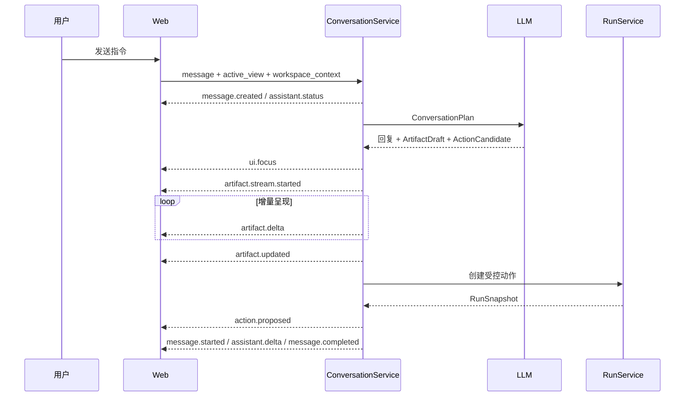

# 工作区、对话与流式协议

本文描述 V0.1 的交互模型、工作区数据、Agent 上下文和 SSE 事件，是修改前端交互或 ConversationService 时的对齐基线。

## 1. 交互原则

V0.1 采用 **workspace-first** 结构，而不是以聊天记录为唯一产物：

- 左侧为办公工作区和视图工具栏，右侧保留持续存在的 Agent 区域。根路径默认进入 Demo 1 Tasks；左侧先回答本轮要准备什么和下一步，右侧默认显示“现在需要你做什么”，并可切回同一 Agent 对话。离开 Tasks 后，右侧只保留后台任务摘要和返回 Tasks 的入口，不继续展示冲突决定或分支控制。
- 中间分隔条可拖动，双方独立滚动；切换工作区只替换左侧内容。
- 用户无需 Agent 也能编辑、保存或从工作区发起操作。
- Agent 接收当前活动视图和浏览器中的未保存内容，可以直接更新该工作区。
- 需要人工介入时，确认卡从对话输入区上方弹出，不遮挡历史消息，也不禁止继续对话。
- 审批不是独立页面。确认完成后动作继续运行，Simulator 结果再由 Agent 以自然语言收尾。

前端入口是 `apps/web/app/page.tsx`，主要视觉和动效位于 `apps/web/app/styles.css`。普通工作区保留暖纸底色、墨黑正文与工作区身份色；Demo 1 Task Director 使用更中性的高密度工作台，蓝色表达当前交互或运行阶段、绿色表达服务端已验证事实、琥珀色表达等待证据或人工决定。颜色、图标、连接线和进度式布局都不是业务真值。各工作区页头标题是固定的“XX 工作台”名称，不随 Artifact 数据变化；Task Director 标题和目标是例外，直接投影当前 `TaskSnapshot.contract`。移动端关键操作目标至少 44px。

## 2. WorkspaceArtifact

`services/api/app/application/conversation_models.py` 中的 `WorkspaceArtifact` 是工作区的服务端协议：

```text
artifact_id          当前活动产物的唯一标识
revision             当前活动产物的单调保存版本，从 1 开始
kind                 mail | document | quote | tasks | calendar | expense | crm
title                工作区标题
content              各视图的业务内容
sources              受信来源、系统、摘要和读取权限
linked_action_id     当前内容绑定的受控动作
linked_run_id        对应治理 Run
requires_recheck     动作绑定后内容是否又被修改
change_history       系统、用户和 Agent 的修改记录
updated_at           最后更新时间
```

工作区按 `user_id + kind` 保存。V0.1 每类只维护一个活动 Artifact，不提供收件箱、文件列表或历史版本浏览器。Conversation Thread 中也可带 Artifact 快照，但跨刷新恢复以 Workspace Store 为准。

### 2.1 各工作区 content 形状

| kind | 主要字段 | V0.1 行为 |
| --- | --- | --- |
| `mail` | `to[]`、`cc[]`、`subject`、`body`、`attachments[]` | 新用户为空白编辑器；“新邮件”创建新 Artifact，并清除旧动作绑定 |
| `document` | `document_type`、`sections[{heading, body}]` | 分章节编辑，Agent 可按章节渐进写入 |
| `quote` | `quote_id`、`customer`、`currency`、`valid_until`、`approved_floor`、`items[{name, qty, unit_price, discount, subtotal}]`、`total`、`approval` | 类表格编辑；行小计、四项汇总与最低折后比例状态由确定性公式投影；导入仅为界面占位 |
| `tasks` | `tasks[{id, title, source, priority, status, reason}]` | “执行记录”按状态分栏维护手工任务卡；“进度 / 成果”只投影 `TaskSnapshot`，不写入该 WorkspaceArtifact |
| `calendar` | `month`、`selected_date`、`events[{id, title, date, start, end, attendees, location, agenda}]` | 一级为全宽月历，日期格内嵌日程条目；点击进入当日安排视图（可前后翻日、返回月历），支持受控邀请 |
| `expense` | `case_id`、`owner`、`amount`、`status`、`invoices[]`、`anomalies[]` | 展示报销核查结果并可受控发起补件 |
| `crm` | `customer`、`opportunity_id`、`amount`、`before`、`suggested_stage`、`next_step` | 编辑商机建议并可受控更新 CRM 阶段 |

报价、任务、报销和 CRM 中声称来自业务系统的记录由确定性 Fixture 合并，模型不能覆盖这些 Connector-owned 字段；模型主要负责文本草稿和候选动作。报价的服务端所有字段为 `quote_id/customer/currency/approved_floor/items[].unit_price/sources`，当前用户可编辑字段为 `valid_until/items[].name/qty/discount`。`subtotal/total/approval` 不能从浏览器升级为权威事实。

报价即时汇总由前端整数分/BigInt 投影，服务端保存与 Agent 数值回答由 Decimal/`ROUND_HALF_UP` 投影，二者都先将每行标准金额舍入到分，再按该行折后比例计算并舍入折后小计，最后求和。基线结果是标准总价 272000 元、折后总价 253400 元、优惠金额 18600 元、综合折后比例 93.16%（约 9.32 折）、优惠率 6.84%。任一行无效时，前端所有聚合值都显示“待核对”，而不是继续显示部分总计。

### 2.2 Demo 1 Task Director

Tasks 主视图采用三个客户端模式，它们不改变服务端 Task 状态：

| 模式 | 前台职责 | 权威事实 |
| --- | --- | --- |
| `director`（前台“进度”） | 业务任务、三项材料、单一主要下一步、用户语言阶段、当前材料、核对/冲突与是否纳入成果 | 当前 `TaskSnapshot`；不存在的 head/report/Commit 必须显示等待或缺失 |
| `artifacts`（前台“成果”） | 当前与历史 ArtifactVersion、来源、检查、lineage 和 Commit | `branches[].artifact_heads`、`artifact_versions[]`、`verification_reports[]`、`conflicts[]`、`last_commit` |
| `manual`（前台“执行记录”） | 原手工待办看板 | `WorkspaceArtifact(kind=tasks)`；不与 TaskSnapshot 相互覆盖 |

初始 `/v1/tasks` 未返回时只显示读取态，不暴露创建动作；确认无 Task 后，固定 Demo 1 空态使用 `/v1/demo1/tasks` 客户 A 创建模板的客户端副本，一次点击依次创建并启动。已有 Task 的标题、目标和交付物全部取自 `TaskSnapshot.contract`。终态“开始新一轮汇报”也依次 create 与 start：新 round key 创建独立 Task，旧 Task 不修改；固定路径启动后通常直接进入 `waiting_input / verify`，不是把旧状态重置为可启动。通用产品仍需服务端模板描述接口，不能把固定空态副本扩展成通用事实。

右侧在 Tasks 中默认进入 `decisions`。open Conflict 先解释为什么需要人、两个口径和具体后果；顶部“查看待确认项”只是弱化定位，唯一改变 Task 状态的主动作仍是服务端 `resolve_evidence` 正式来源。查看材料、补证、暂停和接管降低层级；用户可切到 `agent` 继续同一 Conversation。“补充更多依据”只填充方向输入，提交后也只能显示 `steer accepted / 等待后续循环应用`。右侧模式切换不重建 Conversation，也不产生 TaskEvent。邮件、文档等非 Tasks 工作区不挂载决定控制，只从同一 Snapshot 显示“后台任务”摘要；“打开任务 / 前往处理 / 查看任务 / 查看汇报”只切换客户端视图。

当 Task 已 `committed` 时，三项成果仍首先作为可阅读结果出现；只有当前 `reply_draft` 同时被 Commit 引用并具有 passed VerificationReport 时，成果区才显示“准备发送”。点击后前端调用专用准备接口并切到同一 Conversation 的 Action Gate。该动作不会把 Task 改成 sending，也不表示邮件已发出。Gate 显示绑定成果版本、固定演示目标、风险、为什么需要确认和拒绝后果；用户先批准，再确认执行。拒绝、绑定失效或 Simulator 失败后，原 Task Commit 和三项成果继续保留。

工件选择使用客户端 `follow_head` 与 `pinned_history` 两种语义。默认跟随服务端 Branch head；用户主动选择旧版本时必须显示历史版本 banner、当前 head 版本和返回动作。mutation 完成后，`follow_head` 自动选择新 head；任何旧 candidate 都不能静默冒充当前已验证工件。

Task 同步状态与传输状态仍是客户端事实：它们只说明浏览器是否已经对账和 SSE/GET 是否可用，不表示后台 Loop 进度。主摘要只显示材料核对、业务状态和同步状态；预算、Owner 与内部步数从业务主路径隐藏，必要时由执行记录或服务端证据复核。完成态直接列出 `last_commit` 支持的三项成果和“回复草稿未发送”边界。服务端列表保留多轮 Task，但当前前端只自动选择最近活动 Task，否则选择最近终态 Task，没有历史轮次选择入口。移动端把编排画布改为纵向流，并从阻塞摘要提供到待确认项的可达路径，不通过缩小字体或横向页面滚动保留桌面泳道。

原 PR 6 视觉基线的浏览器 E2E 为 `6 passed (34.5s)`，历史 [`design-qa.md`](../design-qa.md) 只证明当时记录视图的视觉实现。收到用途不清反馈后的当前工程代理回归为 `12 passed (43.7s)`；新增单次开始、延迟列表加载防重复创建、无任务离线时左右区域一致、快速重复开始只产生一次 create/start、同分支多冲突按顺序开放且按剩余冲突解释后果、失败终态覆盖残留冲突卡、完成成果以及 Conflict/Committed 的 `1181 x 900` 溢出断言。既有 `390 x 844` 移动、乱序 Snapshot、`409`、历史版本与 source-ref 回归继续通过。该结果仍不证明目标用户理解、效率或决策质量改善，`DR-0005` 保持 `Draft`。

随后来源与轮次语义修订的完整浏览器 E2E 为 `12 passed (44.5s)`：覆盖非 Tasks 只显示后台摘要/跳转、已知来源显示“演示数据”且原始 ID 不进入 DOM、终态一键 create+start 新 Task 并保留旧 Task。独立证据见 [`DEMO1-ROUND-AND-SOURCE-CLARITY-EVIDENCE-20260811.md`](evidence/DEMO1-ROUND-AND-SOURCE-CLARITY-EVIDENCE-20260811.md)。这仍是工程证据，不证明用户理解。

DR-0007 的跨 Demo 浏览器路径进一步覆盖：完成本轮 → 从已验证客户回复准备动作 → Action Gate 核对绑定版本和演示目标 → 批准与确认执行 → Agent 返回 Simulator 结果；拒绝路径则验证 Task 仍为 committed。完整浏览器为 `29 passed (1.4m)`。该证据只证明被测交互和服务端绑定，不证明真实邮件发送、用户理解或通用 Task 成果动作。

## 3. 来源、权限和修改记录

每个 `SourceReference` 包含：

```text
source_id | label | system | excerpt | permission | updated_at
```

来源、权限使用和修改记录收纳在工作区底部的“上下文与治理”折叠区，默认不占用主编辑画布。其设计目的不是装饰，而是区分：

- 哪些内容来自模型生成；
- 哪些事实来自演示用邮箱、CRM、知识库、项目系统、日历或 OA Fixture；
- 当前用户以什么权限读取；
- 保存、Agent 修改和动作失效分别在何时发生。

这些来源在 V0.1 中是确定性 Demo 数据，并非真实 Connector 返回值。固定 Demo 1 的已知来源在普通业务 UI 中显示为“演示数据 · 业务来源（版本）”；原始 `fixture:` ID 仅保留在服务端协议中用于校验与审计，不进入普通业务 DOM。未知来源继续显示隐藏占位。

## 4. Agent 上下文与规划

发送消息时，前端调用：

```json
{
  "message": "根据当前内容写一封客户确认邮件",
  "active_view": "mail",
  "workspace_artifact_id": "artifact_demo_mail",
  "workspace_revision": 3,
  "workspace_context": {
    "to": ["client-a@example.com"],
    "cc": [],
    "subject": "",
    "body": "用户尚未保存的正文",
    "attachments": []
  }
}
```

`workspace_context` 表达浏览器当前未保存的编辑内容。显式发送时必须同时携带当前 `workspace_artifact_id/workspace_revision`；省略/`null` 表示使用已保存 Artifact 且不要求该 token。普通工作区以当前值形成 active workspace；报价工作区会先把当前 `name/qty/discount/valid_until` 合并到服务端基线，再确定性重算，不能覆盖报价编号、客户、币种、最低折后比例、标准价、来源或审批。显式 `{}` 表示当前上下文为空并 fail closed，不能悄悄回退到旧金额。服务端还会加入当前时间和按关键词检索到的 Demo 企业记录，形成 trusted context。

LLM 必须返回严格的 `ConversationPlan`：

```text
assistant_response   给用户的自然语言
focus_view           建议聚焦的工作区
artifact             可选的工作区草稿
action               可选的 ActionCandidate
```

规划结果经 Pydantic 校验，失败时最多修复一次。普通公共知识问题走直接问答路径，避免无关问题继承上一轮动作；涉及公司、客户、报价、报销、权限等企业事实的问题必须依赖 trusted context，不能用模型常识伪造内部记录。

报价核算、复算、最低折后比例检查和来源追问是更窄的确定性分支：ConversationService 从当前活动报价调用 Quote Calculator，并直接形成可读回答，LLM 不生成金额。写入、修改、保存、发送、创建或导入等业务动作不会被该分支截获，继续进入 `ConversationPlan` 与治理链路。来源回答必须说明数据是当前屏幕中的固定演示报价、公式为数量 × 标准价 × 折后比例，且没有访问真实 CRM。

## 5. 对话 SSE 协议

`POST /v1/threads/{thread_id}/messages/stream` 和动作完成后的 continue 接口均返回 `text/event-stream`。每个事件的 `event:` 名称与 JSON 中的 `type` 相同。

| 事件 | 关键字段 | 前端职责 |
| --- | --- | --- |
| `message.created` | `message` | 立即插入用户消息 |
| `assistant.status` | `status`、`label` | 显示“理解任务/继续执行”等短状态 |
| `message.started` | `message` | 建立空的 Agent 消息气泡 |
| `assistant.delta` | `message_id`、`delta` | 逐段追加文字，形成流式回复 |
| `message.completed` | `message` | 用服务端终态替换临时消息 |
| `ui.focus` | `view` | 切换到 Agent 正在处理的工作区 |
| `artifact.stream.started` | `artifact`、`fields` | 初始化渐进写入状态 |
| `artifact.delta` | `kind`、`artifact_id`、`field`、`value` 或 `item` | 增量更新正文、章节、行或卡片 |
| `artifact.updated` | `artifact` | 接受服务端最终 Artifact |
| `workspace.conflict` | `view`、`latest_artifact` | 保留本地草稿；展示查看最新版本或有界三方重应用，不创建动作 |
| `action.proposed` | `run` | 在输入框上方打开确认卡并订阅 Run |
| `action.closed` | `run_id`、`status` | 关闭确认卡或标记最终状态 |
| `error` | `detail` | 结束当前流并显示可理解错误 |

典型顺序：



报价确定性回答使用较短时序：`message.created → assistant.status(status=calculating) → message.started → assistant.delta* → message.completed`。回复事件与 LLM 回复共用同一 UI 协议，但数值来自服务端 Quote Calculator。同一 API 进程内同一 Thread 的流串行更新，避免并发消息用旧 Thread 覆盖；这不提供跨进程顺序、Thread 持久化或断线游标恢复。

显式上下文的 Artifact/revision 已过期，或 LLM 规划期间活动/目标 Artifact 发生变化时，服务端发出 `workspace.conflict` 并停止写回和动作创建。Web 保留当前输入，读取事件中的最新 Artifact；“重新应用我的修改”只把相对编辑起点发生变化且未被服务端同时改动的字段应用到最新版本。同字段双改、缺失编辑起点或报价行结构变化会列出冲突字段并拒绝自动合并。“查看最新版本”会明确放弃当前草稿并采用服务端版本。

即使请求发出时 revision 有效，用户也可能在 Agent 流返回前继续编辑。Web 在发起请求时记录各工作区的 Artifact 快照与本地 edit token；晚到 `artifact.stream.started/delta/updated` 不直接覆盖请求后的编辑。最终 Artifact 与本地草稿改动不同字段时自动保留双方并继续显示“未保存修改”，同字段双改则把 Agent 版本作为最新版本放入相同冲突 UI，用户输入保持可见。

## 6. 工作区渐进写入

渐进写入是交互呈现，不是逐 token 数据库存储：

1. 服务端先计算并保存最终 Artifact。
2. `_stream_artifact_update` 比较旧内容和目标内容。
3. 字符串按文本块发送，列表按项目发送；不适合渐进的字段直接给出终值。
4. 前端显示光标、淡入、高亮或“Agent 正在编辑”状态。
5. `artifact.updated` 到达后，以服务端最终对象校准界面。

因此刷新页面看到的是最终状态，不会重播打字动画。动画不能被当作事务进度，也不能替代服务端保存结果。

## 7. 确认卡与动作闭环

确认卡位于右侧对话底部、输入框上方，采用非模态 tray：

- 保持消息区可滚动、输入框可使用；
- 显示一次结构化风险等级、简要规则、capability、目标和状态；
- 缺证据时显示补证据操作；
- 缺审批时按角色显示批准/拒绝；
- 条件满足后显示最终执行确认；
- 执行后调用 continue stream，让 Agent 返回最终结果，而不是由卡片硬编码“任务完成”。

风险说明只在动作确认前的 Agent 文本中出现一次；确认卡保留结构化风险字段属于操作控件，不再在执行结果文本中重复。

可执行动作在创建 Run 前重新绑定当前 Artifact：模型提供的收件人、附件、payload、目标范围、数据分类、状态变化类型、可逆性和 `source_refs` 不直接进入执行；服务端按 capability 从可见 Artifact 重建并绑定 `artifact_id/revision/content`。ArtifactDraft 的模型来源也被服务端保留值或默认来源覆盖。内容不匹配时不创建动作；纯文本姓名、畸形邮箱或附件数据类别不明时，Run 由确定性策略置为 `DENIED`，Mock Evidence 不把 Action 自身值或用户自报姓名/哈希当作可信佐证。格式合法的邮箱和已分类报价附件仍可沿 Evidence/Approval/Permit 链路执行 Simulator。

Conversation 创建的 Run 绑定发起它的真实 Thread；continue stream 会拒绝同一用户从另一 Thread 续写该 Run。动作结果说明暂时失败时，前端保留“重新读取结果”；成功生成后，同一 API 进程重试会重放相同 `message.completed`，前端按 `message_id` 更新而不是重复追加。

## 8. 保存、修改与失效

- 用户点击保存时调用 `PUT /v1/workspace/{kind}`，同时提交 `expected_artifact_id/expected_revision`；服务端只在 token 匹配时合并 content、递增 `revision` 并追加修改记录。
- Artifact 已绑定 Action 后再次保存会设置 `requires_recheck=true`，并作废旧 Action；旧审批和旧 Permit 不能用于新内容。
- Agent 更新工作区时同样产生修改记录，并将新动作绑定到当前 Artifact。
- 邮件“新邮件”调用 `POST /v1/workspace/mail/new`，创建空白邮件 Artifact；这也是已编辑邮件返回空白编辑器的正式入口。
- 报价保存先按服务端字段所有权合并并重算小计/总计。相对基线修改 `name/qty/discount/valid_until` 时，保存结果设置 `approval.status=needs_review` 和 `requires_recheck=true`；字段无效时返回 422，不持久化猜测值。

## 9. V0.1 边界

- Thread 和 Message 在 API 进程内存中，重启后不恢复。
- 每个用户每种 kind 只有一个活动 WorkspaceArtifact。
- 当前只有活动 WorkspaceArtifact 的 409 检测与前端有界三方重应用，不是通用冲突合并或多人协作；没有自动保存节流、离线队列或历史版本恢复。Workspace 锁与 revision 比较只在单 API 进程内，数据库原子 CAS 和多实例协调未实现或验证。
- 邮件附件仅保存元数据/名称，不上传真实文件。
- 报价导入、真实邮箱目录、日历账户切换等仅为后续 Connector 扩展点。
- 报价核算只覆盖数量、标准价和单行折后比例，不含税费、汇率、阶梯价、套餐依赖或真实审批规则；当前来源为固定演示数据，不访问真实 CRM/CPQ/ERP。
- SSE 没有断线游标恢复；Run 审计流单独支持 `after` 序号续订。
- 动作结果的 `message.completed` 重放缓存与 Conversation Thread 一样位于单 API 进程内，重启后不恢复。
