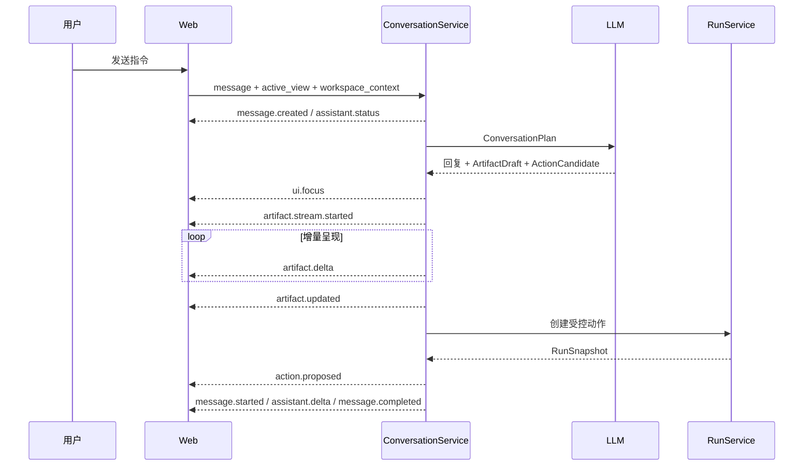

# 工作区、对话与流式协议

本文描述 V0.1 的交互模型、工作区数据、Agent 上下文和 SSE 事件，是修改前端交互或 ConversationService 时的对齐基线。

## 1. 交互原则

V0.1 采用 **workspace-first** 结构，而不是以聊天记录为唯一产物：

- 左侧为办公工作区和视图工具栏，右侧保留持续存在的 Agent 区域。普通工作区默认显示 Agent 对话；Demo 1 Tasks 默认显示只包含当前人工阻塞的 Decision Inbox，并可切回同一 Agent 对话。
- 中间分隔条可拖动，双方独立滚动；切换工作区只替换左侧内容。
- 用户无需 Agent 也能编辑、保存或从工作区发起操作。
- Agent 接收当前活动视图和浏览器中的未保存内容，可以直接更新该工作区。
- 需要人工介入时，确认卡从对话输入区上方弹出，不遮挡历史消息，也不禁止继续对话。
- 审批不是独立页面。确认完成后动作继续运行，Simulator 结果再由 Agent 以自然语言收尾。

前端入口是 `apps/web/app/page.tsx`，主要视觉和动效位于 `apps/web/app/styles.css`。普通工作区保留暖纸底色、墨黑正文与工作区身份色；Demo 1 Task Director 使用更中性的高密度工作台，蓝色表达当前交互或运行阶段、绿色表达服务端已验证事实、琥珀色表达等待证据或人工决定。颜色、图标、连接线和进度式布局都不是业务真值。各工作区页头标题是固定的“XX 工作台”名称，不随 Artifact 数据变化；Task Director 标题和目标是例外，直接投影当前 `TaskSnapshot.contract`。移动端关键操作目标至少 44px。

## 2. WorkspaceArtifact

`services/api/app/application/conversation_models.py` 中的 `WorkspaceArtifact` 是工作区的服务端协议：

```text
artifact_id          当前活动产物的唯一标识
kind                 mail | document | quote | tasks | calendar | expense | crm
title                工作区标题
content              各视图的业务内容
sources              受信来源、系统、摘要和读取权限
linked_action_id     当前内容绑定的受控动作
linked_run_id        对应治理 Run
requires_recheck     动作绑定后内容是否又被修改
change_history       系统、用户和 Agent 的修改记录
updated_at           最后更新时间
```

工作区按 `user_id + kind` 保存。V0.1 每类只维护一个活动 Artifact，不提供收件箱、文件列表或历史版本浏览器。Conversation Thread 中也可带 Artifact 快照，但跨刷新恢复以 Workspace Store 为准。

### 2.1 各工作区 content 形状

| kind | 主要字段 | V0.1 行为 |
| --- | --- | --- |
| `mail` | `to[]`、`cc[]`、`subject`、`body`、`attachments[]` | 新用户为空白编辑器；“新邮件”创建新 Artifact，并清除旧动作绑定 |
| `document` | `document_type`、`sections[{heading, body}]` | 分章节编辑，Agent 可按章节渐进写入 |
| `quote` | `quote_id`、`customer`、`currency`、`valid_until`、`approved_floor`、`items[]`、`total`、`approval` | 类表格编辑与金额展示；导入仅为界面占位 |
| `tasks` | `tasks[{id, title, source, priority, status, reason}]` | “待办”按状态分栏维护手工任务卡；“指挥台 / 共享工件”只投影 `TaskSnapshot`，不写入该 WorkspaceArtifact |
| `calendar` | `month`、`selected_date`、`events[{id, title, date, start, end, attendees, location, agenda}]` | 一级为全宽月历，日期格内嵌日程条目；点击进入当日安排视图（可前后翻日、返回月历），支持受控邀请 |
| `expense` | `case_id`、`owner`、`amount`、`status`、`invoices[]`、`anomalies[]` | 展示报销核查结果并可受控发起补件 |
| `crm` | `customer`、`opportunity_id`、`amount`、`before`、`suggested_stage`、`next_step` | 编辑商机建议并可受控更新 CRM 阶段 |

报价、任务、报销和 CRM 中声称来自业务系统的记录由确定性 Fixture 合并，模型不能覆盖这些 Connector-owned 字段；模型主要负责文本草稿和候选动作。

### 2.2 Demo 1 Task Director

Tasks 主视图采用三个客户端模式，它们不改变服务端 Task 状态：

| 模式 | 前台职责 | 权威事实 |
| --- | --- | --- |
| `director` | 阶段、分支、工件 head、验证、冲突和 Commit 的编排画布 | 当前 `TaskSnapshot`；不存在的 head/report/Commit 必须显示等待或缺失 |
| `artifacts` | 当前与历史 ArtifactVersion、来源、检查、lineage 和 Commit | `branches[].artifact_heads`、`artifact_versions[]`、`verification_reports[]`、`conflicts[]`、`last_commit` |
| `manual` | 原手工待办看板 | `WorkspaceArtifact(kind=tasks)`；不与 TaskSnapshot 相互覆盖 |

右侧在 Tasks 中默认进入 `decisions`，只突出 open Conflict 和现有 Branch Control；用户可切到 `agent` 继续同一 Conversation。收入冲突的主动作仍是服务端 `resolve_evidence` 正式来源；“准备补证指令”只填充方向输入，提交后也只能显示 `steer accepted / 等待后续循环应用`。右侧模式切换不重建 Conversation，也不产生 TaskEvent。

工件选择使用客户端 `follow_head` 与 `pinned_history` 两种语义。默认跟随服务端 Branch head；用户主动选择旧版本时必须显示历史版本 banner、当前 head 版本和返回动作。mutation 完成后，`follow_head` 自动选择新 head；任何旧 candidate 都不能静默冒充当前已验证工件。

Task 同步状态与传输状态仍是客户端事实：它们只说明浏览器是否已经对账和 SSE/GET 是否可用，不表示后台 Loop 进度。移动端把编排画布改为纵向流，并从阻塞摘要提供到 Decision Inbox 的可达路径，不通过缩小字体或横向页面滚动保留桌面泳道。

PR 6 最终全量浏览器 E2E 为 `6 passed (34.5s)`，专用 Task Director 截图封口用例为 `1 passed (21.6s)`；被测 `1487 x 1058` 桌面与 `390 x 844` 移动 CSS 视口无页面级横向溢出，[`design-qa.md`](../design-qa.md) 最终为 `passed` 且无剩余 P0/P1/P2。两项乱序回归还验证 Snapshot 按 `version`、`last_event_sequence` 与已观察 SSE 序号下限单调应用，旧 GET 不能回滚页面或制造虚假 `synced`。这只验证固定 Fixture 的上述交互和视口，不证明目标用户理解、效率或决策质量改善。

## 3. 来源、权限和修改记录

每个 `SourceReference` 包含：

```text
source_id | label | system | excerpt | permission | updated_at
```

来源、权限使用和修改记录收纳在工作区底部的“上下文与治理”折叠区，默认不占用主编辑画布。其设计目的不是装饰，而是区分：

- 哪些内容来自模型生成；
- 哪些事实来自企业邮箱、CRM、知识库、项目系统、日历或 OA Fixture；
- 当前用户以什么权限读取；
- 保存、Agent 修改和动作失效分别在何时发生。

这些来源在 V0.1 中是确定性 Demo 数据，并非真实 Connector 返回值。

## 4. Agent 上下文与规划

发送消息时，前端调用：

```json
{
  "message": "根据当前内容写一封客户确认邮件",
  "active_view": "mail",
  "workspace_context": {
    "to": ["client-a@example.com"],
    "cc": [],
    "subject": "",
    "body": "用户尚未保存的正文",
    "attachments": []
  }
}
```

`workspace_context` 以浏览器当前值为准，因此 Agent 能感知尚未点击保存的编辑内容。服务端还会加入当前时间和按关键词检索到的 Demo 企业记录，形成 trusted context。

LLM 必须返回严格的 `ConversationPlan`：

```text
assistant_response   给用户的自然语言
focus_view           建议聚焦的工作区
artifact             可选的工作区草稿
action               可选的 ActionCandidate
```

规划结果经 Pydantic 校验，失败时最多修复一次。普通公共知识问题走直接问答路径，避免无关问题继承上一轮动作；涉及公司、客户、报价、报销、权限等企业事实的问题必须依赖 trusted context，不能用模型常识伪造内部记录。

## 5. 对话 SSE 协议

`POST /v1/threads/{thread_id}/messages/stream` 和动作完成后的 continue 接口均返回 `text/event-stream`。每个事件的 `event:` 名称与 JSON 中的 `type` 相同。

| 事件 | 关键字段 | 前端职责 |
| --- | --- | --- |
| `message.created` | `message` | 立即插入用户消息 |
| `assistant.status` | `status`、`label` | 显示“理解任务/继续执行”等短状态 |
| `message.started` | `message` | 建立空的 Agent 消息气泡 |
| `assistant.delta` | `message_id`、`delta` | 逐段追加文字，形成流式回复 |
| `message.completed` | `message` | 用服务端终态替换临时消息 |
| `ui.focus` | `view` | 切换到 Agent 正在处理的工作区 |
| `artifact.stream.started` | `artifact`、`fields` | 初始化渐进写入状态 |
| `artifact.delta` | `kind`、`artifact_id`、`field`、`value` 或 `item` | 增量更新正文、章节、行或卡片 |
| `artifact.updated` | `artifact` | 接受服务端最终 Artifact |
| `action.proposed` | `run` | 在输入框上方打开确认卡并订阅 Run |
| `action.closed` | `run_id`、`status` | 关闭确认卡或标记最终状态 |
| `error` | `detail` | 结束当前流并显示可理解错误 |

典型顺序：



## 6. 工作区渐进写入

渐进写入是交互呈现，不是逐 token 数据库存储：

1. 服务端先计算并保存最终 Artifact。
2. `_stream_artifact_update` 比较旧内容和目标内容。
3. 字符串按文本块发送，列表按项目发送；不适合渐进的字段直接给出终值。
4. 前端显示光标、淡入、高亮或“Agent 正在编辑”状态。
5. `artifact.updated` 到达后，以服务端最终对象校准界面。

因此刷新页面看到的是最终状态，不会重播打字动画。动画不能被当作事务进度，也不能替代服务端保存结果。

## 7. 确认卡与动作闭环

确认卡位于右侧对话底部、输入框上方，采用非模态 tray：

- 保持消息区可滚动、输入框可使用；
- 显示一次结构化风险等级、简要规则、capability、目标和状态；
- 缺证据时显示补证据操作；
- 缺审批时按角色显示批准/拒绝；
- 条件满足后显示最终执行确认；
- 执行后调用 continue stream，让 Agent 返回最终结果，而不是由卡片硬编码“任务完成”。

风险说明只在动作确认前的 Agent 文本中出现一次；确认卡保留结构化风险字段属于操作控件，不再在执行结果文本中重复。

## 8. 保存、修改与失效

- 用户点击保存时调用 `PUT /v1/workspace/{kind}`，服务端合并 content 并追加修改记录。
- Artifact 已绑定 Action 后再次保存会设置 `requires_recheck=true`，并作废旧 Action；旧审批和旧 Permit 不能用于新内容。
- Agent 更新工作区时同样产生修改记录，并将新动作绑定到当前 Artifact。
- 邮件“新邮件”调用 `POST /v1/workspace/mail/new`，创建空白邮件 Artifact；这也是已编辑邮件返回空白编辑器的正式入口。

## 9. V0.1 边界

- Thread 和 Message 在 API 进程内存中，重启后不恢复。
- 每个用户每种 kind 只有一个活动 WorkspaceArtifact。
- 没有冲突合并、多人协作、自动保存节流、离线队列或历史版本恢复。
- 邮件附件仅保存元数据/名称，不上传真实文件。
- 报价导入、真实邮箱目录、日历账户切换等仅为后续 Connector 扩展点。
- SSE 没有断线游标恢复；Run 审计流单独支持 `after` 序号续订。
