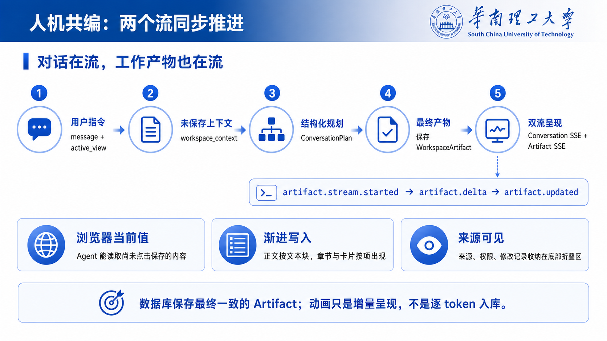
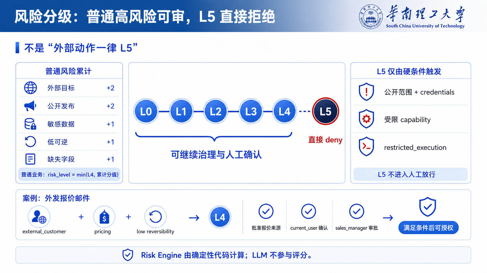

第一页:

这一部分我们先从一个很直观的问题开始：在办公场景中, Agent 虽然给出了一个看起来不错的答案，但用户还要把内容复制到邮件、日历或者业务系统里，再重新检查一遍，那其实真正的工作并没有完成。所以我们的框架并不局限于聊天框，而是采用可感知工作区的agent协作思路——主体是用户，用户在工作区实时编辑文件，而 Agent 是辅助用户完成任务的协作者。

这里展示的是我们的ui界面，左侧承载的是用户真正要处理的业务对象，包括邮件、文档、报价、任务、日历等区域；右侧是持续存在的 Agent 对话。用户不依赖 Agent 也可以正常编辑和保存，Agent 则能够读取当前打开的工作区，读取浏览器里还没点击保存的内容。切换不同工作区时，右侧对话不会重建，因此一段任务可以跨多个办公对象连续推进。

**在这个框架下，我们希望人机交互协作关系更为高效可控，不能只和 AI 在聊天框里对话，应该让用户和 Agent 围绕同一个业务对象，在同一个工作区内共同完成工作，同时把最终控制权保留给用户。**

第二页:

既然双方在同一个工作区内协作，那么关键问题就是：**对话和工作区内容怎样同步变化，人机协作流程是怎样的，又如何保证最终产物的一致性**？

我们的框架让**对话反馈和工作产物同步推进**：用户既能看到 Agent 在理解和回应，也能直接看到agent正在左侧工作区对邮件正文、文档章节或者任务卡经行编辑，这样的形式强调**用户与agent的实时协作，共同编辑**。

用户向agent发送自然语言请求时，系统一起提交当前视图和工作区内的未保存内容，通过上下文管理器再把这些内容、必要的历史消息以及受信的业务上下文交给模型，要求它根据规范输出结构化的请求。此时模型给出的是目标状态，包括自然语言回复以及可见的工作区草稿。

所以从用户体验上看，对话和产物是两条并行的流。来源、权限和修改记录也会保留在工作区底部，方便用户随时追溯内容从哪里来。**比如用户要求agent：向客户A发送邮件，内容是报价表。经过用户批准执行后，系统会保留整个执行链路调取内部数据库、文档的记录，可以清晰查看到agent在执行过程中读取了什么内容，实现全流程的可审计可溯源。**

第三页:

现在 Agent 已经具备修改业务对象能力，接下来更重要的就是更为关键的**协作效率**与**风险控制**问题，应该如何把“模型能做什么”和“系统允许执行什么”清楚地分开。

这张总体架构图表达的核心就是将框架拆分为两块：模型理解，代码施工。agent从工作区和对话框获取输入 --> 上下文管理器负责组织对话、当前工作区和受信上下文 --> 大模型负责理解意图、生成内容 --> 模型输出之后，先要进行严格的协议校验：风险、策略、证据、人工确认、授权和工具执行全部都是**确定性代码控制的范围**。

模型与代码的职责边界非常明确。**模型可以产生自然语言回复，在工作区编辑草稿，以及描述“准备做什么”，但它不能给自己判定风险等级，不能宣布证据已经通过，也不能跳过审批签发批准，更没有直接调用副作用工具的入口**。Risk、Policy 和 Evidence Engine 是风险控制的条件，LangGraph 管理人工中断与恢复，授权服务签发一次性许可，Tool Gateway 在真正执行前再做最后核对，最后才会被允许执行。

底部的 PostgreSQL 和 Audit 用来承接工作区、Run、审计事件和工作流 checkpoint；当然我们现在做的只是一个收发的模拟，后续可以接入真实接口实现发送真实邮件。

第四页:

这条链上的关键框架设计是 -- **ActionSpec**，**它把一句自然语言变成结构化、可审计和授权的动作，让后续程序能够直接读取硬编码字段判断用户行为的风险，强化agent自动化执行过程中的规范性、可控性**。

自然语言很适合表达意图，但不适合直接成为agent权限授予的依据。比如用户说：“把这份报价发给客户”，里面其实还缺少很多必须明确的信息：发给谁、用哪一版报价、涉及什么数据、动作是否可逆、最终要调用具体哪一个工具接口。**这些信息的缺失很有可能导致agent执行时偏离正确轨道，执行不可逆的错误动作**。因此在ActionSpec框架中，系统要求模型生成 ActionCandidate也就是候选动作列表，它只描述业务候选事实，不包含“安全”或者“已经批准”这样的结论。

**右图是一个具体的ActionSpec的Json**，图中这些字段可以理解为一份动作清单：**`action_type`** 说明要做什么，**`capability`** 用于赋予agent调用工具的权限，`target_scope`指的是收件人和资源说明影响对象，**数据类型、状态变化类型和可逆性**帮助后续评估风险，**`missing_slots`** 标记信息是否齐全，**`source_refs`** 和 **`parameters`**是信息数据的来源与具体执行参数。**代码执行严格的硬编码校验，错误字段不会被静默接受。**

最终的ActionSpec加入经过认证的操作者、Trace、Action ID、内容摘要等信息字段。后面的风险、策略、证据、审批、Permit 以及工具参数，全部绑定在同一个动作对象上。**这样经过系统处理的批准就不再是一句模糊的“可以发送”，而是“由谁、把哪份内容、发给谁、调用什么能力”的具体动作。**动作被描述清楚以后，下一步才有可能对它进行稳定、可解释的风险判断。

第五页:

**在风险控制的设计上，有两个极端：一个是完全交给大模型来决策，让模型凭感觉打分，另一个是直接代码中硬编码，写死动作风险等级**。我们的风险评估框架则在两者之间。我们的 Risk Engine 采用的是确定性规则计算，根据动作的性质，如：发送给外部目标、公开发布、涉及敏感数据、操作低可逆和信息缺失会累积风险分值，根据风险分值等级判断风险等级，普通业务动作最高封顶在 L4，因此 L0 到 L4 都可以根据具体条件继续治理和人工确认。

页面下方的外发报价邮件就是一个典型例子。对象是外部客户带来风险值，报价数据属于敏感业务数据，再加上发送后的低可逆性，最终风险等级的判断到达 L4。L4 的含义不是直接放行，也不是直接拒绝，而是需要把条件补齐。Risk 负责说明风险有多高，Policy 再把它转化为可操作的要求，例如确认报价来源确实是已批准版本、由当前用户确认，并由销售经理完成对应角色审批。

L5 则不是普通分值叠加出来的，它只由硬条件触发，例如公开范围泄露凭据、调用付款或权限变更等受限 capability，或者动作本身属于 restricted execution。命中以后策略直接 deny，不进入“人工点一下就能放行”的路径。这样既保留了正常办公自动化的可用性，也明确划出了系统当前绝不跨越的红线。有了风险等级和策略条件以后，下一页就进入用户真正能感知到的 Human Gate。

第六页:

很多系统所谓的人工确认，其实只是 Agent 在对话里说一句“是否继续”，用户回答以后，前后状态并没有真正绑定。这里的 Human Gate 不一样，它是运行流程中的正式节点。确认卡以非模态 tray 的形式放在对话底部，不遮挡历史消息，用户仍然可以继续查看工作区或者补充问题。

整个过程从 `WAITING_EVIDENCE` 开始，先补齐可信证据；证据满足后进入 `WAITING_APPROVAL`，按策略要求让不同角色分别确认；全部满足以后才到 `READY_TO_AUTHORIZE`，由当前用户做执行前的最终授权，成功执行后进入 `EXECUTED`。任一角色拒绝、策略变为 deny，或者授权与执行失败，都会转入拒绝或失败分支。用户提供的是报价版本、附件等业务引用，不能自己填写“DLP 已通过”这类安全结论，证据状态需要由受信服务解析。

还有一个容易被忽略的点：每次从 Gate 恢复时，系统都会重新计算风险、策略、证据和 ControlPlan，而不是直接相信上一次停下来的状态。最终确认以后，也不是前端把按钮改成“已完成”就结束，而是后端继续签发许可、调用 Gateway 和 Simulator，再由 Agent 根据真实执行结果收尾。到这里还有最后一个问题：即使用户已经批准，系统怎样防止执行前偷偷把收件人或附件换掉？这就是下一页一次性 Permit 要解决的事情。

第七页:

Permit 可以用一个比较直观的方式来理解：它不是把邮件工具长期开放给 Agent，而是只为当前这一次、当前这份内容签发一张短时通行证。通行证会绑定操作者、最小 capability、动作内容和具体参数，同时记录策略版本、已有审批、有效期、单次使用限制和幂等信息，并由服务端使用 Ed25519 签名。

真正调用工具之前，Tool Gateway 不会只看“之前是否点过批准”，而是重新计算并核对当前请求。如果批准时是“客户 A 加报价 V3”，执行时仍然完全一致，许可才有效；如果收件人换成了客户 B、附件被替换，或者工作区内容在审批后又被修改，参数哈希就会不一致，旧 Action、旧审批和旧 Permit 都不能继续使用。过期、重复使用、操作者变化以及策略版本漂移也都会被拦截。

这套机制解决的是典型的“批 A、执行 B”问题，把人的确认转换成机器可以验证的授权边界。人工批准绑定的是具体内容，而不是给某个工具一张长期通行证。前面几页把框架拆开讲清楚以后，下面通过邮件和日历两个实际工作区，把感知、编辑、治理和执行重新串成一条完整链路。

第八页:

先看邮件场景。左侧可以从一封空白邮件开始，用户既可以自己编辑，也可以在右侧请 Agent 根据当前草稿和受信上下文补全主题与正文。因为未保存内容会随消息一起提交，Agent 不需要用户先复制到聊天框；生成的内容也不是只返回一段文字，而是直接、渐进地写进邮件这个 WorkspaceArtifact。

如果用户只要求起草，流程就停留在低摩擦的共编阶段，不会创建发送授权。只有当用户明确要求发送时，系统才提议 `email.send`，并根据收件人范围、数据类别、附件和可逆性重新计算风险与策略。右侧确认卡会展示当前目标、最小工具能力、需要的证据和审批；条件满足后签发一次性 Permit，由 Gateway 核对后进入 Email Simulator，最后把工具结果交还给 Agent，用自然语言告诉用户成功、失败或被拒绝。

这里有两个边界需要明确。第一，动作绑定后如果邮件正文、收件人或附件再次变化，原动作会失效，不能复用之前的确认。第二，演示界面中的“发送成功”只表示 Email Simulator 执行成功，并不代表邮件已经投递到真实企业邮箱。邮件场景证明了完整闭环可以运行，但框架的价值不应该只局限在邮件，所以最后我们再看它怎样复用到日历工作区。

第九页:

日历不是一个跳转入口，而是和邮件一样的一级工作区。Agent 可以读取当前月历、用户选中的日期和已有日程，在左侧直接生成新的会议 Artifact；用户先看到业务对象如何变化，再决定是否创建真正带有系统写入或邀请影响的 `calendar.invite` 动作。

这一页截图里演示的是内部团队邀请，所以风险等级较低，主要完成日历可用性校验和当前用户确认；如果把参与人换成外部客户，同一个 ActionSpec 会额外命中外部邀请策略，增加收件人身份等证据要求。也就是说，界面操作看起来仍然是“创建一个会议”，但系统会根据目标范围和数据事实动态生成不同的控制条件，而不是为每个工作区单独写一套不可复用的审批逻辑。

确认完成后，流程同样经过一次性 Permit、Tool Gateway 和 Calendar Simulator，再由 Agent 根据结果收尾。到这里，九页内容就形成了一个完整闭环：Workspace-first 让 Agent 进入真实业务对象，双流让共编过程可见，ActionSpec 把意图变成可校验动作，Risk、Policy、Human Gate 和 Permit 把副作用控制在明确边界内。V0.1 当前验证的是这套可复用的治理与协作范式，真实身份、企业 Connector，以及对话和分布式防重放等生产化持久化仍是后续工作；下一步的重点应当是替换这些工程边界，而不是简单地把更多决定权交给模型。
