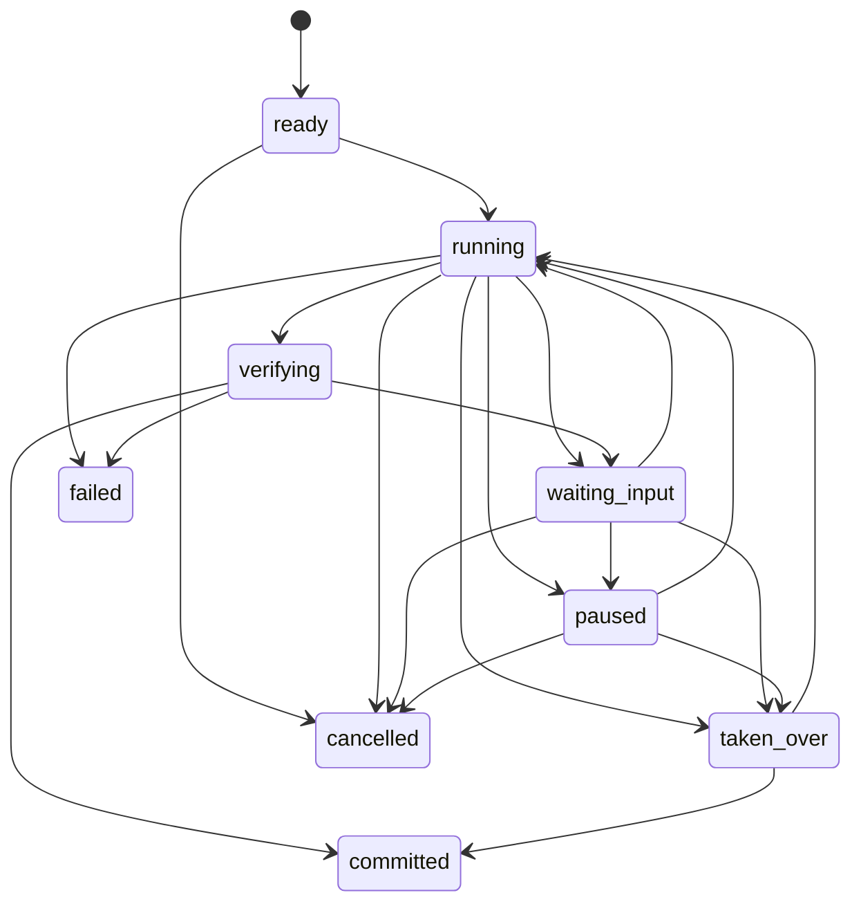
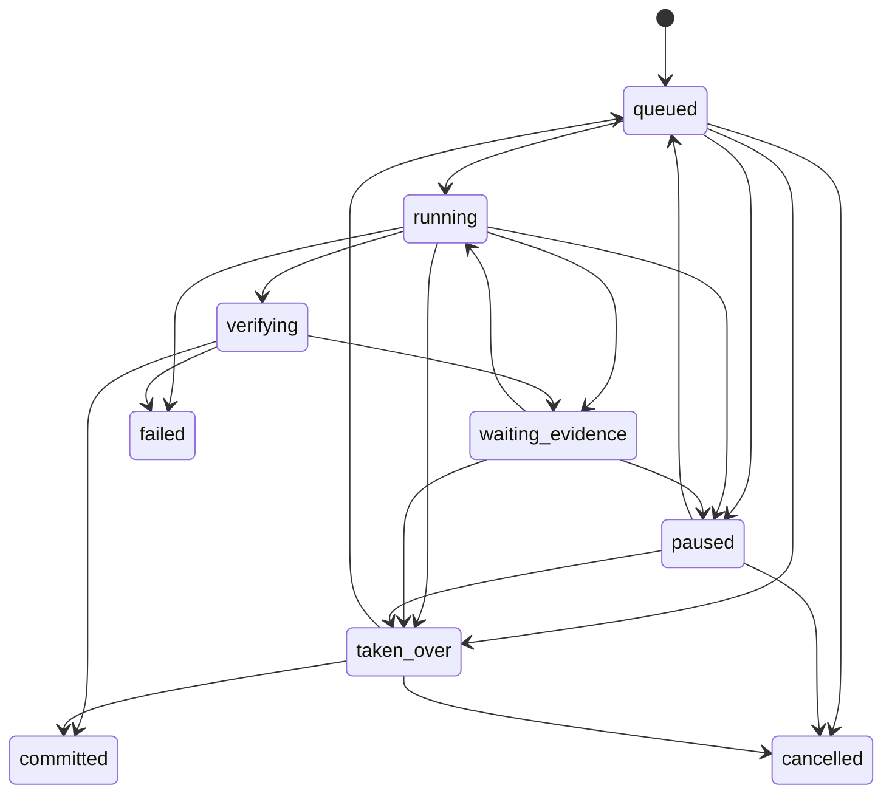

# Demo 1 Task Runtime 协议

> 状态：`Ready`。本文件定义目标协议；PR 1 只落地严格 Pydantic/TypeScript 类型和测试，不宣称持久化、SSE、Loop 或前端已经实现。

## 1. 权威来源与兼容规则

协议权威顺序：

1. `packages/contracts/task_models.py` 是服务端规范来源，全部模型 `extra="forbid"`。
2. `apps/web/app/task-types.ts` 是前端镜像，字段名保持 API 的 `snake_case`，不自行派生业务真值。
3. 本文解释语义、状态机和时序；行为实现后由 API、TaskService、Store、Trace 和测试共同证明。

`schema_version="1.0"` 的未知顶层字段必须拒绝，不能静默接受。协议变更必须同步 Pydantic、TypeScript、API/SSE、本文、UI 事实矩阵和测试。

## 2. 服务端权威实体

| 实体 | 身份与版本 | 核心职责 | 客户端权限 |
| --- | --- | --- | --- |
| `TaskContract` | `task_id + contract_version` | 固定目标、来源范围、交付物、完成条件、预算和截止时间 | 客户端只提交 `TaskContractDraft`；不能指定 ID、Owner、版本、状态或时间 |
| `TaskSnapshot` | `task_id + version` | 当前任务、阶段、分支、工件、验证、冲突、控制、预算和最近 Commit 的服务端投影 | 只读；所有显示状态以它校准 |
| `BranchSnapshot` | `branch_id + version` | 保存单分支目标、状态、Artifact head、问题和最近 Commit | 只读；状态只能由服务端循环或控制事件改变 |
| `ArtifactVersion` | `artifact_id + version` | 不可变候选或已验证工件，绑定分支、来源和内容摘要 | 客户端不能覆盖旧版本；人工接管时也只能创建新版本 |
| `VerificationReport` | `report_id` | 记录来源、一致性和完成条件检查 | 只读；前端不能把 candidate 改成 verified |
| `ConflictRecord` | `conflict_id` | 记录冲突主题、候选值、来源和解决结果 | 用户只能提交解决命令；服务端写 resolved 事实 |
| `ControlEvent` | `control_event_id` | 持久记录 Steer、Pause、Resume、Take over、Return control、Resolve evidence | 客户端提交 `TaskControlCommand`，服务端校验版本、权限和幂等 |
| `TaskEvent` | `task_id + sequence` | 追加式 Trace 与 SSE 事实 | 只读；事件顺序不能由客户端指定 |
| `TaskCommit` | `commit_id + state_hash` | 把通过验证的 ArtifactVersion 和 VerificationReport 固定为完成证据 | 只读；前端收到提交事实后才可显示完成 |

## 3. 状态机

### 3.1 Task 状态



`committed`、`failed` 和 `cancelled` 是本版本终态。顶层状态由 Branch、Verifier、Budget 和 Control Policy 派生，客户端不能直接提交。

### 3.2 Branch 状态



分支冲突只改变受影响 Branch；其他 Branch 保持自身状态。只有全部必需交付物已验证、所有必需 Branch committed 且无 open conflict 时，任务才能进入 committed。

## 4. Artifact、Verify 与 Commit 不变量

1. `ArtifactVersion` 追加而不覆盖，`content_digest` 必须能由 canonical JSON 重新计算。
2. 新版本必须绑定当前 `branch_id`、契约中存在的 `deliverable_id` 和允许的 `source_refs`。
3. candidate 工件不能作为完成证据；进入 Commit 的工件必须有 `VerificationReport.status=passed`。
4. 冲突解决会创建新 ArtifactVersion 并重新验证，不原地修改旧工件或旧报告。
5. `TaskCommit.state_hash` 覆盖 Task 版本、Branch heads、ArtifactVersion IDs、VerificationReport IDs 和 open-conflict 状态。
6. 视觉动画、模型回复、客户端缓存和 SSE 连接状态都不能创建 Commit。

## 5. 控制命令

| kind | 目标 | 必填字段 | 服务端效果 | 前台反馈 |
| --- | --- | --- | --- | --- |
| `steer` | Task 或 Branch | `instruction`、`expected_task_version`、`idempotency_key` | 记录方向变更并在安全提交点重新规划 | 先显示待确认，收到 `CONTROL_APPLIED` 后显示生效版本 |
| `pause_branch` | Branch | `branch_id`、version、key | 非终态 Branch 进入 paused | 显示影响范围和最后 Commit |
| `resume_branch` | Branch | `branch_id`、version、key | paused Branch 回到 queued/running | 服务端确认后恢复，不乐观动画 |
| `take_over` | Branch | `branch_id`、version、key | Branch 进入 taken_over，Agent 停止写入 | 显示控制权、人工编辑范围和 Return control |
| `return_control` | Branch | `branch_id`、version、key | 从人工最新版本恢复 Agent 控制 | 重新校验来源和版本后继续 |
| `resolve_evidence` | Branch | `branch_id`、`selected_source_ref`、version、key | 解决指定冲突并创建重新验证工作 | 冲突保持 open，直到收到服务端 resolved 事件 |

每个 mutation 都必须携带 `expected_task_version` 和 `idempotency_key`。版本过期返回 `409`；相同 key 与相同命令返回原结果；相同 key 与不同命令返回 `409`，不得产生新事件。

## 6. 事件目录与 SSE

`TaskEvent.sequence` 在每个 Task 内严格单调递增。写入 Snapshot、ArtifactVersion、ControlEvent 和 TaskEvent 必须属于同一持久化事务，事务提交后才能广播 SSE。

| 事件族 | 事件 | UI 用途 |
| --- | --- | --- |
| Task | `TASK_CREATED`、`TASK_RESTORED`、`TASK_STATUS_CHANGED`、`TASK_PHASE_CHANGED`、`TASK_FAILED`、`TASK_COMMITTED` | Task Bar 与终态 |
| Loop | `LOOP_STEP_STARTED`、`LOOP_STEP_COMPLETED`、`BUDGET_UPDATED` | 阶段和预算，不等同于完成 |
| Branch | `BRANCH_STATUS_CHANGED` | 分支列表与影响范围 |
| Artifact | `ARTIFACT_VERSION_CREATED`、`VERIFICATION_RECORDED`、`CHECKPOINT_COMMITTED` | 工件版本、验证和恢复点 |
| Conflict | `CONFLICT_OPENED`、`CONFLICT_RESOLVED` | 冲突卡与重新验证 |
| Control | `CONTROL_ACCEPTED`、`CONTROL_APPLIED`、`CONTROL_REJECTED` | 用户命令终态与原因 |

目标接口：

```text
POST /v1/tasks
GET  /v1/tasks
GET  /v1/tasks/{task_id}
GET  /v1/tasks/{task_id}/events?after={sequence}
POST /v1/tasks/{task_id}/controls
```

SSE 帧：

```text
id: 17
event: BRANCH_STATUS_CHANGED
data: {TaskEvent JSON}
```

断线恢复顺序固定为：携带最后确认的 `after=sequence` 回放事件，再 GET 最新 Snapshot；若版本或序号存在缺口，以 Snapshot 覆盖本地投影。heartbeat 和断线属于传输状态，不改变任务业务状态。

## 7. 身份、权限与隐藏信息

- 读取、控制和事件订阅必须验证 Task Owner；生产环境需要 SSO/JWT，V0.1 身份头仍只是 Demo 占位。
- Branch 来源读取必须落在 `TaskContract.source_scope` 和当前用户权限内。
- 副作用动作不属于 TaskControlCommand，继续调用现有 RunService 和 Tool Gateway，不能旁路 Permit。
- 普通 UI 不展示原始 Prompt、思维链、Worker 对话、JWT/Permit、幂等键、完整工具参数、权限哈希、密钥或堆栈。

## 8. 分阶段实现状态

| 能力 | PR 1 | 后续目标 |
| --- | --- | --- |
| Pydantic 与 TypeScript 协议 | 实现并测试 | 随行为演进同步 |
| 场景、来源、状态机、UI 映射 | `Ready` | 用运行证据更新为 Verified |
| Task Store / Snapshot API / SSE | 未实现 | PR 2 |
| Observe/Plan/Act/Verify/Commit | 未实现 | PR 3 |
| Task UI 与断线恢复 | 未实现 | PR 2 最薄 Task Bar，PR 3/4 完整闭环 |
| Adaptive Swarm / 真实 Connector | 非本决策范围 | 需独立 Admission 和来源证据 |
