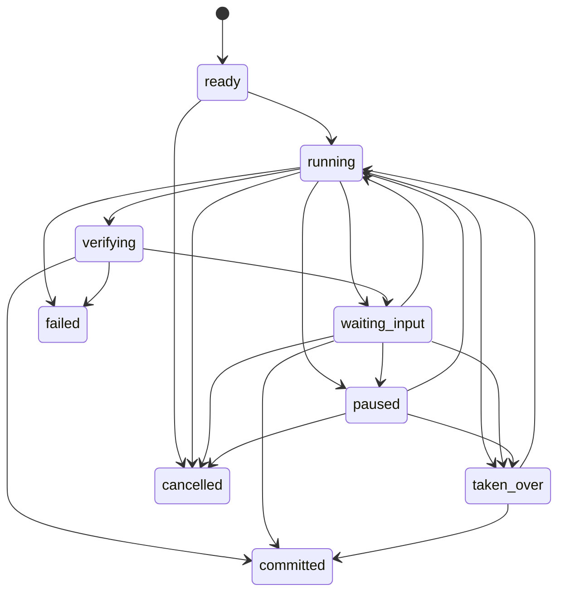
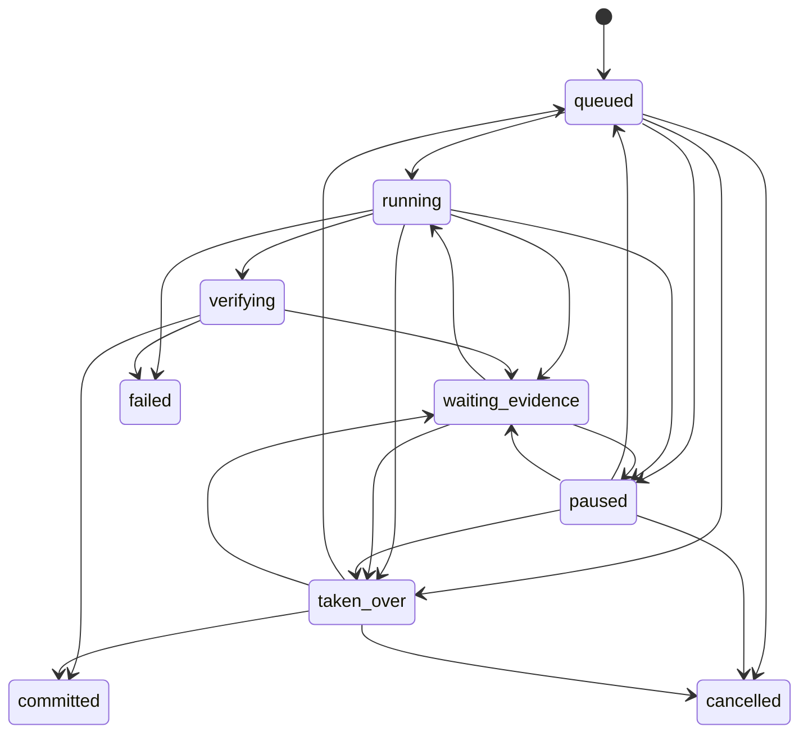

# Demo 1 Task Runtime 协议

> 状态：`Ready`。PR 3 已增加固定 Fixture 的 start/control mutation、ArtifactVersion、Verifier、局部冲突、Commit 和最薄控制 UI；内存 Store 已覆盖引用/hash/幂等回归，PostgreSQL 重启、完整异常恢复与 Artifact/Action 绑定尚未验收。

## 1. 权威来源与兼容规则

协议权威顺序：

1. `packages/contracts/task_models.py` 是服务端规范来源，全部模型 `extra="forbid"`。
2. `apps/web/app/task-types.ts` 是前端镜像，字段名保持 API 的 `snake_case`，不自行派生业务真值。
3. 本文解释语义、状态机和时序；行为实现后由 API、TaskService、Store、Trace 和测试共同证明。

`schema_version="1.0"` 的未知顶层字段必须拒绝，不能静默接受。协议变更必须同步 Pydantic、TypeScript、API/SSE、本文、UI 事实矩阵和测试。

### 1.1 PR 3 当前实现边界

| 能力 | 当前事实 | 尚未实现 |
| --- | --- | --- |
| Task 创建 | `TaskService` 从 `TaskContractDraft` 生成服务端 Task ID、Owner、契约、三个初始 Branch 和 `TASK_CREATED` | 契约修改与取消 |
| 固定 Runtime | `/start` 在一次 mutation 中产生固定客户 A 的阶段 Trace、ArtifactVersion、VerificationReport 和局部 Conflict；`resolve_evidence` 可形成 TaskCommit | 通用任务规划、LLM 生成、后台调度和任意中间阶段恢复 |
| TaskStore | `InMemoryTaskStore` 与 `PostgresTaskStore` 已有 Snapshot、Event 和 ArtifactVersion commit 路径 | PostgreSQL 本机运行/重启证据、Outbox、迁移工具 |
| API | 创建、列表、读取、`POST /tasks/{id}/start`、`POST /tasks/{id}/controls` 和 Task SSE | 取消、通用任务执行、人工 Artifact 编辑 API |
| 幂等 | 新 mutation 的 marker 保存原结果 Snapshot；内存回归证明旧 key 在后续 mutation 后仍返回原结果且不重复写。旧版 marker 缺原结果时仅在当前 version 未前进时兼容返回，否则 409 拒绝不安全重放 | PostgreSQL 崩溃/重启恢复实证 |
| Owner scope | 列表、读取和事件均以 `X-User-Id` 过滤，跨 Owner 按不存在处理 | 生产 SSO/JWT、租户 RBAC |
| Budget / Deadline | start 和 resolve 会在 mutation 前校验预计用量与 `deadline_at`，`TaskBudgetSnapshot.exhausted` 字段存在；预计超限时当前请求不写状态 | 专门的顶层/分支耗尽状态、缩小范围/申请额度和完整恢复 UI |
| 前台 | Active Task Bar、Branch、Conflict、Control 和最近 Commit 均读取服务端 Snapshot；Task SSE 后重新 GET 对账；未知 mutation 在当前标签页保存原 key/intent，offline/reconnecting 时可同 key 对账 | 完整 Artifact Workspace、人工新版本、失败/预算/重启闭环与浏览器恢复 E2E |

创建后的初始事实仍是 `ready / contract`、三个 `queued` Branch、空工件/验证/冲突/控制列表、`last_commit=null` 和 `TASK_CREATED(sequence=1)`。只有固定 Demo 1 `start` 后，服务端才产生后续工件、验证、冲突和阶段事件。该调用不使用 LLM 或真实 Connector，且所有阶段在一个事务提交后才可见，不等于持续后台 Loop。

## 2. 服务端权威实体

| 实体 | 身份与版本 | 核心职责 | 客户端权限 |
| --- | --- | --- | --- |
| `TaskContract` | `task_id + contract_version` | 固定目标、来源范围、交付物、完成条件、预算和截止时间 | 客户端只提交 `TaskContractDraft`；不能指定 ID、Owner、版本、状态或时间 |
| `TaskSnapshot` | `task_id + version` | 当前任务、阶段、分支、工件、验证、冲突、控制、预算和最近 Commit 的服务端投影 | 只读；所有显示状态以它校准 |
| `BranchSnapshot` | `branch_id + version` | 保存单分支目标、状态、Artifact head、问题和最近 Commit | 只读；状态只能由服务端循环或控制事件改变 |
| `ArtifactVersion` | `artifact_id + version` | 不可变候选或已验证工件，绑定分支、来源和内容摘要 | 客户端不能覆盖旧版本；人工接管时也只能创建新版本 |
| `VerificationReport` | `report_id` | 记录来源、一致性和完成条件检查 | 只读；前端不能把 candidate 改成 verified |
| `ConflictRecord` | `conflict_id` | 记录冲突主题、候选值、来源和解决结果 | 用户只能提交解决命令；服务端写 resolved 事实 |
| `ControlEvent` | `control_event_id` | 持久记录 Steer、Pause、Resume、Take over、Return control、Resolve evidence | 客户端提交 `TaskControlCommand`，服务端校验版本、权限和幂等 |
| `TaskEvent` | `task_id + sequence` | 追加式 Trace 与 SSE 事实 | 只读；事件顺序不能由客户端指定 |
| `TaskCommit` | `commit_id + state_hash` | 把通过验证的 ArtifactVersion 和 VerificationReport 固定为完成证据 | 只读；前端收到提交事实后才可显示完成 |

## 3. 状态机

### 3.1 Task 状态



`committed`、`failed` 和 `cancelled` 是本版本终态。协议目标要求顶层状态由 Branch、Verifier、Budget 和 Control Policy 派生，客户端不能直接提交；PR 3 当前固定路径实际由 Branch/phase 派生状态，预算与截止时间是在 mutation 前拒绝，并未派生专门的顶层耗尽状态。

### 3.2 Branch 状态



分支冲突只改变受影响 Branch；其他 Branch 保持自身状态。Resume 或 Return control 遇到仍为 open 的 Conflict 时返回 `waiting_evidence`，不能绕过来源选择。只有全部必需交付物已验证、所有必需 Branch committed 且无 open conflict 时，任务才能进入 committed。

## 4. Artifact、Verify 与 Commit 不变量

以下仍是必须满足的不变量，不因类型存在或单次主路径成功而自动视为已验证：

1. `ArtifactVersion` 追加而不覆盖，`content_digest` 必须能由 canonical JSON 重新计算。
2. 新版本必须绑定当前 `branch_id`、契约中存在的 `deliverable_id` 和允许的 `source_refs`；Artifact head、VerificationReport、Conflict 和 Commit 引用必须指向同一 Task 内存在的对象。
3. candidate 工件不能作为完成证据；进入 Commit 的工件必须有 `VerificationReport.status=passed`。
4. 冲突解决会创建新 ArtifactVersion 并重新验证，不原地修改旧工件或旧报告。
5. `TaskCommit.state_hash` 必须覆盖 Task 版本、契约摘要、按 Branch/deliverable 映射的 heads、每个 head 的完整 Artifact lineage 与内容摘要、各 head 的完整 VerificationReport，以及全部 resolved Conflict 内容；只要仍有 open Conflict 就必须拒绝 Commit。
6. 视觉动画、模型回复、客户端缓存和 SSE 连接状态都不能创建 Commit。

PR 3 的内存 Store 回归已覆盖内容摘要、单 lineage、连续版本与父链、历史不可变、最新 head、Verification/Conflict/Commit 引用和最终 state hash。`state_hash` 绑定契约摘要、按 Branch/deliverable 排序的 head、完整 lineage、各 head 的完整 VerificationReport，以及全部已关闭 Conflict 内容。该证据仍不替代 PostgreSQL 实例与进程重启验证。

## 5. 控制命令

| kind | 目标 | 必填字段 | 服务端效果 | 前台反馈 |
| --- | --- | --- | --- | --- |
| `steer` | Task 或 Branch | `instruction`、`expected_task_version`、`idempotency_key` | PR 3 只持久记录为 `accepted`；尚无后续重新规划 | 只显示“已记录，等待后续循环应用”，不得显示已生效 |
| `pause_branch` | Branch | `branch_id`、version、key | 非终态 Branch 进入 paused | 显示影响范围和最后 Commit |
| `resume_branch` | Branch | `branch_id`、version、key | paused Branch 回到 queued；有 open conflict 时回到 waiting_evidence | 服务端确认后恢复，不乐观动画 |
| `take_over` | Branch | `branch_id`、version、key | Branch 进入 taken_over | 显示控制权和 Return control；人工新 ArtifactVersion 尚未实现 |
| `return_control` | Branch | `branch_id`、version、key | taken_over Branch 回到 queued；有 open conflict 时回到 waiting_evidence | 服务端确认后更新，不声称已从人工新版本恢复 |
| `resolve_evidence` | Branch | `branch_id`、`selected_source_ref`、version、key | 解决指定冲突并创建重新验证工作 | UI 在收到 mutation 响应或 SSE 后重新 GET 的 resolved Snapshot 前保持旧状态，不乐观关闭冲突 |

当前已有 `/controls` 路由。每个 mutation 都必须携带 `expected_task_version` 和 `idempotency_key`；版本过期返回 `409`，前端刷新最新 Snapshot，但不自动重放旧命令。相同 key 与相同命令返回幂等 marker 中保存的原 mutation Snapshot，不产生新事件、ArtifactVersion 或 Commit；相同 key 与不同命令返回 `409`。该语义已由内存回归覆盖，但尚不能称 PostgreSQL 崩溃恢复已验证。

## 6. 事件目录与 SSE

`TaskEvent.sequence` 在每个 Task 内严格单调递增。写入 Snapshot、ArtifactVersion、ControlEvent 和 TaskEvent 必须属于同一持久化事务，事务提交后才能广播 SSE。

| 事件族 | 事件 | UI 用途 |
| --- | --- | --- |
| Task | 已产生：`TASK_CREATED`、`TASK_STATUS_CHANGED`、`TASK_PHASE_CHANGED`、`TASK_COMMITTED`；目标：`TASK_RESTORED`、`TASK_FAILED` | Task Bar 与终态 |
| Loop | `LOOP_STEP_STARTED`、`LOOP_STEP_COMPLETED`、`BUDGET_UPDATED` | 阶段和预算，不等同于完成 |
| Branch | `BRANCH_STATUS_CHANGED` | 分支列表与影响范围 |
| Artifact | `ARTIFACT_VERSION_CREATED`、`VERIFICATION_RECORDED`、`CHECKPOINT_COMMITTED` | 工件版本、验证和恢复点 |
| Conflict | `CONFLICT_OPENED`、`CONFLICT_RESOLVED` | 冲突卡与重新验证 |
| Control | 已产生：`CONTROL_ACCEPTED`、分支控制的 `CONTROL_APPLIED`；目标：Steer 后续应用、`CONTROL_REJECTED` 事件化 | 用户命令状态与原因 |

当前接口：

```text
POST /v1/tasks
POST /v1/demo1/tasks
GET  /v1/tasks
GET  /v1/tasks/{task_id}
POST /v1/tasks/{task_id}/start
POST /v1/tasks/{task_id}/controls
GET  /v1/tasks/{task_id}/events?after={sequence}
```

SSE 帧：

```text
id: 17
event: BRANCH_STATUS_CHANGED
data: {TaskEvent JSON}
```

当前 Task SSE 使用 `after` 查询参数并轮询 Store，路由不读取 `Last-Event-ID` 请求头。Active Task Bar 收到事件或连接建立后 GET 最新 Snapshot 对账；heartbeat 和断线属于传输状态，不改变任务业务状态。当前没有 PostgreSQL `LISTEN/NOTIFY`、消息代理或跨实例广播，多实例通知未实现和验证。

内存模式下复用同一 Store 构造新的 `TaskService` 可以恢复相同 Snapshot 和游标，但 API 进程退出会丢失全部 Task。只有 PostgreSQL 模式具备跨进程保存基础，且当前尚无真实进程重启验收证据。

## 7. 身份、权限与隐藏信息

- 读取、控制和事件订阅必须验证 Task Owner；生产环境需要 SSO/JWT，V0.1 身份头仍只是 Demo 占位。
- Branch 来源读取必须落在 `TaskContract.source_scope` 和当前用户权限内。
- 副作用动作不属于 TaskControlCommand，继续调用现有 RunService 和 Tool Gateway，不能旁路 Permit。
- Action Gate 打开时前端保留 Active Task Bar，并让 Gate 占用独立网格行。TaskRuntimePanel 保持挂载以保留 Steer 草稿，但视觉隐藏、`aria-hidden`；Task Control 与 Task Bar 的创建/重连/立即对账均被禁用。Gate 收起后网格行缩至 58px。该互斥不表示 Task Artifact 已绑定 Action；Artifact 改动触发 Action 失效仍未实现。
- 普通 UI 不展示原始 Prompt、思维链、Worker 对话、JWT/Permit、幂等键、完整工具参数、权限哈希、密钥或堆栈。

## 8. 分阶段实现状态

| 能力 | 当前状态 | 后续目标 |
| --- | --- | --- |
| Pydantic 与 TypeScript 协议 | PR 1 已实现并测试 | 随行为演进同步 |
| 场景、来源、状态机、UI 映射 | `Ready` | 用运行证据更新为 Verified |
| Task Store / Snapshot API / SSE | PR 3 已增加 mutation 和多事件回放；内存路径有自动化覆盖 | PostgreSQL 真实重启与多实例通知 |
| Observe/Plan/Act/Verify/Commit | 固定 Fixture 在单次 start/resolve mutation 中可观察；引用/hash/幂等已有内存回归 | 通用后台 Loop、任意中间恢复、PostgreSQL 重启回归 |
| Task UI 与断线恢复 | PR 3 已实现最薄 Branch/Conflict/Control/Commit、自动重连、当前 Task 优先对账，以及当前标签页内 pending mutation 的保存；offline/reconnecting 可同 key 对账，重放后强制读取最新 Snapshot | pending 入口 reload 可达性、完整 Artifact、异常、跨标签页/进程重启与浏览器 E2E |
| Adaptive Swarm / 真实 Connector | 非本决策范围 | 需独立 Admission 和来源证据 |
