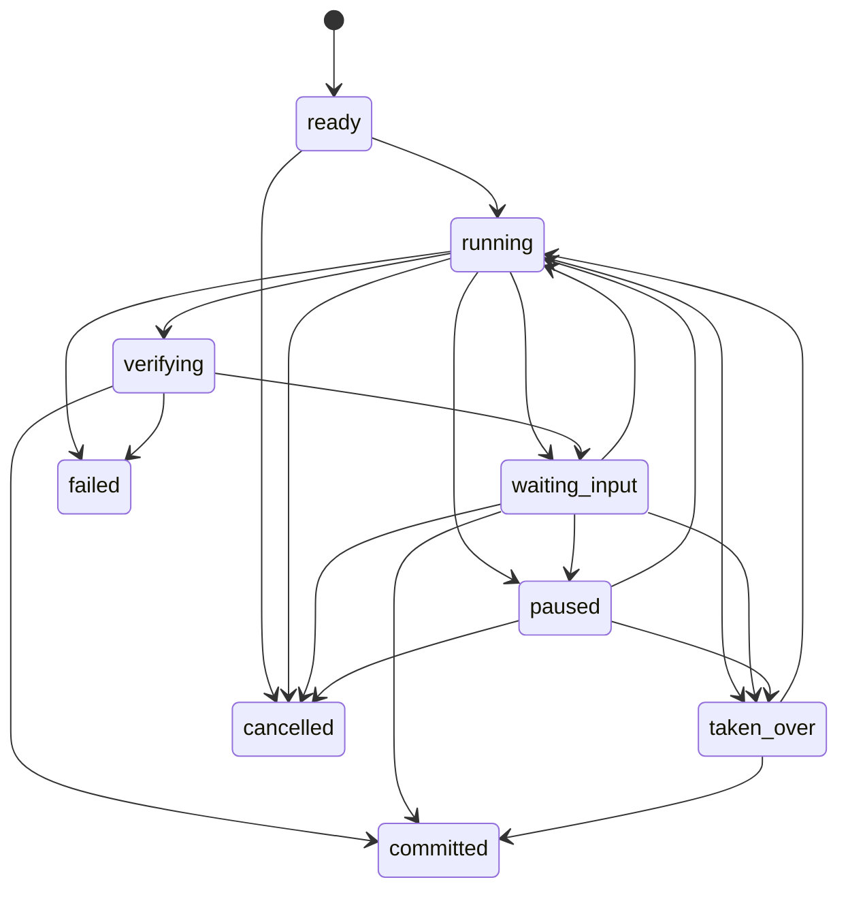
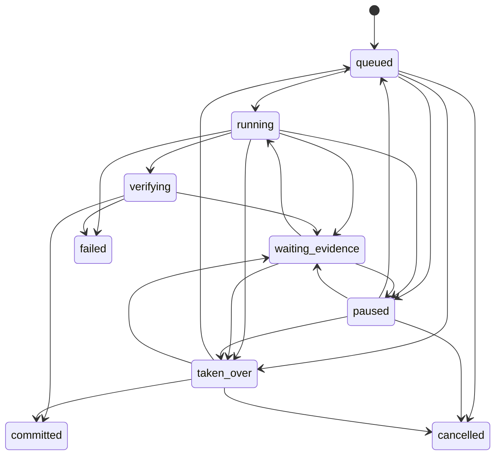

# Demo 1 Task Runtime 协议

> 状态：协议 `Ready`，交互决策 `DR-0005` 仍为 `Draft`。PR 3 已实现固定 Fixture 的 start/control、ArtifactVersion、Verifier、局部冲突与 Commit；PR 4 已验证服务端事实驱动的交付物工作区和发送前失败恢复；PR 5 已在 PostgreSQL 16.14 和三个顺序 API 进程上验证 v2/v3 恢复与幂等零重复，并验证同页前台的断线/对账状态。`DR-0007` 已验证固定 `reply_draft` 到 `email.send` 治理 Run 的单一 Artifact/Action 绑定；断线期间事件回放、响应丢失、历史轮次选择、完整异常恢复与通用 Artifact/Action 绑定尚未验收。

## 1. 权威来源与兼容规则

协议权威顺序：

1. `packages/contracts/task_models.py` 是服务端规范来源，全部模型 `extra="forbid"`。
2. `apps/web/app/task-types.ts` 是前端镜像，字段名保持 API 的 `snake_case`，不自行派生业务真值。
3. 本文解释语义、状态机和时序；行为实现后由 API、TaskService、Store、Trace 和测试共同证明。

`schema_version="1.0"` 的未知顶层字段必须拒绝，不能静默接受。协议变更必须同步 Pydantic、TypeScript、API/SSE、本文、UI 事实矩阵和测试。

### 1.1 PR 5 当前实现边界

| 能力 | 当前事实 | 尚未实现 |
| --- | --- | --- |
| Task 创建 | `TaskService` 从 `TaskContractDraft` 生成服务端 Task ID、Owner、契约、三个初始 Branch 和 `TASK_CREATED` | 契约修改与取消 |
| 固定 Runtime | `/start` 进入 v2 Observe；四次 `/advance` 分别完成 Plan、Act、Verify 和 waiting-input；`resolve_evidence` 可形成 v7 TaskCommit | 通用任务规划、后台调度和任意非 Demo 阶段恢复 |
| TaskStore | `InMemoryTaskStore` 与 `PostgresTaskStore` 已有 Snapshot、Event 和 ArtifactVersion commit 路径；PostgreSQL 16.14 下已验证两个状态、三个顺序 API 进程的恢复 | 数据库重启/中途崩溃、Outbox、迁移工具、多实例并发 |
| API | 创建、列表、读取、`POST /tasks/{id}/start`、`POST /tasks/{id}/controls`、固定客户回复的 `POST /tasks/{id}/artifacts/{version_id}/actions/email-send` 和 Task SSE | 取消、通用任务执行、人工 Artifact 编辑 API、任意工件动作路由 |
| 幂等 | 新 mutation 的 marker 保存原结果 Snapshot；内存与 PostgreSQL 跨进程回归证明旧 key 在后续 mutation 后仍返回原结果且不重复写。旧版 marker 缺原结果时仅在当前 version 未前进时兼容返回，否则 409 拒绝不安全重放 | 响应丢失浏览器闭环、数据库中途崩溃 |
| Owner scope | 列表、读取和事件均以 `X-User-Id` 过滤，跨 Owner 按不存在处理 | 生产 SSO/JWT、租户 RBAC |
| Budget / Deadline | start 和 resolve 会在 mutation 前校验预计用量与 `deadline_at`，`TaskBudgetSnapshot.exhausted` 字段存在；预计超限时当前请求不写状态 | 专门的顶层/分支耗尽状态、缩小范围/申请额度和完整恢复 UI |
| 前台 | 非 Tasks 后台摘要与 Tasks 中的 Branch/Conflict/Control/Commit、只读交付物工作区均读取服务端 Snapshot；顶部连接文案与 Task 传输状态一致；Task 面板可打开分支 head；Tasks 视图保留手工待办 tab；当前已验证客户回复可准备受控 Action | 历史轮次选择、人工编辑新版本、失败/预算完整闭环、通用 Artifact/Action 绑定 |
| 浏览器恢复 | E2E 覆盖发送前 abort、`sessionStorage` reload、同 key 重试；PR 5 system Edge 运行覆盖 API 进程停止、保留 Snapshot/禁用控制、自动重连和 v2/v3 对账 | 服务端已提交但响应丢失、断线期间 TaskEvent 回放、多实例连接迁移 |

创建后的初始事实仍是 `ready / contract`、三个 `queued` Branch、空工件/验证/冲突/控制列表、`last_commit=null` 和 `TASK_CREATED(sequence=1)`。只有固定 Demo 1 `start` 后，服务端才产生后续工件、验证、冲突和阶段事件。该调用不使用 LLM 或真实 Connector，且所有阶段在一个事务提交后才可见，不等于持续后台 Loop。

## 2. 服务端权威实体

| 实体 | 身份与版本 | 核心职责 | 客户端权限 |
| --- | --- | --- | --- |
| `TaskContract` | `task_id + contract_version` | 固定目标、来源范围、交付物、完成条件、预算和截止时间 | 客户端只提交 `TaskContractDraft`；不能指定 ID、Owner、版本、状态或时间 |
| `TaskSnapshot` | `task_id + version` | 当前任务、阶段、分支、工件、验证、冲突、控制、预算和最近 Commit 的服务端投影 | 只读；所有显示状态以它校准 |
| `BranchSnapshot` | `branch_id + version` | 保存单分支目标、状态、Artifact head、问题和最近 Commit | 只读；状态只能由服务端循环或控制事件改变 |
| `ArtifactVersion` | `artifact_id + version` | 不可变候选或已验证工件，绑定分支、来源和内容摘要 | 客户端不能覆盖旧版本；人工接管时也只能创建新版本 |
| `VerificationReport` | `report_id` | 记录来源、一致性和完成条件检查 | 只读；前端不能把 candidate 改成 verified |
| `ConflictRecord` | `conflict_id` | 记录冲突主题、候选值、来源、服务端允许的解决选项和解决结果 | 用户只能提交已暴露的解决选项；服务端写 resolved 事实 |
| `ControlEvent` | `control_event_id` | 持久记录 Steer、Pause、Resume、Take over、Return control、Resolve evidence 及实际影响回执 | 客户端提交 `TaskControlCommand`，服务端校验选项、版本、权限和幂等 |
| `TaskEvent` | `task_id + sequence` | 追加式 Trace 与 SSE 事实 | 只读；事件顺序不能由客户端指定 |
| `TaskCommit` | `commit_id + state_hash` | 把通过验证的 ArtifactVersion 和 VerificationReport 固定为完成证据 | 只读；前端收到提交事实后才可显示完成 |

## 3. 状态机

### 3.1 Task 状态



`committed`、`failed` 和 `cancelled` 是本版本终态。协议目标要求顶层状态由 Branch、Verifier、Budget 和 Control Policy 派生，客户端不能直接提交；PR 3 当前固定路径实际由 Branch/phase 派生状态，预算与截止时间是在 mutation 前拒绝，并未派生专门的顶层耗尽状态。

### 3.2 Branch 状态



分支冲突只改变受影响 Branch；其他 Branch 保持自身状态。Resume 或 Return control 遇到仍为 open 的 Conflict 时返回 `waiting_evidence`，不能绕过来源选择。只有全部必需交付物已验证、所有必需 Branch committed 且无 open conflict 时，任务才能进入 committed。

## 4. Artifact、Verify 与 Commit 不变量

以下仍是必须满足的不变量，不因类型存在或单次主路径成功而自动视为已验证：

1. `ArtifactVersion` 追加而不覆盖，`content_digest` 必须能由 canonical JSON 重新计算。
2. 新版本必须绑定当前 `branch_id`、契约中存在的 `deliverable_id` 和允许的 `source_refs`；Artifact head、VerificationReport、Conflict 和 Commit 引用必须指向同一 Task 内存在的对象。
3. candidate 工件不能作为完成证据；进入 Commit 的工件必须有 `VerificationReport.status=passed`。
4. 冲突解决会创建新 ArtifactVersion 并重新验证，不原地修改旧工件或旧报告。
5. `TaskCommit.state_hash` 必须覆盖 Task 版本、契约摘要、按 Branch/deliverable 映射的 heads、每个 head 的完整 Artifact lineage 与内容摘要、各 head 的完整 VerificationReport，以及全部 resolved Conflict 内容；只要仍有 open Conflict 就必须拒绝 Commit。
6. 视觉动画、模型回复、客户端缓存和 SSE 连接状态都不能创建 Commit。

PR 3 的内存 Store 回归已覆盖内容摘要、单 lineage、连续版本与父链、历史不可变、最新 head、Verification/Conflict/Commit 引用和最终 state hash。`state_hash` 绑定契约摘要、按 Branch/deliverable 排序的 head、完整 lineage、各 head 的完整 VerificationReport，以及全部已关闭 Conflict 内容。PR 4 工作区只读取并呈现这些事实；它不重新计算或签发 Commit。PR 5 又在 PostgreSQL 16.14 上逐字段恢复相同 v2/v3 Snapshot，并在重放后保持 `45 events / 7 artifacts / 1 TASK_COMMITTED`；它仍不证明数据库中途崩溃或迁移。

### 4.1 PR 4 交付物显示协议

1. 导航项来自 `branches[].deliverable_ids`、`branches[].artifact_heads` 和 `contract.deliverables[]`；没有 head 时只能显示“尚未生成”。
2. 当前工件及历史版本来自 `artifact_versions[]`，lineage 只沿同一 `artifact_id` 的 `parent_version_id` 追溯；前端不能合并或改写历史。
3. 工件状态与验证徽标分别来自 `ArtifactVersion.status` 和该版本最新的 `VerificationReport.status`；candidate/conflict 不得显示为完成。
4. 冲突来自同一 Branch 的 `conflicts[]`；来源与验证检查默认折叠，但仍可按需查看 `source_refs` 与 `checks[]`。
5. 最终提交只在 `last_commit` 存在时显示 task version、工件数、报告数和 `state_hash`。
6. 固定 Fixture 的结构化内容只按 `artifact.kind` 的 allowlist 投影；未知 kind/字段默认隐藏。Conflict Card 与 Artifact Workspace 复用同一 `source_ref` 投影，四个已知 Demo 1 引用必须显示为带“演示数据”前缀的业务标签；普通业务 DOM 使用序号 key，不接收原始 `fixture:` 值。其他标识 fail closed，URL、路径和凭据形态负例必须显示隐藏占位。
7. 上述规则只是前端第二道投影。服务端尚未提供通用字段可见性 Schema/display projection；allowlist 字段中的任意文本仍需服务端脱敏，不能仅凭前端过滤视为安全。
8. Tasks 视图必须保留原“工作台待办”tab；长期 Task Artifact 不能覆盖手工待办 WorkspaceArtifact。
9. Conflict、来源候选和 Task Control 只在 Tasks 工作区投影；非 Tasks 工作区只能显示当前/上一轮后台任务摘要和进入 Tasks 的客户端跳转。

## 4.2 文件驱动来源与操作冲突（DR-0014）

Demo 1 的当前资料包位于仓库 [`demo-enterprise-data/customer-a/`](../../demo-enterprise-data/customer-a/)，性质为 `project_generated_simulation`。`manifest.json` 是唯一 allowlist，逐文件声明 source ref、document ID、相对路径、业务显示名、系统标签、语义类型、记录状态、记录时间、责任角色、解析器和 SHA-256。AdventureWorks、Power BI 和 Dynamics 官方资料只提供结构与业务语义依据，不是运行时企业事实。

服务端 `DemoSourceCatalog` 必须在任何业务事实进入 Task 前检查：manifest schema、source scope、相对路径、路径穿越、符号链接、文件大小、SHA-256 和声明的结构化解析器。CSV/JSON/EML 只产生 allowlist 内的 `TaskSourceFact(field/label/value/display_value)`；文件缺失、变化、哈希不一致或解析失败时 fail closed，不能使用旧常量、LLM 猜测或部分结果推进。

`TaskSnapshot.source_documents[]` 在创建时冻结 `TaskSourceDocument(source_ref/document_id/display_name/relative_path/system_label/semantic_type/record_status/recorded_at/owner_role/content_digest/facts[])`，并在 `TASK_CREATED` 记录文档 digest。任务推进前若当前文件与冻结快照不一致，服务端拒绝继续并要求基于当前文件开始新一轮。旧 Snapshot 缺失该字段时只兼容读取，不能补造文件事实；完成提交的 state hash 应覆盖来源快照摘要或 digest。

`ConflictRecord.operation_context` 记录当前业务操作与历史/当前文件事实的关系：`operation_label/target_field/attempted_value/attempted_source_field/mismatch_reason`。例如销售预测文件的 `forecast_revenue` 不能直接写入财务关账文件定义的 `recognized_revenue`。`source_refs[]` 继续用于契约、控制和审计；普通 UI 只投影 `source_documents[]` 的安全字段，不渲染原始 ref、绝对路径、完整 digest、解析日志或任意原始文件正文。

前台文件证据卡必须由 Snapshot 事实驱动，显示文件名/相对目录、系统、记录时间、状态、字段值和当前操作 before/attempted/after 差异；提交前仍是 expected impact，提交后仍只认 ControlEvent receipt。文件失败、过期或投影缺失时显示待核验和恢复动作，不关闭冲突、不宣布完成。

## 5. 控制命令

| kind | 目标 | 必填字段 | 服务端效果 | 前台反馈 |
| --- | --- | --- | --- | --- |
| `steer` | Task 或 Branch | `instruction`、`expected_task_version`、`idempotency_key` | PR 3 只持久记录为 `accepted`；尚无后续重新规划 | 只显示“已记录，等待后续循环应用”，不得显示已生效 |
| `pause_branch` | Branch | `branch_id`、version、key | 非终态 Branch 进入 paused | 显示影响范围和最后 Commit |
| `resume_branch` | Branch | `branch_id`、version、key | paused Branch 回到 queued；有 open conflict 时回到 waiting_evidence | 服务端确认后恢复，不乐观动画 |
| `take_over` | Branch | `branch_id`、version、key | Branch 进入 taken_over | 显示控制权和 Return control；人工新 ArtifactVersion 尚未实现 |
| `return_control` | Branch | `branch_id`、version、key | taken_over Branch 回到 queued；有 open conflict 时回到 waiting_evidence | 服务端确认后更新，不声称已从人工新版本恢复 |
| `resolve_evidence` | Branch | `branch_id`、当前 Snapshot 暴露的 `resolution_option_id`、匹配的 `selected_source_ref`、version、key | 校验服务端选项后解决冲突，创建新工件与验证，并写实际 `impact_receipt` | 提交前只显示 `expected_impact`；收到 applied Snapshot 后才显示实际变化回执，不乐观关闭冲突 |

当前已有 `/controls` 路由。每个 mutation 都必须携带 `expected_task_version` 和 `idempotency_key`；版本过期返回 `409`，前端刷新最新 Snapshot，但不自动重放旧命令。相同 key 与相同命令返回幂等 marker 中保存的原 mutation Snapshot，不产生新事件、ArtifactVersion 或 Commit；相同 key 与不同命令返回 `409`。该语义已由内存回归和 PostgreSQL 16.14 跨 API 进程回归覆盖；数据库事务中途崩溃和响应丢失浏览器路径仍未验证。

`ResolutionImpact` 与 `ImpactReceipt` 是两个不同时间点的事实。前者位于 `ConflictResolutionOption.expected_impact`，只描述服务端当前选项预计产生的业务变化；后者只在 Control 已应用后写入 `ControlEvent.impact_receipt`，记录实际 `from/to task version`、新增 ArtifactVersion、VerificationReport、Commit、外部副作用和逐项变化。旧 Conflict/Control payload 缺少这些字段时分别反序列化为 `[]` 与 `null`，前端不得用静态 preview 补成 receipt。

## 6. 事件目录与 SSE

`TaskEvent.sequence` 在每个 Task 内严格单调递增。写入 Snapshot、ArtifactVersion、ControlEvent 和 TaskEvent 必须属于同一持久化事务，事务提交后才能广播 SSE。

| 事件族 | 事件 | UI 用途 |
| --- | --- | --- |
| Task | 已产生：`TASK_CREATED`、`TASK_STATUS_CHANGED`、`TASK_PHASE_CHANGED`、`TASK_COMMITTED`；目标：`TASK_RESTORED`、`TASK_FAILED` | Task Bar 与终态 |
| Loop | `LOOP_STEP_STARTED`、`LOOP_STEP_COMPLETED`、`BUDGET_UPDATED` | 阶段和预算，不等同于完成 |
| Branch | `BRANCH_STATUS_CHANGED` | 分支列表与影响范围 |
| Artifact | `ARTIFACT_VERSION_CREATED`、`VERIFICATION_RECORDED`、`CHECKPOINT_COMMITTED` | 工件版本、验证和恢复点 |
| Conflict | `CONFLICT_OPENED`、`CONFLICT_RESOLVED` | 冲突卡与重新验证 |
| Control | 已产生：`CONTROL_ACCEPTED`、分支控制的 `CONTROL_APPLIED`；目标：Steer 后续应用、`CONTROL_REJECTED` 事件化 | 用户命令状态与原因 |

当前接口：

```text
POST /v1/tasks
POST /v1/demo1/tasks
GET  /v1/tasks
GET  /v1/tasks/{task_id}
POST /v1/tasks/{task_id}/start
POST /v1/tasks/{task_id}/controls
GET  /v1/tasks/{task_id}/events?after={sequence}
```

`POST /v1/demo1/tasks` 可带 `Idempotency-Key` 表示一次独立汇报轮次。同一 Owner+key 重放必须返回已存在 Task 当前已持久化的 Snapshot，不新增 `TASK_CREATED`、不回退已发生的 mutation；这与 start/control 命令重放返回首次 mutation Snapshot 的语义不同。不同 key 必须创建独立 Task。未带 key 时使用 Owner 绑定的兼容默认键。终态 Task 不回滚、不删除。当前前端“开始新一轮汇报”使用新 round key 创建 Task，再立即以新 Task 的版本调用 start 到 v2 Observe；浏览器随后在每个服务端 Snapshot 确认后依次调用四次 `advance` 到 v6 待决策。它不是 reset/reopen 旧 Task。`GET /tasks` 会返回多轮 Snapshot，但当前前端没有历史轮次选择入口。

SSE 帧：

```text
id: 17
event: BRANCH_STATUS_CHANGED
data: {TaskEvent JSON}
```

当前 Task SSE 使用 `after` 查询参数并轮询 Store，路由不读取 `Last-Event-ID` 请求头。后台任务摘要和 Tasks 主视图收到事件或连接建立后 GET 最新 Snapshot 对账；heartbeat 和断线属于传输状态，不改变任务业务状态。PR 5 的同页 system Edge 运行实际停止并重启 API，验证断线文案、控制禁用、自动重连和 GET 对账；停机期间没有新增业务事件，因此没有验证 `after` 缺口回放。当前没有 PostgreSQL `LISTEN/NOTIFY`、消息代理或跨实例广播，多实例通知未实现和验证。

内存模式下复用同一 Store 构造新的 `TaskService` 可以恢复相同 Snapshot 和游标，但 API 进程退出会丢失全部 Task。PostgreSQL 16.14 模式已验证顺序 API 进程对 v2/v3 Snapshot、Event、ArtifactVersion 和 Commit 的恢复；这不包含 Conversation Thread/Message、数据库进程重启或多实例并发。

## 7. 身份、权限与隐藏信息

- 读取、控制和事件订阅必须验证 Task Owner；生产环境需要 SSO/JWT，V0.1 身份头仍只是 Demo 占位。
- Branch 来源读取必须落在 `TaskContract.source_scope` 和当前用户权限内。
- 副作用动作不属于 TaskControlCommand，继续调用现有 RunService 和 Tool Gateway，不能旁路 Permit。
- Action Gate 打开时前端保留后台任务摘要，并让 Gate 占用独立网格行。Tasks 决策区退出交互；Task 跳转、Control、创建/重连/立即对账均被禁用。固定客户回复路径还必须携带 `TaskArtifactBinding`，绑定 Task version、Commit、ArtifactVersion content digest 与 passed VerificationReport；RunService 在每个治理门前重校验，变化即失效。该规则只覆盖当前固定 `reply_draft -> email.send`，不能外推为通用 Artifact/Action 框架。
- 普通 UI 不展示原始 Prompt、思维链、Worker 对话、JWT/Permit、幂等键、完整工具参数、权限哈希、密钥或堆栈。

## 8. 分阶段实现状态

| 能力 | 当前状态 | 后续目标 |
| --- | --- | --- |
| Pydantic 与 TypeScript 协议 | PR 1 已实现并测试 | 随行为演进同步 |
| 场景、来源、状态机、UI 映射 | 固定 Fixture 的工程映射已有 PR 3/PR 4/PR 5 证据 | 真实场景代表性与用户价值研究 |
| Task Store / Snapshot API / SSE | mutation、多事件回放、内存路径和 PostgreSQL 顺序 API 进程恢复有自动化覆盖 | 数据库故障、SSE 缺口回放与多实例通知 |
| Observe/Plan/Act/Verify/Commit | 固定 Fixture 通过 start + 四次 advance + resolve 分阶段可观察；引用/hash/幂等由内存与 PostgreSQL Store 保护 | 通用后台 Loop、任意非 Demo 中间 checkpoint 恢复 |
| Task Artifact Workspace | PR 4 已实现只读 head/version/verification/conflict/content/source/lineage/Commit 视图，并保留手工待办 tab；DR-0007 已实现已验证客户回复到治理 Run 的窄绑定 | 人工编辑新版本、其他 Artifact/Action 绑定、通用工件类型 |
| Task Artifact Action Bridge | `committed + Commit 引用 + passed report + reply_draft` 才可准备动作；创建 key 幂等，绑定在证据/审批/授权/执行前重校验；拒绝/失败不修改 Task | 跨进程 Run 创建幂等、真实联系人/附件、通用 capability 映射、真实 Connector |
| Task UI 与恢复 | PR 4 E2E 覆盖主路径和发送前 abort；PR 5 运行覆盖 API 进程断开、禁用、自动重连与 v2/v3 对账 | 已提交但响应丢失、断线期间事件回放与更多异常路径 |
| 来源与多轮前台语义 | 非 Tasks 摘要、带“演示数据”的来源标签、原始 ID 不入普通业务 DOM，以及独立新 Task 的 create+start 已有浏览器工程证据 | 历史轮次选择与至少 5 人无引导理解测试 |
| Adaptive Swarm / 真实 Connector | 非本决策范围 | 需独立 Admission 和来源证据 |

## 9. 当前渐进阶段补充（2026-08-17）

本节覆盖旧版“start 一次产生阶段 Trace”的表述，作为当前 Demo 1 协议：

| mutation | 预期 Snapshot |
| --- | --- |
| create | v1 `ready / contract`，`stage_records=[]` |
| start | v2 `running / observe` |
| advance 1 | v3 `running / plan` |
| advance 2 | v4 `running / act` |
| advance 3 | v5 `verifying / verify` |
| advance 4 | v6 `waiting_input / verify`，5 ArtifactVersion、1 open Conflict、2 passed VerificationReport |
| resolve evidence | v7 `committed / commit`，最终 `TaskCommit` |

每个阶段记录持久化 `stage`、`status`、用户摘要、受限详情、`artifact_ids`、`generation_source` 和时间戳；缺少该字段的旧 Snapshot 反序列化为默认空数组。`start`、`advance` 和 `resolve_evidence` 均要求 `expected_task_version + idempotency_key`，成功只增加一个 version；同 key 重放首次响应，旧 version 返回 409。

Plan/Act 的请求和响应由 `TaskStagePlanRequest/TaskStagePlan` 与 `TaskStageActRequest/TaskStageAct` 严格校验，适配器当前配置 `deepseek-v4-pro`；只有与服务端批准模板逐字段一致的面向用户文字才保留 `generation_source=model`，否则显式 `template_fallback`。因此模型不能把思维链、内部 ID、来源引用、状态或新事实写入阶段记录，也不能决定身份、来源、冲突、验证、预算或 Commit；Observe/Verify/Commit 是确定性逻辑。固定渐进路径还要求完整 Demo 契约匹配，包括预算与截止时间。模型调用在 CAS 前执行，CAS 冲突时结果丢弃。预算是 steps/tool calls/runtime，不是 token cost。浏览器负责下一阶段协调，关闭浏览器不触发后台运行；同进程同 key 有锁，跨实例无分布式 LLM lease。

## 10. Demo 1 处理来源投影（DR-0013）

Task Runtime 不新增通用 `call_trace` 协议。前端直接读取 `TaskStageRecord.processing` 的 `path/model_called/model/elapsed_ms/output_used`，并结合阶段 `status`、`generation_source` 和时间戳显示业务处理来源。阶段完成的通用状态为“已运行”；只有 `model_called=true` 显示“模型已调用”，`path=language_model` 且 `output_used=model` 才表示模型输出被采用；模型调用但输出被模板接管时显示回退；确定性阶段显示“已运行 · 未调用大模型”。

兼容旧数据时，v>1 Snapshot 没有 `stage_records`，或旧 Plan/Act 记录缺少 `processing`，前端必须显示“模型调用待核对”，不能推断为未调用。`TaskStageProcessing` 的跨字段 validator 拒绝确定性路径携带模型调用/模型输出，也拒绝语言模型路径缺少观测调用或模型名。当前真实模型路径仅以服务端记录的本次处理事实为准；日志只保留 stage、model_called、accepted_model_output、model、elapsed_ms、origin 等元数据，不把 Prompt、正文或 Key 暴露到普通 UI。
