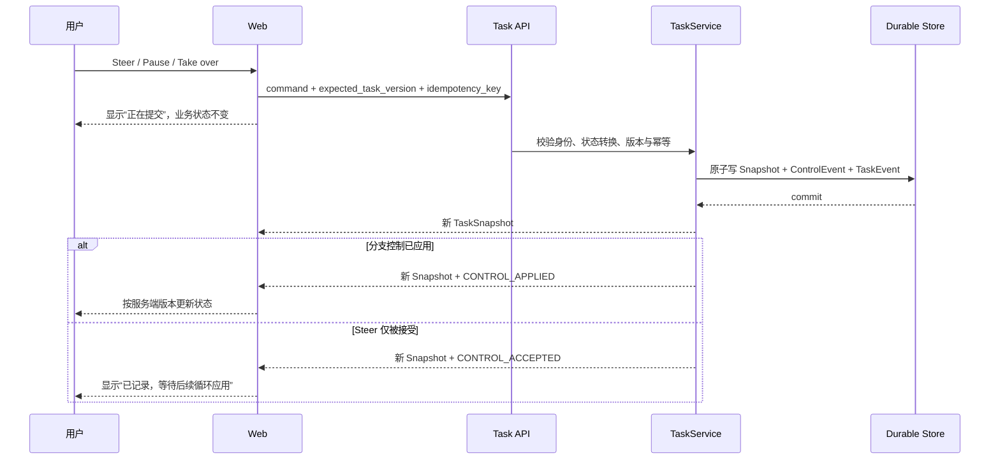

# UI—服务端事实矩阵（Demo 1、Demo 2 与报价工作区）

> 状态：Demo 1 与报价协议映射 `Ready`，文件驱动来源决策 `DR-0014` 在仓库仿真文件、来源快照、冲突投影和被测桌面/移动路径内为限定范围 `Verified`；交互决策 `DR-0005` 为 `Draft`，Agent 影响预演决策 `DR-0010` 在固定 Demo 1 的限定工程范围内为 `Verified`；报价核算决策 `DR-0006` 在固定演示报价、当前公式、revision 协议和被测恢复路径内为 `Verified`；`DR-0007` 在固定客户回复草稿到治理 Run 的单一纵切内为 `Verified`；Demo 2 `DR-0008` 的 Admission/路由和 `DR-0011` 的影响预演/回执为限定范围 `Verified`，`DR-0015` 的固定客户 A、单 API 进程 memory、真实模型受控内部执行为 `Limited Verified`；Demo 3 `DR-0012` 在固定客户 A `reply_draft → email.send`、四个治理场景和被测桌面/移动路径内为限定范围 `Verified`；Demo 身份导航与调用轨迹证据层 `DR-0013` 在固定 Demo 1/2/3 前台投影范围内为 `Verified`。`DR-0016` 的 FORTE 导入审计在固定 commit/MIT/原字节范围 Verified，统一 Harness 工作现场与 `ready_to_execute` 规划纵切在固定三场景、真实模型、单 API 进程 memory 和被测桌面/移动路径内为 `Limited Verified`；三 Demo 执行迁移仍为 Draft。自动化只能验证工程投影与调用语义，不能代替真实用户理解、真实 Connector、通用 Adaptive Swarm、生产报价规则、后台无人值守、跨进程恢复或多实例一致性验证。

## 1. 组件映射

| UI 状态或组件 | 用户含义 | 服务端权威字段 | Snapshot / SSE | 允许动作 | 失败与恢复 | 默认隐藏 |
| --- | --- | --- | --- | --- | --- | --- |
| 固定 Demo 1 空态（当前交互 Draft） | 尚无 Task 时，本轮将准备客户 A 的经营分析、风险页和回复草稿 | 客户端复制固定 `/v1/demo1/tasks` 创建模板；创建后必须与返回的 `contract.title/objective/deliverables` 一致 | 初始 `GET /tasks` 确认无 Task 后才显示；加载中只显示读取态 | 一次“开始准备汇报”依次调用 create 与 start | 初始列表慢时不显示创建动作；create 成功/start 未知时进入既有 pending 对账 | 不把客户端模板副本冒充 Snapshot；通用模板描述接口尚未实现 |
| 非 Tasks 工作区的后台任务摘要（当前交互 Draft） | 用户编辑邮件、文档等工作区时，只需要知道是否有当前/上一轮经营汇报以及是否需要前往处理 | `TaskSnapshot.contract.title/objective/status/phase`；`taskSyncState/taskTransportState` 是客户端事实 | 初始列表、mutation 响应；Task SSE 只触发完整 Snapshot 对账 | “打开任务 / 前往处理 / 查看任务 / 查看汇报”只切换到 Tasks；“前往处理”进入 Tasks 后聚焦待确认标题；断线时可重新连接或立即对账 | 保留最后确认 Snapshot；`task=null` 时按 loading、connecting、reconnecting、synced 分别表达读取、连接、恢复和确认无任务，只有 synced 可显示可开始事实；跳转不产生 TaskEvent | Conflict 候选、来源、分支控制、Task ID、预算、版本和 Runtime 明细 |
| 任务简报、主要下一步与摘要（当前工程代理已通过） | 当前要准备的三项结果、材料核对数、业务状态、同步状态和一个状态推进主动作 | `TaskSnapshot.status/phase/contract.title/contract.objective/contract.deliverables/branches/conflicts/last_commit`；`taskSyncState/taskTransportState` 是客户端事实 | 初始列表、创建/mutation 响应；Task SSE 触发 `GET /tasks/{id}` 对账 | Ready 开始；Conflict 的弱化入口定位到待确认项；Committed 查看成果；刷新为次要动作 | 未同步时禁用控制并可立即对账；同步版本只表达对账结果，budget/owner/internal step 不进入业务摘要 | Prompt、内部调度、实际幂等键、完整 Task JSON、网络栈、数据库类型与内部重试日志 |
| 三份材料的当前状态（当前工程代理已通过） | 每份材料的当前内容、核对/冲突和是否纳入本轮成果 | `contract.deliverables[]`、`branches[].status/artifact_heads`、`artifact_versions[]`、`verification_reports[]`、`conflicts[]`、`last_commit` | Snapshot、`BRANCH_STATUS_CHANGED`、工件/验证/冲突/Commit 事件后 GET 对账 | 有 head 时打开成果；具体控制在待确认区 | 单分支错误只影响对应材料；没有 head/report/Commit 时明确等待，不用颜色补造进度 | Branch version、Worker 对话、内部计划文本、完整 Trace payload |
| 待确认项（当前工程代理已通过） | `waiting_input` 中的 open Conflict、为什么必须由人决定、候选依据和服务端允许的解决选项 | `status`、`conflicts[].status/subject/summary/source_refs/candidate_values/operation_context/resolution_options[]`、Branch/head/report、`TaskSnapshot.version` | Snapshot、`CONFLICT_OPENED/RESOLVED`、`CONTROL_ACCEPTED/APPLIED` | 只在 Tasks 工作区开放；查看两份文件证据；唯一状态推进动作提交服务端 `resolution_option_id` 和固定 CRM 正式来源；查看材料；次级补证、Pause、Take over；可切 Agent | 只有 `waiting_input` 投影可操作卡；文件缺失/哈希变化/解析失败时待核验并要求新一轮；选项缺失/不可执行时禁用；resolved 后记录变为已解决；请求失败先对账 | 非 Tasks 工作区不渲染本组件；普通业务 DOM 不接收原始 `source_ref`、绝对路径、完整 digest、未授权来源正文或检索日志；未知来源使用隐藏占位 |
| 文件证据卡（`DR-0014`，限定范围 Verified） | 用户能看到仓库演示文件、记录时间、字段值，以及当前操作与历史事实的差异 | `TaskSnapshot.source_documents[].display_name/relative_path/system_label/semantic_type/record_status/recorded_at/owner_role/content_digest/facts[]`；`ConflictRecord.operation_context` | 创建时由 `TASK_CREATED` 冻结；随完整 Snapshot 到达，不单独广播原始文件内容 | 展开文件证据、查看工件、接受服务端 option；不能编辑来源事实 | 文件/manifest/hash/解析器失败时 fail closed，保留旧 Snapshot，显示待核验/开始新一轮；证据缺失不显示完成 | `fixture:`、绝对本机路径、完整 hash、解析日志、Prompt/CoT、任意原始文件正文 |
| Agent 影响预演与变化回执（DR-0010） | 提交前看见这次决定会改变、重新核对、保留和不会触发什么；提交后看见实际落地结果 | 预演：`ConflictRecord.resolution_options[].expected_impact.changes`；回执：`ControlEvent.impact_receipt` 的 version/artifact/report/commit/external_side_effect/changes | 预演随 v6 Snapshot；回执随 applied ControlEvent 所在的新 Snapshot，SSE 后仍以 GET 对账 | 选择服务端允许的 option；应用后查看成果或进入独立 Action Gate | 409 保留旧事实并重新读取；结果未知按幂等键对账；旧 Snapshot 无字段时不显示结构化回执；仍有其他冲突时 receipt 为 partial 且不生成 Commit | 原始 option/source ID、Artifact/Report/Commit 内部 ID、完整 hash、模型过程；不能把 expected impact 显示为实际结果 |
| 来源依据投影（当前交互 Draft） | 用户知道这些是项目演示数据，并能读懂文件、系统、记录时间、业务字段和版本 | 服务端 `source_refs[]` 原值仅作控制/审计；文件显示使用 `TaskSnapshot.source_documents[]` 的安全业务字段 | 随包含 Conflict 或 Artifact 的完整 Snapshot 到达，不单独产生事件 | 展开“查看演示文件证据”；真实控制仍提交协议要求的原始来源值 | 已知文件显示项目演示数据、文件名/相对目录和业务元数据；未知值显示“内部标识已隐藏”；文件不一致时待核验 | 原始 `fixture:` / `source:`、绝对路径 / URL / 完整 digest / 凭据形态不进入普通业务 DOM；序号 DOM key 不复用原始值 |
| 本轮成果（当前工程代理已通过） | 服务端确认的三项成果、验证状态以及客户回复仍为草稿、未发送 | 终态 `status`、`last_commit.artifact_version_ids`、`artifact_versions[]`、`verification_reports[]` | resolved mutation / Task SSE 后的 Snapshot | 打开经营分析、风险页、客户回复草稿；查看折叠审计证据 | 缺少终态、Commit 或工件时不得显示完成；成果按契约顺序排列 | state hash、版本与事件等审计细节默认折叠；不暗示真实外部发送 |
| 已核对客户回复的受控动作（DR-0007 限定范围 Verified） | 用户把已完成成果准备成外发动作，并在发送前理解对象、风险与后果 | `TaskSnapshot.status/last_commit`、目标 `ArtifactVersion`、passed `VerificationReport`；`ProposedActionSpec.task_artifact_binding`、`RunSnapshot.risk/control_plan/status` | `POST /tasks/{task_id}/artifacts/{artifact_version_id}/actions/email-send` 返回 Run；后续审批/授权 REST 与 Run 审计 SSE | 在当前已验证回复上“准备发送”；Gate 中批准、拒绝、确认执行；查看最终 Simulator 结果 | 准备不等于发送；历史/未验证工件禁用；绑定事实在每个治理门前重校验，变化则 Action 失效；拒绝/失败不回滚 Task；结果未知时同 key 对账 | 原始内容摘要、Commit state hash、Permit、策略内部秘密；业务界面只显示成果版本和演示目标，不暗示真实邮件已发出 |
| 开始新一轮汇报（当前交互 Draft） | 开始另一轮独立经营汇报，不是重置当前 Task，也不是把它改回可启动状态 | 新 round key 的 `POST /v1/demo1/tasks` 返回新 Task ID 和 `ready / contract` Snapshot；随后新 Task 的 `POST /start` 返回其后续 Snapshot | 两个 mutation 响应；随后 Task SSE/GET 对账 | 终态时一次点击创建并启动；同轮重试复用 key | create 成功/start 未知时按 pending mutation 对账；旧 Task、Artifact、Event、Commit 不修改 | round key、旧 Task 内部标识；不暗示旧轮次已删除或已有历史轮次选择器 |
| Task Artifact Workspace（PR 4 已实现，PR 6 已验证历史防误读） | 当前 Branch head、版本、验证、冲突、结构化内容、来源、lineage 与 Commit，以及是否主动固定查看历史版本 | `contract.deliverables[]`、`branches[].artifact_heads/status`、`artifact_versions[]`、`verification_reports[]`、`conflicts[]`、`last_commit`；`follow_head/pinned_history` 是客户端选择事实 | mutation 响应；Task SSE 后的完整 Snapshot 对账 | 从泳道打开 head、选择分支/版本、返回当前版本、按需展开来源与验证检查 | 默认 mutation 后跟随新 head；主动选择非 head 时显示历史 banner 与当前 head；candidate/conflict 不显示完成；当前只读 | 按 `artifact.kind` allowlist 投影；未知 kind/字段默认隐藏；非安全或疑似敏感 `source_ref` 显示隐藏占位 |
| Tasks“执行记录”（保留） | 原工作台待办仍可按状态分栏查看和编辑 | `WorkspaceArtifact(kind=tasks)` | Workspace API 与 Conversation SSE | 在“进度 / 成果 / 执行记录”间切换；修改优先级、状态和内容并保存 | Task Snapshot 不覆盖手工待办内容；状态变化仅重排本地看板，保存后才更新 WorkspaceArtifact | 两套数据模型的内部 ID 与调度细节 |
| Task Control（PR 3 部分实现） | 用户能否记录方向指令、暂停或接管固定分支 | `TaskSnapshot.version`、`controls[]`、Branch status、服务端允许转换 | `CONTROL_ACCEPTED`；分支控制另有 `CONTROL_APPLIED` | Steer、Pause branch、Resume、Take over、Return control | pending mutation 将原 key、intent 和预期版本写入当前标签页 `sessionStorage` 并冻结新控制；offline/reconnecting 时可同 key 对账，重放确认后再 GET 最新 Snapshot；`409` 后刷新并提示复核 | idempotency key、权限哈希 |
| Tasks 中的待我决定 / Agent 对话模式 | 用户是在处理当前 Task 阻塞，还是继续通用 Agent 对话 | 客户端右侧模式；Conversation Thread/Message 与 Action Gate 仍走既有事实链 | 模式切换无 Task API/SSE；Agent 模式继续使用 Conversation/Run SSE | 只在 Tasks 工作区切换待我决定与 Agent 对话；切换不重建 Conversation | 离开 Tasks 后卸下决定面板，仅保留后台任务摘要；Action Gate 继续使用原 tray | 非 Tasks 工作区不复刻 Conflict/Control；Conversation 内部 Prompt、CoT、Permit token、工具秘密 |
| Stream Health Badge（已并入 Task Bar） | 浏览器是否能读取并对账服务端 Snapshot | 客户端 `taskSequenceRef/taskSyncState/taskTransportState`，不属于业务状态 | EventSource open/error、新 TaskEvent、对账 GET | offline 可手动重新连接，reconnecting/pending 可立即对账；未同步时禁止 Task Control | 自动重连；Snapshot 对 `version/last_event_sequence` 与已观察 SSE floor 单调应用；旧 GET 被拒绝，未覆盖 floor 时保持 `reconnecting`；PR 5 已实测进程重启，PR 6 已测两项乱序 | 网络栈、数据库类型和内部重试日志 |
| Verified Commit Summary（已实现） | 服务端是否已生成最近 Commit | `last_commit.summary/committed_at/task_version/state_hash/artifact_version_ids/verification_report_ids` | Snapshot、`CHECKPOINT_COMMITTED`、`TASK_COMMITTED` | 查看摘要、提交版本、工件/报告数量与 state hash | 没有服务端 Commit 时不得出现完成；引用/hash 有内存回归，PostgreSQL 16.14 已验证 v3 Commit 跨进程恢复 | 原始 Trace payload、签名和密钥 |
| Task Error Banner（部分实现） | mutation 是否被拒绝、过期或结果待确认 | HTTP 状态、重新 GET 的 Snapshot version；`last_error` 完整路径尚未实现 | mutation 响应与 Snapshot 对账 | 复核后重新提交 | `5xx` 只显示结果待确认；不凭客户端异常宣告失败 | 堆栈、内部服务地址、敏感参数 |
| Action Gate Tray | 某个副作用动作是否可执行 | `RunSnapshot.risk/control_plan/permit/tool_result/thread_id`；注册 capability 的 Action 由当前 WorkspaceArtifact 内容与 revision 确定性重建；DR-0007 的固定路径另携带 `task_artifact_binding` | Conversation `action.proposed`、Task 工件准备动作响应、Run API/SSE、绑定 Thread 的 continue stream | 补证据、审批、Authorize；结果未确认送达时重新读取 | 模型参数/source_refs 不直接执行，内容不匹配或 Artifact 竞态时不创建动作；Task 绑定变化时失效；未解析纯文本收件人/附件类别固定 deny且自报 evidence 不能解锁；跨 Thread continue 拒绝；完成说明单进程重放同一消息 | Permit token、策略内部秘密、模型伪造 payload/source、Task 内容摘要与内部重放缓存 |

### 1.2 Demo 2 智能工作驾驶舱（DR-0008/0011 Verified；DR-0015 Limited Verified）

以下字段和页面已在固定演示纵切中实现。服务端当前仅使用 memory；固定队列和路由选择不等于执行，固定客户 A 的执行也不等于后台/跨进程 Runtime 或外部动作。

| UI 状态或组件 | 用户含义 | 服务端权威字段 | Snapshot / SSE | 允许动作 | 失败与恢复 | 默认隐藏 |
| --- | --- | --- | --- | --- | --- | --- |
| 驾驶舱固定队列 | 四项统一工作来自当前 Owner 的固定演示 Snapshot；顺序由服务端给出 | `WorkCockpitSnapshot.owner_id/backend/version/last_event_sequence/items[]`；每项 `facts` | `GET /demo2/cockpit`；执行 SSE 与驾驶舱读取分离 | 查看工作卡、演示来源、业务条件和固定队列位置 | GET 未返回前只显示读取态；失败保留已有 Snapshot并提供重新读取 | 原始 Prompt、检索日志、原始 `fixture:` ID、内部来源路径 |
| 路由解释 | 用户知道每项任务为什么进入某种处理方式 | `items[].recommendation/allowed_modes/route_profiles` | 同一 Snapshot；路由解释不由前端自算 | 展开路由理由和允许模式 | 字段缺失或版本过期时显示待核对，不补造推荐 | 模型思维链、策略内部权重、Worker 对话 |
| 路由影响预演 | 用户在确认前知道所选方式将如何改变工作分配、并行/等待和人工介入，以及什么不会发生 | `items[].route_profiles[].impact_preview.summary/changes/execution_status_before/execution_status_after/external_side_effect` | 随 `WorkCockpitSnapshot` 返回；右侧 `draftMode` 只选择要投影的服务端 profile | 切换允许模式并比较影响；确认前不提交 mutation | preview 缺失时显示不可预演并禁用确认；不得用前端常量补造 | 内部调度图、Worker 对话、策略权重、真实成本和时延 |
| 三项简单任务固定路由 | 报销异常、供应商邮件、周报分别使用 Tool Call、Single Agent、Fixed Workflow 的固定演示选择 | 对应 `items[].recommendation`、`selected_mode`、`selection_source=admission`、`execution_status=not_started` | 同一 Cockpit Snapshot | 查看规则选择；单一允许模式的 radio 禁用且没有确认按钮 | 读取失败后重新 GET；不创建 Worker | 真实工具调用、模型调用、成本账单、时延日志 |
| 客户 A 待决定 | 复杂任务尚未自动启动；用户需要在允许模式中作出本次选择 | `items[].allowed_modes=[single_agent,fixed_workflow,adaptive_swarm]`、`selected_mode`、`selection_source`、`override_scope`、`version`；响应另含 `cockpit_version/cockpit_last_event_sequence` | `POST /demo2/work-items/{id}/route` 返回 `RouteSelectionResult` | 接受推荐、选择其他允许模式、暂不选择；范围固定为 `this_run` | 只应用服务端返回的聚合版本；`expected_version` 冲突保留本地意图并 GET 最新 Snapshot；未知结果先 GET 对账 | 内部 Admission 打分过程、底层调度图、实际幂等键 |
| 路由选择回执 | 用户确认服务端记录了哪种工作方式、由谁选择、影响了什么，并知道任务仍未执行 | `items[].selection_receipt` 的版本前后、`selected_mode/selection_source/override_scope/forecast/changes/execution_status_before/execution_status_after/external_side_effect` | 路由 mutation 返回的 `RouteSelectionResult.item`；同进程后续 GET | 查看业务变化与折叠的版本审计 | 409 不显示回执；刷新只有读回同一 receipt 才恢复；memory 重启会丢失 | receipt ID、内部事件序号、幂等键、真实 Worker/Connector 日志 |
| Adaptive Swarm 推荐/本次选择 | 用户选择了复杂协作方式，但尚未开始执行；可显式启动 | `items[].selected_mode=adaptive_swarm`、`selection_source`、`override_scope`、`execution_status=not_started` | 选择 mutation 返回 `RouteSelectionResult.item`；启动是独立 POST | 查看依据、改选，或提交启动命令 | 不允许模式/过期版本返回 409；错误不能改写为已启动 | 启动前不展示“运行中/已完成”、实际成本或外部动作 |
| 受控执行状态 | 用户知道整轮协作处于当前 Runtime 可达的 queued/running/verifying/completed/failed，并看到工作单元、共享工件和模型调用事实；`verifying` 不属于 Worker | `Demo2ExecutionSnapshot.status`；协议虽含 Execution `cancelled`，当前无取消路由/转换；`workers[].status` 仅为 queued/running/completed/failed/cancelled；另有 `processing/artifacts/events/receipt` | execution GET、events replay、SSE；sequence 单调；当前无 Demo 2 `waiting_input` | 启动、查看业务工作单元/工件/来源、断线后重读；Execution cancel 为 Draft | 响应未知或事件缺口时 GET 对账；memory 重启不恢复 | Prompt、CoT、Worker 对话、原始响应、内部来源 ID、底层日志 |
| 动态增派 | 用户知道为什么新增收入口径核验，而不是只看到 Worker 数变化 | `SwarmEvent.message/details` 与新增 `Demo2WorkerSpec.trigger=dynamic_replan` | seq 9 `DYNAMIC_REPLAN`、seq 10 `WORKER_ADDED` | 只读查看原因与依赖 | 缺事件时不由前端补造；当前不可手动接受/拒绝任意调度 | 策略权重、内部评分、模型推理、任意调度主张 |
| 内部完成回执 | 用户知道 4 个 Worker/5 个 Artifact 已收敛，且外部动作没有发生 | `ExecutionReceipt.status/worker_ids/artifact_version_ids/final_artifact_version_id/external_side_effect/summary` | seq 15 `EXECUTION_COMPLETED` 后完整 Snapshot | 查看共享汇报工件包；另行进入 Demo 3 | 无 receipt 不显示成功；当前 failed 不冒充完成；cancelled 仅为协议兼容、无当前 Execution 路径 | 真实 Connector 写入、供应商账单、未测量质量/效率 |
| 演示策略成本/时效预测 | 用户看到的是固定规则给出的工具调用上限、预计秒数和并行上限，不是实测结果 | `items[].route_profiles[].forecast.source_type=fixture_policy_forecast`、`estimated_tool_calls/estimated_runtime_seconds/max_workers` | 随 WorkCockpitSnapshot 返回 | 查看预测与选择代价 | Schema 缺失时页面不能补数字 | 供应商账单、模型 Token 计费、真实 SLA、未经测量的节省比例 |
| 驾驶舱读取与恢复边界 | 浏览器是否读到了当前进程的最新 Cockpit/Execution Snapshot | 客户端 loading/error + 服务端 owner/version/sequence/execution_id | 初始/手动 GET、mutation 后 GET、execution SSE 后 GET 对账 | 重新读取、冲突后复核并重试 | 保留最后确认 Snapshot；memory API 重启会丢选择和执行，不宣称跨进程恢复 | 网络栈、数据库 DSN、内部重试日志 |

本节所有行均限定在单 API 进程固定演示纵切。它覆盖固定队列、路由解释、客户 A 本次模式选择，以及受控模型 Worker、固定事实冲突增派、SharedArtifactVersion、验证和无外部副作用回执；拖拽调序、长期偏好、任意动态调度、人工冲突处理、真实 Connector、成本/质量效果和跨进程恢复仍待后续证据。

### 1.3 Demo 3 动作影响账本（DR-0012，Verified 限定范围）

以下字段是 Demo 3 Action Gate 的服务端协议。`impact_preview` 与 `execution_receipt` 均由服务端生成；前端只翻译业务标签，不自行推断动作影响。当前 Verified 仅限固定客户 A `reply_draft → email.send`、四个治理场景和被测桌面/移动路径。

| UI 状态或组件 | 用户含义 | 服务端权威字段 | Snapshot / SSE | 允许动作 | 失败与恢复 | 默认隐藏 |
| --- | --- | --- | --- | --- | --- | --- |
| 动作影响预演 | 提交前知道会改变、重新核对、保持不变和不会发生什么 | `RunSnapshot.impact_preview.items[]`；基于 `ProposedActionSpec`、`RiskAssessment`、`PolicyEffect`、`EvidenceRecord`、`ControlPlan` 生成 | `RUN_CREATED` 的 RunSnapshot；后续治理状态更新重新返回完整 Snapshot | 查看目标、范围、治理门槛和未执行边界 | 缺 preview 时禁用确认；旧 action/hash 时标记待重新准备；未知结果读取 RunSnapshot 对账 | Prompt、CoT、Worker、原始 source_refs、完整参数、内部权重 |
| ImpactItem | 一条可读业务影响 | `ImpactItem.item_id/change_kind/label/before/after`；固定 `target-change→will_change`、`binding-recheck→will_recheck`、`task-preserved→unchanged`、`real-connector-not-called→no_external_action` | 随 `impact_preview.items[]` 或 `execution_receipt.items[]` 返回 | 只读查看；不得编辑 `after` | 字段缺失或枚举非法时整组账本降级为待核对，不补静态文字 | action_id、run_id、trace_id、哈希、Permit |
| 治理过程账本 | 用户知道补证、审批和授权是否已记录，但不把治理记录说成业务执行 | `EvidenceRecord`、`ApprovalRecord`、`ControlPlan.status`、`PermitMetadata`、`AuditEvent` | `EVIDENCE_SUBMITTED`、`CONTROL_PLAN_UPDATED`、`APPROVAL_RECORDED`、`PERMIT_ISSUED` | 提交依据、批准/拒绝、确认执行 | 409/401/403/未知结果均保留最后确认 Snapshot；不自动重放业务含义 | Permit token、审批内部 ID、策略内部 ID、网络/重试日志 |
| 执行回执 | 用户知道服务端记录了什么实际终态 | `RunSnapshot.execution_receipt.items[]`、`ActionExecutionReceipt.status`、`ToolExecutionResult`、`RunSnapshot.status` | `TOOL_EXECUTED`、`ACTION_INVALIDATED`、`TAMPER_BLOCKED`、`action.closed` 后 GET 对账 | 查看模拟器结果、重新读取结果；新意图使用新幂等键 | 拒绝、失效、篡改、失败不得回滚 Task Commit；结果未知不得声称成功或失败 | Simulator 原始 payload、Permit、完整 audit payload |
| 普通业务审计工作台 | 用户查看动作进展和结果，但不需要理解内部事件协议 | 服务端 `AuditEvent` 经业务 display projection；摘要来自 RunSnapshot、ImpactItem、ToolExecutionResult 状态 | Run SSE/Trace API 后由前端按服务端摘要对账 | 查看业务标签、状态、时间和结果边界；可显示“Permit Service”等业务级状态 | 缺摘要时显示待核对，不回退渲染 raw event；技术审计另行受控访问 | raw `event_type`、`payload`、`trace`、`email_simulator`、`email.send`、`PERMIT_ISSUED`、Permit token/内容/permit_id/签名 |
| 任务成果保持不变 | 已提交 Task、ArtifactVersion、VerificationReport 不被派生动作改写 | `TaskArtifactBinding`、`TaskSnapshot.last_commit`、绑定校验结果 | Run 事件；Task Snapshot 不因拒绝/失败改变 | 返回成果或重新准备新动作 | 绑定变化使旧 Action 失效；重新准备必须产生新的 action/hash/key | state hash、content digest、内部 Artifact ID |

本节的四类影响固定为“会改变 / 会重新核对 / 保持不变 / 不会发生”。工程验证为 Python `151 passed, 1 skipped in 3.69s`、完整浏览器 `37 passed (2.2m)`，Ruff、governance、lint、build 通过；视觉终验无 P0/P1，截图及 hash 见 Demo 3 Evidence。五个 Simulator capability 的通用影响预测、真实 Connector、生产身份、跨进程执行幂等/Permit replay、多实例/数据库恢复和用户理解均不在 Verified 范围。

### 1.4 Demo 身份导航与调用轨迹（DR-0013，Verified 限定范围）

本节记录已经实现的前台事实投影。用户先看见当前 Demo 1/2/3 的业务身份和目标，再看到“已运行 / 未调用 / 未执行 / 待核对”的统一语义，只有模型事实显示“模型已调用”；没有服务端事实时不得由前端补造。统一的是显示语义，不新增通用 `call_trace[]`。

| UI 状态或组件 | 用户含义 | 服务端权威字段（Draft） | Snapshot / SSE | 允许动作 | 失败与恢复 | 默认隐藏 |
| --- | --- | --- | --- | --- | --- | --- |
| Demo 身份导航 | 当前正在看 Demo 1、2 还是 3，以及它要证明的业务问题 | 产品级客户端信息架构提供 Demo 名称/目标；当前状态副标题来自 Task/WorkCockpit/Run scope | 路由/页面初始化与完整 Snapshot 对账 | 切换 Demo 视图；不得重置 Task、Run、Artifact、Event 或 Conversation | 状态事实缺失时显示待核对；Demo 名称本身不是服务端 descriptor | Prompt、内部路由、Task/Run/Artifact 内部 ID |
| 调用轨迹 | 用户知道哪个业务阶段真实调用了什么 | Demo 1：`TaskStageRecord.processing`；Demo 2：`RouteSelectionReceipt.processing` 与 `Demo2WorkerSpec.processing/events/receipt`；Demo 3：`RunSnapshot.status/control_plan/evidence/approvals/permit/tool_result` 与 `impact_preview/execution_receipt` | 对应 Task Snapshot、WorkCockpit/Execution Snapshot/SSE、Run Snapshot/SSE | 通用完成状态显示“已运行”；模型字段显示“模型已调用”；Demo3 使用“执行许可服务”“受控演示工具”等业务词，Permit/Gateway/Simulator 仅为二级技术元信息 | 事件缺口、响应丢失或跨进程未知时显示待核对并重新读取；unknown 工具结果显示“工具结果待核对” | raw event_type、payload、trace、密钥、Permit token/内容/permit_id/签名、Worker 对话 |
| 调用来源标签 | 区分确定性处理、策略规则、语言模型、路由记录、治理 Run 和受控演示工具 | 现有 `processing.path/model_called/output_used`，或 RunSnapshot 治理字段；不新增 `source_kind`/`call_trace` 协议 | 与对应 Snapshot/有序事件绑定 | 查看“已运行 / 未调用 / 未执行 / 待核对”；仅模型事实显示“模型已调用” | 缺来源时不显示“已运行”；unknown 不转成成功 | Prompt、CoT、供应商原始响应、内部模型参数 |
| 未执行边界 | 用户知道 selected 不等于 running，内部 completed 不等于真实外部写入 | `WorkItemSnapshot.execution_status`、`Demo2ExecutionSnapshot.receipt.external_side_effect`、`RunSnapshot.status/tool_result` | WorkCockpit/Execution Snapshot、Demo 2/3 SSE | 重新读取或进入受控技术审计 | unknown 结果显示“工具结果待核对”；结果未知不自动重试副作用 | `email.send`、`email_simulator`、`PERMIT_ISSUED`、Permit token/内容/permit_id/签名等技术原值 |

本节为 `DR-0013` Verified 限定范围；全量 Python `154 passed, 1 skipped in 4.32s`，浏览器 `38 passed (2.3m)`，Ruff/governance/lint/build 通过。`TaskStageProcessing` 已有跨字段一致性校验。截图及 hash 见 [`DEMO-IDENTITY-AND-CALL-TRACE-EVIDENCE-20260820`](../evidence/DEMO-IDENTITY-AND-CALL-TRACE-EVIDENCE-20260820.md)。这些证据不证明真实用户理解、真实 Connector/Worker、后台无人值守、生产持久化、跨进程执行幂等/Permit replay、多实例或数据库恢复。

### 1.5 FORTE Workspace + 统一 Harness 工作现场（DR-0016，Limited Verified 规划纵切）

| UI 状态或组件 | 用户含义 | 服务端权威字段 | Snapshot / SSE | 允许动作 | 失败与恢复 | 默认隐藏 |
| --- | --- | --- | --- | --- | --- | --- |
| 三个公开办公场景 | 用户先选择要处理的财务核对、上线审查或运营规则任务 | 安全 `BenchmarkPublicScenario`：`scenario_id/demo_id/title/goal/deliverables/data_boundary/human_gate_summary/allowed_capabilities/dataset_label/dataset_version/experience_policy/files[]` | `GET /v1/harness/scenarios` 与单场景 GET | 切换 Demo/场景，查看安全来源，开始本轮 | Catalog 失败时不创建 Run；重新读取固定本地包 | raw `task.md`、内部净化 Prompt、`task_instruction`、rubric/solution/grading、原始 path/hash |
| 左侧来源工作区 | 本轮 Agent 能读取哪些公开 input，以及为什么选择它们 | 公共场景 `files[].display_label/display_group/display_summary`；Run 后由安全 `source_documents[].file_ref/display_label/display_group/display_summary` 与 `selection_reason` 冻结 | 场景 GET；`workspace_index` 后完整公共 Run Snapshot | 展开来源分组和文件业务摘要 | 文件/manifest/hash/解析失败时整轮 fail closed；不调用模型 | 绝对路径、完整 SHA-256、raw task、工作簿原始内容、内部 ID |
| 渐进四阶段 | 用户按“读取文件 → 生成计划 → 校验计划 → 准备执行”理解当前进度 | `HarnessRunSnapshot.status/version/last_event_sequence/events[]` | `workspace_index`、`planning_started/completed`、`plan_validation`、`ready_to_execute` | 开始本轮、查看当前阶段；未来 execution 不在本纵切 | 非终态断流保留 Snapshot、GET 对账后按 `after=N` 续读；终态只一条连接并最终 GET；API 重启需新 Run | 用动画估算进度、客户端补造跳步、后台继续运行暗示 |
| 模型调用回执 | 区分模型是否调用、输出是否采用和服务端是否校验通过 | `model_receipt.called/model/elapsed_ms/output_used`；`status` 与事件 details | `planning_completed` 后 Snapshot；`plan_validation`/`ready_to_execute` | 查看模型名和本次观测耗时 | 调用失败保留 `called/elapsed_ms`，`output_used=false`；不显示 fallback 为模型输出 | Prompt、CoT、Key、Token、供应商 payload、模型原始 JSON |
| 动态 Plan DAG | 用户知道本轮工作单元、依赖、输入、允许工具和 Human Gate，而不是看固定 Worker 模板 | 公共 `plan.summary/units[].unit_id/title/objective/input_file_refs/depends_on/tool/requires_human_gate/side_effect/artifact_name/artifact_type`；内部 `input_paths` 只用于服务端校验 | 只有 validation 通过后随 Snapshot 到达；`plan_validation` 事件通知 | 查看节点、依赖、安全文件标签和允许能力 | 未知 path/tool、非法副作用/Artifact、未知依赖/环/Gate 缺失时不显示可执行计划 | 内部 path/hash、静态预画流程、Worker 对话、模型推理、服务端内部评分 |
| 计划校验失败 | 用户知道本轮为什么不能进入执行且来源仍被保留 | `status=failed`、`validation_errors[]`、`model_receipt`、`harness_failed.details.execution_started=false` | `harness_failed` + GET Snapshot | 修正配置后以新 key 开始新一轮 | 不自动重试或执行 fallback；保留最后确认来源与调用事实 | 堆栈、内部异常、服务地址、敏感响应 |
| 准备执行边界 | 用户知道安全计划已经形成，但任何工作单元与外部动作都没有发生 | `status=ready_to_execute`、非空 `plan`、`model_receipt.output_used=true`、事件 `details.execution_started=false` | `ready_to_execute` + GET Snapshot | 只读审查；当前没有 execution command | Snapshot/事件缺失时不得显示就绪；API 重启不恢复 | “任务完成”“工件已生成”“工具已调用”“外部动作成功”等越界文案 |
| 右侧活动回执 | 用户按服务端事件查看资料冻结、模型规划、校验、等待或失败 | `HarnessEvent.sequence/event_name/occurred_at/status/message/details` | 命名 SSE，`after` 只回放更大 sequence；heartbeat 不改变状态 | 查看业务级摘要；重连/重新读取 | 序号缺口先 GET 对账；不存在或非当前 Owner Run 在建流前统一 404；普通错误不回退 raw payload | Prompt、CoT、完整 event details 技术原值、底层日志 |
| 三 Demo 执行迁移标签 | 用户不会把新场景规划误读成旧 Demo 已经迁移完成 | `scenario.demo_id/experience_policy` 只描述目标策略；当前 Run 终态仍是 `ready_to_execute` | 场景 GET 与 Harness Snapshot | 在三个场景间比较规划；不能启动新执行 | 旧固定 Demo 的 Snapshot/Event 不得复制为 FORTE 运行事实 | 固定客户 A 的 Worker/Artifact/Conflict/Action 常量 |

本节已由 [`FORTE-WORKSPACE-AGENT-HARNESS-EVIDENCE-20260824`](../evidence/FORTE-WORKSPACE-AGENT-HARNESS-EVIDENCE-20260824.md) 在限定范围封口：可复核 manifest 的三次 `deepseek-v4-pro` 运行均到 v6/seq 5 `ready_to_execute`，绑定六张桌面/移动截图、Python `199 passed, 1 skipped in 7.93s`、浏览器 `48 passed (3.6m)`、Ruff/lint/build 通过、实现 `fdcc3d819686b0d0afd99fcd0b637b5329607835`、首份证据文档提交 `265ffb6f1e4f35416b0020deff9becee9a3a26a2` 和 open、未合并 PR #23。浏览器 E2E 不是用户研究，三 Demo execution、Worker/Tool/Artifact mutation/Connector/外部副作用仍为 Draft。

当前 Task Director 展示的仍是固定 Demo 1 的服务端状态，不是通用 Agent 执行器。Task、分支、工件、验证、冲突和 Commit 必须逐项映射上述 Snapshot 字段；不存在于 Snapshot/TaskEvent 的事实不得由前端文案、颜色、泳道或 Toast 补造。文件驱动来源继续保留四个稳定 `fixture:` 引用用于服务端控制/审计，但前台文件证据只使用 `TaskSnapshot.source_documents[]` 与 `ConflictRecord.operation_context` 的安全字段，显示项目生成仿真文件和字段差异；原始标识、绝对路径和完整 hash 不进入普通 DOM。顶部连接文案映射独立客户端传输状态，pending mutation/Snapshot 对账仍由 Task 同步状态表达；右侧模式、活动工作区和工件选择模式同样只是客户端事实。非 Tasks 工作区只能投影后台任务摘要并跳转到 Tasks，不得提交决定或分支控制。未知来源或缺少文件事实 fail closed；该前台专项已有源码、全量自动化和桌面/移动截图证据，但不能表述为真实企业数据接入或用户价值已验证。

### 1.1 报价工作区与确定性问答（DR-0006）

| UI 状态或组件 | 用户含义 | 服务端事实与客户端当前值 | REST / SSE | 允许动作 | 失败与恢复 | 默认隐藏 |
| --- | --- | --- | --- | --- | --- | --- |
| 报价身份与最低折后比例 | 当前核对的是哪张演示报价、针对哪个客户、使用什么币种和批准底线 | 服务端 `WorkspaceArtifact(kind=quote).artifact_id/revision/content.quote_id/customer/currency/approved_floor` 与 `sources`；客户端不能覆盖 | `GET /workspace`、保存响应或 `artifact.updated` | 编辑有效期；查看演示来源 | 服务端字段缺失/非法时显示“待核验”，不能前端补 88% | 原始缓存、凭据、真实系统地址；不得暗示实时 CRM |
| 报价行编辑 | 用户可在当前视图修改项目名、数量与折后比例，并看到尚未保存的结果 | 浏览器当前 `workspace_context.items[].name/qty/discount`；`unit_price` 来自服务端基线；行数必须与服务端版本一致 | 消息显式携带上下文与 `workspace_artifact_id/revision`；保存携带 `expected_artifact_id/revision` | 修改 `name/qty/discount/valid_until`、保存、询问核算 | 无效、越界、超限或行数不一致时 fail closed；修正字段后恢复 | 客户端提交的 `quote_id/customer/currency/approved_floor/unit_price/sources/approval` 不进入权威合并 |
| 行小计与四项汇总 | 当前标准总价、优惠金额/优惠率、综合折后比例/折数、折后总计 | 服务端 Decimal 结果是保存与 Agent 回答事实；前端整数分/BigInt 按同一公式即时投影；旧 `subtotal/total` 不可信 | 未保存编辑只更新本地投影；保存响应规范化；Agent 回复走 Conversation SSE | 编辑后即时核对；保存；要求再算 | 任一行无效时所有聚合值显示“待核对”，不得显示部分总计或历史值 | Decimal/BigInt 中间值、旧合计、模型生成金额 |
| 最低折后比例状态 | 每行是否低于批准底线；这不是“总优惠率” | 服务端 `approved_floor` 与当前每行 `discount`；前端只翻译结果 | 当前上下文核算；保存响应；确定性 Agent 回复 | 检查最低折后比例；修正低于底线的行 | 无底线时显示不可核验；低于底线列出行项目；不能把综合比例高于底线替代逐行检查 | 内部规则实现、未提供的审批推断 |
| 报价核算/来源 Agent 回答 | 回答使用当前屏幕值、逐行公式和演示来源；完成消息显示“服务端公式核算，未调用大模型”与真实耗时 | `ConversationService` 将当前可编辑值合并到服务端报价基线后调用 Decimal Quote Calculator；`ChatMessage.processing.path=deterministic_formula`；LLM 不生成数值 | `message.created → assistant.status(calculating) → message.started → assistant.delta* → message.completed` | “核算/再算/检查底线/说明来源”；写入或发送进入既有业务规划/治理 | 显式空上下文或非法字段时明确拒绝猜测；同线程流在单进程内串行 | Prompt、思维链、Thread 锁、历史错误金额、真实 CRM 暗示 |
| 已保存、待重新复核 | 当前修改已持久化，但不能沿用演示基线审批 | `WorkspaceArtifact.content.approval.status=needs_review`、`requires_recheck=true`；绑定旧 Action 时由服务端失效 | `PUT /workspace/quote` 完整响应；后续 `GET /workspace` | 修正并再次保存；等待后续复核 | 422 时保留当前未保存输入和上一个服务端版本，不显示已保存 | 旧审批或 Permit 不得作为当前版本状态展示 |
| 工作区版本冲突与晚到 Agent 结果 | 当前草稿基于旧版本，或用户在请求等待期间又编辑；系统未覆盖新输入 | 保存 409 / `workspace.conflict.latest_artifact`；请求时 Artifact/edit token、编辑起点和草稿是客户端恢复事实 | `PUT /workspace/quote` 409 后 `GET /workspace`；SSE `workspace.conflict` 或晚到 `artifact.updated` | 查看最新版本；重新应用仅本地独有修改；复核后再保存 | 不同字段可三方重应用；同字段双改、缺失 base 或行结构变化时列出冲突并拒绝自动合并；等待期本地编辑保持可见 | 内部锁、edit token、revision 比较日志；不把当前机制称为多人实时协作 |

报价前端即时投影只用于让用户核对当前未保存输入，不是独立业务真值。跨 API 边界的报价身份、标准价、底线、规范化总计和 `needs_review` 仍由 Workspace 服务端事实约束；Agent 回答必须重新从这些事实计算。基线演示值与来源记录见 [`DR-0006`](../decisions/DR-0006-deterministic-quote-calculation.md) 与对应 Evidence：全量 Python `108 passed, 1 skipped (2.62s)`，报价/Conversation 聚焦 `54 passed (1.72s)`，报价浏览器 `15 passed (23.6s)`，完整浏览器 `27 passed (1.1m)`，Ruff、lint、build 通过。`Verified` 只覆盖上述固定范围；Workspace 锁/revision 仍是单 API 进程内机制，没有数据库 CAS 或多实例验证。

## 2. 状态文案与颜色不是事实

前端可把服务端枚举翻译为中文，但不能改变语义：

| 服务端状态 | 建议中文 | 用户可做什么 | 禁止推断 |
| --- | --- | --- | --- |
| Task `running` | 任务运行中 | 查看分支、Steer、暂停或接管 | 不能按动画估算完成比例 |
| Task `waiting_input` | 等待你的决定 | 处理冲突或接管 | 不能把单分支等待写成整任务失败 |
| Task `paused` | 已暂停 | Resume 或 Take over | 不能声称后台仍在执行 |
| Task `taken_over` | 由你接管 | 当前只能归还控制 | PR 4 仍无人工编辑并创建新 ArtifactVersion 的闭环 |
| Task `verifying` | 正在验证 | 查看候选工件，等待结果 | candidate 不能显示已完成 |
| Task `committed` | 已验证并提交 | 查看 Commit、工件与验证结果 | 必须同时存在服务端 Commit 事实；普通 UI 不展示内部 Trace |
| Branch `waiting_evidence` | 此分支等待依据 | 解决冲突、Pause 或 Take over | 其他分支状态保持独立 |
| Branch `failed` | 此分支失败 | 查看原因、从 Commit 恢复或接管 | 不自动覆盖为整个 Task failed |

颜色、图标、进度条、动效、Toast 和按钮 disabled 状态都是 UI 表达，不能成为风险、预算、验证、执行或完成的权威来源。

## 3. 控制提交时序

服务端返回 `409` 时，UI 必须读取最新 Snapshot，并让用户看到哪些字段发生变化；不得用旧 version 自动重试含义可能已经改变的命令。当前 PR 6 浏览器回归已覆盖版本提示、复核和用户再次提交成功；字段级变更摘要和重新应用入口仍未完成，PR 4 当时也未覆盖该路径。

## 4. 断线、过期与恢复

1. **断线**：显示“服务连接中断，正在恢复 / 正在重新对账”；保留最后确认 Snapshot，停止模拟进度，禁用新的控制提交。固定路径没有可据此声称仍在推进的后台 worker；PR 5 已通过停止 API 进程实测该前台状态。
2. **重连**：EventSource 重连后 GET Snapshot；重复事件按 `task_id + sequence` 去重。PR 5 已验证没有停机期新事件时的自动重连和 v2/v3 对账；PR 6 又验证延迟旧 GET 不能回滚较新 mutation Snapshot。
3. **序号缺口**：已观察 SSE sequence 成为 Snapshot 应用和 `synced` 的下限；PR 6 验证未覆盖该 floor 的乱序 GET 不会污染 UI 或伪标已同步。真实停机期事件缺口的完整回放仍未验收。
4. **旧版本**：`409` 后不改变业务状态；当前展示服务端最新 version、提示复核并允许用户再次提交。字段级变更摘要和重新应用入口仍待实现。
5. **身份过期**：`401/403` 后转只读，保留未提交 Steer 文本但不自动重放。
6. **服务重启**：PostgreSQL 16.14 下已验证同一数据库、三个顺序 API 进程恢复 v2/v3；内存模式进程退出后仍会丢失，Conversation Thread/Message 也不会随 Task 恢复。
7. **请求结果未知**：先显示“结果待确认”，把原 key、intent 和预期版本保存在当前标签页；同 key 确认首次结果后再 GET 最新 Snapshot。PR 4 E2E 已覆盖请求发送前 abort、reload 后入口可达、同 key 重试和无重复工件；请求已到服务端但响应丢失尚未覆盖。

当前 EventSource 只通过 `after` 查询参数传递游标，不使用 `Last-Event-ID`；服务端轮询 TaskStore，没有跨实例通知总线。前端会在连接打开或收到事件后重新 GET Snapshot，在连接错误后自动重试，并对 mutation 409/未知结果重新读取 Snapshot；Snapshot 应用同时检查当前 version、last sequence 和已观察 SSE floor。PR 4 已证明发送前 abort 恢复，PR 5 已证明同页 API 进程停止/重启，PR 6 已证明两类 GET/SSE 乱序防回滚。真实事件缺口回放、身份过期、服务端已提交但响应丢失和多实例连接迁移仍未完成浏览器 E2E。

Workspace revision 恢复是独立于 Task mutation 的较小机制：保存 409 或 `workspace.conflict` 后保留草稿并显式选择最新/三方重应用，报价浏览器已覆盖不同字段合并与同字段冲突。它不使用 Task 的 idempotency key、Snapshot sequence 或 SSE `after`，也不证明数据库 CAS、多实例锁、离线重放或历史版本浏览。

## 当前 Demo 1 渐进映射（2026-08-17）

| 用户看到的状态 | 服务端事实 | 浏览器行为与边界 |
| --- | --- | --- |
| 读取资料 | v2 `running / observe` + `stage_records[observe]` | `start` 后显示；确认 Snapshot 后才请求下一步 |
| 拆分任务 | v3 `running / plan` + Plan record | 严格适配器结果只作为摘要/详情；身份和来源由服务端重建 |
| 生成材料 | v4 `running / act` + Act record | 显示候选工件，不能显示为已验证 |
| 核对事实 | v5 `verifying / verify`，随后 v6 `waiting_input / verify` | v6 显示 5 工件、1 open conflict、2 passed verification |
| 已提交 | v7 `committed / commit` + `last_commit` | 仅收到服务端 Commit 才显示完成 |

`stage_records` 缺失时使用默认空数组以兼容旧 Snapshot；v>1 若无任何阶段记录，或旧 Plan/Act 记录缺少 `processing`，前端显示“模型调用待核对”，不能推断为未调用。客户端不能用动画、SSE payload、版本猜测或 token 预算推导阶段。关闭浏览器只保留最后一次持久化 mutation，重新打开后继续协调；无后台 scheduler。Plan/Act 使用 `deepseek-v4-pro`，只有与服务端批准模板逐字段一致的文字才记录为 `model`，否则显式 `template_fallback`；smoke 只证明连接和严格响应，不证明质量。预算是 steps/tool calls/runtime，不是 token cost；跨实例无分布式 LLM lease。原始 `fixture:`、思维链和内部 ID 只在受控服务端边界处理，普通 DOM 使用“演示数据”业务标签。

## 5. 实现与验证责任

| PR | 前台最小输出 | 后端事实 | 必须提供的证据 |
| --- | --- | --- | --- |
| PR 1 | 只定义 TypeScript 类型与本矩阵，不宣称页面已实现 | Pydantic 目标协议 | 严格 Schema 测试、TypeScript 编译 |
| PR 2 | 已实现真实 Task Bar、同步状态和 Snapshot 读取 | 已实现 Store、创建/读取 API、Owner scope、创建幂等和 `TASK_CREATED` SSE | 当前自动化覆盖内存 Store 恢复、Owner 隔离、创建幂等和游标；PostgreSQL 重启、多实例通知与浏览器 E2E 仍未验证 |
| PR 3 | 已实现固定 Fixture 的最薄 Branch/Conflict/Control/Commit；Action Gate 打开时视觉隐藏明细并保留草稿 | 单次 start/resolve mutation、Verifier、ControlEvent、ArtifactVersion | 已有内存引用/hash/幂等测试、桌面/移动冲突截图和桌面提交态截图；PostgreSQL 重启和完整浏览器恢复仍待补 |
| PR 4 | 已实现只读 Task Artifact Workspace、Tasks 双 tab、Task 面板直达工件和移动端布局 | 复用 PR 3 Snapshot/Event/Artifact/Verification/Conflict/Commit | system Edge E2E `2 passed (18.4s)`；覆盖主路径、发送前 abort/reload/同 key恢复、桌面/移动截图与被测 overflow/44px；SSE/响应丢失/PostgreSQL/用户研究仍待补 |
| PR 5 | 顶部按独立传输状态显示已连接/中断，Task Bar 单独显示同步/对账；断线时保留 Snapshot 并禁用控制；Conflict/Artifact 共用 fail-closed source-ref 投影 | PostgreSQL TaskStore 恢复 v2/v3；历史 mutation result Snapshot；事件/工件唯一约束与 Commit 状态机 | 合并兼容回归：opt-in PostgreSQL system test `1 passed (9.78s)`，三个顺序 API 进程、两个演示轮次、原 Task 45 events/7 artifacts/1 commit；system Edge suite `3 passed (17.0s)`，另有基线同页断线/恢复五张截图；事件缺口/响应丢失/用户研究仍待补 |
| PR 6 | 原基线实现 Task Director/Decision Inbox、历史版本与 Snapshot 单调应用；当前修订改为根路径业务任务、单次开始、具体决定后果和完成成果 | 复用现有 TaskSnapshot/Control；无 Task 空态为固定 Demo 模板副本；客户端拒绝低 version/sequence 或未覆盖 SSE floor 的 Snapshot；快速重复开始由 in-flight guard 收敛；没有 `conflict_id` 的 resolve 只开放每分支第一条 open conflict；只有 `waiting_input` 投影可操作冲突，终态优先；无任务 offline 在左右区域使用同一恢复事实 | 原基线 [`TASK-DIRECTOR-INTERACTION-DEMO1-PR6-20260811`](../evidence/DEMO1-PR6-TASK-DIRECTOR-INTERACTION-EVIDENCE.md) 为 `6 passed (34.5s)`；当前 Draft [`TASK-DIRECTOR-USABILITY-AUDIT-DEMO1-PR6-20260811`](../evidence/DEMO1-PR6-USABILITY-COMPREHENSION-AUDIT-20260811.md) 为 `12 passed (43.7s)`；工程代理通过不证明用户理解，5 人测试未运行 |
| 2026-08-11 来源/新轮次修订（工程范围已验证，交互结论 Draft） | 非 Tasks 只保留后台摘要与跳转；来源明确标为演示数据且原始 ID 不入 DOM；终态入口为“开始新一轮汇报”并一键创建、启动独立 Task | 复用当时的 TaskSnapshot、source_refs、创建/启动幂等协议；旧 Task 不 mutation，前端也不新增历史轮次选择事实 | 来源为 [`USER-FEEDBACK-20260811-ROUND-AND-SOURCE-03`](../sources/USER-FEEDBACK-20260811-05-source-labels-and-new-round.md)；独立工程证据为 [`TASK-DIRECTOR-ROUND-AND-SOURCE-CLARITY-20260811`](../evidence/DEMO1-ROUND-AND-SOURCE-CLARITY-EVIDENCE-20260811.md)，完整浏览器 E2E `12 passed (44.5s)`；历史证据未反写，自动化不证明用户理解 |
| DR-0009 Demo 1 渐进阶段（限定范围 Verified） | 新一轮 start 先显示 Observe，随后依次展示 Plan、Act、Verify；已完成阶段可回看，v6 只展开待决策材料，完成后显示三项成果 | `TaskSnapshot.stage_records`；`start` 到 v2，四次带版本和幂等键的 `advance` 到 v3-v6，resolve 到 v7；Plan/Act 只接受服务端批准文字；完整 Demo 契约含预算/截止时间 | [`DEMO1-PROGRESSIVE-STAGES-20260817`](../evidence/DEMO1-PROGRESSIVE-STAGES-EVIDENCE-20260817.md)：实现 `13c9c13`，Python `138 passed, 1 skipped`，完整浏览器 `35 passed`，渐进重复 `3 passed`，八张截图；不证明用户理解、后台无人值守、多实例 LLM 去重、模型质量或成本 |
| DR-0006 报价修订（限定范围 Verified） | 当前行即时核算、指标区分、错误停算、待复核、版本/晚到结果冲突恢复与可追溯 Agent 回答 | Decimal/BigInt 同公式；Workspace Artifact/revision/request epoch；请求发送快照作为三方 base；服务端来源与字段所有权；Artifact/Thread 绑定 Action；严格收件人识别与确定性 unresolved-context deny；结果完成消息重放 | [`QUOTE-WORKSPACE-DETERMINISTIC-CALCULATION-EVIDENCE-20260811`](../evidence/QUOTE-WORKSPACE-DETERMINISTIC-CALCULATION-EVIDENCE-20260811.md)：提交 `2f9866f + fe865bd + e2c4b56`；Python `108 passed, 1 skipped (2.62s)`；聚焦 `54 passed (1.72s)`；报价浏览器 `15 passed (23.6s)`；完整浏览器 `27 passed (1.1m)`；不证明用户理解、真实 Connector/计价或多实例 CAS |
| DR-0007 Task 工件动作桥（限定范围 Verified） | 完成态列出成果，当前已验证客户回复提供“准备发送”；Gate 显示绑定版本、演示目标、L4 风险、确认原因和拒绝后果 | TaskService 校验 Commit/ArtifactVersion/Verification；RunService 持久化并重校验 `TaskArtifactBinding`；Policy/Evidence/Approval/Permit/Gateway 延续 Demo 3 事实链 | [`TASK-ARTIFACT-ACTION-BRIDGE-20260813`](../evidence/DEMO1-DEMO3-TASK-ARTIFACT-ACTION-BRIDGE-EVIDENCE-20260813.md)：实现提交 `d827f29`、文档提交 `d1cc746`、PR #12；Python `112 passed, 1 skipped`；完整浏览器 `29 passed`；Ruff、lint、build 与治理测试通过；不证明真实发送、通用工件动作、跨重启 Run 幂等或用户价值 |
| DR-0008 Demo 2 可解释 Admission（限定范围 Verified） | 四项固定演示任务的固定队列、路由解释与客户 A 仅本次模式选择；主动作写“记录本轮方式”并明确规则路由不调用模型；选择后保持 `execution_status=not_started` | 已实现 `WorkCockpitSnapshot(owner_id/backend/version/last_event_sequence/items)`、`RouteSelectionResult(cockpit_version/cockpit_last_event_sequence/item)` 与 WorkItem 路由事实；POST 是确定性 `policy_engine`；当前仅 memory | [`DEMO2-PR1-EXPLAINABLE-ADMISSION-EVIDENCE-20260817`](../evidence/DEMO2-PR1-EXPLAINABLE-ADMISSION-EVIDENCE-20260817.md) 及本轮处理路径证据；旧证据数字保持历史口径 | 只允许查看解释、记录推荐或其他允许模式、暂不选择；scope 为 `this_run`；不覆盖启动执行、拖拽调序或长期偏好 | 409 保留本地选择并 GET 对账；未知结果先 GET；memory 重启不恢复；预测标记 `fixture_policy_forecast` | 原始 Prompt、思维链、内部来源 ID、策略权重、Token、Permit、真实账单和未测量的节省/时延 |
| DR-0011 Demo 2 路由影响（限定范围 Verified） | 右侧切换服务端允许模式时，左侧即时显示工作组织影响地图；确认后左侧显示实际变化、右侧显示精简回执且仍未执行 | `RouteProfile.impact_preview`、`WorkItemSnapshot.selection_receipt/selection_receipts[]`、RouteSelection 的版本/幂等事实；当前仅 memory | [`DEMO2-ROUTE-IMPACT-EVIDENCE-20260820`](../evidence/DEMO2-ROUTE-IMPACT-EVIDENCE-20260820.md)；聚焦协议/服务 11 passed、Demo 2 浏览器 5 passed、完整 Python 144 passed/1 skipped、完整浏览器 35 passed | 只预演/记录任务分配、协调、人工介入、规则预测与无外部动作；不启动执行 | preview/profile 缺失、同模式重复和版本过期均 409；草稿保留；同进程 GET 恢复 receipt/history；进程重启不恢复 | 内部 ID、Worker 对话、真实 Connector、账单、时延和用户效果结论 |

## 6. Demo 2 Admission→受控执行事实矩阵（Limited Verified）

以下协议已在固定客户 A、单 API 进程 memory、项目仿真文件、真实 `deepseek-v4-pro` Worker 且无外部动作的纵切内实现。任意任务编排、人工冲突接管、预算控制、跨进程恢复、真实 Connector 与用户价值仍为 Draft。

| UI 状态 | 用户看到/可做什么 | 权威后端事实（目标） | 事件/版本/权限 | 隐藏内容与失败边界 |
| --- | --- | --- | --- | --- |
| 推荐协作方式 | 看六类 Admission 依据、组织预演；改选或暂不确认 | `WorkCockpitSnapshot` + `RouteProfile.impact_preview` | `cockpit_version` + `expected_version`；Owner scope | 不显示策略权重/Prompt；缺 preview 禁止确认 |
| 已确认本次方式 | 看选择回执和“尚未启动执行” | `WorkItemSnapshot.selection_receipt` | `RouteSelectionReceipt` 幂等；`selection_source`、`override_scope=this_run` | 选择不等于执行；memory 重启不伪装恢复 |
| 协作已启动 | 看三个初始业务工作单元和依赖 | `Demo2ExecutionSnapshot.status/workers/events` | `EXECUTION_STARTED/WORKER_STARTED`、单调 sequence；服务端创建 | 不显示 Worker 内部对话；创建失败保留选择回执 |
| 处理中 | 看业务阶段、模型调用事实、已产生工件和等待原因 | `workers[].status/processing`、`SharedArtifactVersion[]` | execution GET/SSE、Artifact version/digest | 不用客户端动画推断完成；事件缺口显示待核对 |
| 动态重排 | 看为什么增派收入口径核验 | `SwarmEvent.message/details`、新增 `Demo2WorkerSpec` | seq 9 `DYNAMIC_REPLAN`、seq 10 `WORKER_ADDED` | 当前固定事实冲突触发；不显示内部评分或声称通用调度 |
| 已验证汇总 | 看 5 个共享工件、来源、验证状态；准备 Demo 3 | `SharedArtifactVersion[]`、`ExecutionReceipt` | `ARTIFACT_VERIFIED`、seq 15 `EXECUTION_COMPLETED` | 不能称真实外部业务已完成；无 receipt 不显示成功 |
| 外部动作边界 | 看“未触发外部动作”；另行进入 Demo 3 Action Gate | `ExecutionReceipt.external_side_effect=none` | 内部完成不触发外部 Connector | 不显示真实系统写入；未知结果为“状态待核对” |
| 失败/恢复 | 来源或 Worker 失败时看终态；断线后重读 | failed Snapshot/Event | sequence 回放 + 完整 Snapshot 对账；memory 单进程 | 跨进程不恢复；失败不生成成功 receipt |

前端只能投影服务端 Snapshot、字段和有序事件。当前已落地的是 `Demo2ExecutionSnapshot`、`Demo2WorkerSpec`、`SharedArtifactVersion`、`SwarmEvent` 和 `ExecutionReceipt`；没有通用 `WorkerRun/SchedulerReplan/BudgetLedger`，也没有持久化执行 Store。运行与截图证据见 [`DEMO2-CONTROLLED-EXECUTION-20260821`](../evidence/DEMO2-CONTROLLED-EXECUTION-EVIDENCE-20260821.md)。
