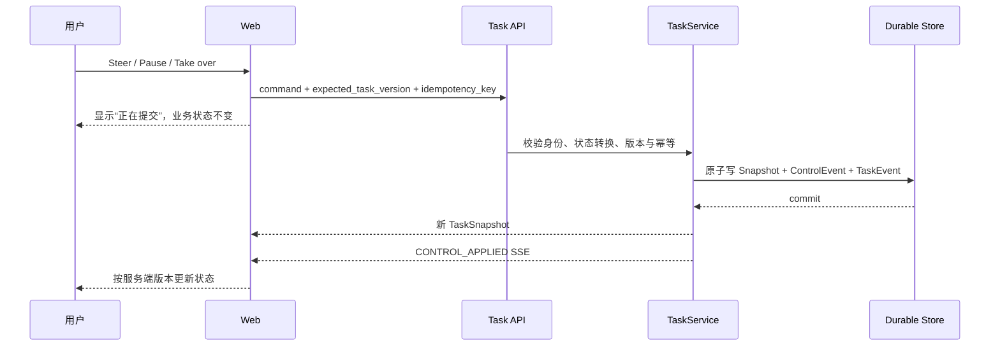

# Demo 1 UI—服务端事实矩阵

> 状态：`Ready`。PR 2 已接入最薄 Active Task Bar 和连接同步标记；Branch、Conflict、Artifact、Control、Commit 与完整恢复界面仍是后续目标。

## 1. 组件映射

| UI 状态或组件 | 用户含义 | 服务端权威字段 | Snapshot / SSE | 允许动作 | 失败与恢复 | 默认隐藏 |
| --- | --- | --- | --- | --- | --- | --- |
| Active Task Bar（PR 2 已实现） | 当前服务端 Task 契约是否已创建，以及客户端是否与 Snapshot 对账 | `TaskSnapshot.task_id/status/phase/version/contract.title/contract.objective/budget`；`sync_state` 仅是客户端传输状态 | 初始 `GET /tasks`；创建响应；Task SSE 触发 `GET /tasks/{id}` 对账。当前服务端只产生 `TASK_CREATED` | 创建 Demo 1 Task | 初始化失败显示全局错误并进入 `offline`；SSE 错误进入 `reconnecting` 并重连 | Prompt、内部调度、幂等键、完整 Task JSON |
| Branch Status List（目标） | 哪些分支运行、等待、暂停、失败或已提交 | `branches[].status/version/pause_reason/artifact_heads/issue_ids` | `BRANCH_STATUS_CHANGED` | Pause、Resume、Take over、Return control | 单分支错误只影响该行；版本过期后刷新 Snapshot | Worker 对话、内部计划文本 |
| Conflict Card（目标） | 哪个事实冲突、影响哪个分支、可选依据是什么 | `conflicts[].status/subject/summary/source_refs/candidate_values` | `CONFLICT_OPENED`、`CONFLICT_RESOLVED` | Resolve evidence、Take over | 提交后保持 open，直到服务端 resolved；失败显示可理解原因 | 未授权来源正文、原始检索日志 |
| Task Artifact Workspace（目标） | 当前交付物版本、来源和验证结果 | `artifact_versions[]`、`verification_reports[]`、`branches[].artifact_heads` | `ARTIFACT_VERSION_CREATED`、`VERIFICATION_RECORDED`、`CHECKPOINT_COMMITTED` | 查看来源、版本历史、人工接管后编辑 | candidate/failed 不能显示为完成；旧 head 只读 | 原始模型上下文、完整工具参数 |
| Task Control Bar（目标） | 用户能否纠偏、暂停或接管 | `TaskSnapshot.version`、Branch status、服务端允许转换 | `CONTROL_ACCEPTED/APPLIED/REJECTED` | Steer、Pause branch、Resume、Take over、Return control | mutation 带 version/key；`409` 时展示新版本并要求用户复核 | idempotency key、权限哈希 |
| Stream Health Badge（PR 2 已并入 Task Bar） | 浏览器是否能读取并对账服务端 Snapshot | 客户端 `last_sequence/sync_state`，不属于业务状态 | EventSource open/error、新 TaskEvent、对账 GET | 当前没有手动重连或任务控制 | 1.2 秒后自动重连；连接后重新 GET Snapshot | 网络栈和内部重试日志 |
| Verified Commit Summary | 哪些工件构成最终结果及如何验证 | `last_commit.state_hash/artifact_version_ids/verification_report_ids` | `CHECKPOINT_COMMITTED`、`TASK_COMMITTED` | 查看 Trace 摘要、打开工件 | 没有 Commit 或有 open conflict 时不得出现完成 | 原始 Trace payload、签名和密钥 |
| Task Error Banner | 哪一层失败、是否可恢复、用户下一步是什么 | `last_error.code/scope/recoverable/user_action` | `TASK_FAILED` 或最新 Snapshot | 重试、缩小范围、接管、返回上个 Commit | `5xx` 先标记“结果待确认”并按幂等键查询，不直接宣告失败 | 堆栈、内部服务地址、敏感参数 |
| Action Gate Tray | 某个真实副作用动作是否可执行 | 现有 `RunSnapshot.risk/control_plan/permit/tool_result` | 现有 Run API/SSE | 补证据、审批、Authorize | 与 Task Control 分离；旧 Action 继续遵守失效和 Permit 规则 | Permit token、策略内部秘密 |

PR 2 的 Task Bar 虽具备全部状态的中文映射，当前后端实际只返回 `ready / contract`、预算使用量 0、版本 1 和三个 `queued` Branch。其他文案存在于前端类型中不等于对应运行能力已经实现。

## 2. 状态文案与颜色不是事实

前端可把服务端枚举翻译为中文，但不能改变语义：

| 服务端状态 | 建议中文 | 用户可做什么 | 禁止推断 |
| --- | --- | --- | --- |
| Task `running` | 任务运行中 | 查看分支、Steer、暂停或接管 | 不能按动画估算完成比例 |
| Task `waiting_input` | 等待你的决定 | 处理冲突或接管 | 不能把单分支等待写成整任务失败 |
| Task `paused` | 已暂停 | Resume 或 Take over | 不能声称后台仍在执行 |
| Task `taken_over` | 由你接管 | 编辑新版本或归还控制 | Agent 不得继续写受控分支 |
| Task `verifying` | 正在验证 | 查看候选工件，等待结果 | candidate 不能显示已完成 |
| Task `committed` | 已验证并提交 | 查看 Commit、工件和 Trace 摘要 | 必须同时存在服务端 Commit 事实 |
| Branch `waiting_evidence` | 此分支等待依据 | 解决冲突、Pause 或 Take over | 其他分支状态保持独立 |
| Branch `failed` | 此分支失败 | 查看原因、从 Commit 恢复或接管 | 不自动覆盖为整个 Task failed |

颜色、图标、进度条、动效、Toast 和按钮 disabled 状态都是 UI 表达，不能成为风险、预算、验证、执行或完成的权威来源。

## 3. 控制提交时序（PR 3 目标）

服务端返回 `409` 时，UI 必须读取最新 Snapshot，并让用户看到哪些字段发生变化；不得用旧 version 自动重试含义可能已经改变的命令。

## 4. 断线、过期与恢复

1. **断线**：显示“更新暂时中断，任务可能仍在后台运行”；保留最后确认 Snapshot，停止模拟进度，禁用新的控制提交。
2. **重连**：使用 `after=last_sequence` 回放，随后 GET Snapshot；重复事件按 `task_id + sequence` 去重。
3. **序号缺口**：若下一事件不是 `last_sequence + 1`，立即标记 `reconciling` 并以 Snapshot 覆盖本地投影。
4. **旧版本**：`409` 后不改变业务状态，展示服务端当前 version、变更摘要和重新应用入口。
5. **身份过期**：`401/403` 后转只读，保留未提交 Steer 文本但不自动重放。
6. **服务重启**：这是 PostgreSQL 模式的待验收目标。内存模式只在同一 Store 对象存活时可恢复，进程退出后数据丢失。
7. **请求超时/5xx**：先显示“结果待确认”，用 idempotency key 或 Snapshot 查询结果后再决定是否允许重试。

当前 EventSource 只通过 `after` 查询参数传递游标，不使用 `Last-Event-ID`；服务端轮询 TaskStore，没有跨实例通知总线。PR 2 前端会在连接打开或收到事件后重新 GET Snapshot，并在连接错误后自动重试，但还没有完整的过期版本、控制提交、失败恢复或进程重启 UI。

## 5. 实现与验证责任

| PR | 前台最小输出 | 后端事实 | 必须提供的证据 |
| --- | --- | --- | --- |
| PR 1 | 只定义 TypeScript 类型与本矩阵，不宣称页面已实现 | Pydantic 目标协议 | 严格 Schema 测试、TypeScript 编译 |
| PR 2 | 已实现真实 Task Bar、同步状态和 Snapshot 读取 | 已实现 Store、创建/读取 API、Owner scope、创建幂等和 `TASK_CREATED` SSE | 当前自动化覆盖内存 Store 恢复、Owner 隔离、创建幂等和游标；PostgreSQL 重启、多实例通知与浏览器 E2E 仍未验证 |
| PR 3 | 最薄 Branch/Conflict/Control 交互 | Loop、Verifier、ControlEvent、幂等恢复 | 分支隔离、过期版本、重复命令、重启恢复和控制截图 |
| PR 4 | 完整 Task Artifact Workspace、异常与移动端闭环 | 所有状态追到 Snapshot/SSE | 浏览器端到端、断线恢复、桌面/移动截图；用户研究仍单独标待办 |
