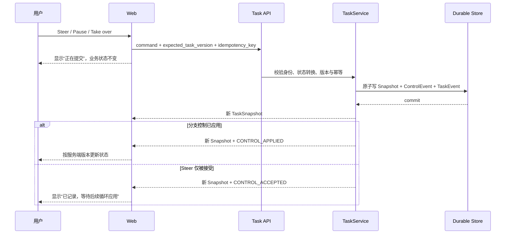

# Demo 1 UI—服务端事实矩阵

> 状态：`Ready`。PR 4 已接入固定 Fixture 的只读 Task Artifact Workspace，并验证主路径和发送前失败恢复；PR 5 已验证 PostgreSQL 跨 API 进程恢复、同页断线/重连和 Snapshot 对账，并让顶部连接文案与 Task 传输状态一致。服务端已提交但响应丢失、断线期间事件回放、Task/Action 绑定和用户价值验证仍是后续目标。

## 1. 组件映射

| UI 状态或组件 | 用户含义 | 服务端权威字段 | Snapshot / SSE | 允许动作 | 失败与恢复 | 默认隐藏 |
| --- | --- | --- | --- | --- | --- | --- |
| Active Task Bar（已实现） | 当前服务端 Task 及客户端是否与 Snapshot 对账 | `TaskSnapshot.task_id/status/phase/version/contract.title/contract.objective/budget`；`taskSyncState` 与 `taskTransportState` 均为客户端事实 | 初始 `GET /tasks`；创建/mutation 响应；Task SSE 触发 `GET /tasks/{id}` 对账 | 创建或查看 Demo 1 Task；终态显示“再次演示”并用新 round key 创建独立 Task；Action Gate 打开时按钮禁用 | 初始化失败降级为 Task offline；同一创建 key 可安全重试；刷新优先恢复未终止 Task，否则保留最近终态并允许下一轮；SSE 错误优先重连当前 Task ID，顶部身份区显示连接中断，重新 GET Snapshot 成功后才恢复 `synced` | Prompt、内部调度、实际幂等键、完整 Task JSON、网络栈、数据库类型与内部重试日志 |
| Branch Status List（已实现） | 哪些固定分支等待、暂停、接管或已提交 | `branches[].status/version/pause_reason/artifact_heads/issue_ids` | Snapshot、`BRANCH_STATUS_CHANGED` | Pause、Resume、Take over、Return control；有 head 时直达交付物 | 单分支错误只影响该行；版本过期后刷新 Snapshot | Worker 对话、内部计划文本 |
| Conflict Card（PR 3 已实现） | 哪个 Fixture 事实冲突、影响哪个分支、可选依据是什么 | `conflicts[].status/subject/summary/source_refs/candidate_values` | Snapshot、`CONFLICT_OPENED`、`CONFLICT_RESOLVED` | 采用固定 CRM 正式来源、Pause、Take over；候选值与 source_ref 默认折叠 | 只有服务端返回 resolved 后才移除；请求失败先对账 | 未授权来源正文、原始检索日志；非安全或疑似敏感 source ref 使用与 Artifact Workspace 相同的隐藏占位 |
| Task Artifact Workspace（PR 4 已实现） | 当前 Branch head、版本、验证、冲突、结构化内容、来源、lineage 与 Commit | `contract.deliverables[]`、`branches[].artifact_heads/status`、`artifact_versions[]`、`verification_reports[]`、`conflicts[]`、`last_commit` | mutation 响应；Task SSE 后的完整 Snapshot 对账 | 从 Task 面板打开 head、选择分支/版本、按需展开来源与验证检查 | 没有 head/report/Commit 时显示缺失事实；candidate/conflict 不显示完成；当前只读 | 按 `artifact.kind` allowlist 投影；未知 kind/字段默认隐藏；非安全或疑似敏感 `source_ref` 显示隐藏占位 |
| Tasks 手工待办 tab（保留） | 原工作台待办仍可按状态分栏查看和编辑 | `WorkspaceArtifact(kind=tasks)` | Workspace API 与 Conversation SSE | 在“长期任务工件 / 工作台待办”间切换；修改优先级、状态和内容并保存 | Task Snapshot 不覆盖手工待办内容；状态变化仅重排本地看板，保存后才更新 WorkspaceArtifact | 两套数据模型的内部 ID 与调度细节 |
| Task Control（PR 3 部分实现） | 用户能否记录方向指令、暂停或接管固定分支 | `TaskSnapshot.version`、`controls[]`、Branch status、服务端允许转换 | `CONTROL_ACCEPTED`；分支控制另有 `CONTROL_APPLIED` | Steer、Pause branch、Resume、Take over、Return control | pending mutation 将原 key、intent 和预期版本写入当前标签页 `sessionStorage` 并冻结新控制；offline/reconnecting 时可同 key 对账，重放确认后再 GET 最新 Snapshot；`409` 后刷新并提示复核 | idempotency key、权限哈希 |
| Stream Health Badge（已并入 Task Bar） | 浏览器是否能读取并对账服务端 Snapshot | 客户端 `taskSequenceRef/taskSyncState/taskTransportState`，不属于业务状态 | EventSource open/error、新 TaskEvent、对账 GET | offline 可手动重新连接，reconnecting/pending 可立即对账；未同步时禁止 Task Control | 自动重连；优先 GET 当前 Task ID，连接后重新 GET Snapshot，成功后才恢复 `synced`；PR 5 已实测同页 API 进程重启 | 网络栈、数据库类型和内部重试日志 |
| Verified Commit Summary（已实现） | 服务端是否已生成最近 Commit | `last_commit.summary/committed_at/task_version/state_hash/artifact_version_ids/verification_report_ids` | Snapshot、`CHECKPOINT_COMMITTED`、`TASK_COMMITTED` | 查看摘要、提交版本、工件/报告数量与 state hash | 没有服务端 Commit 时不得出现完成；引用/hash 有内存回归，PostgreSQL 16.14 已验证 v3 Commit 跨进程恢复 | 原始 Trace payload、签名和密钥 |
| Task Error Banner（部分实现） | mutation 是否被拒绝、过期或结果待确认 | HTTP 状态、重新 GET 的 Snapshot version；`last_error` 完整路径尚未实现 | mutation 响应与 Snapshot 对账 | 复核后重新提交 | `5xx` 只显示结果待确认；不凭客户端异常宣告失败 | 堆栈、内部服务地址、敏感参数 |
| Action Gate Tray | 某个副作用动作是否可执行 | 现有 `RunSnapshot.risk/control_plan/permit/tool_result` | 现有 Run API/SSE | 补证据、审批、Authorize | Gate 使用独立网格行；Task 面板保持挂载以保留草稿，但视觉隐藏、不可交互，Task Bar 操作也禁用；收起后行高缩至 58px；Artifact/Action 失效尚未绑定 | Permit token、策略内部秘密 |

PR 5 UI 展示的仍是固定 Demo 1 的服务端状态，不是通用 Agent 执行器。Task、分支、工件、验证、冲突和 Commit 必须逐项映射上述 Snapshot 字段；不存在于 Snapshot/TaskEvent 的事实不得由前端文案、颜色或 Toast 补造。顶部连接文案映射独立客户端传输状态，pending mutation/Snapshot 对账仍由 Task 同步状态表达；两者都不是 Task 业务字段，也不能据此声称后台仍在执行。字段 allowlist 与 Conflict/Artifact 共用的 `source_ref` 投影只放行契约中的四个已知 Demo 1 Fixture 引用，其他值 fail closed；这只是前端第二道防线，服务端尚无通用字段可见性 Schema/display projection。

## 2. 状态文案与颜色不是事实

前端可把服务端枚举翻译为中文，但不能改变语义：

| 服务端状态 | 建议中文 | 用户可做什么 | 禁止推断 |
| --- | --- | --- | --- |
| Task `running` | 任务运行中 | 查看分支、Steer、暂停或接管 | 不能按动画估算完成比例 |
| Task `waiting_input` | 等待你的决定 | 处理冲突或接管 | 不能把单分支等待写成整任务失败 |
| Task `paused` | 已暂停 | Resume 或 Take over | 不能声称后台仍在执行 |
| Task `taken_over` | 由你接管 | 当前只能归还控制 | PR 4 仍无人工编辑并创建新 ArtifactVersion 的闭环 |
| Task `verifying` | 正在验证 | 查看候选工件，等待结果 | candidate 不能显示已完成 |
| Task `committed` | 已验证并提交 | 查看 Commit、工件与验证结果 | 必须同时存在服务端 Commit 事实；普通 UI 不展示内部 Trace |
| Branch `waiting_evidence` | 此分支等待依据 | 解决冲突、Pause 或 Take over | 其他分支状态保持独立 |
| Branch `failed` | 此分支失败 | 查看原因、从 Commit 恢复或接管 | 不自动覆盖为整个 Task failed |

颜色、图标、进度条、动效、Toast 和按钮 disabled 状态都是 UI 表达，不能成为风险、预算、验证、执行或完成的权威来源。

## 3. 控制提交时序

服务端返回 `409` 时，UI 必须读取最新 Snapshot，并让用户看到哪些字段发生变化；不得用旧 version 自动重试含义可能已经改变的命令。当前会显示已刷新到的 version，但字段级变更摘要和重新应用入口仍未完成，也不在 PR 4 E2E 覆盖内。

## 4. 断线、过期与恢复

1. **断线**：显示“服务连接中断，正在恢复 / 正在重新对账”；保留最后确认 Snapshot，停止模拟进度，禁用新的控制提交。固定路径没有可据此声称仍在推进的后台 worker；PR 5 已通过停止 API 进程实测该前台状态。
2. **重连**：EventSource 重连后 GET Snapshot；重复事件按 `task_id + sequence` 去重。PR 5 已验证没有停机期新事件时的自动重连和 v2/v3 对账；`after=last_sequence` 的事件缺口回放尚未验收。
3. **序号缺口**：目标是发现下一事件不等于 `last_sequence + 1` 时标记重新对账并以 Snapshot 覆盖本地投影；尚无浏览器 E2E。
4. **旧版本**：`409` 后不改变业务状态，展示服务端当前 version、变更摘要和重新应用入口。
5. **身份过期**：`401/403` 后转只读，保留未提交 Steer 文本但不自动重放。
6. **服务重启**：PostgreSQL 16.14 下已验证同一数据库、三个顺序 API 进程恢复 v2/v3；内存模式进程退出后仍会丢失，Conversation Thread/Message 也不会随 Task 恢复。
7. **请求结果未知**：先显示“结果待确认”，把原 key、intent 和预期版本保存在当前标签页；同 key 确认首次结果后再 GET 最新 Snapshot。PR 4 E2E 已覆盖请求发送前 abort、reload 后入口可达、同 key 重试和无重复工件；请求已到服务端但响应丢失尚未覆盖。

当前 EventSource 只通过 `after` 查询参数传递游标，不使用 `Last-Event-ID`；服务端轮询 TaskStore，没有跨实例通知总线。前端会在连接打开或收到事件后重新 GET Snapshot，在连接错误后自动重试，并对 mutation 409/未知结果重新读取 Snapshot。PR 4 已证明发送前 abort 的 pending 数据可经同标签页 `sessionStorage`、reload 和同 key 重试恢复；PR 5 已证明同页 API 进程停止/重启与 Snapshot 对账。SSE 序号缺口、身份过期、服务端已提交但响应丢失和多实例连接迁移仍未完成浏览器 E2E。

## 5. 实现与验证责任

| PR | 前台最小输出 | 后端事实 | 必须提供的证据 |
| --- | --- | --- | --- |
| PR 1 | 只定义 TypeScript 类型与本矩阵，不宣称页面已实现 | Pydantic 目标协议 | 严格 Schema 测试、TypeScript 编译 |
| PR 2 | 已实现真实 Task Bar、同步状态和 Snapshot 读取 | 已实现 Store、创建/读取 API、Owner scope、创建幂等和 `TASK_CREATED` SSE | 当前自动化覆盖内存 Store 恢复、Owner 隔离、创建幂等和游标；PostgreSQL 重启、多实例通知与浏览器 E2E 仍未验证 |
| PR 3 | 已实现固定 Fixture 的最薄 Branch/Conflict/Control/Commit；Action Gate 打开时视觉隐藏明细并保留草稿 | 单次 start/resolve mutation、Verifier、ControlEvent、ArtifactVersion | 已有内存引用/hash/幂等测试、桌面/移动冲突截图和桌面提交态截图；PostgreSQL 重启和完整浏览器恢复仍待补 |
| PR 4 | 已实现只读 Task Artifact Workspace、Tasks 双 tab、Task 面板直达工件和移动端布局 | 复用 PR 3 Snapshot/Event/Artifact/Verification/Conflict/Commit | system Edge E2E `2 passed (18.4s)`；覆盖主路径、发送前 abort/reload/同 key恢复、桌面/移动截图与被测 overflow/44px；SSE/响应丢失/PostgreSQL/用户研究仍待补 |
| PR 5 | 顶部按独立传输状态显示已连接/中断，Task Bar 单独显示同步/对账；断线时保留 Snapshot 并禁用控制；Conflict/Artifact 共用 fail-closed source-ref 投影 | PostgreSQL TaskStore 恢复 v2/v3；历史 mutation result Snapshot；事件/工件唯一约束与 Commit 状态机 | 合并兼容回归：opt-in PostgreSQL system test `1 passed (9.78s)`，三个顺序 API 进程、两个演示轮次、原 Task 45 events/7 artifacts/1 commit；system Edge suite `3 passed (17.0s)`，另有基线同页断线/恢复五张截图；事件缺口/响应丢失/用户研究仍待补 |
