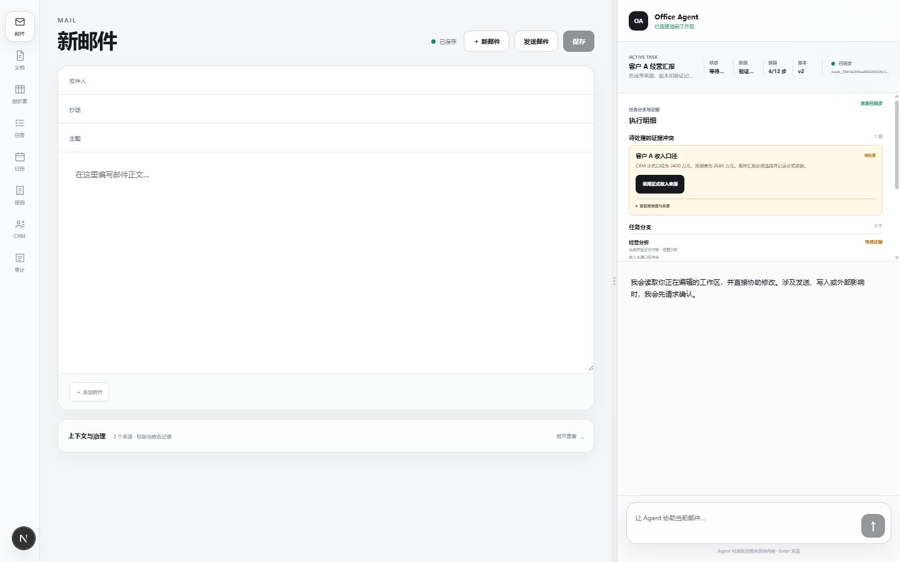
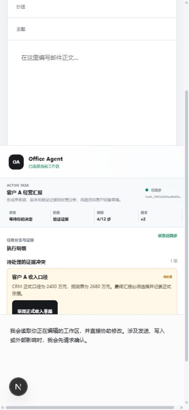
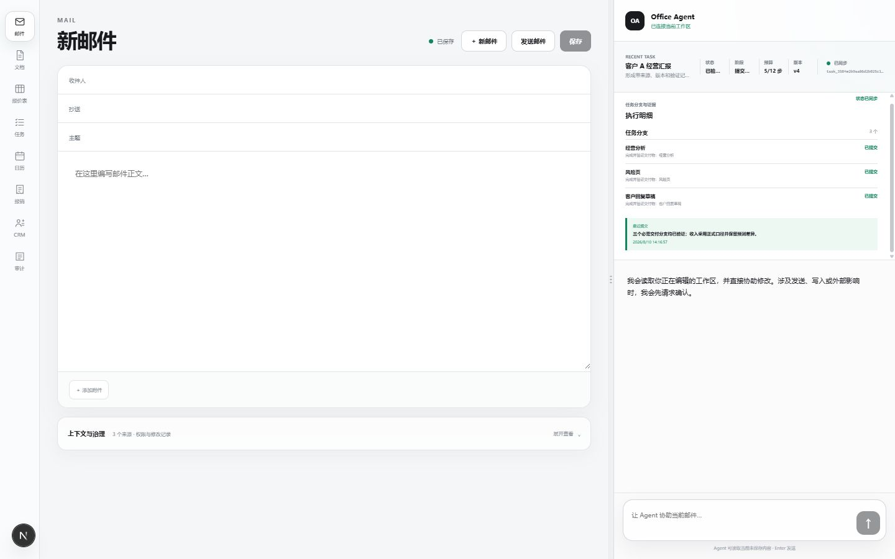

# Demo 1 PR 3 Runtime Evidence

| 字段 | 内容 |
| --- | --- |
| Evidence ID | `RUNTIME-EVIDENCE-DEMO1-PR3-20260810` |
| Date | 2026-08-10，Asia/Shanghai |
| Branch | `feature/demo1-controlled-loop-20260810` |
| Decision | [`DR-0002`](../decisions/DR-0002-bounded-durable-office-loop.md) |
| Scenario | [`SCENARIO-001`](../scenarios/SCENARIO-001-customer-a-durable-report.md) |
| Status | `Partial evidence`，只覆盖固定 Fixture 的工程实现与当前界面，不包含 PostgreSQL 重启、真实 Connector 或用户价值验证 |

## 1. 证据对象

本证据只覆盖 Demo 1 固定 Fixture：客户 A、三个交付分支，以及 CRM 正式收入 2,400 万元与预测收入 2,680 万元的冲突。当前 Task Runtime 不调用 LLM，不连接真实邮箱、CRM、预测表或项目系统，也不执行真实副作用。

可观察实现落点：

| 事实 | 代码或协议位置 | 当前边界 |
| --- | --- | --- |
| 创建、启动、读取和控制 Task | `services/api/app/api/routes.py`、`services/api/app/application/tasks.py` | `POST /tasks/{task_id}/start` 只运行固定 Demo 1 路径，不是通用后台调度器 |
| Snapshot、Event 与 ArtifactVersion mutation | `services/api/app/application/task_storage.py` | 有内存和 PostgreSQL 代码路径；本机尚无 PostgreSQL 运行与进程重启实证 |
| Branch、Conflict、Control 与 Commit 前台 | `apps/web/app/page.tsx`、`apps/web/app/task-runtime-panel.tsx` | UI 只渲染服务端 `TaskSnapshot`，并在 Task SSE 后重新 GET Snapshot 对账；未知 mutation 会把原 key 与 intent 保存到当前标签页的 `sessionStorage`，offline/reconnecting 时可同 key 确认，随后再 GET 最新 Snapshot |
| Action Gate 协调 | `apps/web/app/page.tsx`、`apps/web/app/styles.css` | Gate 使用独立网格行；TaskRuntimePanel 保持挂载以保留 Steer 草稿，但视觉隐藏、`aria-hidden` 且任务控制与 Task Bar 操作不可用；收起后网格行缩至 58px；Task Artifact 与 Action 失效尚未绑定 |

`start` 请求会在一次服务端 mutation 中按固定数据生成阶段事件、候选或已验证工件、验证报告和一个局部冲突。事务提交前，浏览器看不到中间 Snapshot；因此这证明的是固定 Fixture 的确定性、可追踪状态转换，不证明真实长任务正在后台持续运行，也不证明从任意中间步骤恢复。

## 2. 前台截图

| 文件 | 视口 | SHA-256 | 能证明什么 | 不能证明什么 |
| --- | --- | --- | --- | --- |
| [`demo1-pr3-conflict-desktop.png`](../assets/demo1-pr3-conflict-desktop.png) | 1440 x 900 | `8EF7E205B135A56DBD5502E899CC8DF7DD43EFEDC1048976D83FA8500D8300CE` | 桌面布局能显示 Active Task、待处理冲突、解决动作和其他分支仍存在；候选值与 Fixture `source_ref` 保持默认折叠 | 不证明按钮行为、断线恢复、用户理解或真实业务价值 |
| [`demo1-pr3-conflict-mobile.png`](../assets/demo1-pr3-conflict-mobile.png) | 380 x 822 | `178EC647B88926992832BC10125AEC58C8240EAE6CE94EFBE5CDE3BAF04105DD` | 导出 PNG 的实际内容区能在窄屏显示 Active Task、冲突摘要和解决动作 | 不证明全部移动端路径、触控可用性或无滚动问题；浏览器设置为 390 x 844，表中按导出文件实测像素记录 |
| [`demo1-pr3-committed-desktop.png`](../assets/demo1-pr3-committed-desktop.png) | 1440 x 900 | `DAD47694D9940C6C449AFFE2F5A57D1532BA44E08C43957815909EDD4EE013B9` | 桌面布局能显示服务端 committed 状态、三个 committed 分支和最近 Commit 摘要 | 截图本身不证明 Commit 引用、state hash 或幂等正确；这些由自动化测试支持 |

截图中展示目标、状态、阶段、预算、版本、分支、冲突摘要或最近 Commit。冲突候选值与 `source_ref` 默认折叠；原始 Prompt、思维链、Worker 内部对话、幂等键、完整 Trace JSON、Permit、密钥和堆栈均未展示。

## 3. 自动化验证记录

在 Runtime 修正完成后的同一 PR 3 工作区，已实际运行：

| 命令 | 结果 | 支持范围 |
| --- | --- | --- |
| `uv run pytest -q tests/integration/test_task_runtime.py tests/integration/test_task_routes.py` | `15 passed` | 内存 Store 下的固定 Fixture 主路径、局部冲突、联动回复、剩余冲突不提交、lineage/head、state hash、预算/截止时间、Owner/版本和原结果幂等 |
| `uv run pytest -q` | `56 passed` | 当前工作区的全量 Python 回归 |
| `uv run ruff check .` | 通过 | Python 静态检查 |
| `pnpm --dir apps/web lint` | 通过 | TypeScript 类型检查 |
| `pnpm --dir apps/web build` | 通过 | Next.js 生产构建 |
| `git diff --check` | 通过，只有工作区 LF/CRLF 提示 | 文本 diff 基础检查 |

这些结果证明上述行为在内存 Store 自动化中通过。PostgreSQL 实例、真实进程重启、多实例通知和浏览器恢复不在这组 Python 结果内。前端 lint/build 证明类型与生产构建通过，不等同于浏览器端到端恢复验证。

## 4. Claim 与边界

当前可以使用的表述：

- 固定 Fixture 在内存 Store 测试中产生服务端拥有的有序 Task Trace、局部冲突、ArtifactVersion、VerificationReport、ControlEvent 和 TaskCommit。
- 选择正式收入后，服务端先创建并验证经营分析 v2。若仍有其他 open Conflict，本次只持久化 resolution、经营分析 v2 和其报告，不生成 reply v3 或 TaskCommit；只有解决最后一个 open Conflict 时，服务端才把客户回复从 v2 联动重生成并验证为 v3，正文保留 2,400/2,680/280/11.7% 差异，再生成 TaskCommit。
- 内存 Store 已验证 Artifact 内容摘要、单 lineage、连续版本/父链、历史不可变、最新 head、完整 Commit state hash，以及旧幂等 key 在后续 mutation 后仍返回原 Snapshot 且不重复写。
- start/resolve 在 mutation 前校验预计预算和截止时间；拒绝路径不新增事件或工件。预算耗尽后的产品恢复流程尚未实现。
- 收入口径冲突只把目标分支置为 `waiting_evidence`，其他两个固定分支可形成已验证工件；这是工程行为，不是等待时间或业务收益证据。
- 前端的 Task、Branch、Conflict、Control 和 Commit 状态来自 REST 返回的 `TaskSnapshot` 或 Task SSE 触发后的 Snapshot 对账，不由动画、Toast 或客户端计时器创造。
- 未知 mutation 的原 key、intent 和预期版本保存在当前标签页的 `sessionStorage`；offline/reconnecting 时可同 key 重放，成功后还会 GET 当前 Task 的最新 Snapshot，避免把历史幂等响应当作当前状态。reload 后入口始终可达尚未证明；该行为有源码与构建证据，没有浏览器刷新/断线 E2E。
- `steer` 若服务端仅返回 `ControlEvent.status=accepted`，前端只能说“方向指令已记录，等待后续循环应用”，不能说已重新规划或已生效。

当前禁止使用的表述：

- “已经接入真实 CRM、邮箱或企业数据”，或“由 LLM 自主完成经营分析”。
- “已经实现生产级后台持续运行、进程重启恢复或多实例实时通知”。
- “Take over 已提供完整人工编辑和新 ArtifactVersion 闭环”。
- “Task Artifact 改动会让已打开 Action 自动失效”。该绑定尚未实现；现阶段只在 Action Gate 打开时视觉隐藏 Task 明细、保留组件草稿并禁止提交 Task Control。
- “Task Bar、分支隔离或控制显著降低了用户认知负担、等待时间或错误率”。`H-001` 至 `H-004` 仍无目标用户研究。

## 5. 待补证据

1. PostgreSQL `commit` 路径的实际运行、API 进程重启，以及重启前后 Task ID、version、event sequence、Artifact head 和 state hash 对账。
2. mutation 响应丢失、同标签页刷新、旧版本 `409`、SSE 序号缺口和断线恢复的浏览器端到端验证。
3. Task Artifact 与 ActionCandidate/Run 的版本绑定和 Action 失效测试。
4. 针对 `H-001` 至 `H-004` 的目标用户任务测试；完成前保持 `Draft hypothesis`。
