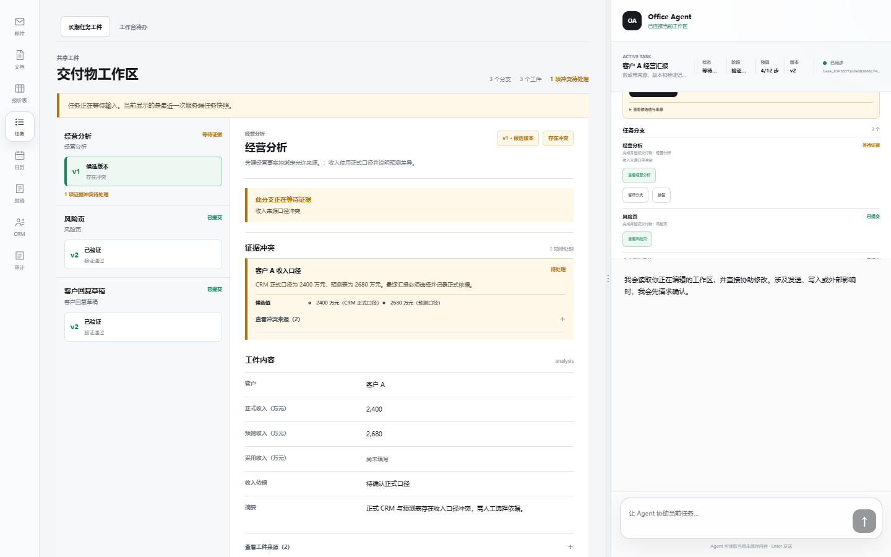
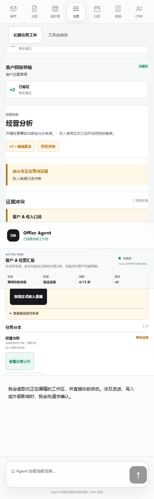
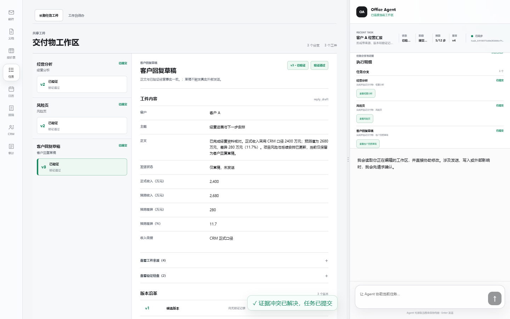
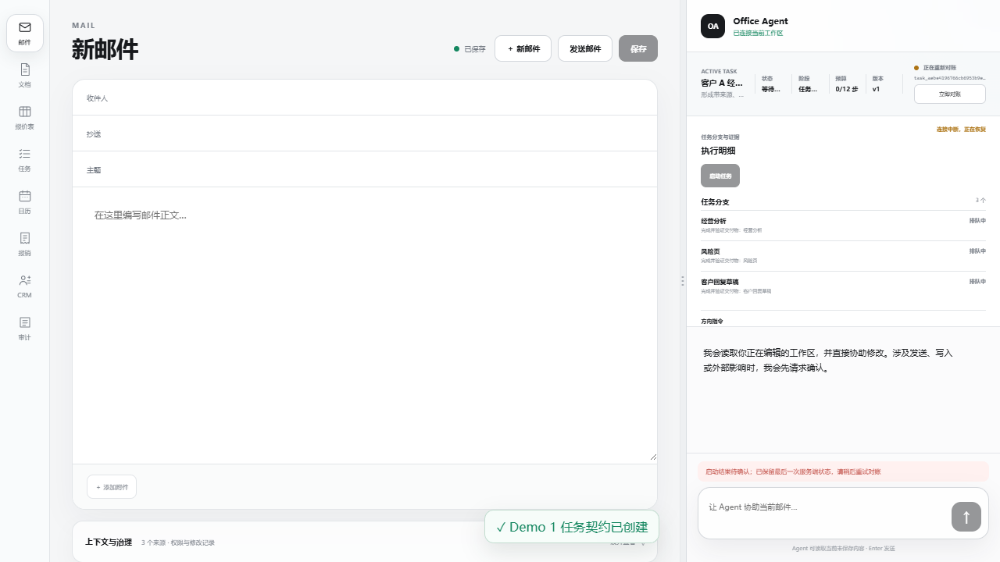
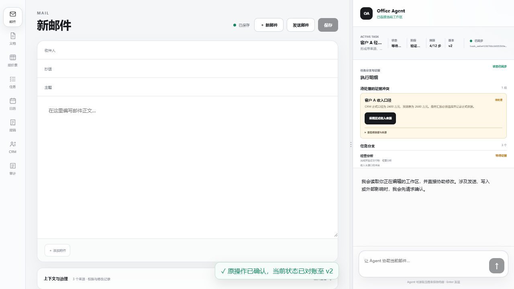

# Demo 1 PR 4 Frontend E2E Evidence

| 字段 | 内容 |
| --- | --- |
| Evidence ID | `FRONTEND-E2E-DEMO1-PR4-20260810` |
| Date | 2026-08-10，Asia/Shanghai |
| Branch | `feature/demo1-artifact-workspace-20260810` |
| Decision | [`DR-0002`](../decisions/DR-0002-bounded-durable-office-loop.md) |
| Scenario | [`SCENARIO-001`](../scenarios/SCENARIO-001-customer-a-durable-report.md) |
| Status | `Verified engineering path`，仅限固定 Fixture、内存 TaskStore 和本页列出的浏览器路径 |

## 1. 证据对象

PR 4 在现有服务端 `TaskSnapshot` 上增加只读交付物工作区，没有增加新的业务真值或 Artifact 编辑 API：

| 前台事实 | 服务端来源 | 实现位置 | 边界 |
| --- | --- | --- | --- |
| 分支、交付物和当前 head | `branches[].deliverable_ids/artifact_heads/status`、`contract.deliverables[]` | `apps/web/app/task-artifact-workspace.tsx` | 缺少 head 时显示“尚未生成”，不由前端创建假版本 |
| 工件版本、结构化内容与 lineage | `artifact_versions[].artifact_id/version/parent_version_id/status/content` | `apps/web/app/task-artifact-workspace.tsx` | 只读展示；人工编辑并创建新 ArtifactVersion 尚未实现 |
| 验证与冲突 | `verification_reports[]`、`conflicts[]` | `apps/web/app/task-artifact-workspace.tsx` | 来源和验证检查默认折叠；candidate/conflict 不能显示为完成 |
| Commit | `last_commit.task_version/artifact_version_ids/verification_report_ids/state_hash` | `apps/web/app/task-artifact-workspace.tsx` | 没有 `last_commit` 时明确显示尚未形成最终提交 |
| 从 Task 面板打开工件 | `branches[].artifact_heads` | `apps/web/app/task-runtime-panel.tsx`、`apps/web/app/page.tsx` | 只导航到服务端已存在的版本 |
| Tasks 视图兼容 | 前台 `taskViewMode` | `apps/web/app/page.tsx` | “长期任务工件”与原“工作台待办”是两个 tab，未删除手工待办 |

结构化内容只为固定 Fixture 的 `analysis/risk_brief/reply_draft` 使用字段 allowlist，未知 kind/字段默认隐藏；字段名内部模式检查作为附加拒绝条件。`source_ref` 只显示安全的非敏感 opaque scheme，疑似 token、secret、signature、路径或 URL 的值显示“内部标识已隐藏”。这是前端第二道投影，不是服务端数据删除或通用安全保证：服务端尚未提供字段可见性 Schema/display projection，allowlist 字段中的任意文本仍需由服务端脱敏。

## 2. 浏览器 E2E

实际运行环境：

- FastAPI：`http://localhost:8011`，未配置 `DATABASE_DSN` 或 `LANGGRAPH_CHECKPOINT_DSN`，使用内存 TaskStore。
- Next.js：`http://localhost:3011`。
- 浏览器：本机 system Microsoft Edge，由 Playwright `channel=msedge` 驱动。
- 命令：`pnpm --dir apps/web test:e2e`。
- 结果：`2 passed (18.4s)`。

| 用例 | 实际覆盖 | 明确不覆盖 |
| --- | --- | --- |
| 固定 Fixture 主路径 | 创建、start、局部冲突、从 Task 面板打开经营分析、Steer accepted、选择正式来源、Commit、打开客户回复 v3；页面显示正式收入 2,400 万元、“仅草稿，未发送”和 `sha256:` state hash；API 终态为一个 committed Task、三个 committed Branch、七个唯一 ArtifactVersion | 真实 LLM/Connector、发送邮件、通用后台 Loop、用户体验收益 |
| pending mutation 恢复 | 浏览器在 start 请求发出前 abort；原 key/expected version 写入 `sessionStorage`；reload 后同 key“立即对账”；最终只得到一个 Task、五个唯一 ArtifactVersion；再次同 key 重放仍无重复 | 请求已到服务端并提交、但响应在返回途中丢失的浏览器路径；API/浏览器进程重启 |
| 响应式检查 | 390 x 844 viewport 下检查任务/工件区域无横向 overflow；可见工件按钮和 summary，以及冲突动作与 Steer 输入高度均至少 44px | 所有设备、缩放比例、辅助技术和长文本组合 |

第二个用例的 abort 发生在浏览器把请求交给服务端之前，因此只能证明“发送前失败”的 pending 保存、reload 和同 key 重试。服务端已提交但客户端未收到响应仍是单独的待验证路径。

## 3. 截图

| 文件 | PNG 实测尺寸 | SHA-256 | 能证明什么 | 不能证明什么 |
| --- | --- | --- | --- | --- |
| [`demo1-pr4-conflict-artifact-desktop.png`](../assets/demo1-pr4-conflict-artifact-desktop.png) | 1440 x 900 | `D1AF0ACB76C61BCE2B449908F7C3170612C514E1B5489EF6B4B93BB9F9AB7ABE` | 桌面端可从冲突任务进入经营分析 v1，显示 candidate、冲突、结构化内容和折叠的来源/验证入口 | 不证明真实来源或冲突交互收益 |
| [`demo1-pr4-conflict-artifact-mobile.png`](../assets/demo1-pr4-conflict-artifact-mobile.png) | 390 x 1260 | `3460B4AF3C55B5ADF657C343F62CDCCD6F8B60C90ED463893BE38A91F41165E5` | 390 x 844 viewport 的 full-page 导出能展示移动端任务与工件布局 | 截图本身不证明无 overflow 或 44px；这些由 DOM 断言支持 |
| [`demo1-pr4-committed-artifact-desktop.png`](../assets/demo1-pr4-committed-artifact-desktop.png) | 1440 x 900 | `4E015E5796BC125B9779C68BA69E51A700BFEB4B60A4A94A5374388955D51A39` | 客户回复 v3 显示为已验证，正文事实包含 2,400 万元、仅草稿未发送，并显示最终 Commit/state hash | 截图不独立证明 hash 内容正确或副作用隔离 |
| [`demo1-pr4-pending-recovery.png`](../assets/demo1-pr4-pending-recovery.png) | 1280 x 720 | `075C9BB1DCA551D7601D4F1657CCAD1547EF6B3D9410B6868CA0B433DAFE8617` | start 发送前失败后显示“结果待确认”和立即对账入口 | 不展示或泄露实际幂等 key；不证明服务端已收到请求 |
| [`demo1-pr4-reconciled.png`](../assets/demo1-pr4-reconciled.png) | 1280 x 720 | `AC9DED4685A2FC52EF73F542F0B148CC0B806F10011DFF8569A4EF9F081B5226` | reload 后同 key 对账可回到服务端冲突 Snapshot | 唯一性由 API 断言而不是截图证明 |

## 4. Claim 与边界

当前可以使用的表述：

- 固定 Demo 1 的 Task、Branch、ArtifactVersion、VerificationReport、Conflict 和 Commit 已能由同一服务端 Snapshot 驱动任务面板与交付物工作区。
- 浏览器 E2E 已覆盖固定主路径，以及 start 请求发送前失败后的 `sessionStorage` reload、同 key 重试和无重复工件。
- 客户回复 v3 在界面中显示正式收入 2,400 万元和“仅草稿，未发送”；这不是实际邮件发送。
- 移动 viewport 的被测页面没有横向 overflow，被测可见操作目标不小于 44px。

当前禁止或必须限定的表述：

- 不得把 E2E 称为请求已提交但响应丢失、SSE 断线回放、API 进程重启或 PostgreSQL 恢复测试。
- 不得声称已支持多实例通知、真实 CRM/邮箱/LLM Connector、生产身份或通用后台持续运行。
- 不得把固定三类 Artifact 的前端 allowlist/source-ref 遮蔽称为通用数据安全保证或服务端脱敏。
- 不得声称 Task Artifact 变化会使 ActionCandidate/Run 自动失效；两条事实链仍未绑定。
- 不得把截图、两条 E2E 或固定 Fixture 功能正确性表述为 `H-001` 至 `H-004` 的用户价值验证。

## 5. 待补证据

1. 请求已经提交到服务端但响应丢失时，浏览器以原 key 找回首次结果并再 GET 最新 Snapshot 的 E2E。
2. Task SSE 断线、`after=sequence` 回放、序号缺口和 Snapshot 对账的浏览器 E2E。
3. PostgreSQL 实例、API 进程重启、多实例通知和跨进程一致性验证。
4. 人工接管后编辑并创建新 ArtifactVersion，以及 Task Artifact 与 Action 版本/失效绑定。
5. 真实 LLM/Connector 接入和 `H-001` 至 `H-004` 目标用户研究。
