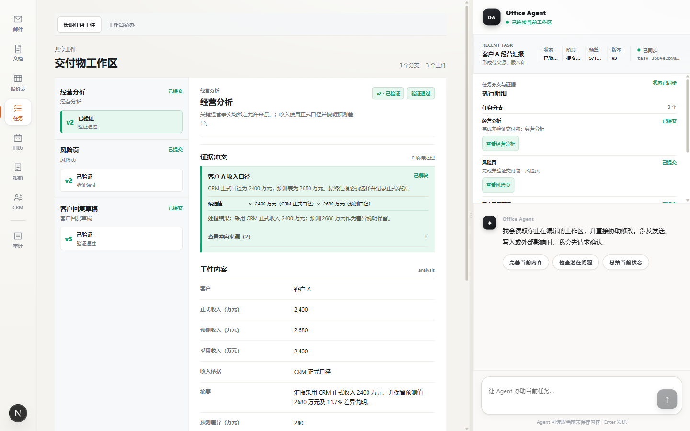

# DR-0003 前端视觉同步与兼容证据

> 日期：2026-08-10。范围：来源工作区视觉/交互同步，以及当前 Demo 1 Task Runtime/Artifact Workspace 的桌面和移动兼容。

## 1. 自动化结果

```text
uv run pytest -q
56 passed in 1.73s

uv run ruff check .
All checks passed!

pnpm --dir apps/web lint
tsc --noEmit

pnpm --dir apps/web build
Compiled successfully
Route: / (Static)

pnpm --dir apps/web test:e2e
2 passed (15.7s)
```

E2E 使用真实本地 FastAPI `8011`、Next.js `3011` 和 system Edge。主路径覆盖服务端创建、三分支、冲突、Steer、resolve、Commit 与工件终态；恢复路径覆盖 start 请求发送前中断、reload、同一幂等键对账和无重复工件。

首轮 E2E 暴露移动端 `.task-runtime-panel` 高度为 234.5px，超过既有 220px 约束；修复为 220px 上限并保留内部滚动后，复跑 `2 passed`。这证明测试实际拦截了视觉同步导致的布局回归，而非只记录成功结果。

## 2. 浏览器交互与布局结果

使用 Playwright CLI 连接运行中的 `http://localhost:3000`，实际完成：

- Tasks 双 Tab 切换；长期任务工件显示 3 个分支、3 个工件、验证、冲突、版本沿革和最终 Commit。
- 手工待办切换状态后卡片立即移入对应列，出现“未保存修改”和可用保存按钮；随后恢复原状态，未写入服务端。
- 日历从全宽月历点击 2026-07-14 进入当日安排，显示两项日程、前后翻日、返回月历和新建入口。
- CRM 显示五阶段 stepper、当前阶段、目标阶段选择与下一步编辑框。

390px 视口实测：

```text
viewport/document/body/workbench width: 390/390/390/390
task board: clientWidth 347, scrollWidth 1060, overflow-x auto
Task Artifact workspace: clientWidth 348, scrollWidth 348
Task Artifact 按钮高度: 48-61px
Task Artifact 字号: 正文 12px，导航标题 13px，详情标题 17px，工作区标题 18px
右侧 Task Runtime 字号: 约 10-13px
```

因此看板横向滚动被限制在看板内部，页面与工作区没有横向溢出；Task Artifact 的移动端操作目标高于 44px。

## 3. 截图

桌面 Task Artifact 与右侧 Runtime：



移动端 Task Artifact：


## 4. 当前边界

- 来源仓库的前端改动是未提交工作树 diff，不是可追溯的独立 commit；本记录固定了读取路径、共同基线和日期。
- 浏览器手测使用当前内存 TaskStore 中已有 Demo Task；E2E 使用隔离的内存 API，不覆盖 PostgreSQL 或进程重启。
- 看板为横向分栏，窄屏需要在看板内部横向滚动；没有实现拖拽换列，状态通过下拉框修改。
- 本次未改变 Task/Action 绑定边界、真实 Connector、身份、风险、Permit 或 Simulator 事实。
