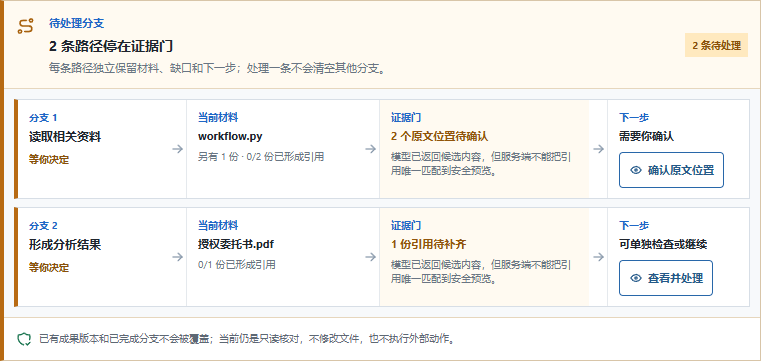
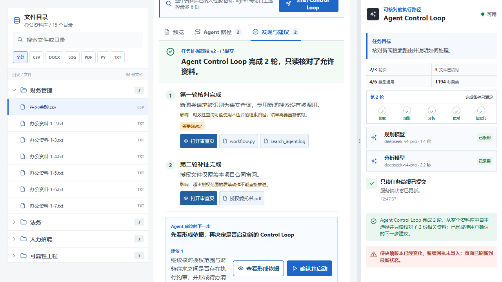

# DR-0033-CLOSABLE-REVIEW-BRANCH-LANES-EVIDENCE-20260827

## 状态

`Limited Verified`。实现、自动化、真实 PostgreSQL 顺序 Runtime 回归与页面截图已完成；提交与
PR 记录在合并后由 Git 历史提供。本 Evidence 不把自动化或单一 Stakeholder 反馈写成用户研究。

## 修复前证据

真实页面与 API 日志共同定位到：关闭 ambiguous Resolution 时多次 POST control 返回 409；Run
Snapshot v21 的开放 `DecisionRequest` 位于顶层，而前端只从 round `next_step` 读取，导致
`decision_request_id` 丢失。三张原始截图、尺寸、字节和 SHA-256 见
[`USER-FEEDBACK-20260827-CLOSABLE-REVIEW-AND-BRANCH-LANES`](../sources/USER-FEEDBACK-20260827-closable-review-and-branch-lanes.md)。

## 验证账本

| Gate | 当前结果 | 能证明什么 |
| --- | --- | --- |
| Python | `83 passed, 2 skipped`，14.53 s | memory Runtime、协议与既有控制路径未回归；两条 PG 门在无 DSN 的通用全量命令中按设计跳过 |
| PostgreSQL 17.11 | `2 passed`，10.26 s | 真实数据库下 DR-0032 待决单、DecisionRecord、目标 Branch 恢复与 v1/v2 顺序重启路径未被本前端改动破坏 |
| Ruff | `passed` | Python 静态检查通过 |
| Web lint | `passed` | TypeScript/React 静态检查通过 |
| Production build | `passed` | Next.js 生产构建成功 |
| 完整浏览器 | `24 passed`，42.9 s | Workspace、Control Loop、顶层 packet、202/409 关闭、Decision 与 Branch recovery 的受控浏览器路径未回归 |
| 截图复核 | `2 passed`；两张截图人工复核 | 分支行和回执冲突后已关闭的页面状态与设计一致 |

## 修复后页面证据

### Evidence Gap 改为分支路径

每条分支在点开前即可看到当前材料、Evidence Gate 状态和下一步；这只是 Branch 服务端事实的
投影，不表示后台启动了多个 Worker。

### defer 回执冲突不再锁住用户

模拟控制接口返回 409 后，审查页已经退出，主页面保留非阻塞“暂缓回执未写入”提示；页面没有
把失败伪装成已记录。

| 文件 | 尺寸 / 字节 | SHA-256 |
| --- | --- | --- |
| `dr-0033-branch-evidence-lanes.png` | `761 x 361` / `38145` | `97F4DD10EE6CECD40218D48DA4996C160F44D1CADCAFFE8B8DC9BDB1F10A5C48` |
| `dr-0033-review-closed-after-conflict.png` | `1280 x 720` / `119029` | `EEB91275B404B540DC18E5512DC0E47C640D717DFC85943B53507B05C6D0A7E7` |

## 协议与交互结论

- Snapshot 顶层 `decision_requests[]` 是开放待决单的权威来源；历史 round 字段仅兼容旧数据。
- 关闭审查页与写入 `defer` 是两个结果：前者必须立即可达，后者以控制回执和刷新后的 Snapshot
  为准。
- 分支路径由 `branch_id` 连接 Branch、Gap、Resolution 与 DecisionRequest；没有 Resolution 时只
  显示可证明的缺口，不伪造原文位置。

## 不能推断

- 分支行是 Branch/Gap/Decision 服务端事实的可视化，不证明多 Worker 或并行调度。
- 关闭可达性与自动化通过不证明目标用户理解、信任、效率或任务质量提高。
- defer 失败时只证明浏览器没有困住用户；是否记录成功必须继续以返回 Snapshot 为准。
- PostgreSQL 门证明单实例顺序恢复，不证明 CAS、多实例并发安全或独立 Decision ledger。
