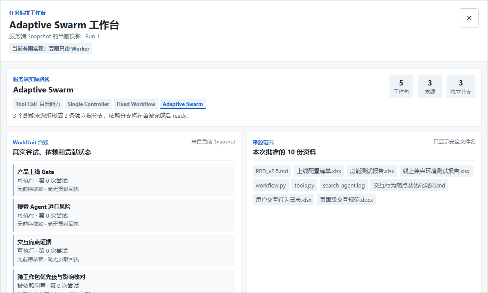
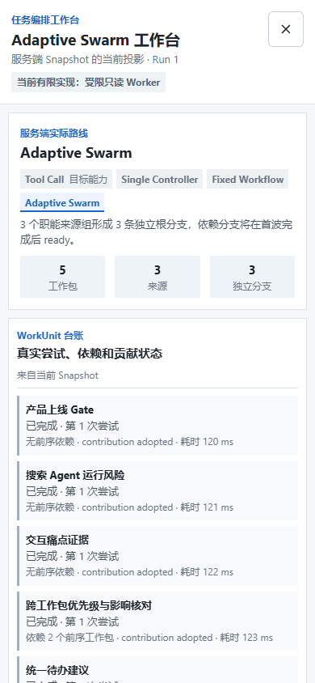

# DR-0056：Demo 1 / Demo 2 分层工作面工程 Evidence

## 证据元数据

| 字段 | 内容 |
| --- | --- |
| 状态 | `Limited Verified`（工程范围） |
| 日期 | 2026-09-01 |
| 决策 | [`DR-0056`](../decisions/DR-0056-demo1-loop-and-adaptive-swarm-workspaces.md) |
| 场景 | [`SCENARIO-043`](../scenarios/SCENARIO-043-task-conversations-and-adaptive-swarm-workbench.md) |
| 测试合同 | [`Demo 1 / Demo 2 分层工作面验收门`](../testing/DEMO1-DEMO2-SEPARATED-WORKSPACE-GATES-20260901.md) |
| 原始实现提交 | `f942b3a`、`da6cbbc`、`e9635bb` |
| 本分支等价提交 | `f1b2fac`、`031b4ea`、`e580b36` |

## 本轮证明了什么

1. 根页面可从 Owner 范围内最近 20 个 Run 按 `task_id` 分组任务会话；同 Task 的 Run 1、
   Run 2 留在同一组，不同 Task 不按同名 instruction 合并。
2. 打开记录时以前台 Task pointer 判断 current/history。历史 Run 可查看但不接 SSE，不提供
   控制；切回非终态 current Run 会从其 `last_event_sequence` 继续连接。
3. Demo 1 的 Task Contract、Round、Branch、Evidence、ArtifactVersion 与 Run lineage
   留在默认 Agent Control Loop；完整 Worker/WorkUnit/Contribution 台账不再挤在主页面。
4. Demo 2 可打开独立全屏 `Adaptive Swarm 工作台`，显示服务端实际路线、10 份批准来源、
   5 个业务 WorkUnit、依赖/阻塞、Worker 回执、Contribution 状态和逻辑 v1/v2。
5. Adaptive 正例明确标注“当前有限实现：受限只读 Worker”；Fixed Workflow 反例明确显示
   “本次未启动 Adaptive Swarm”，不生成假 Worker 或假 Contribution。
6. 工作台支持 `Escape` 关闭、焦点回到入口；被测事实文字不小于 13 px，390 px 单列没有
   页面横向溢出。

## 图形证据

下列图片由 Playwright 固定 Fixture 生成。Fixture 使用公开 Snapshot 合同，不是实时
Provider 运行，不是 PostgreSQL 重启证据，也不是目标用户研究。

### 图 1：任务会话与 Run 回看

- 文件：`dr-0056-task-sessions.png`，460 x 367，20630 bytes。
- SHA-256：`CF40C6EC583B8187C8AB11C3F60A1AC01E5A9483DF483F349FB51BED8BE0D1A7`。
- 可见事实：两条 Task 分成两个会话；第一条会话内保留两个 Run；页面明确发现范围为最近
  20 个 Run。

### 图 2：Adaptive Swarm 桌面工作台

- 文件：`dr-0056-adaptive-swarm-workbench.png`，1120 x 672，66009 bytes。
- SHA-256：`0EA27E4E249F48F7E2F77061DB59570D22027D96420C6B5BA3F1B610BB995880`。
- 可见事实：实际路线为 Adaptive Swarm；边界是受限只读 Worker；工作台显示 5 个工作包、
  3 个来源组和 3 条独立分支；业务名称与依赖状态来自 Snapshot。

### 图 3：390 px 单列与两波回执

- 文件：`dr-0056-adaptive-swarm-workbench-390.png`，390 x 844，49864 bytes。
- SHA-256：`0822713A06B3420904F93C22A138F53423A035D7C173937AEE819E76BEE9CFC9`。
- 可见事实：路线和计数先出现，五个业务工作包按单列显示；已完成 WorkUnit 显示
  `contribution adopted` 和真实 fixture 耗时，被依赖项保留依赖说明。

## 自动化结果

| 门 | 结果 | 能证明 | 不能证明 |
| --- | --- | --- | --- |
| DR-0056 定向 Playwright | `4 passed` | 会话隔离、历史只读、current SSE、Adaptive/Fixed 两类工作台路径和截图钩子 | 真实模型、网络或用户理解 |
| 全量 Playwright | `73 passed` | 现有 15 目录/96 文件、预览、Loop、Task/WorkUnit 和新增分层页面未在被测浏览器路径回归 | 任意浏览器、长期稳定性或业务正确性 |
| 全量 Python | `418 passed, 23 skipped` | 现有 Runtime/API/合同回归；最终追加提交只改前端和 E2E | 23 个环境门、真实 Provider 或生产多实例 |
| Ruff | 通过 | 被检查 Python 规则通过 | 语义正确或前端质量 |
| 前端 lint | `tsc --noEmit` 通过 | TypeScript 类型门通过 | 运行时效果或可用性 |
| Next.js build | 通过 | production build 可生成 | 部署、SLA 或线上兼容性 |
| 汇报治理测试 | 通过 | living docs 的治理约束未被已知规则破坏 | 来源内容绝对正确 |
| 变更 Markdown 链接检查 | 通过 | 本轮变更文档的相对文件链接存在 | 外部站点未来可用性 |
| `git diff --check` | 通过 | 无空白错误 | 功能正确 |

## 运行边界

- 会话区只发现 `GET /v1/harness/runs?limit=20` 返回的记录，不是完整 Task list、全文搜索或
  无限历史。
- `Adaptive Swarm` 当前映射的是 `adaptive_readonly_workers`：单 API 进程、每波最多三个、
  只读 Analyst Worker；没有分布式 queue/lease、远端 Worker、动态扩缩或多实例调度。
- 当前 Supervisor 是 Planner、Runtime 与 Branch/WorkUnit DAG 的有限组合；没有完整
  Conflict Resolver、Tool Gateway、Connector 或外部动作。
- ArtifactVersion 是可审查、可恢复的逻辑成果；没有 `workspace_artifacts` 时不代表已生成
  DOCX/CSV。
- 自动化与截图不证明“更清楚、更高效、更可信”。至少五名目标用户的形成性走查仍未运行。
