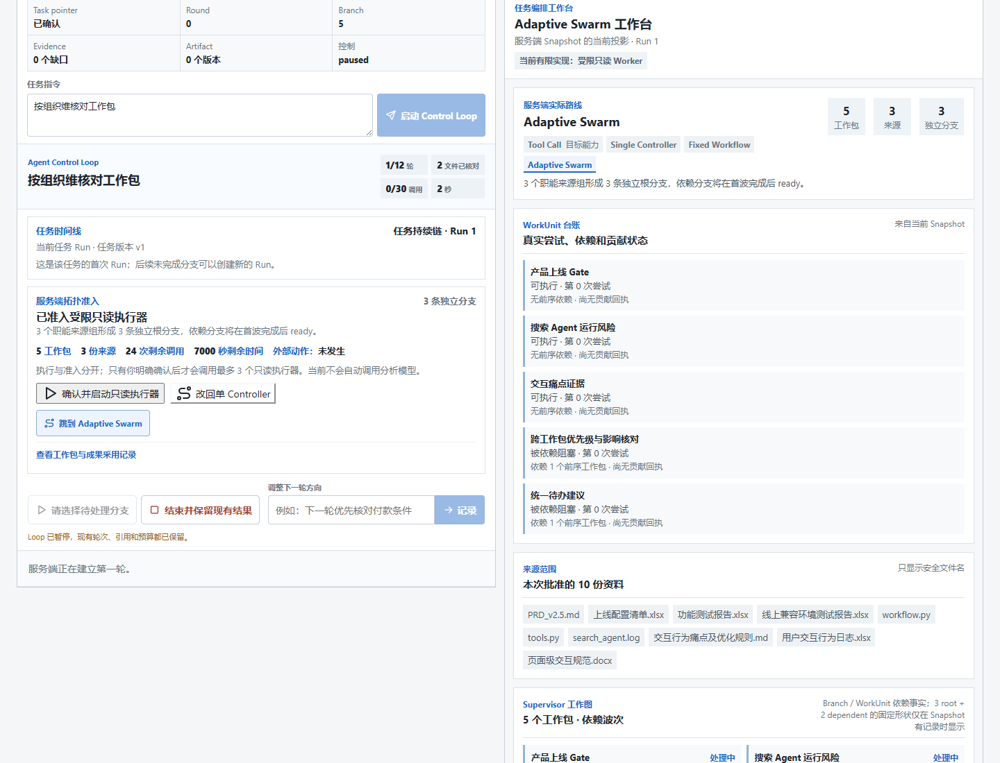
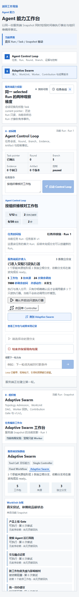

# DR-0057 Agent 能力页工程 Evidence

## 元数据

| 字段 | 内容 |
| --- | --- |
| 日期 | 2026-09-01 |
| 状态 | `Limited Verified`，工程纵切 |
| Decision | [`DR-0057`](../decisions/DR-0057-agent-capability-page-and-smart-cockpit-boundary.md) |
| Scenario | [`SCENARIO-044`](../scenarios/SCENARIO-044-agent-capability-page-and-future-smart-cockpit.md) |
| 测试合同 | [`AGENT-CAPABILITY-PAGE-AND-COCKPIT-BOUNDARY-GATES-20260901`](../testing/AGENT-CAPABILITY-PAGE-AND-COCKPIT-BOUNDARY-GATES-20260901.md) |
| 研究与来源 | [`DEMO1-DEMO2-SEPARATED-VIEWS-AND-ADAPTIVE-SWARM-UI-RESEARCH-20260901`](../research/DEMO1-DEMO2-SEPARATED-VIEWS-AND-ADAPTIVE-SWARM-UI-RESEARCH-20260901.md)、[`SOURCE_REGISTER`](../decisions/SOURCE_REGISTER.md) |

## 1. 实现提交

Luna 子 Agent 在独立源码 worktree 完成并验证：

- `19948176238f0c3358e1d3ac10fe8f4036e9a6d0`：新增 `/agent-capabilities`、同页真实 Loop 与
  Adaptive 投影、安全 Catalog fail-closed、EvidenceReviewDialog 与历史只读处理；
- `a3d7f99245cc9ade101977df6e390b0b13bf4145`：修复页眉导航间距，把能力页内的旧“打开
  工作台”改成跳转到同页 Adaptive 能力，并增加 hash、目标可见和无假驾驶舱断言。

本验证分支上的等价提交为 `4776ea0` 与 `d7a1f80`。设计纠正和 living docs 提交为
`070dbd8` 与 `9c8b324`。

## 2. 当前可证明的前台行为

1. Workspace 顶部可进入 `/agent-capabilities`，直接刷新后仍通过公开 API 恢复 Owner 的
   Run，而不是依赖浏览器常量。
2. 页面把 Agent Control Loop 与 Adaptive Swarm 显示为两个同级能力区。两者共用当前
   selected Task/Run/Snapshot；切换任务会话或历史 Run 时一起切换。
3. Loop 区显示 Task pointer、Round、Branch、Evidence、Artifact、控制和实际 Loop 详情；
   页面内按钮只滚动到 Adaptive 区，不再假装打开另一个 Demo 2 页面。
4. Adaptive 区显示服务端实际 `TopologyAdmission`、安全来源名、Branch/WorkUnit 依赖、
   Worker receipt、Contribution Gate 与 ArtifactVersion。Fixed Workflow 反例不生成假 Worker。
5. 能力页可以从 Finding 打开真实 EvidenceReviewDialog；文件名称来自安全 Catalog。历史
   Run 的审查可读但不记录控制、决策、恢复或新任务操作。
6. Catalog 不可用时页面 fail closed，不用本地常量补来源、拓扑或回执。
7. DOM 没有“智能工作驾驶舱”、固定“客户 A”队列或无合同的驾驶舱入口。智能工作
   驾驶舱仍是后续独立实现目标。

## 3. 截图

### 桌面

- 文件：`dr-0057-agent-capabilities-desktop.png`
- 尺寸：`1440 x 1100`
- SHA-256：`70C7F26E237BF3D4F1157515F54A6212A07BB9035ECD5830F51E35403B5A4DA2`

### 390 px

- 文件：`dr-0057-agent-capabilities-390.png`
- 尺寸：`390 x 2912`
- SHA-256：`FC07427CFD02DA7C3DE1F59C8F7872A69663CF89505425B6F77FB8335A0100C2`

两张图由 `CAPTURE_DR0057_EVIDENCE=1` 的确定性 Playwright Fixture 生成。它们证明当前
DOM、布局和公共 Snapshot 映射，不是真实 Provider、真实企业任务或目标用户研究截图。

## 4. 验证结果

| 门 | 结果 |
| --- | --- |
| DR-0057 定向能力页 Playwright | `4 passed`；覆盖独立路由、同 Run 双能力、current/history、Adaptive/Fixed、真实审查入口 |
| 截图钩子复跑 | `1 passed` |
| 全量 Playwright | `77 passed in 2.7m` |
| 全量 Python | `418 passed, 23 skipped in 315.20s` |
| Ruff | `All checks passed!` |
| Web lint | 通过，`tsc --noEmit` |
| Web build | 通过，静态路由包含 `/` 与 `/agent-capabilities` |
| 汇报治理 | `4 passed` |
| `git diff --check` | 通过 |

源码子 Agent 的独立 worktree 还执行了全量 `77 passed`、lint、build 与 diff check；本分支
再次执行上表全量门。`next-env.d.ts` 的 build 生成差异未纳入提交。

## 5. 不能证明的内容

- 没有实现智能工作驾驶舱、真实业务任务队列、优先级、跨 Task dispatch、四路线通用执行
  或 Demo 3 转交；
- 没有证明 Dynamic Workers、分布式 Swarm、durable queue/lease、远端 Worker、多实例
  Scheduler 或生产身份；
- 本轮没有复跑真实 PostgreSQL 和真实 Provider；23 个环境相关测试保持 skip；
- 固定 Fixture、截图和自动化不能证明用户理解更快、信任更高、业务质量更好或 Adaptive
  Swarm 比 Single Agent 更优；
- Evidence Anchor 证明位置与成员关系，不证明语义蕴含、穷举或数值正确。

## 6. 下一阶段

智能工作驾驶舱必须另立公开合同、Decision、Scenario 和 Evidence。实现前先定义真实任务
队列与优先级事实、四路线准入/执行回执、返回驾驶舱状态、待我确认队列和 Demo 3 Risk
Gate 转交；没有这些服务端权威时，不得用静态卡片代替产品完成度。
