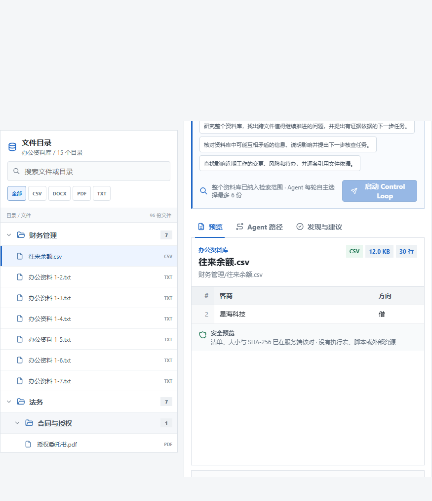
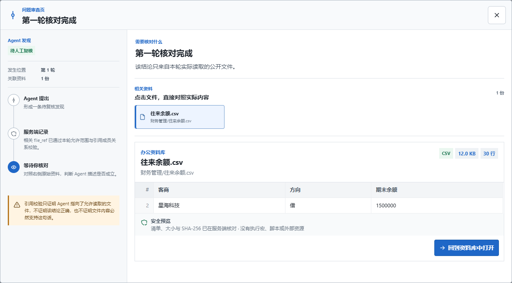

# 分层文件目录与问题审查页 Evidence（2026-08-26）

> 状态：`Limited Verified`。本文件证明当前 FORTE workspace 投影可以在浏览器中形成
> 分层目录树，并且 Gap、Branch、Finding 与建议具备可打开、可回到真实安全预览的审查
> 入口。它不证明 Agent 结论正确、建议有逐项引用、用户效率提高或真实企业文件系统接入。

## 1. 失败观测与验证问题

修复前，服务端虽提供 15 个 folder 和文件 `display_path`，浏览器却把 96 份文件平铺为
一张长列表。运行时的 Evidence Gap 只显示摘要和数量；用户无法从缺口卡直接查看问题描述、
关联文件和实际内容。Stakeholder 反馈见
[`USER-FEEDBACK-20260826-22`](../sources/USER-FEEDBACK-20260826-22-hierarchical-workspace-and-evidence-review.md)。

该图来自修改前本机浏览器页面，`1280x720`、`96341` bytes、SHA-256
`628C38B8F4059A6611C65BC446ABF2CDEE731BFEAC9AF1A6E29123ECE1FA744A`。它证明当时被观察到的
布局，不证明目标用户普遍存在相同困难。

## 2. 当前实现事实

| 用户看到的能力 | 权威事实 | 实现位置 |
| --- | --- | --- |
| 顶层目录与嵌套子目录 | workspace `folders[]`、文件安全 `display_path` | `apps/web/app/harness-workbench.tsx` |
| 展开、搜索、类型筛选 | 浏览器展示状态；不改变 Run scope | 同上、`apps/web/app/styles.css` |
| Branch/Gap 查看问题 | Snapshot Branch、`evidence_gaps[]`、候选/缺失 refs | `LoopView`、问题审查页 |
| Finding 打开审查页 | `result.findings[].title/detail/file_refs` | `ResultView`、Preview GET |
| 建议查看形成依据 | `result.follow_ups[]` + 当前 Finding refs 并集 | `ResultView`；明确非逐项 citation |
| 提交记录式轨迹 | 上述事实的前台组织 | Agent 提出 -> 服务端记录 -> 等待人工核对 |

没有新增 API path。审查页仍通过
`GET /v1/harness/workspace/files/{file_ref}` 读取经过完整性与格式边界校验的内容。

## 3. 分层目录截图

该图来自确定性 Playwright fixture，显示 15 个顶层目录中的已展开财务/法务目录，以及
`法务/合同与授权/授权委托书.pdf` 的三级结构。PNG `875x1013`、`65311` bytes、SHA-256
`C4141DD44D77B6CC3563A4900E10FC305430036C6DA8903E3587E176FFC2C3E0`。

它证明层级 DOM、展开动作和文件预览能在被测浏览器中同时出现；fixture 的“业务目录”
名称只用于覆盖 96 文件规模，不是 FORTE 实际内容质量证据。

## 4. 缺口审查截图

确定性 fixture 把 Branch 设为 `waiting_input`，Gap 绑定候选 PDF。用户点击“查看问题”后，
审查页显示第 1 轮/形成分析结果、Evidence Gate 服务端事实、候选文件和实际安全预览。
PNG `1252x692`、`80592` bytes、SHA-256
`FA52F548A1E95BD966E79F1F100256A3EE047E78D55202F319DE5CBB3FDFF7CD`。

查看问题没有发送 control；只有关闭审查页后点击“继续此分支”，测试才观测到携带
`branch_id` 的 resume。

## 5. Finding 审查截图

该页把逐条 Finding 和其 `file_refs` 对应的 CSV 预览放到同一视图，并显式说明：引用成员
关系校验不等于语义、穷举或数值正确。PNG `1252x692`、`67539` bytes、SHA-256
`48FEA313F87E9B46EBFE3FE9242DE3EC9F0C0DDC36899206F5DB1A5584FB91D8`。

## 6. 自动化观测

| 检查 | 结果 | 能证明什么 | 不能证明什么 |
| --- | --- | --- | --- |
| `pnpm --dir apps/web lint` | 通过 | TypeScript 契约可编译 | 浏览器行为和用户理解 |
| Harness Playwright | `13 passed in 27.0s` | 目录层级、四类预览、Gap/Finding/建议审查、Branch 控制、SSE、390px 路径 | 真实模型、真实 PostgreSQL、语义正确性 |
| 定向截图回归 | `3 passed in 13.5s` | 三张当前交互截图与测试状态绑定 | 真实用户操作和业务效果 |

完整 Python、Ruff 和生产构建在提交前门统一记录；本次前端没有改变公开 API、Runtime 或
数据清单。

## 7. 不能证明什么

- 目录树是 `display_path` 的浏览器投影，不是操作系统目录、企业网盘或 Connector。
- 审查页只能定位到文件；没有 PDF 页、DOCX 段落、CSV 单元格或代码行的服务端定位契约。
- Finding 引用只通过允许范围/成员关系校验，不证明内容蕴含该结论。
- `follow_ups` 没有逐项引用；页面展示的是本轮结果上下文，并明确不是直接证据。
- 自动化与截图不是用户研究；“更容易看清”仍需任务完成率、核对时间和理解访谈验证。

## 8. 绑定

- 工作分支：`codex/hierarchical-workspace-evidence-review-20260826`
- Decision：[`DR-0028`](../decisions/DR-0028-hierarchical-workspace-and-evidence-review.md)
- Scenario：[`SCENARIO-014`](../scenarios/SCENARIO-014-inspect-agent-issue-in-context.md)
- Source：[`USER-FEEDBACK-20260826-22`](../sources/USER-FEEDBACK-20260826-22-hierarchical-workspace-and-evidence-review.md)
