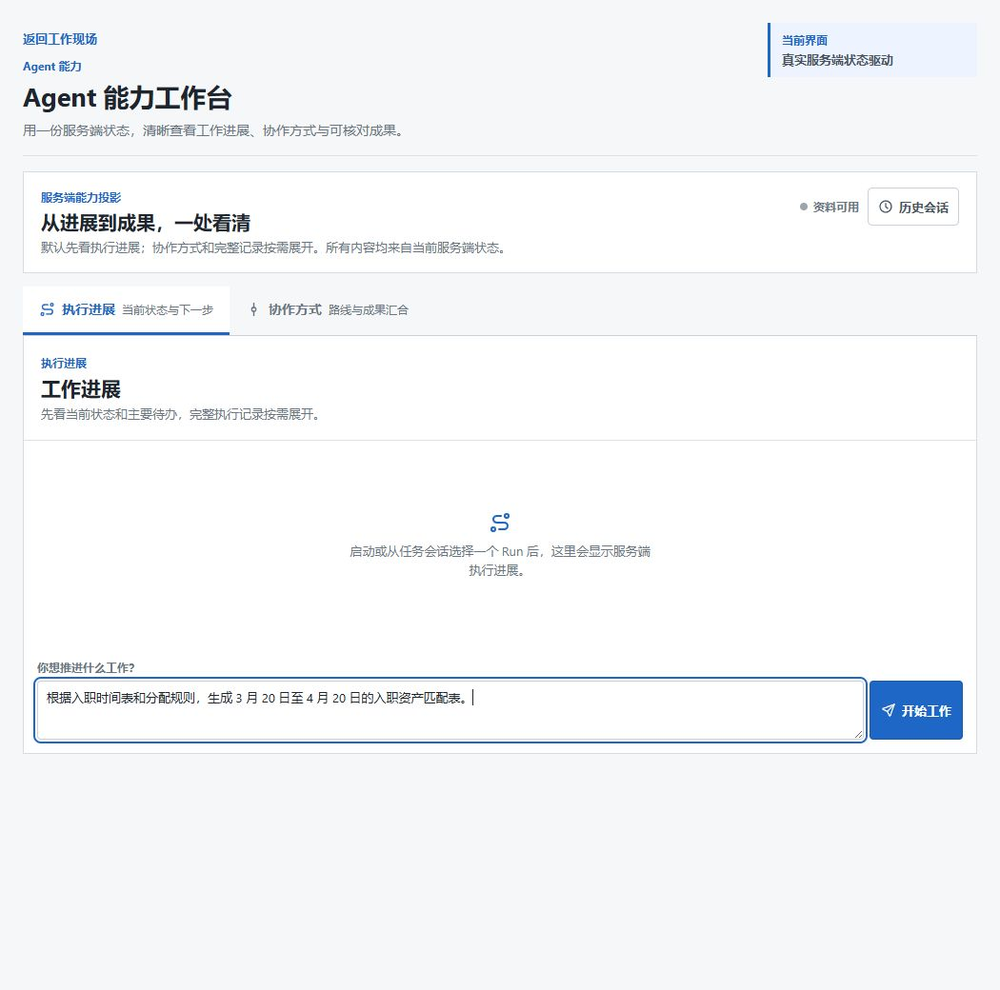
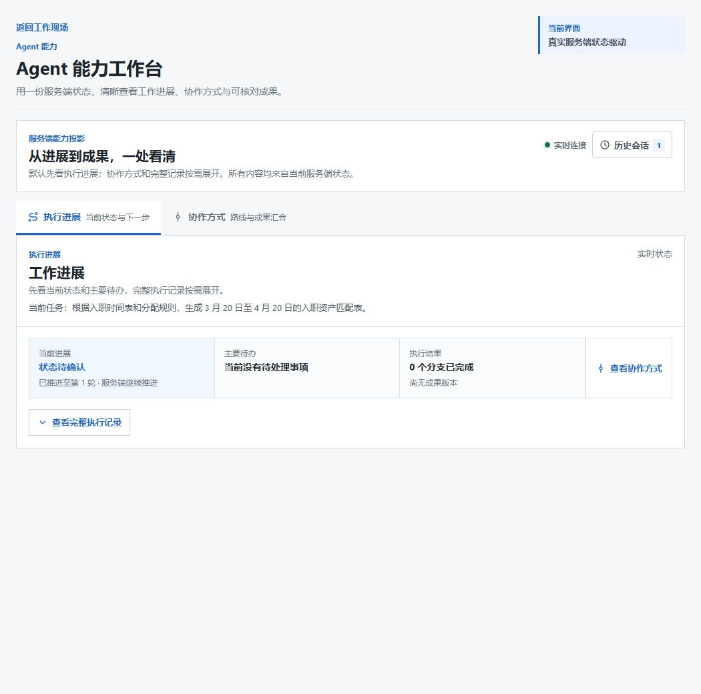
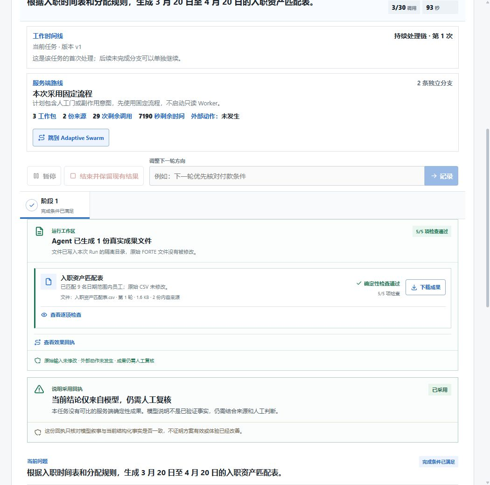
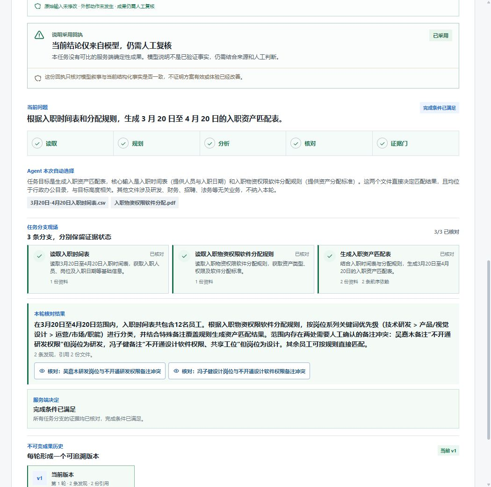
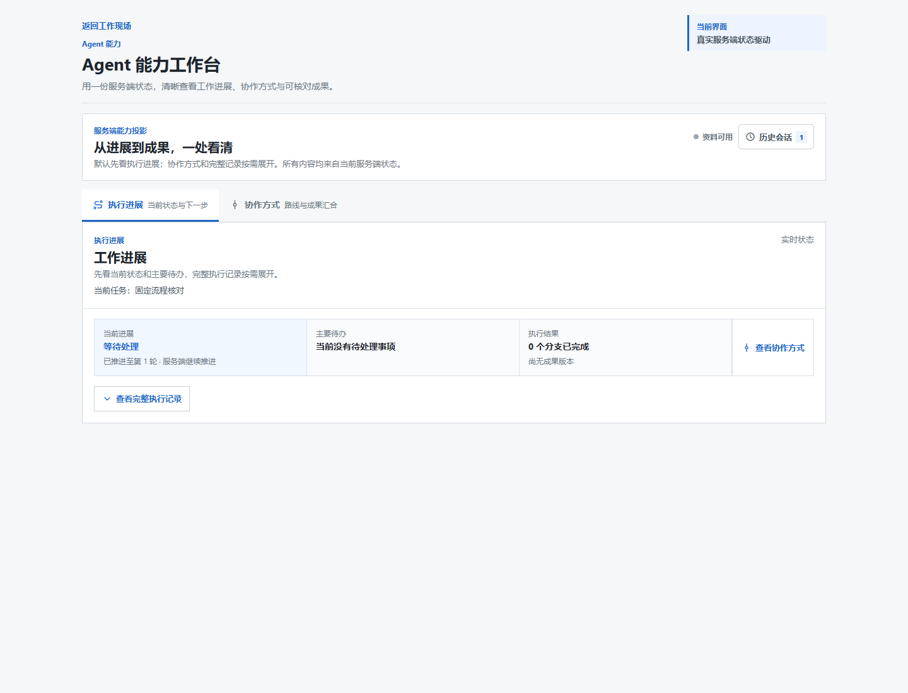
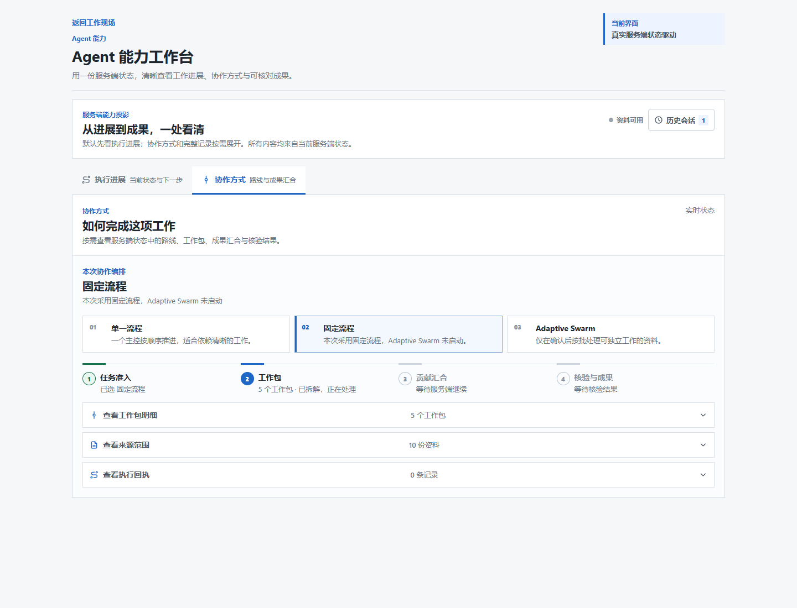
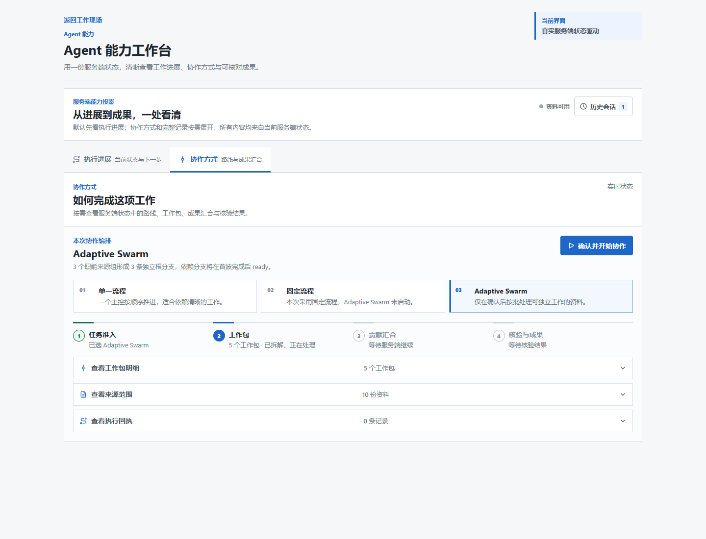
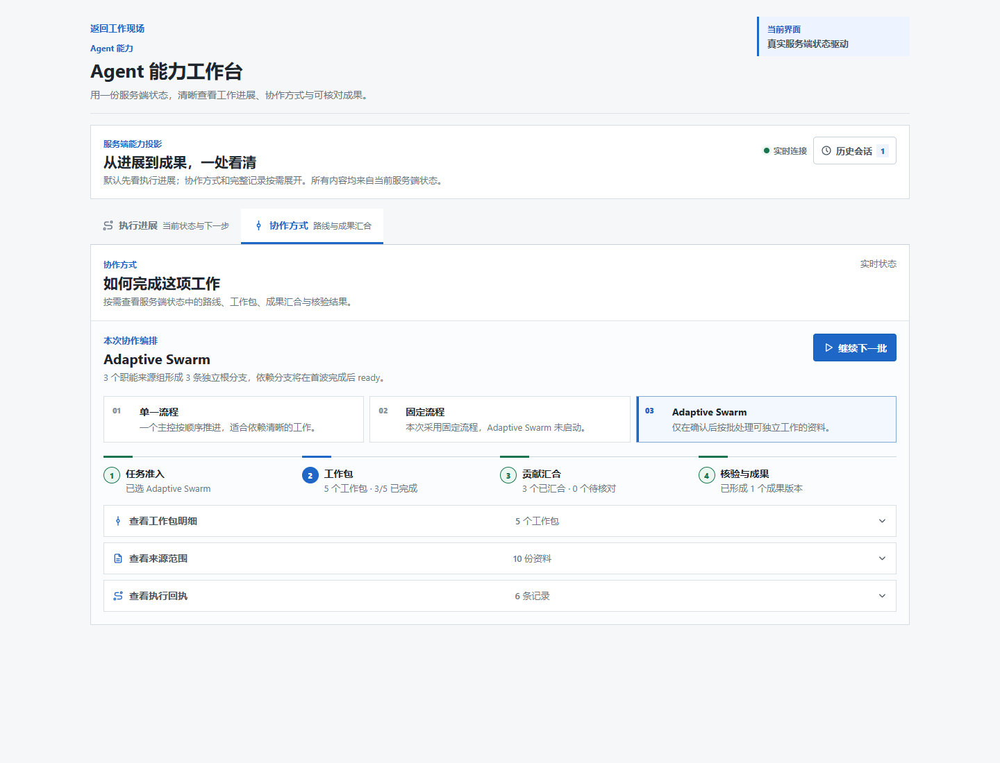
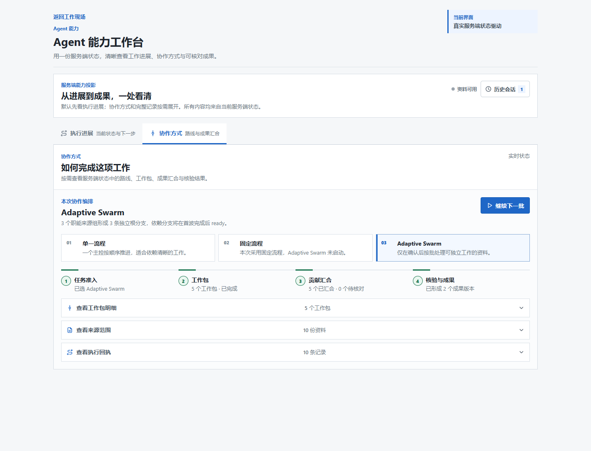
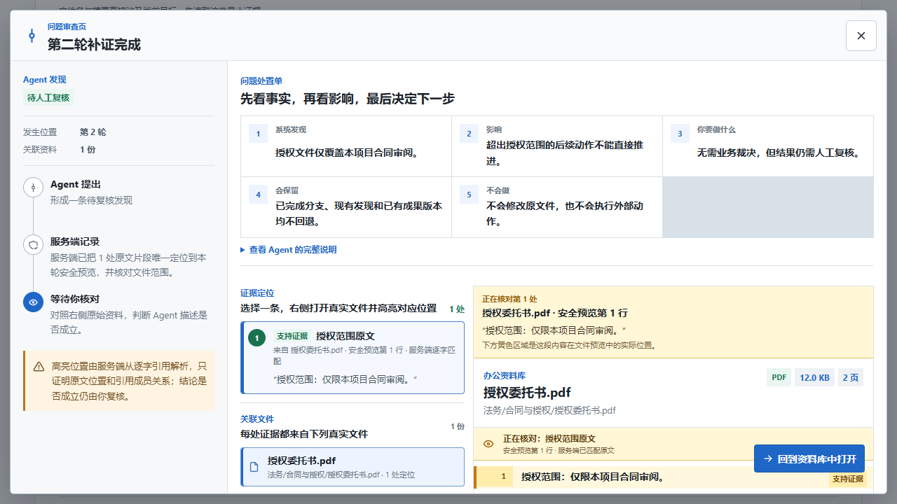

# Agent 能力工作台测试与界面标注（2026-09-01）

## 1. 这次测了什么

本轮不是只看静态设计稿，而是同时做了两类验证：

- **真实本地运行**：在当前 `master=bc52a73`、`deepseek-v4-pro`、
  `checkpoint=memory`、`task_store=memory` 下实际运行 TC-01 入职资产匹配；
- **确定性 UI Fixture**：复跑固定流程、Adaptive Swarm 和证据审查三条浏览器门，
  用固定服务端 Snapshot 检查界面是否如实表达路线、回执和人工动作。

确定性浏览器门结果为 `3 passed`；额外补拍 Adaptive 第二波和证据审查状态时，对应
定向用例也通过。Fixture 只能证明前台状态映射和交互合同，不证明真实 Provider 每次都会
选同一路线，更不证明业务结果正确或用户体验已经改善。

## 2. 用例一：TC-01 入职资产匹配，真实本地运行

### 2.1 输入阶段

| 标注 | 前台想表达什么 | 本轮观察 |
| --- | --- | --- |
| 1 | 用户只写办公目标，不需要预先挑文件或理解 Agent 拓扑 | 输入框承担唯一启动动作，符合 Workspace-first 入口 |
| 2 | “执行进展”是默认视图，“协作方式”按需查看 | 首屏没有把拓扑、Worker、证据细节一次性铺开 |
| 3 | 尚未创建 Run 时不伪造任何状态 | 中央为空态，按钮只有在输入后可用 |

### 2.2 运行中摘要

| 标注 | 前台想表达什么 | 本轮观察 |
| --- | --- | --- |
| 1 | “实时连接”表示页面正在接收服务端当前 Run 的状态 | SSE 正常更新，历史会话计数变为 1 |
| 2 | 摘要只回答“做到哪、要不要我处理、已有多少成果” | 当前显示第 1 轮、0 个完成分支、尚无成果版本 |
| 3 | 用户无需操作时不应被迫进入审查或协作页 | 此时没有可执行的人工按钮 |

**这里有一个真实的表达问题**：页面同时显示“状态待确认”“服务端继续推进”和“当前没有
待处理事项”。系统真正的含义是“后台仍在核对，暂时不需要用户动作”，但“待确认”很容易
被理解为正在等用户确认。建议改成“核对进行中 / 暂无需操作”。

### 2.3 完成摘要

| 标注 | 前台想表达什么 | 本轮观察 |
| --- | --- | --- |
| 1 | `可复核` 不等于业务正确，而是当前结构化结果可以交给人检查 | 3 个分支完成，成果版本为 v1 |
| 2 | 完整记录默认收起，避免把 Run 内部事实淹没在首屏 | 用户仍可主动展开查看路线、调用和证据 |
| 3 | 固定流程与 Adaptive Swarm 是同一 Run 的两种观察维度，不是两个 Demo 开关 | 当前实际路线为固定流程，页面仍允许查看为何没有启用 Swarm |

### 2.4 成果文件与验证边界

| 标注 | 前台想表达什么 | 本轮观察 |
| --- | --- | --- |
| 1 | 文件是 Run 隔离工作区中的真实成果，不覆盖 FORTE 源文件 | 生成 `入职资产匹配表.csv`，可下载 |
| 2 | 确定性检查与模型说明分开 | 文件显示 `5/5` 检查通过；模型说明仍标“需人工复核” |
| 3 | “外部动作未发生”用于防止用户把生成文件误解为已分配资产或已开通权限 | 本轮没有外部系统调用 |

真实运行约 93 秒，调用 3 次模型，服务端自主选择 2 份来源，生成 1 份成果文件；适配器
报告匹配 9 名范围内员工并通过 5 项确定性检查。这里证明的是该固定任务适配器和文件输出
链路可运行，不代表任意入职规则都已经被通用 Verifier 覆盖。

审计 Run 为 `harness:05c77975d7d149f5a8990a1cfdb7d5ed`。服务端在
`13:18:57Z` 先写入并验证成果文件，第一轮分析返回在 `13:19:49Z` 因结构不合格被拒绝，
受控重试直到 `13:20:18Z` 才通过结果与证据门。也就是说，用户看到“成果已生成”后仍有约
81 秒的模型核对尚未结束；这正是前台必须区分“文件效果已通过”和“整轮证据核对已完成”
的原因。

### 2.5 分支、发现与证据门

| 标注 | 前台想表达什么 | 本轮观察 |
| --- | --- | --- |
| 1 | 五阶段条表达当前轮已经经过读取、规划、分析、核对和证据门 | 终态五阶段均完成 |
| 2 | 三张分支卡说明任务怎样被拆开，以及哪条分支依赖前序结果 | 两条读取分支和一条生成分支均已核对 |
| 3 | 绿色结果区是本轮只读分析结论，不是成果文件本身 | 模型给出 2 条需人工确认的备注冲突 |
| 4 | “核对”按钮应把用户带到来源位置，而不是要求用户重新猜文件 | 两条发现分别绑定引用入口 |

本轮没有再出现最终态“缺引用”。此前运行中短暂出现的缺口，最终被服务端证据定位消解；
因此运行中 UI 应明确写“证据核对中”，不要把临时缺口表达成已确定的失败。

## 3. 用例二：固定流程反例，不伪造 Worker

### 3.1 默认进展页

前台先显示当前状态和主要待办。测试断言完整执行记录默认关闭，协作拓扑不会挤占首屏。

### 3.2 协作方式页

| 标注 | 前台想表达什么 | 测试断言 |
| --- | --- | --- |
| 1 | 三张路线卡是解释实际服务端选择，不是让用户手动挑一个 Demo | `固定流程`被高亮 |
| 2 | WorkUnit 可以先被拆解，但不等于 Worker 已经调用 | 执行回执为 0 |
| 3 | 没有启用 Adaptive Swarm 时必须直说原因 | 页面显示“Adaptive Swarm 未启动” |
| 4 | 来源和工作包按需展开 | 默认只显示摘要数量，不平铺全部台账 |

这条用例通过，说明当前前台没有为了展示 Demo 2 而伪造 Worker、Wave 或 Contribution。

## 4. 用例三：Adaptive Swarm 两波协作

### 4.1 用户确认前

| 标注 | 前台想表达什么 | 测试断言 |
| --- | --- | --- |
| 1 | 服务端已经完成准入和五个工作包拆解 | 能看到 5 个 WorkUnit，但尚无执行回执 |
| 2 | 用户确认是启动只读 Worker 的边界 | 主按钮为“确认并开始协作” |
| 3 | 确认前不得冒充实际调用 | Contribution 和成果版本仍为空 |

这里还有一个措辞问题：阶段 2 写“已拆解，正在处理”，但确认前实际调用为 0。更准确的
文字应是“计划已拆解，等待确认”，避免把计划存在误解成 Worker 已开始。

### 4.2 第一波完成

| 标注 | 前台想表达什么 | 测试断言 |
| --- | --- | --- |
| 1 | 三个独立根工作包可以先并行收敛 | 3/5 WorkUnit 完成 |
| 2 | “贡献汇合”与“工作包完成”分开计数 | 3 个 Contribution 已汇合 |
| 3 | 第一波只形成 v1，依赖工作包尚未执行 | 1 个成果版本，按钮为“继续下一批” |
| 4 | 10 份来源、5 个工作包和执行回执都可按需展开 | 默认界面保持四层摘要 |

### 4.3 第二波完成

第二波后，5 个 WorkUnit 已完成、5 个 Contribution 已汇合、形成 2 个成果版本。这证明
依赖满足后可以继续下一批，并且 v1/v2 是追加的逻辑成果历史。

**这里发现一个需要开发修正的 UI 问题**：第二波完成后主按钮仍显示“继续下一批”。服务端
已经没有下一批，按钮应该消失或禁用，并改成“协作已完成”，否则用户会误以为还能继续
产生新工作。

## 5. 用例四：证据审查，不让用户自己找答案

| 标注 | 前台想表达什么 | 测试断言 |
| --- | --- | --- |
| 1 | 左侧先交代发现来自哪一轮、哪份资料以及现在为何需要人 | 当前 Run 可以打开，历史 Run 不会变成可操作状态 |
| 2 | 顶部五格依次回答事实、影响、用户动作、保留内容和不会发生什么 | 用户不需要先理解 `EvidenceResolution` 等协议字段 |
| 3 | 中间给出服务端唯一定位的原文摘录 | 不是浏览器根据 Finding 文案猜位置 |
| 4 | 右侧安全 Preview 高亮真实来源位置 | 用户可以对照来源判断 Agent 描述是否成立 |
| 5 | “回到资料库中打开”保留上下文回开能力 | 审查页不是孤立的确认弹窗 |

这条用例通过。它表达的是“让用户确认结论是否被原文支持”，不是让用户替 Agent 搜索资料，
也不是让用户证明整个业务结论正确。

## 6. 本轮结论与开发优先级

1. **P0 交互修正**：Adaptive 第二波完成后移除“继续下一批”，显示明确终态。
2. **P0 运行中语义**：把“状态待确认 / 当前没有待处理事项”改成“核对进行中 / 暂无需操作”。
3. **P1 准入语义**：确认前把“正在处理”改成“等待确认”，严格区分 DAG 已创建与 Worker 已调用。
4. **保留现状**：固定流程没有伪造 Worker；成果文件、模型说明和证据门分层是正确方向。
5. **后续用户走查**：自动化和本轮人工检查不能证明界面已更清楚，仍需让目标用户完成任务并记录误读、错误点击和完成时间。

## 7. 验证边界

- TC-01 是真实本地 Provider 运行，但状态库为 memory，未验证进程重启恢复；
- Adaptive、Fixed 和证据审查使用固定 Fixture，验证协议到 UI 的确定性映射；
- 本轮没有修改 96 份 FORTE 输入、Manifest 或历史 Evidence；
- 本轮没有验证 PostgreSQL、多实例、真实多 Worker、外部 Connector 或任意办公任务的通用业务正确性。
