# Office Agent V0.2 详细中文汇报稿与图文规划

> 日期：2026-08-25
>
> 用途：会议主讲稿、产品评审底稿与后续 PPT 页面规划
>
> 当前结论状态：限定工程链路为 `Limited Verified`；任务正确性、生产可用性与用户价值仍未验证
>
> 当前事实基线：源码、[`ARCHITECTURE.md`](../ARCHITECTURE.md)、[`UI_SERVER_FACT_MATRIX.md`](../contracts/UI_SERVER_FACT_MATRIX.md) 与 [`DR-0035`](../decisions/DR-0035-scenario-effect-gate-and-run-workspace-artifacts.md)

> 2026-08-25 最新交互修订：`DR-0024` 已取代本文早期 `DR-0022` 的“用户勾选 1-20 个文件 / selected_file_refs”方案。当前产品是一个统一文件管理器；用户只给目标，Agent 面向完整安全索引自主选择每轮证据。本文后文如引用旧勾选流程，均只表示历史设计对照，不得作为当前演示口径。

> 2026-08-26 当前能力修订：`DR-0026` 已取代本文后文“只能整组补证、成果只在
> Snapshot、没有分支级控制/独立 ArtifactVersion/TaskCommit”的旧结论。后文的约
> `30%` 表格和缺口描述继续作为历史基线，不得覆盖本增补。现行能力与边界以本节、
> `PRESENTATION_BRIEF.md` 和 DR-0026 Evidence 为准。

> 2026-08-26 问题处置与恢复修订：`DR-0030` 在 `DR-0029` 的精确原文定位上继续前进。
> 当前 Finding 会把事实、影响和人工动作分开，人工选择与反馈只会创建新的只读 Run；
> 合法范围内的原文定位或结构问题先有界修复，再保留有效工作并暂停最小 Branch。

> 2026-08-26 预算与缺口恢复修订：`DR-0031` 把默认 deadline 从 120 秒提高为 1200 秒，
> 并改为只累计 Agent active 时间；人工阅读和暂停不消耗它。无 Anchor 的 Gap 不再暗示用户
> 修改源文件，而是明确为 Agent 执行缺口，并提供留空线索也能只重试受影响 Branch 的入口。

## 2026-08-27 增补：从“有回答”升级为“有效果证据”

`DR-0035` 取消了固定三轮的产品假设。当前默认完整任务预算是 12 轮、每轮 16 份文件、
30 次模型调用和 7200 秒 active deadline，服务端上限为 24/24/60/14400。等待人工、显式
暂停和终态仍冻结 active elapsed；轮次、文件、调用和时间仍是相互独立的停止边界。本文后文
出现的“三轮、1-8 文件、1200 秒”只表示旧实现与历史 Evidence，不再是当前演示口径。

更重要的变化不是预算，而是新增 **Scenario Effect Gate**。过去的 `completed`、引用成员校验
和一段模型答案只能证明只读分析链路，不能证明办公任务真的完成。现在十二个固定本地能力在
Plan Validator 之后由服务端适配器读取冻结的 FORTE 输入，在隔离 Run Workspace 生成真实
CSV、Markdown、DOCX 或 ZIP，再由命名的确定性 validator 复算字段、数值、排序、规则、
测试结果或禁止动作。Snapshot 同时保存可下载 `workspace_artifacts[]` 和
`effect_receipts[]`，后者逐项记录 `state -> action -> observation -> cost -> result`。

前台因此不再把三个事实混在一个绿色状态里：

1. Planner/Analyst 是否真实调用以及输出是否被采用；
2. 固定本地能力是否生成了真实文件并通过确定性检查；
3. Agent Control Loop 最终是 waiting、completed、stopped 还是 failed。

真实 `deepseek-v4-pro` 运行覆盖 TC-01 入职资产匹配、TC-05 财务跨期核对、TC-10
合规外呼流程、TC-13 客户画像、TC-14 SRE 日志诊断和 TC-15 交互痛点排序。第一份红灯
基线六条全部没有 Artifact，随后补齐执行纵切并迭代模型作用域问题；最终六条都留下真实模型
调用和通过的确定性效果，其中某次 Analyst 未采用或 Run 未终态的负例也保留在账本中。它证明
固定场景效果与恢复路径，不证明模型稳定质量、任意办公任务、用户理解或生产价值。

TC-02/04/06/07/11/12 的固定本地适配器也通过确定性门，形成 12 条本地通过；TC-03
远程 SQL、TC-08 Web 采集和 TC-09 Web+cron 则保留
`blocked_external_boundary`。安全阻断证明系统没有伪造外部效果，不等于任务成功。当前仍没有
通用 Tool Gateway、任意命令沙箱、Web/SQL/Scheduler Connector、多 Worker、多实例协调或
外部动作。完整的逐场景输入、工件、validator、前台效果、Snapshot/event/receipt 与失败证据见
[`SCENARIO-EFFECT-GATE-LEDGER-20260827`](SCENARIO-EFFECT-GATE-LEDGER-20260827.md)
和[`SCENARIO-EFFECT-GATE-20260827`](../evidence/SCENARIO-EFFECT-GATE-20260827.md)。

TC-02 后续暴露了“固定场景通过”仍可能验错对象的典型问题：旧实现另造 9 文件迷你包，
虽然 8 项测试通过，却缺真实 `workflow.py` 和日志，无法证明原项目被改造。`DR-0040` 把效果门
提升为完整 algorithm-013 副本、统一 diff、机器可读变更、下载后独立编译与测试 ID 集合核对。
前台同时显示文件变更、自测卡和人工合并边界。修复后一次真实 Run 的 Planner/Analyst 均调用并
采用，ZIP 15 文件、当前 20 项声明/执行测试一致；但这仍只是固定适配器，不是任意代码沙箱、
自动 PR 或 OS 级网络隔离。更重要的是，下载项目的 `DefaultReActPolicy` 仍按已规划工具确定性
执行，只证明有界、可插拔的 ReAct 控制结构；它没有证明模型依据 Observation 在副本内自主
决定动作。外层 `deepseek-v4-pro` Planner/Analyst 回执是 Run 事实，不是包内 action policy。
两份下载物复用同一组 12 个确定性检查，因此汇总按 `check_id` 写成“共享 12 项、12/12
通过”，而不是把卡片级重复投影夸大成 24 项。修复前的假绿 baseline 被保留，避免汇报只讲成功结果。

TC-04 又暴露了第二种“测了很多但没有测到真实系统”的假绿：旧实现把 105 项动态测试放在
另造的 `contracts.py` 上，覆盖率也只统计替身模块。`DR-0041` 改为复制 dev-015
`input/source-code` 全部 44 个文件，用同一套真实模块测试先跑未修复副本、观察三类缺陷对应的
五个红灯，再修改真实 `model_service.py`、`dataset_service.py` 和
`evaluation_engine.py`。修复后本地收集 117 项，五类为 15/16/15/23/48；三份变更源码各自
超过 80% 语句覆盖率，aggregate 只作补充。前台不再只给“117 项”这个数字，而是显示真实
测试文件、分类数量和可展开 collected ID；页面、公共 manifest、ZIP manifest 与实际执行集合
必须一致。它仍是固定 dev-015 适配器，不是通用沙箱、OS 级断网、真实外部 HTTP 集成或自动 PR。

TC-04 的真实运行还暴露了一个“后台实现直接破坏前台体验”的问题：完整副本测试约需一分钟，
旧代码却在 FastAPI 主事件循环里同步执行。结果不是只有一个 Run 等得久，而是用户同时无法读取
这个 Run 的 Snapshot/SSE，甚至 health 与资料库操作也会超时。把客户端 timeout 从 30 秒放宽到
180 秒只能让脚本更耐等，不能让人知道系统是否还活着。现在 Runtime 先在主线程完成完整性核验并
冻结 46 份 allowlisted bytes，再发布“正在复制并运行真实测试”，随后用工作线程执行固定 builder
和子进程。前台不显示虚构百分比，但用户可以继续看资料、Run 状态和有序轨迹；失败会形成独立
`scenario_effect_failed`，不会冒充绿色成果。同一 Run/capability 的进程内 claim 也避免重复调度。
这说明技术差异必须落到交互后果：把长工作移出事件循环，用户等待期间不再失明；但它仍然只是
单 Controller 内的工作线程，不是多 Worker，也不能在 API 重启后续跑子进程。PostgreSQL 只恢复
已经提交的 Snapshot，并按原 checkpoint 规则暂停，不能据此声称实现了 durable Tool Gateway。

TC-12 随后暴露了第三种假绿风险：历史看板工具纵切只有修复后的 9/9，虽然测试命令真实运行，
却不能回答“同一套测试能否抓住原缺陷”。`DR-0042` 把 qa-003 `dashboard-toolkit` 的
11 个 input 全部复制到隔离副本，以同一 71 项 Vitest 依次运行四个阶段：原别名配置先解析失败；
只修配置后暴露增长率分母、排序修改调用方数组、相等值稳定性与日期函数未导出；只补导出后
继续暴露日期闭区间问题；最后应用四文件 diff 才达到 71/71。三个测试 suite 为 23/20/28，
页面、公共 manifest、ZIP 和实际 collected ID 必须完全一致；三个变更业务模块的 V8
statements/lines/branches 分别过 `85/85/75` 门。前台因此不再只给一个绿灯数字，而是让用户
看到红灯为什么出现、四处修改影响什么、测试具体叫什么、如何下载复跑，以及为什么仍需人工
审查 `changes.patch` 再合并。这仍是固定 qa-003 适配器，没有自动 PR、任意 JavaScript
执行、生产多租户隔离或 OS 级断网。

最终真实 Run `harness:c4bd926b13a44665aa49429d177305a9` 把这项差异落成了可测交互事实：
场景总耗时约 165 秒，但长构建活跃期间 61 次 Run GET 的最大延迟为 47ms、61 次 health 的最大
延迟为 16ms，SSE 能立即读取 started 事件；全过程 286 次 Run GET 最大 578ms。下载 ZIP 后独立
复跑 117/117，确定性 Artifact 效果通过；同一 Run 的 Analyst 最终输出未采用、整轮为 failed。
汇报必须同时保留这两个状态，不能用绿色成果掩盖模型/Control Loop 失败，也不能因为整轮失败抹去
已经通过且可下载的成果。

## 2026-08-27 增补：把“卡住”改造成可判断、可重启、可局部恢复

`DR-0032` 继续修复一个更具体的失败体验：同一段原文出现多次，或当前来源已经变化时，旧系统
要么随机指一个位置，要么整轮失败。现在模型只负责给出逐字 quote 候选，服务端把定位结果编译
为 `exact/ambiguous/unavailable/stale/rejected`。一条 Finding 无法唯一定位时，只暂停绑定 Branch；
已采用 Finding、已完成 Branch、Planner/Analyst 回执与 ArtifactVersion v1 都保留。范围越权、
Catalog 完整性或任务合同损坏仍整 Run fail closed，没有把安全失败放宽成“尽量继续”。

前台不再只显示“缺少证据”。Decision Packet 先列发生了什么、只影响哪里、已经保留什么和为什么
必须由人判断；随后把每个候选的文件、行号、前后文与真实 Preview 并排。用户可以选择候选、
暂不采用、补充来源线索、只重试目标 Branch、取消待决或结束并保留。每个动作都绑定当前
DecisionRequest、expected version 与幂等键，回执明确 `external_action=none`。`defer` 不是死状态，
断线或刷新后仍能继续作最终选择；`cancel` 也不会伪装成“候选已被否决”。

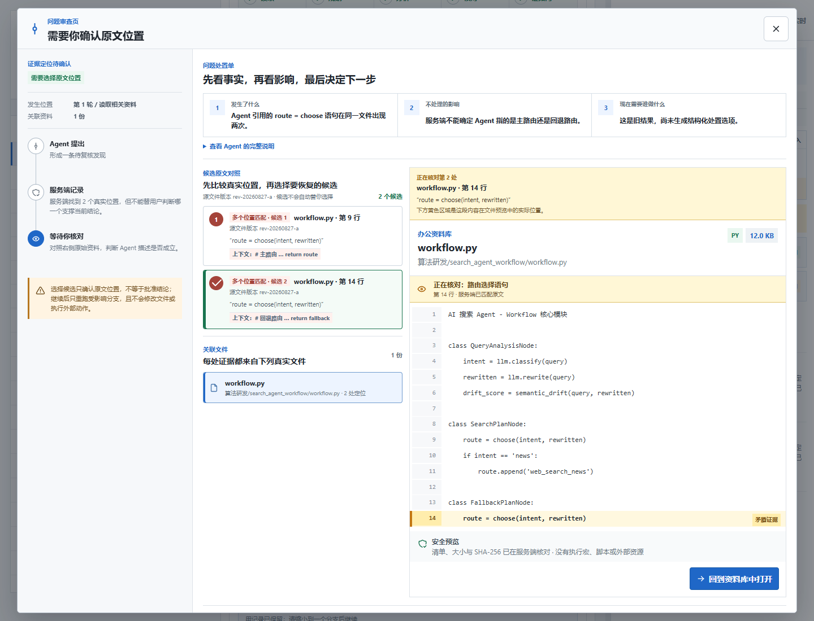

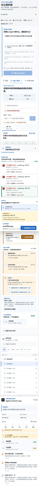

真实 PostgreSQL 17.11 顺序门验证开放的三候选 DecisionRequest 可跨重启保留，accept 后只恢复
目标 Branch，v1 不变并 append v2，再次重启仍一致；确定性五 Finding 挑战验证 4 条 exact 与
1 条 ambiguous 的部分成果不会互相拖垮。真实 `deepseek-v4-pro` 运行则记录首轮两次结构输出
未采用后保留 v1，只恢复一个行政办公 Branch，第二轮采用 4 条 Finding 并 append v2，最终按
“模型调用预算已耗尽”有界停止。它证明的是控制链路，不证明这些 Finding 的语义正确。

## 2026-08-26 增补：把等待时间还给人，把失败责任留给 Agent

真实运行暴露了一个典型的人机协作反模式：Agent 第 1 轮已经花了接近一分钟完成 Planner、
Analyst 和一次结构修复，然后在 Evidence Gate 等待用户。用户阅读文件和思考两分钟后选择
继续，旧 Runtime 却把这段人工等待也算进 deadline，导致第 2 轮尚未真正工作就到达预算边界。
这不是“模型做了很多”，而是预算的时钟选错了。

修订后的 deadline 默认从 120 秒提高十倍到 1200 秒，上限为 3000 秒，并只统计 Agent active
区间。进入 `waiting_input`、用户 pause 或终态时冻结 `budget.elapsed_ms`；合法 resume 后从
已有 active elapsed 继续。轮次、模型调用数和每轮 1 到 8 份文件仍是独立边界，避免用更长
时间换取无界检索。前台停止原因也不再统一说“到达预算边界”，而是区分模型调用耗尽与 Agent
执行时间耗尽。这改变了用户流程：用户可以真正停下来核对，而不必为了抢预算匆忙点击继续。

第二个修订针对“缺少证据”。旧页面只给一份候选表格和整表预览，用户自然会追问“到底哪
一行错了，我要改什么”。但服务端事实可能只是 Analyst 没返回合法结构，或逐字引用无法唯一
定位，并没有证据证明源文件有错。新处置单把它命名为“Agent 执行缺口”，第一屏固定回答：
原本要确认什么、Agent 尝试过哪些文件和调用、已经保留什么、不会发生什么。用户不懂业务
细节也能把线索留空，直接让 Agent 只重试这一 Branch；没有 Anchor 就明确不高亮，也不让人
替 Agent 猜行号。若旧 Run 已终止，同一位置改为创建独立新任务，而不是伪装成 resume。

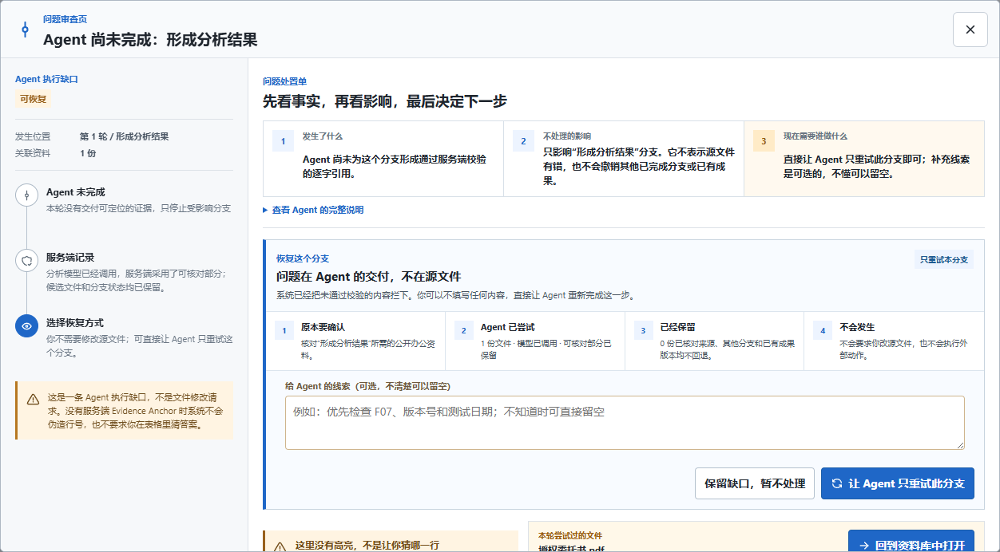

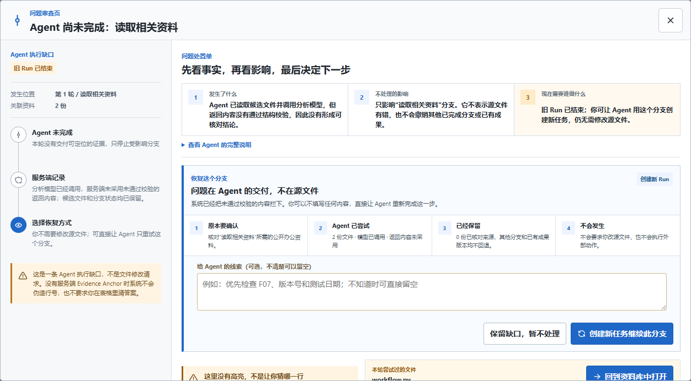

这轮的核心交互主张是：人的时间不等于 Agent 成本，Agent 没交付可核对证据也不等于用户
必须修文件。当前自动化只证明 active elapsed、状态投影和按钮路径按协议工作；它不证明更大
预算提高任务正确率，也不证明目标用户已经理解这套处置方式。

## 2026-08-26 增补：Agent 不只指出问题，还要把问题交给人处理

上一版已经能从 Finding 跳到文件原文，但用户仍然需要自己从长段判断里拆出三个问题：
到底发生了什么、不处理会影响什么、现在是不是必须由我决定。新的问题处置单把这三件事
固定成第一屏的 1/2/3，并把证据索引和真实文件安全预览并排。每个证据都显示文件名、服务端
位置和逐字摘录；点击后右侧实际文件高亮同一位置，不再要求用户在长文件里二次搜索。

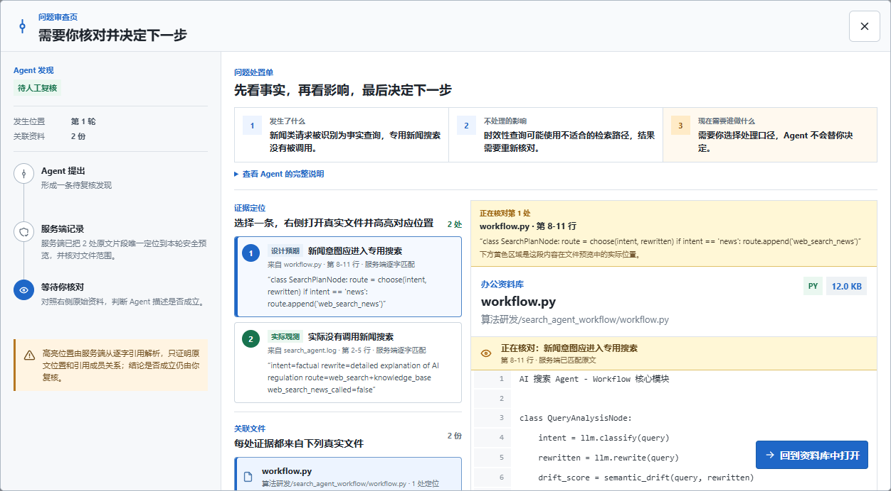

当两个业务来源冲突时，Agent 可以提出 2-3 个互斥处理口径，但不能替用户选择。页面会
说明为什么需要人决定。为避免 Agent 的解释先锚定用户，推荐项默认隐藏；用户先形成自己的
初始选择，再主动点“对照 Agent 建议”查看推荐及理由。用户可以坚持其他方案，并用反馈框
补充“同时核对发布记录中的代码版本”。接受、否决或暂缓会先写入绑定 Finding/Branch 的
版本化幂等 DecisionRecord；接受业务口径后系统才启动新的独立只读 Control Loop。旧 Run、
旧证据与原文件都不改变。这是可审计的人机协作回执，不是业务审批通过或文件修改。

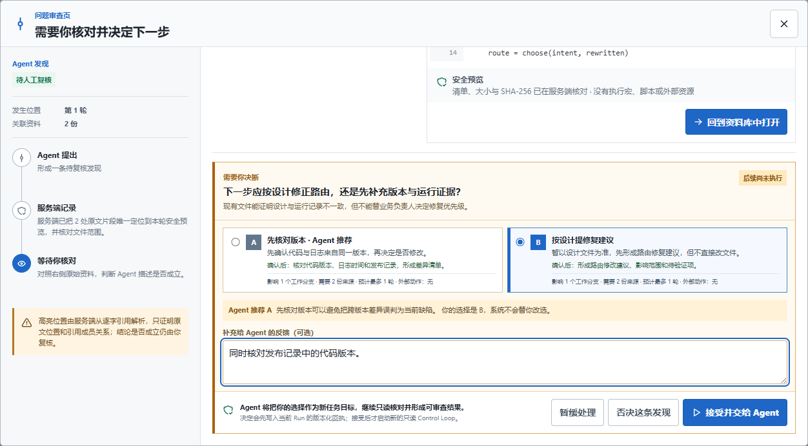

第二个变化是把局部分析问题从“整轮死掉”降为可恢复状态。合法范围内的一条引用无法唯一
定位时，Runtime 最多修复一次，并把位置事实分为 `exact/ambiguous/unavailable`；同一轮其他
可定位 Finding、完成分支和成果版本会保留。多候选时用户直接比较真实文件中的候选位置，
确认后只恢复绑定分支，不再重新运行整个任务。

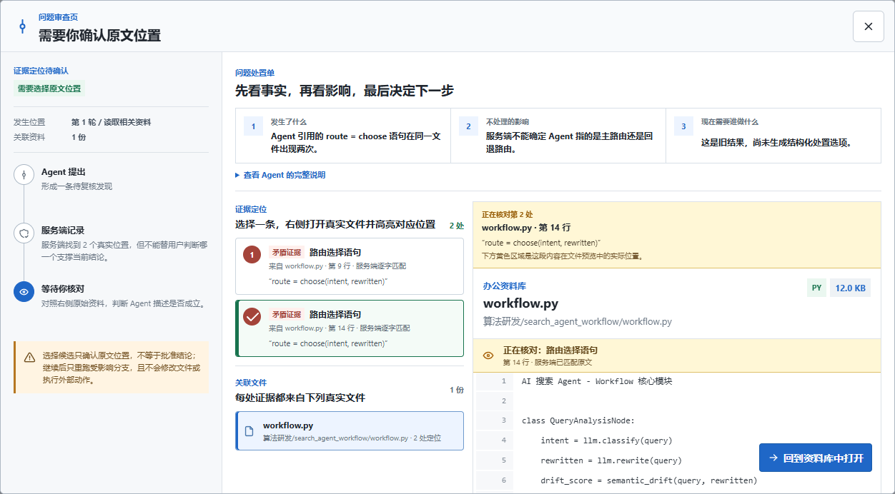


两次都没有可采用内容时，页面明确列出“已保留、未采用、未发生”，让用户只选择一个最小
Branch，必要时补充方向后继续。暂时不处理也不会静默消失：关闭页面会记录 `defer`，重连后
仍能看见决定回执。预算不足则有界停止并保留缺口。范围越权和文件完整性错误仍 fail closed。

真实模型运行又暴露出一个更细的交互陷阱：`stopped/bounded` 已经是终态，如果页面仍说
“选择分支后继续”，用户会误以为旧 Run 能恢复。现在终态卡明确回答三件事：当前只影响哪些
未完成 Branch，Plan、调用回执和 ArtifactVersion 保留了什么，以及没有发生哪些外部动作。
用户可以补充方向，再用某一条 Branch 创建新的 Task Contract。新 Run 仍重新冻结整库索引并
自主选证；旧 Run 不接收 `resume/steer`，也不会被覆盖。这把“恢复”从模糊按钮变成了可审计
的任务交接。


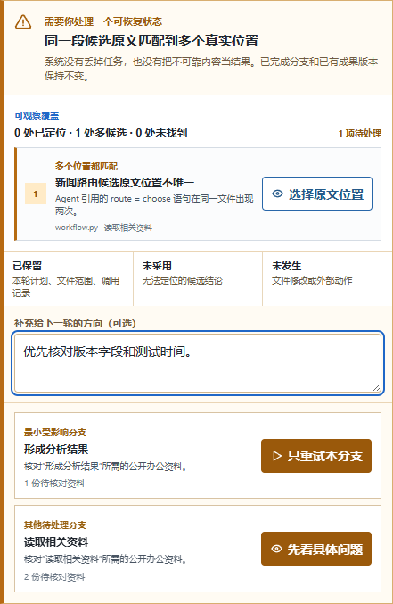

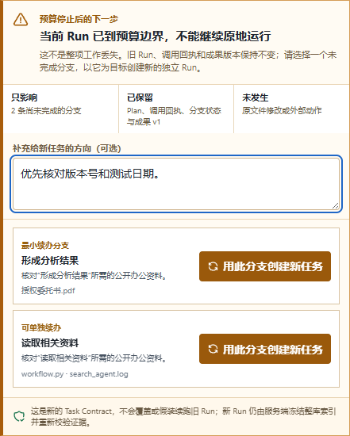

这组设计的交互主张是“把判断权交给人，同时把查找和恢复成本留给 Harness”。当前工程证据
只证明 `accept/decline/defer` 回执、候选消歧和 Branch 局部恢复可运行，不证明模型推荐正确；
可写 Artifact、Tool Gateway 和外部动作仍未实现，清晰度、效率与信任提升仍需目标用户实验。
## 2026-08-26 竞争性修订：不只问“哪里不同”，要验证“为什么必须选我们”

最新 Stakeholder 反馈把汇报问题再推进了一步：技术差异只有改变了用户选择，才有竞争
意义。我们不能满足于说 Office Agent 的 Workspace-first 流程“更透明”或“更可靠”，而要
提出一组可证伪的问题：**当前 Office Agent 能完成什么；最接近的主流产品能否在同一数据、
同一异常和同一验收条件下完成；失败发生在哪里。**

这一修订同时推翻了几种过时说法。Microsoft 365 Copilot 已能引用文件、文件夹、站点、
邮件和工作内容，并提供内联引用与来源侧栏；Copilot Notebooks 可用数百个 References。
NotebookLM（当前官方帮助页重定向为 Gemini Notebook）、ChatGPT deep research 和 Claude Research 都能在多来源上进行带引用研究；
ChatGPT deep research 还允许审查计划、跟踪进度和中途调整。OpenAI 2026 年官方资料也已将
Codex 明确扩展到报告、表格、演示文稿、合同与跨职能知识工作。Claude Code 与 OpenClaw
分别具有 Workspace、Checkpoint、并行 Agent、Permission，以及持久 Task Ledger、revision、
Question/Approval。所以下文第三章仍可用于解释各方案的**交互起点**，但不得再把 Codex
描述为“只能做代码”，也不得把整库、引用、暂停、恢复或并行本身写成独占能力。

当前最值得验证的独占候选是一条**可验证办公结论合同**：

```text
用户只给业务目标
  -> 服务端冻结 96 份安全索引和硬预算
  -> Planner 自主提出本轮来源
  -> 服务端编译实际可读范围、依赖、副作用和人工门
  -> Analyst 只读批准正文
  -> 每条 Finding 必须回到批准来源的服务端位置
  -> 模型已调用与输出被采用分开回执
  -> Branch Evidence Gate
  -> append-only ArtifactVersion + TaskCommit 当前指针
  -> completed 仍固定 review_required=true / external_action=none
```

这条合同的用户价值不是“回答下面多了几个引用”。它让用户能检查：Agent 本轮实际读了
什么；哪些模型候选被服务端拒绝；每条进入成果的结论来自哪里；补证后 v1/v2 是否都保留；
恢复旧版有没有覆盖新版；绿色完成是否仍明确表示待复核、未改文件、未执行外部动作。

| 差异化候选 | 当前本项目能证明什么 | 最接近的主流替代 | 当前允许的竞争结论 |
| --- | --- | --- | --- |
| 冻结整库、逐轮开放最小正文范围 | 96 份索引冻结；Analyst 每轮只读服务端批准的 1-8 份安全投影 | Copilot、NotebookLM、deep research、Claude Research 均有多来源检索 | 本项目原生提供逐轮范围合同；竞品是否满足同一保证待实测 |
| 模型调用与结果采用分离 | Planner/Analyst 的 `called/output_used/elapsed_ms` 分开，服务端可拒绝候选 | Hook、Approval、审查队列可控制通用动作 | 本项目把业务结果采用做成服务端回执；不得说竞品没有审批 |
| Finding 进入成果前必须有服务端 Anchor | 引用在批准 `file_ref` 内唯一解析后才能采用并回开高亮 | 多个研究产品已有引用和来源回开 | 候选差异是“采用门”，不是“有引用”；竞品是否同样 fail closed 待实测 |
| 证据简报版本与当前指针分离 | append-only `ArtifactVersion`，恢复只新增 `TaskCommit` | Checkpoint、Git、Task revision、活动历史 | 本项目原生保存证据约束业务成果版本；不等于竞品无法定制 |
| 完成仍证明待复核和未执行 | `review_required=true`、`external_action=none`，原文件只读 | 主流产品也有只读与审批模式 | 本项目把非动作边界纳入终态合同；完整挑战结果待实测 |

### 图示区零：从市场入场能力收敛到独占候选

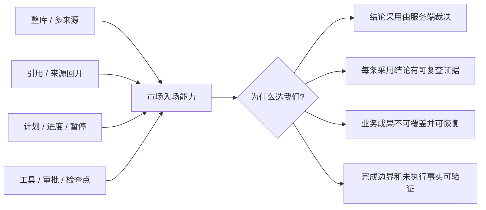

**图 0 讲解词：** 左侧已经是主流产品共同能力，不能再作为领先结论。右侧是本项目已经
形成受限纵切、但仍需竞品同场挑战的候选保证。

对应的前台也要改变。首页不以更长的 Agent 回答为中心，而固定提供“合同回执、来源采用
账、结论证明、问题处置、成果版本链、完成边界”六类对象。尤其是“已调用、未采用”、
“4 条结论保留、1 条定位待处理”、“当前 v1，v2 仍保留”、“未修改文件、未发送消息”这些
负状态，才是本项目区别于只展示最终答案的可见价值。

在竞品实测完成前，汇报只使用“本项目原生提供”“公开产品工作流的首要对象不同”“待同场
验证”。测试必须固定 FORTE commit、15 个目录和 96 份输入，覆盖不知道资料位置、跨文件
冲突、重复 quote、多分支部分失败、清单完整性失败、成果恢复、研究与发送混合指令、外部
数据缺失八个挑战。只有记录产品版本、账户、入口、允许配置、真实运行输出和截图后，才允许
写：“在该固定配置下，该竞品当前不能满足某项验收条件。”

完整官方链接、六项候选、八个挑战、前台输出和研发优先级见
[`Office Agent 可证伪差异化研究`](../research/COMPETITIVE-WHITE-SPACE-AND-FALSIFIABLE-DIFFERENTIATORS-20260826.md)。
该研究当前仍为 `Draft`；它校正竞争叙事，不把目标设计、官方资料或未运行的竞品挑战冒充
实现 Evidence。

## 2026-08-26 增补：用户控制的对象从“整轮继续”变成“选择工作分支”

上一版已经做到证据不足先停下来，但前台只能问用户“要不要全部继续”。这仍然把模型
生成的一组缺口当作一个黑箱：用户看不出哪条工作线已经完成，也无法只把预算花在最重要
的一条。现在服务端会把通过校验的 plan unit 编译为稳定 Branch，再根据已批准引用计算
每条 Branch 的完成和缺证状态。模型不拥有 Branch ID，也不能自己宣布分支完成。

```text
用户目标
  -> 服务端校验 Plan 并建立 Branch DAG
  -> Analyst 只读分析
  -> 服务端按 Branch 核对引用
  -> 多条缺证：统一暂停，不自动继续
  -> 人选择一条 Branch
  -> 下一轮只补该 Branch 的 missing_file_refs
  -> 其他 Branch 保持等待
```

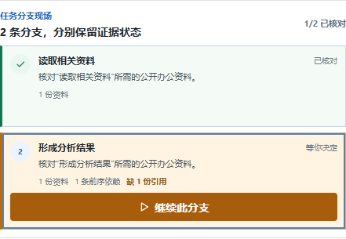

**图 C 讲解词：** 绿色分支是服务端已经核对完成的工作，琥珀色分支仍缺一份引用。
“继续此分支”不是 Demo 播放按钮，而是携带当前 version、幂等键和 `branch_id` 的服务端
控制。回执返回前，前台不会把点击动画说成下一轮已经发生。Branch 仍由一个顺序
Controller 推进，因此这张图不能用来宣称 Demo 2 的多个 Worker 已经并行执行。

第二个变化是成果历史不再靠修改 Run JSON 表达。每个完成轮次的完整只读简报写入独立
append-only ArtifactVersion；最终 Gate 另建 TaskCommit 指向当前版本。用户恢复旧版本时，
系统不会覆盖新版，而是再建一条 `operation=rollback` TaskCommit，移动当前指针。


**图 D 讲解词：** “当前 v1”来自 `last_commit.artifact_version`，不是浏览器本地选择。
v2 仍留在历史中，恢复轨迹也有服务端事件。这里的 Artifact 是 Agent 只读证据简报，
不是 XLSX/DOCX 源文件；所以可以汇报“成果历史不可变、当前指针可恢复”，不能汇报
“办公文件已经写回、回滚或提交”。

这两处技术变化直接改写用户流程：以前用户只能批准整轮，现在可以判断预算应该花在哪条
工作线上；以前恢复意味着担心覆盖结果，现在恢复是可审计的新 Commit。前台新增的是
可决策的业务状态，而不是展示 Branch hash、数据库表、完整 digest、Prompt、思维链或
raw provider response。当前本地门为 Python `63 passed, 1 skipped`、Runtime `26 passed`、
浏览器 `13 passed`、Ruff/lint/build 通过；PR #31 已合并为 `697e38b`，其 PostgreSQL 17.11 顺序 Runtime
workflow 为 `1 passed in 1.84s`。自动化和截图仍不是用户研究，理解、信任、效率和任务价值继续标
`Draft`。

## 最新增补：从“用户先找文件”改为“Agent 找证据，人确认下一步”

这次变化不是把 checkbox 换成搜索框，而是重新分配人和 Agent 的工作。旧流程要求用户先知道答案可能藏在哪些文件里，再把这些文件交给 Agent；这对小演示可控，却违背“大文件夹办公”的真实前提。当前流程把**目标表达权、过程监督权和下一步确认权**留给人，把**检索、证据缩小和跨文件关联**交给 Agent。

```text
旧流程：浏览 -> 人工猜文件 -> 勾选范围 -> 下达任务 -> Agent 分析

当前流程：浏览整库 -> 下达目标 -> Agent 搜索安全索引
       -> 服务端限制每轮证据 -> Agent 分析并引用
       -> Agent 提出下一步 -> 人确认后启动新的 Control Loop
```


**图 A 讲解词：** 左侧不是 Demo 或职业导航，而是 96 份文件的统一文件管理器。搜索、类型筛选和预览只帮助人理解资料，不会偷偷改变 Agent 的范围。用户不再勾选文件，只提交目标和预算。


**图 B 讲解词：** 每轮轨迹公开 Agent 选了哪些文件、为什么选、模型是否被采用以及服务端如何核对引用。终态最多给四条下一步任务；建议本身不会执行，只有用户点击“确认并启动”才创建新的独立 Loop。

这会直接改变汇报中的创新点：我们不再把“显式选择文件”当作核心差异，而把核心放在**整库可浏览、Agent 自主检索可见、服务端逐轮限权、证据可回开、下一步由人确认**。它减少一次前置操作，但没有放弃控制；控制从“人替 Agent 做检索”转移到“人监督 Agent 的选证据和推进建议”。

## 一、开场：我们真正要解决的不是“再加一个聊天框”

今天汇报的核心不是做一张 OpenClaw、Codex App、Claude Code、ReAct 和
Office Agent 的功能对比表，也不是证明哪一种方案“更先进”。我们要回答的是：
当 Agent 从代码或消息场景进入办公资料场景后，用户最先需要控制和核对的对象
发生了什么变化；这种变化为什么要求我们重新安排交互顺序；当前项目究竟已经
实现到了哪一步。

主流 Agent 方案已经证明了几类重要模式：OpenClaw 把常驻 Gateway、Channel、
Session、Tool 和主机执行审批连成长期运行入口；Codex App 把项目 Task、Worktree、
并行 Agent 和变更审查组织成软件交付工作台；Claude Code 把项目目录、Tool Loop、
Subagent 和 Permission 放进开发者熟悉的 Terminal 与 IDE；ReAct 则提供了
Reasoning、Action、Observation 交替推进的通用方法。

当前 Office Agent 没有否定这些模式。它做了一个针对办公工作的刻意选择：
**先把完整资料库摆到用户面前，再让 Agent 自主找证据，同时把选择理由和边界公开。**
用户可以打开安全预览，但只需写出自己的任务；Planner 从完整安全索引中选择本轮材料，
服务端按预算和策略校验后才允许 Analyst 读取正文，最后由人复核结论并确认下一步。

这条路径目前已经在固定公开数据上形成一个有界的 Agent Control Loop 工程纵切：最多
三轮、有预算、服务端 Branch/Evidence Gate，并支持安全点暂停、选择一条分支继续、
调整下一轮、停止和恢复逻辑成果版本。配置 PostgreSQL 时，Snapshot、命令回执、逻辑
ArtifactVersion 与 TaskCommit 可跨顺序 Runtime 恢复。它仍不能执行真实工具、修改办公
文件、完成多 Worker 调度、保证多实例高可用或证明结论正确。这不是附加在演示末尾的
免责声明，而是产品当前的组成部分：前台必须让用户看见“为什么继续、继续哪一条、当前
成果是哪版、待复核、没有外部动作”。

## 二、当前产品：一个办公资料库，一条可核对的只读路径

当前根页面不是 Scenario 或 Demo 选择器，而是唯一的 FORTE 公开办公资料库。
数据固定在 FORTE commit
`345c1ec1487139db9dd319787fa9405ba85d1869`：15 个公开任务目录、96 份
`input/` 文件，共 111 个任务说明与输入文件、`1,780,445` bytes。FORTE 官方
完整 benchmark 报告 180 条任务，但公开仓库只给出每类职业一个示例；本项目没有
取得、也不能声称取得其余 165 条未公开任务。

普通用户只看到 96 份公开输入。`task.md` 只保留为 provenance，不进入普通 UI，
不进入 Analyst 输入，也不会成为隐藏默认任务。每轮任务都必须由用户自己写
`instruction`；服务端冻结完整索引，客户端不再提交 `selected_file_refs`。

### 图示区一：历史工作台与当前文件管理器


**图 1 讲解词：** 这张 `DR-0022` 截图保留为历史对照；当前左侧已经收敛成一份统一
文件管理器，不再把职业目录或文件勾选当作产品入口。中间仍是任务输入、安全
预览、计划和结果，右侧仍是执行轨迹与模型回执。图中可见的 96 份文件、
只读状态和预览内容均来自服务端投影，不是静态演示数据。截图只能证明这一时刻的
可见界面；后端事实由 Snapshot、接口返回与自动化共同约束。

当前八条公开路径、九个 operation 把交互分成四个层次：Workspace 接口回答“有什么资料”，
文件预览接口回答“这份资料里能安全看到什么”，Run、Control 与 named SSE 接口回答“本轮
Agent 实际走到了哪里、用户如何干预”，Artifact 下载接口回答“哪个确定性通过的隔离文件
真实存在”。公开接口不挂载旧 Scenario 路径，也不挂载多 Worker Scheduler、通用 Tool
Gateway、Connector 或外部动作路由。

当前成功路径按以下顺序发生：

1. `GET /v1/harness/workspace` 返回 15 个目录和 96 个文件的公共投影。
2. 用户打开文件，服务端重新校验 allowlist 相对路径、大小、SHA-256、非 symlink、
   压缩结构与格式边界，再返回 XLSX/CSV、PDF、DOCX、文本或代码的有界预览。
3. 用户写出 3 到 2,000 个字符的原创任务，并设置轮次、每轮文件数、模型调用数和 deadline；当前默认 `12/16/30/7200`、上限 `24/24/60/14400`，无需预选文件。
4. `POST /v1/harness/runs` 以 Owner、`idempotency_key`、`expected_version=1`、
   `instruction` 和 Loop 预算接受一个独立 Run，同时冻结完整 allowlisted 索引。
5. 每轮 Planner 从安全元数据索引自主选择证据并返回严格 JSON 业务意图；服务端拥有来源范围、副作用、人工 Gate、
   单元、依赖、工具与引用规则，并负责编译与校验公开 Plan。候选失败最多进行一次预算内修复。
6. 若原创指令与冻结输入满足十二个固定本地能力之一，服务端适配器在隔离 Run Workspace 生成真实文件并运行确定性 validator；否则 Act 保持只读分析。模型不能自行声明工具成功。
7. Analyst 只接收本轮批准文件的安全内容投影，形成带引用的 Finding；其调用/采用与确定性效果分开记录。
8. 服务端 Verify 分别检查引用范围与固定能力的字段、数值、排序、规则或测试结果，Evidence Gate 决定完成、进入下一轮或因预算/用户命令停止。
9. 用户可在模型调用之间的安全点 pause/resume/steer/stop；浏览器只依据返回 Snapshot 更新状态。
10. 浏览器用 named SSE 展示有序变化，用 Snapshot 做最终权威对账；引用按钮重新打开同一份来源文件的安全预览。
11. 通过效果门的 Artifact 可按 Owner/Run 下载；模型未采用不会删除已经验证的真实文件。Agent 最多提出四条下一步任务，用户确认后才创建独立新 Run。

真实封口运行完成 2 轮、8 份文件、5 次模型调用和 21 条事件，其中第一轮候选计划被
服务端拒绝后只进行一次预算内修复。`completed` 只表示 Schema、引用范围、有界循环和
只读边界检查通过，不表示答案正确、数值正确、Artifact 已写入、Tool 或 Worker 已运行，
更不表示外部业务动作已经发生。

## 三、五种方案到底在组织什么工作

### 3.1 OpenClaw：从消息、会话和常驻 Gateway 组织 Agent

OpenClaw 官方材料首先解决的是“Agent 如何常驻、如何从多个 Channel 接收消息、
如何把 Session 路由到 Agent、如何调用 Tool，以及主机执行如何进入审批”。它的
主要交互对象是 Message、Channel、Session 和 Gateway；用户通常先从消息入口发起
意图，再在任务推进中处理工具和执行边界。

这套模式对长期在线、多入口触达和主机工具控制非常重要。它带来的交互后果是：
会话连续性与 Channel 身份天然处于第一层，文件或业务资料可以成为 Tool 的输入，
但不必天然成为首屏的可见契约。

当前 Office Agent 选择不同的首要对象：不是先建立消息会话，而是先展示服务端拥有的
办公资料库。用户可以在模型调用前看文件、看格式和安全说明，但不必预先找齐材料；
Run 启动后再监督 Agent 如何从整库缩小到本轮证据。这并不证明 OpenClaw 不能实现
文件夹优先交互，只说明本项目把“选证据是否有依据”放到了默认主路径。

**来源绑定：** `OPENCLAW-OFFICIAL-20260825`，包括 [OpenClaw overview](https://docs.openclaw.ai/)、
[runtime architecture](https://docs.openclaw.ai/agent-runtime-architecture) 与
[exec approvals](https://docs.openclaw.ai/tools/exec-approvals)。这些来源支持上述官方
设计侧重点，不是竞品实测，也不能支持“OpenClaw 没有办公证据能力”的推断。

### 3.2 Codex App：从项目 Task、隔离工作区和结果审查组织长任务

Codex App 最初以软件任务、Worktree、Diff、Skill、Automation 和审查队列建立交互模型，
但 2026 年官方定位已经扩展到报告、表格、演示文稿、合同、研究与跨职能知识工作。因而
这里能比较的不是“Codex 只做代码”，而是它仍以项目 Task、隔离工作区、产出物和审查队列
作为重要组织对象。

这种模式让任务的结束条件围绕可见产出组织：在代码场景中审 Diff 与测试，在知识工作中
审报告、表格或页面。用户可以并行委派、查看进度、Steer，并围绕结果进行审查。

当前 Office Agent 面对的不是代码 Diff，而是业务文件与业务结论。原始文件保持只读；
十二个固定本地能力可写隔离 Office/代码 Artifact，但没有任意工作区修改能力。因此它不能借用“有 Diff 可审”来代表任务完成。用户要审查的
是 Agent 本轮选择了哪些资料、Planner 和 Analyst 是否真实调用、服务端是否采用其输出、每条
结论引用了哪份文件，以及结论是否仍需人工复核。

**来源绑定：** `OPENAI-CODEX-APP-20260826`，OpenAI 官方文章
[Introducing the Codex app](https://openai.com/index/introducing-the-codex-app/)、
[Codex is becoming a productivity tool](https://openai.com/index/codex-for-knowledge-work/) 与
[Codex for every role, tool, and workflow](https://openai.com/index/codex-for-every-role-tool-workflow/)。
这些来源支持并行 Task、Worktree、Skill、Automation、审查和知识工作扩展，不是 FORTE
办公任务的竞品实测。

### 3.3 Claude Code：从项目目录、Tool Loop 和 Permission 组织开发协作

Claude Code 官方材料重点解决“Agent 如何理解项目目录、如何在工具调用与环境反馈中
循环、如何用 Subagent 拆分工作、如何通过 Permission Mode 控制操作，并在 Terminal、
IDE 等界面中协作”。其主要交互对象是项目目录、命令、Tool 调用、代码变更与权限请求。

项目目录上下文让开发者能够以整个代码库为工作现场。交互后果是：用户可以先给出目标，
Agent 在目录和 Tool Loop 中逐步发现需要的上下文，并在敏感操作前请求权限。

当前 Office Agent 允许 Planner 检索完整的安全元数据索引，但不允许模型静默读取全部
96 份正文。服务端按每轮文件预算裁剪候选、校验来源和依赖，Analyst 只收到本轮批准文件
的安全投影。用户少做一次范围选择，却多得到“本轮选了什么、为什么选、是否被采用”的
过程监督。“这一取舍是否真的提高理解或信任”仍需用户研究，不能从架构本身推出。

**来源绑定：** `CLAUDE-CODE-OFFICIAL-20260825`，包括 [How Claude Code works](https://code.claude.com/docs/en/how-claude-code-works)、
[subagents](https://code.claude.com/docs/en/sub-agents) 与
[permissions](https://code.claude.com/docs/en/permissions)。这些来源支持项目目录、Tool
Loop、Subagent 与 Permission 的官方描述，不证明本项目更易用。

### 3.4 ReAct：从 Reasoning、Action、Observation 组织循环

ReAct 不是一个与上述产品同层级的办公 UI，而是一种 Agent 组织方法。它强调让
Reasoning、Action 与 Observation 交替出现，使下一步计划能够吸收环境反馈，而不是
一次性生成完整答案后停止。

这对 Office Agent 的启发不是把私有思维链完整展示给用户，而是把可审计的业务事实
组织成循环：当前观察了什么来源、提出了什么动作、环境或验证器返回了什么、是否需要
调整计划、何时应该停止。

当前 Office Agent 已实现最多二十四轮的有界近似：Workspace 观察、每轮 Planner、服务端
校验、固定本地适配器或只读 Act、Analyst、确定性/引用验证和 Branch Evidence Gate，并支持预算停止、安全点控制、独立逻辑
ArtifactVersion、TaskCommit、隔离 Run Workspace Artifact 与配置 PostgreSQL 时的顺序 Runtime 恢复。它仍没有通用 Tool Gateway、
外部 Connector、并行 Worker 或多实例调度，因此不能称为完整 ReAct
执行器。普通 UI 展示 named SSE、模型回执、业务 Plan 和引用，明确不展示 Prompt、
chain-of-thought 或原始模型响应。

**来源绑定：** `REACT-ICLR-2023`，Yao 等，[ReAct: Synergizing Reasoning and Acting in Language Models](https://arxiv.org/abs/2210.03629)。
该论文支持 Reasoning、Action、Observation 交替组织的判断，不直接定义持久状态、
办公文件 UI、策略编译、Evidence Gate 或 Commit。

### 3.5 当前 Office Agent：从可检查来源组织办公分析

当前 Office Agent 解决的是一个更窄但可核对的问题：当用户面对一组混合格式办公
资料时，能否在 Agent 调用前知道有哪些文件、看见文件的安全投影，然后只给目标，
让 Agent 自己找证据，并在只读结果形成后回到同一来源复核。

它的主要交互对象依次是 Workspace、文件预览、用户任务、每轮自主选证据、Run Snapshot、
named SSE、Planner/Analyst 回执、Plan、Finding、引用与下一步建议。Demo 1、Demo 2、Demo 3
只是未来通用能力的验收视角，不是当前产品入口，也不会解锁隐藏执行器。

### 图示区二：不同首要对象如何改变默认流程

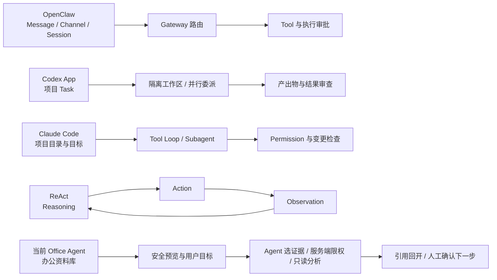

**图 2 讲解词：** 这张图比较的是“默认从什么对象开始”，不是排他性能力。前三种
产品模式都可能扩展到办公文件；Office Agent 也需要吸收它们的 Tool、并行、权限和
循环能力。当前差异只在于：我们把整库可见性置于任务之前，把选证据的理由置于执行中，
把复核与下一步确认置于终态之后。

## 四、为什么选择 Workspace-first：技术选择如何逐步改写用户流程

### 4.1 从“先提问”改为“先知道手里有什么”

服务端持有 `public-suite-manifest.json`，而不是让浏览器根据文件名拼目录，也不是让
模型临时发现未知文件。用户进入页面后先得到 15 个业务目录、96 份输入、格式、大小和
预览可用性。两类只依赖外部系统且没有本地输入的目录会明确显示能力缺口，不能伪造本地
数据。

交互结果是：调用模型之前就可以浏览与判断。Catalog 完整性失败返回受控 503，前台显示
“资料库完整性校验未通过”，不回退到静态假数据；API 离线与文件预览失败也分别呈现，
避免把所有问题都写成“Agent 正在思考”。

### 4.2 从“人先选范围”改为“Agent 选证据、服务端限权”

用户不再用 checkbox 替 Agent 做检索。Run 启动时服务端冻结 96 个稳定 `file_ref` 和
`scope_mode=whole_workspace`；Planner 只读取安全元数据，自主提出本轮最小证据集合。
服务端再按 `max_files_per_round` 限制文件数、修复依赖并校验工具与副作用，Analyst 只收到
这一小组批准正文。超范围引用会 fail closed。

交互结果是：用户少一次前置操作，但范围控制没有消失，而是从静态 checkbox 迁移为过程中的
“选择理由 + 实际采用文件 + 服务端预算 + 引用回开”。任务示例仍只填入可编辑文本，不会自动运行。

### 图示区三：整库检索与逐轮证据范围


**图 3 讲解词：** 截图展示任务文本由用户输入，左侧 96 份文件统一浏览，没有职业入口或
勾选框。真正的整库合同来自 POST 后的 Snapshot；真正进入 Analyst 的范围来自每轮
`input_file_refs`，而不是当前打开的预览文件。

### 4.3 从“模型写了计划”改为“模型提出，服务端拥有政策”

Planner 只提出业务意图。服务端编译并校验来源、依赖、环、Tool 标识、逻辑成果、副作用
与人工 Gate，再决定是否公开 Plan。`model_receipt.called` 说明是否发起模型请求，
`output_used` 说明返回内容是否被采用；两者与动画、配置中的模型名相互独立。

交互结果是：右侧回执区分“未调用”“已采用”“未采用”。“未采用”不是“没有调用”，而是
模型已经返回但服务端拒绝其输出。计划页只显示服务端接受后的业务表述；内部 effect、
gate、Prompt、chain-of-thought 与 raw provider response 默认隐藏。

### 4.4 从“进度动画”改为“named SSE 加权威 Snapshot”

当前每轮的成功事件顺序为：

```text
workspace_index -> round_started -> planning_started -> planning_completed
-> optional plan_validation_rejected and one bounded repair -> plan_validation
-> analysis_started -> analysis_completed -> result_validation -> evidence_gate
-> next round or loop_committed/loop_budget_stopped/loop_stopped
```

named SSE 是有序变更投影，Snapshot 才是状态权威。浏览器只单调应用 version 和 sequence。
非终态断线后先 GET 当前 Snapshot，再从 `after=N` 继续；终态事件后关闭流并做 final GET。
“服务可用”只表示 HTTP 可达，“轨迹实时”必须有当前 EventSource 连接。

交互结果是：用户看到的是“已锁定文件”“规划模型返回”“服务端校验计划”“分析模型返回”
等业务节点，而不是补造的百分比。中断时显示恢复状态，并保留当前 Snapshot 与最后 sequence。

### 4.5 从“引用作为脚注”改为“引用作为复核入口”

Analyst 的每条 Finding 至少要引用一个本轮批准的 `file_ref`。服务端检查成员关系，前台把
引用投影成业务文件名；用户点击后，界面选中该文件并回到安全预览。

交互结果是：复核不需要离开任务现场寻找附件。但引用成员关系只说明“引用的是允许范围内
的文件”，不证明该文件蕴含结论，也不证明检索完整、计算正确或政策判断正确。因此终态始终
显示“模型初步结论 · 待复核”。

### 图示区四：运行轨迹、模型回执与引用回看


**图 4 讲解词：** 这两张 `DR-0022` 图片保留为实现前工作现场证据。当前 Loop 应改用
`dr-0023-agent-control-loop-*` 截图：真实运行有 2 轮、5 次模型调用和 21 条事件，第一轮
候选计划被拒绝后进行一次预算内修复。这只是一次观测，不是 SLA、成本或质量结论；当前
服务端仍只核对 Schema、引用范围、显式证据缺口与只读边界。

## 五、七个办公场景：同一底座如何工作，又在哪里停下

以下场景来自固定 FORTE 公开示例和现有测试目录。它们不是七条已经完成的业务任务，
而是用同一 Workspace-first Harness 说明当前可用路径、应当停顿的位置和目标能力缺口。

### 5.1 入职物资与权限匹配

**触发：** 行政同事拿到入职人员 CSV 和物资权限分配 PDF，需要核对指定日期范围内的人员，
并识别缺失、冲突或涉及敏感字段的情况。

**用户动作：** 可以先打开 CSV 与 PDF 了解资料，也可以直接输入“研究资料库中的入职人员与
物资权限，指出缺失、冲突和需要隐藏的字段”。用户不必先知道具体文件名。

**Agent 路径：** 服务端冻结完整索引；Planner 从文件元数据中选择人员表与规则 PDF 并说明
原因；服务端编译、限额并校验；Analyst 只读批准的安全投影，生成带引用的初步 Finding。

**停顿或失败：** 文件 hash、路径或解析异常时在预览前 fail closed；模型返回越界引用或
不合规计划时显示“未采用”并安全停止。当前可以把缺少引用的工作单元停为 Branch 并由人
选择继续，但岗位规则互斥或字段缺失尚无语义 Verifier，仍只能在结果中列为待人工判断。

**前台输出：** 表格行、PDF 规则文本、安全说明、Agent 本轮选择理由、Planner/Analyst 回执、
业务 Plan、待复核结论、可回开的文件引用和人工确认的下一步任务。

**后端事实：** Workspace/preview 响应、Run `source_documents[]`、seq 1-8、两份
`HarnessModelReceipt`、结果 `file_refs` 与 `review_required=true`。

**证据来源：** `TC-01`、`SCENARIO-008`、`FORTE-PINNED-20260825`，以及当前
Evidence 中绑定的两文件真实浏览器 Run。

**当前边界：** 固定 TC-01 适配器已生成真实 CSV，并确定性验证日期、排序、字段、
分隔符和敏感列删除；它不等于通用 HR 工具，也不会创建账号、分配权限或发起采购。

### 5.2 三期财务往来与僵尸账款核对

**触发：** 财务人员需要比较三个期间的 XLSX，统计未收、未付，并找出跨三期余额不变的
往来款。

**用户动作：** 可以先查看三个工作簿的期间与字段，也可以直接写出比较口径和逐条引用要求；
Agent 负责在整库中找到对应期间的工作簿。

**Agent 路径：** 每轮包含 Planner、服务端 Plan 校验、Analyst 与引用范围检查；Plan 通过后，
固定 `Finance-018` 适配器冻结三份批准工作簿，从原始 XLSX 字节解析业务行，再在隔离 Run
Workspace 生成两个 2026 CSV 和一份三期说明。生成后由独立 Verifier 重新读取批准来源和三份
成果 bytes，逐字段复核金额、方向、排序、来源位置、合计与候选集合。模型回执与这套确定性效果
事实分别记录，不能互相冒充。

**停顿或失败：** 加密、超限或完整性异常的工作簿不可进入 Run；Planner 引用整库外或本轮未批准文件、
生成未允许 Tool 时拒绝。当前分支级 Evidence Gate 能处理“该工作单元缺少批准引用”，
但不能判断企业会计政策、账龄、币种、主体、核销记录或期间内活动；这些业务语义仍需财务复核。

**前台输出：** 首个可见 Sheet 的最多 30 列、120 行预览，Plan 单元、模型回执和三张真实
成果卡。两张 CSV 分别显示“2026 期末未付明细”“2026 期末未收明细”，直接写明涵盖期间、
贷/借方正数期末余额口径、用途、动态记录数与合计；“三期僵尸账款核对说明”才显示三个期间。
首屏先说“这是跨期风险候选，不是付款、核销、记账或坏账确认”，再分开显示确定性文件检查、
当前候选和最终财务处置。0 条候选显示“当前启发式未发现候选，仍需财务复核”；1 条或多条候选
使用琥珀色而不是系统失败红灯，并可展开三期金额和 Excel locator。

同日的第二次反馈又证明“审计项、来源定位、影响内部步骤”仍是服务端语言：用户真正需要先看到
“成果已生成，还有一条说明缺少原表格行”，再决定查看成果或让 Agent 查找具体位置；Branch/Gap
细节只应放进可展开的技术详情。

`DR-0038` 因此把这一页改成三种明确状态。成果已通过时先说“成果已生成”，并提供“查看已生成
成果”和“查找原表格位置”；成果尚未通过时不借用可用话术；旧 Run 已结束时只允许创建新任务。
普通定位恢复只续跑目标 Branch，不重新生成或覆盖已经通过的文件。自动化只能证明文案、事实映射
和动作负载，不能证明用户理解已经改善。

**后端事实：** 两个 CSV 的 Artifact `source_file_refs` 只绑定 2026，分别拥有结构、来源行、
排序、合计和原件只读检查；跨期说明绑定三个冻结 `file_ref`，其 `check-finance-zombie` 验证
“候选枚举与来源重算一致”，不再要求候选必须为 0。`finance_review_outcome` 同时持久化于三份
Artifact 与 EffectReceipt，包含三期、未付/未收数量与合计、0/N 条候选、方法、局限、人工决定和
`external_action=none`。确定性通过、发现候选和最终处置待决可以同时成立。

**证据来源：** `TC-05`、`DR-0046`、`SCENARIO-032`、`FORTE-PINNED-20260825`；历史
Finance 负面结果与“候选必须为 0”的 false-red/false-green 风险都被保留为验收基线。

**当前边界：** 这是固定 FORTE `Finance-018` 的精确余额启发式，不是通用总账、应收应付或
僵尸账款业务定论。当前没有主体、科目编码、币种、子项、账龄、期间内活动或 Connector；引用
只证明来源/位置。`completed` 或检查通过不能翻译成财务处置已完成，也没有付款、核销、记账、
坏账确认或原表修改。自动化与截图仍不构成财务用户研究。

### 5.3 来源推导的合规外呼流程设计

**触发：** 运营人员需要把一份公开专业说明转成可审查的 M1 逾期外呼流程设计，同时避免把
“文档里写了拨号、CRM、短信”误解成 Agent 已经执行了这些动作。

**Agent 路径：** Planner/Analyst 仍负责整库选证据与可审查分析。固定 TC-10 效果门另行
冻结 `Operations-008` 唯一批准 Markdown，校验逻辑 ID、路径、file ref、声明大小与字节，
再按安全行号把时段、频次、录音、身份、第三方、态度分支、终态、还款引导与重拨说明拆成
原子规则。服务端为节点、边、守卫和终态分配稳定 ID，验证唯一 START、全部节点和终态可达、
关键顺序以及每条来源规则都有图映射。生成 DOCX 后，Verifier 会重新解析批准来源与 DOCX
六类结构化表格，不能由生成前的图对象自证。

**前台输出：** 第一屏先说“这是流程设计，不是拨号、CRM/短信执行，也不是法律意见”，随后
把四件事并列：来源/DOCX/图结构是否通过、规则覆盖和终态可达情况、最终业务与合规审批是否
发生、真实拨号和系统写入是否发生。规则详情可以展开到 `专业性说明.md:Lxx` 的原文和对应
node/edge/guard/terminal ID。当前固定来源动态为 15 组、34 条要求、31 个节点、36 条边、
7 个守卫和 7/7 个可达终态；这些是当前版本观测，不是产品常量。

**技术差异与交互后果：** 旧实现写死流程和 13 项检查后自证，来源合法变化也可能继续绿灯。
现在时间、频次、录音保存年限、重拨间隔和可识别转人工触发由来源推导，因此用户能看到
“哪一句规则改变了哪条路径”。未知规范、冲突规则或无路径终态会转红，不再被 13/13 掩盖。
这使 Artifact 检查通过、规则覆盖完整、最终审批待决和外部动作未发生可以同时成立。

**证据来源：** `TC-10`、`DR-0047`、`SCENARIO-033`、
`USER-FEEDBACK-20260829-TC10-SOURCE-DERIVED-OUTBOUND-FLOW` 与固定 FORTE 来源；历史 `DR-0039`
仍保留为 fixed-flow false-green 基线，不改写其 Run 和截图。

**当前边界：** 来源只笼统列出监管与内部制度，没有版本或批准主体。当前只是固定
`Operations-008` 流程设计适配器，不是最新监管核验、法律意见、生产审批或外呼系统；没有
拨号、CRM/短信、禁呼写入、真实转人工、Connector、多 Worker 或用户研究。

### 5.4 双岗位与多份简历匹配

**触发：** 招聘人员需要把两份 JD 与五份简历逐项对照，同时保留最终招聘决定权。

**用户动作：** 输入“依据两个岗位说明分别审阅五份简历，保留逐条证据并输出辅助筛选结果”；
用户可以在文件管理器中自由预览两份 JD 和五份简历，但不负责先勾选或配对文件。

**Agent 路径：** Planner/Analyst 继续执行整库选证据与可审查分析。固定 TC-06 效果门另行
冻结 `hr-001` 的两份批准 JD DOCX 与五份批准简历 PDF，校验来源唯一性并从冻结原始字节
解析条件和履历事实。外卖商户 BD 形成 14 条条件，文本评测形成 8 条条件；五名候选人共有
110 条岗位/候选人/条件判断。目标架构中的多 Worker 拆分、候选人分支并行和跨 Worker
一致性核验尚未接入。

**判定模型：** 条件不是简单通过/不通过，而是 `met / not_met / unverifiable /
human_exception_required`。简历没写到的能力保持资料不足，不会被推断为不满足；明确“无”
或可复算数值低于无例外硬门槛时才是不满足。王琳达学历低于 BD 默认门槛，但来源 JD 明示
“优秀者可放宽”，所以进入人工例外判断。周伦文本评测必要项有来源支持；孙博文 8 个月
AI 经历低于当前 1 年门槛。以上都只是人工复核输入，不是录用或淘汰决定。

**停顿或失败：** 缺失、额外或重复来源，同一内容冒充两份，姓名串线，空/损坏 PDF/DOCX，
非法或倒置日期，学历/年限冲突，隐私泄漏或成果篡改都会使固定效果门失败。Planner/Analyst
若另有 Evidence Gap，三份已验证 Artifact 仍保留，而整个 Run 可以诚实停在 `waiting_input`。

**前台输出：** 首屏先显示“这是人工复核建议，不是录用或淘汰决定”，然后把“来源和成果
检查”“岗位匹配建议”“最终 HR 决定”分成三种状态。用户按岗位和候选人展开后可以看到每条
条件的 JD 位置、简历位置、事实、判断、面试或补证动作与退出条件；绿色文件检查不会覆盖
资料不足或人工例外。

**后端事实：** `candidate_review_outcome` 与 110 条 `reviews[].assessments[]` 同时写入三份
Artifact 和 EffectReceipt；两份岗位报告分别只绑定本岗位 JD 与五份简历，联合 CSV 绑定全部
七份来源。Planner/Analyst 的 `called/output_used/elapsed_ms`、确定性 `11/11`、Run 状态和
`external_action=none` 分开记录。

**证据来源：** `DR-0045`、`SCENARIO-031`、`TC-06`、
`USER-FEEDBACK-20260829-TC06-SOURCE-DERIVED-CANDIDATE-REVIEW` 与对应真实 Run/下载 manifest。

**当前边界：** 当前只是固定 `hr-001` 的辅助筛选适配器。它不是通用 ATS、正式录用决定、
公平性证明、背景调查、身份核验、候选人通知、多 Worker 或生产 Connector；输出不证明简历
陈述真实，姓名只作为固定来源核对主键，最终决定仍由 HR 作出。

### 5.5 六份授权委托书风险核查

**触发：** 法务人员需要按统一规则检查六份委托书，并识别缺失条款、授权范围冲突和风险项。

**用户动作：** 输入“依据统一规则核查六份授权委托书，逐项说明风险、资料不足和复核动作”。
用户无需先点选文件；可以在文件管理器中自由查看规则和委托书，结果出来后按文件展开逐项记录。

**Agent 路径：** Planner 和 Analyst 继续执行整库选证据与可审查分析。固定 TC-07 效果门另行
冻结 Legal-020 的一份规则 Markdown 与六份唯一 DOCX，从规则表解析 21 条规则，再从每份
DOCX 的段落、表格、主体字段、日期、授权范围和包内签署对象形成 21 条判断。每条状态只能是
`triggered/not_triggered/unverifiable`，综合等级只从已触发规则动态取最高。它仍由单一 Controller
顺序执行，不是六个并行 Worker。

**确定性结果：** 当前六份公开 DOCX 的签署栏都是空占位，包内也没有 media、drawing、pict、
嵌入或数字签名；当前没有获批草稿豁免，因此 R05 对六份均触发。委托书 4 以律师为受托人但
没有身份证号或执业证号，动态触发 R01、R02、M03。委托书 2、6 虽有执业证号文本，系统没有
律师资格 Registry 或 Connector 回执，只能把 M03 标为不可验证，不能把字段存在冒充资质已核验。
当前台账动态汇总为 6 份高风险、11 条关键资料不足、0/6 可审查签署证据，三条业务 Gate 均失败。

**字段与来源约束：** 委托人和受托人的证件字段绑定各自主体行；不能从全文第一个号码补齐另一个
主体。六份文件各 21 条，共 126 条记录，每条包含规则、来源位置、摘录、事实、判断、原因、责任人、
处置动作和退出条件。修复测试副本的一份文件只改变该文件，规则等级变异会改变相应汇总。

**停顿或失败：** 缺失、重复或未知来源、同内容冒充两份、空正文、规则表损坏、未知/歧义等级、
日期非法或倒置、字段冲突都会 fail closed。DOCX/CSV 的结构、126 行守恒、原文位置或动态摘要任一
Verifier 检查失败，两份成果与 EffectReceipt 转红；不能靠法务结论文案覆盖失败。

**前台输出：** 首屏先显示“不得据此签署，必须法务复核”，再并列显示三个不同事实：确定性文件/
计算检查、法务业务 Gate、签署与人工复核。六份文件默认折叠，展开后可读 21 条来源记录。
`unverifiable` 显示为资料不足，不伪装成通过或风险已触发。

**后端事实：** Artifact 与 EffectReceipt 共享 `legal_review_outcome` 和法务
`business_gate_outcome`；两份真实下载物为 `授权委托书风控报告.docx` 与 126 行
`授权委托书逐项核查台账.csv`。原件不修改，`external_action=none`。

**证据来源：** `USER-FEEDBACK-20260828-TC07-SOURCE-DERIVED-LEGAL-REVIEW`、`DR-0044`、
`SCENARIO-030`、`TC-07` 与固定 FORTE revision。

**当前边界：** 这是固定 Legal-020 辅助核查，不是正式法律意见、手写或数字签名真伪鉴定、
律师资格核验、授权生效判断、通用合同审查器、外部动作或用户研究。

### 5.6 上线准备与报告冲突核对

**触发：** 产品负责人需要综合 PRD、上线配置、功能测试和兼容测试报告，识别冲突并判断
是否具备上线条件。

**用户动作：** 写明需要核对的覆盖率、通过率与冲突点；可以预览 Markdown/XLSX，但不先
指定 Agent 必须读取哪些文件。

**Agent 路径：** Planner 与 Analyst 仍负责从整库选择证据并形成可审查分析；固定 TC-11
效果门另外冻结 `pm-014` 的四份批准输入。服务端先校验 PRD 18 项功能和三张 13 项执行表，
再从 PRD 原因规则自己的等级单元格、功能优先级、测试事实与兼容异常环境推导逐功能风险，
最后聚合正式上线 Gate。风险和未提测数量由 18 行台账动态汇总；未知/歧义等级直接失败。这个路径
没有依赖功能名称名单，也没有启动并行 Worker。

**确定性结果：** 四条正式 Gate 分别为 P0 提测 `5/7=71.4%<100%`、P0 已提测可接受结论
`4/5=80%<100%`、P1 已提测通过 `2/5=40%<80%`、严重问题 `4>0`。四条均失败，因此
业务结论为“不得上线”。分级和综合用例通过率仍展示，但明确只作辅助质量指标。

**停顿或失败：** 重复或未知功能编号、跨表名称/优先级冲突、未知状态、非法数字、兼容环境
重复语义、零分母都会使数据合同失败。DOCX、CSV、风险集合或公式任一 Verifier 检查失败，
两份成果必须转红，不能因为业务结论文案存在就冒充可靠报告。模型分析还有引用缺口时，
Artifact 与业务 Gate 事实保留，整个 Run 可以继续处于 `waiting_input`。

**前台输出：** 首屏先显示非绿色“业务 Gate 4/4 未通过，不得上线”和四条公式原因；
辅助指标与 18 项逐功能台账渐进展开。两份可下载成果同时显示“确定性检查通过”，并解释这
只证明来源、公式和文件结构，不代表业务 Gate 通过。用户无需先理解内部 Branch 才能看到
结论、风险、负责人、退出条件和“没有执行上线、没有修改配置”。

**后端事实：** Artifact 与 EffectReceipt 共享服务端 `business_gate_outcome`；每条 Gate 保存
分子、分母、运算符、阈值、实际值、结果和来源规则。Artifact `verifier_status`、业务 Gate
状态与整个 Run 终态是三组不同事实。来源变异测试证明 F17、F05、F02 的等级会随来源行
变化；F02 合法修复后完整 Effect 仍通过且风险总数从 8 变为 7，DOCX、CSV 与前台摘要同步，
不再让固定样本答案进入生产 Verifier。

**证据来源：** `TC-11`、`DR-0043`、`SCENARIO-029`、
`USER-FEEDBACK-20260828-TC11-DERIVED-RELEASE-GATES`、`FORTE-PINNED-20260825`，以及
Run `harness:d1a3d9fca21d4e2299ac308bbaf73e1e`。

**当前边界：** 这是固定 `pm-014` 适配器，不是通用发布审计器、动态 Worker、真实上线审批、
配置写入或生产 Connector。自动化和单次 Provider Run 不能证明用户理解、模型稳定质量或业务价值。

### 5.7 来源推导的客户画像清洗与策略草案

**触发：** 销售运营人员希望依据一份公开问卷和一份分类规则，先把每个样本如何清洗、命中和排除讲清楚，再由销售负责人补充策略内容。

**Agent 路径：** Planner/Analyst 仍负责整库选证据与可审查分析。固定 TC-13 效果门另行冻结 Sales-020 的问卷 CSV 与规则 Markdown，校验逻辑 ID、路径、声明大小、file ref 与原始字节。服务端从规则行推导中文数字、缺失默认、三类阈值、优先级、无法归类和报告结构；每个原始行保留来源位置、原始值、清洗值、转换、全部画像命中、优先级是否真正应用、最终标签或排除原因。生成 Markdown 与逐原始行 CSV 后，Verifier 重新读取批准来源并独立解析两份成果，不能由生成前列表自证。

**当前事实：** 固定来源动态为 11 个原始行、10 个唯一业务载荷、1 个精确重复、8 个分类、2 个无法归类，合计排除 3 个；技术型、安全型、敏捷型为 3/3/2。canonical 没有多标签样本，所以 `priority_witness_count=0`，不能写成优先级已经被当前数据验证。来源没有定义重复主键，当前 `exact_non_id_payload` 只是保守假设，仍需业务负责人确认。

**前台输出与交互后果：** 第一屏先说“这是公开样本的画像清洗与策略草案，不是真实客户研究、销售效果证明或 CRM 执行”，再分开显示四层事实：来源/文件确定性验证、清洗事实与重复口径假设、策略草案待负责人复核、客户联系和系统动作未发生。用户展开样本即可查看来源行、原始到清洗值、全部命中画像、优先级裁决、最终标签或排除原因；不必从 6/6 绿灯猜 Agent 做了什么。

**技术差异：** 旧实现保存固定样本 ID、阈值、8 条分类、排除名单和销售话术，再用同一内存结果自证。新实现让阈值、优先级、缺失默认、新样本和 sample ID 的合法变化进入服务端台账与前台；加入多标签 witness 后才显示真实优先级裁决。未知中文、CSV 注入、第四画像、未知规范或成果篡改会转红。来源只规定报告栏目，因此具体话术、产品功能、行业结论和联系顺序都降级为待销售负责人补充的模板，不进入确定性绿灯。

**后端事实：** `customer_segmentation_outcome` 同时保存在两份 Artifact 与 EffectReceipt，包含动态计数、规则、参数、逐样本决定、`duplicate_policy_assumption=exact_non_id_payload`、`priority_witness_count`、`strategy_evidence_status=no_approved_strategy_source`、人工决定和 `external_action=none`。真实 Run 的 Planner/Analyst 调用采用事实、8/8 Artifact Effect 和整体 Run 状态分别记录。

**证据来源：** `USER-FEEDBACK-20260829-TC13-SOURCE-DERIVED-CUSTOMER-SEGMENTATION`、`DR-0049`、`SCENARIO-034`、固定 FORTE revision 与对应真实 Run/下载/重启 manifest。历史固定答案和无来源销售话术保留为 false-green 负例，不改写旧 Evidence。

**当前边界：** 当前只是固定 Sales-020 的公开样本清洗与画像决策辅助适配器，不是真实客户研究、CRM、自动营销、销售效果验证或通用分群引擎。系统没有联系客户、写 CRM、创建商机或触发营销；重复口径与策略内容仍需业务负责人批准，自动化与截图也不构成用户研究。

### 5.8 SRE 日志诊断与高风险止损建议

**触发：** SRE 在大促故障中需要从一份公开 TXT log 形成可复核观察、来源冲突、根因假设和
条件式止损提案。任何真实集群命令和业务降级都不属于本轮授权。

**Agent 路径：** Planner/Analyst 继续负责整库选证据和可审查分析。固定 TC-14 效果门另行冻结
唯一 SRE-010 日志，校验逻辑 ID、路径、声明大小、file ref 和原始字节。服务端逐行生成
Observation，保留 locator/excerpt；Hypothesis 只通过 observation ID 连接支持、反证和局限；
ActionProposal 必须保存风险、未解析目标、前置、回滚、执行后验证、官方语义链接、审批要求和
`executed=false`。最终 Markdown 和 CSV 被重新解析，再与新鲜来源推导逐字段核对。

**当前来源事实：** 固定日志有 232 行、3 个索引、11 个列出节点（3 master/8 data），查询和
写入 QPS 均是日志基线的 8 倍。系统动态识别三组矛盾：声明节点数 10 对列表/角色/health 11，
health 的 48 个 UNASSIGNED 对 shard 明细 24，以及节点磁盘 53.9%-56.1% 对 allocation explain
大于 85%。这些不是被系统“修正”的数据，而是必须带回现场复核的来源冲突。

**假设与建议：** 容量压力、查询形态、GC、队列拒绝和慢查询同时出现，只能支持“共同放大”
假设，不能证明单一因果。NODE_LEFT、来源冲突和恢复事件作为反证或局限保留。第一阶段只给
cluster/allocation/nodes/thread pool/stats/settings 等只读预检；`retry_failed`、refresh 和
index-scoped cache clear 都是有前置、rollback 与 stop condition 的条件式写提案。来源中的
`10.1.1.1` 是 dedicated master，不能被 Agent 猜成批准 endpoint，因而 ES target 保持
`unresolved`。

**前台输出与交互影响：** 第一屏先说“这是固定公开日志的离线事故复盘与止损提案，不是在线
监控、根因定论或命令执行回执”。随后分四层显示：两份成果的确定性检查；观察与三组来源冲突；
假设和提案待 SRE 复核；ES 命令和业务降级均未发生。用户展开即可看到来源行、冲突两端、
支持/反证、风险、前置、rollback 和验证，不必从旧 9/9 绿灯猜系统做了什么。

**后端事实：** `sre_diagnosis_outcome` 同时保存在两份 Artifact 与 EffectReceipt，包含动态指标、
observations、source_conflicts、hypotheses、action_proposals、business_mitigations、
`resolved_target_count=0`、`human_review_required=true`、`original_inputs_modified=false` 和
`external_action=none`。模型调用/采用、Artifact Effect、Run 终态和真实外部动作始终是不同事实。

**技术差异：** 历史实现只从日志取 IP，再写死 QPS、资源、48 个 UNASSIGNED、根因、命令和
9 项检查后自证。DR-0050 让 QPS、节点/角色、分片、慢查询、证据删除和冲突修正动态改变结果；
来源/成果篡改转红。Elasticsearch 7.10 官方文档只解释 API 和节点语义，不批准当前现场、目标、
参数或动作。

**证据来源：** `USER-FEEDBACK-20260829-TC14-SOURCE-DERIVED-SRE-DIAGNOSIS`、`DR-0050`、
`SCENARIO-035`、`ELASTICSEARCH-7.10-OFFICIAL-SRE-ACTION-SEMANTICS-20260829`、固定 FORTE revision
与对应真实 Run/下载/重启 manifest。旧固定 9 项 Evidence 保留为历史负例，不被改写。

**当前边界：** 固定 SRE-010 离线事故复盘适配器不是在线监控、根因确定器、真实 Elasticsearch
Connector、命令执行器或生产变更审批。代码、测试和演示都不连接 Elasticsearch，不执行生成的
ES/curl/Invoke-WebRequest/http 命令；自动化与截图也不证明 SRE 用户理解或现场安全。

### 5.9 完整交互日志排序、逐组规则依据与方案待批

**触发：** UX 负责人希望结合交互日志、痛点规则和页面规范决定先看哪些问题，同时要求能够回到具体来源行并理解每组“为何这样分级”。

**历史负例：** 旧实现把前台 bounded Preview 当成完整来源。批准 XLSX 有 212 个数据行，Preview 只有 120 行；旧成果的 66 组恰好等于前 120 行的有效组合，漏掉后 92 行新增的 21 组。66 个重叠组中还有 22 个因完整分母/计数变化而改变频次，例如“点击保存按钮”从 5/120 的中频变为 11/212 的高频。旧 6/6 仍全部绿色，因此“文件生成了”和“覆盖了完整来源”曾被错误混在一起。

**Agent 路径：** Planner/Analyst 继续负责整库选证据和可审查分析。固定 TC-15 效果门另行冻结 uiux-021 的完整 XLSX、规则 Markdown 和页面规范 DOCX。服务端逐行解析 212 条操作，保留 locator、结果、痛点、误触、退出、重试和重复事件；从规则来源解析严重度、全量分母、3%/5% 档位和 3×3 优先级矩阵；从 DOCX 解析 5 个页面和 28 个规范元素。最终两份 CSV 被重新解析并与新鲜来源推导逐字段核对。

**当前来源事实：** 当前来源动态得到 161 行有痛点、51 行无痛点但仍计入全量分母、55 行“成功但有痛点”；192 个唯一完整载荷、16 个重复组和 20 条额外重复事件。固定适配器不擅自去重。87 个 page×operation×pain 组合的当前分布是 P0/P1/P2/P3/P4=25/40/14/6/2；这些只是当前来源观测，不是生产 success 常量。

**“为何这样分级”：** 每组保存真正采用的严重度、频率和优先级来源规则。规则 ID 由语义槽位和批准摘录/参数的短哈希组成，所以阈值、矩阵或严重度变化时引用随结论一起变化；locator 仍可读。当前规则对 3% 同时使用闭区间和开区间，系统将其保留为 source conflict。未来恰好 3% 的组同时列出两侧 frequency refs，并明确未应用 priority ref，而不是猜一个答案。

**映射和建议边界：** 来源没有批准“操作动作到规范元素”的 crosswalk，24 个当前映射均显示为 `controlled_adapter_assumption/review_required`，4 个规范元素暂未覆盖。来源也没有批准“拆主线程”等具体方案，因此成果只显示来源矩阵处置、对应规范和待 UX 负责人补充/批准的模板，`suggestion_status=no_approved_solution_source`。

**前台输出与交互影响：** 第一屏先说明“这是固定公开日志的离线排序，不是用户研究、线上遥测、设计效果证明或自动修复”，随后分四层显示：三份来源和两份 CSV 的确定性验证；212/212 行覆盖、重复和 3% 冲突；P0-P4 组合、contributors 与逐组 rule refs；方案、生产 UI、发布和实验全部未发生。用户不必从全局规则清单自己推断某组结论。

**交互研究依据：** Microsoft Research 的 *Guidelines for Human-AI Interaction* 支持说明能力边界、展示上下文并允许纠正；Google HEART 支持把行为信号映射到产品目标和指标，也提醒单一离线频次不能证明体验改善；W3C Status Messages 与 Target Size 只用于动态状态可感知和移动端操作目标参考。这些研究/官方页面不批准 uiux-021 的具体排序或方案，也不能替代真实用户研究。

**后端事实：** `ux_prioritization_outcome` 同时保存在两份 Artifact 与 EffectReceipt，包含逐行裁决、动态组合和分布、规则/规范/映射、每组 content-addressed `rule_refs`、重复事实、source conflict、人工决定和 `external_action=none`。模型采用、Artifact Effect、Run 状态和生产动作仍是四类事实。

**证据来源：** `USER-FEEDBACK-20260829-TC15-SOURCE-DERIVED-UX-PRIORITIZATION`、`DR-0051`、`SCENARIO-036`、固定 FORTE revision，以及 Microsoft HAI Guidelines、Google HEART、W3C Status Messages/Target Size 的限定用途。旧 66 组/6 项 Evidence 作为 false-green 基线保留。

**当前边界：** 当前只是固定 uiux-021 的离线优先级适配器，不是用户研究、线上遥测、通用产品分析、设计效果验证、自动修改 UI、A/B 实验或生产发布。自动化与截图不能证明真实 UX 用户理解或方案有效。

### 5.9.1 服务端确定性成果与模型说明只保留一个当前结论

**新发现的失败样本：** 历史 Run `harness:731c429f82a941438b838fa8982699fd` 的服务端成果已经完整复算 212/212 行和 87 个组合；同一 Run 的 Analyst 却说“只展示前 60 行”，要求再次统计 212 行，并把一项来源矩阵 P0 改成 P1。旧 Runtime 仍把模型记录为 `output_used=true`。这说明仅把模型调用、确定性 Artifact 和 Run 终态分列还不够：用户仍会同时看到两套互相冲突的真相。

**技术方案：** DR-0052 不新增第九模块，而是在 Artifact Workspace & Verifier 和 Governance Control 中加入通用 `narrative_reconciliation`。确定性 Effect 先形成；服务端把内容寻址的紧凑复算事实提供给 Analyst，bounded Preview 只作原文引用。模型返回后先通过既有范围/Anchor 门，再核对覆盖、计数、优先级、方案来源与 follow-up，最后才决定 `output_used`。

**前台输出与交互影响：** 一致说明才进入当前 Result；不可比较说明只作为补充；冲突或过期说明默认折叠为“说明采用回执”，不再生成错误 Finding 或下一步按钮。已经验证的文件仍在，首屏写“成果已完成，模型说明未采用”，当前结论只保留服务端复算结果。只有 `authority=deterministic_outcome` 与 passed Artifact/EffectReceipt 同时存在时，页面才显示“以服务端确定性成果为准”；失败或受限回执明确显示尚无可采用结论。

**后端事实：** `narrative_reconciliation.status` 区分 `consistent/partial/contradictory/stale/not_applicable`，`model_disposition` 区分 `adopted/supplemental/rejected`。冲突只公开稳定类型、脱敏摘录、结构化事实路径和期望/观测值；raw Provider response、Prompt 与 CoT 继续隐藏。Snapshot、named SSE 与 PostgreSQL 复读同一回执。

**方案与来源：** 直接来源是 `USER-FEEDBACK-20260829-DETERMINISTIC-OUTCOME-NARRATIVE-CONFLICT`、历史真实 Run 负例、`DR-0052` 与 `SCENARIO-037`。它把此前“模型调用/采用分离”的工程原则推进为用户能感知的单一当前结论，而不是用文案掩盖冲突。

**当前边界：** 首个具体 claim extractor 只覆盖固定 uiux-021 的结构化事实。对账只证明模型叙事与当前确定性事实是否一致，不证明叙事全面、排序有效或体验改善；没有确定性成果的任务仍是 model-only 并等待人工复核。

### 5.10 外部 SQL 或定时 Web 任务的能力阻断

**触发：** 用户希望分析远程 Datasette，或设置周期 Web 搜索并追加文件；对应公开任务目录
只有 provenance，没有本地 `input/`。

**用户动作：** 用户在统一资料库中找不到相关本地输入时仍可提交目标；系统不能因为存在
公开 benchmark 的 `task.md` 就把远程系统数据伪造成可读文件。

**Agent 路径：** 当前正确路径是停在能力边界，不调用模型猜测远程数据，不创建假查询结果，
也不把静态任务文案当成已设置的定时任务。

**停顿或失败：** 没有获批 SQL/Web/Scheduler Connector、查询预算、凭据范围、幂等批次和
外部动作回执时确定性阻断。未来即使接入，也应先显示影响范围和人工 Gate。

**前台输出：** Agent 只能说明当前公开资料库缺少完成该目标所需证据，并提出需要接入何种
数据的下一步；不出现虚构进度、结果或 execution receipt。

**后端事实：** 完整安全索引中没有对应输入、Evidence Gap/待复核结果，以及当前未连接的模块 5、6。

**证据来源：** `TC-03`、`TC-09`、`FORTE-PINNED-20260825`。

**当前边界：** 没有 SQL、Web、cron Connector，没有生产凭据治理、查询预算、持久调度或
撤销入口。这里的“安全停止”才是当前可辩护结果。

## 六、Agent Control Loop 模块级完成度

### 6.1 冻结历史基线：约 30% 是实现前架构成熟度估计

在实现提交 `8364b1e` 之前，按 11 个 Control Loop 模块等权估算，完整架构成熟度为
`(45+55+65+15+35+10+30+10+0+5+65) / 11 = 30.45%`，汇报时取约 30%。
这是基于当前源码事实与目标职责之间距离做出的**架构成熟度估计**，不是代码覆盖率、
需求完成率、自动化通过率、模型质量分、业务正确率或上线进度。分值的用途是帮助团队看清
结构性短板，不能替代逐项验收，也不能继续当作提交 `8364b1e` 之后的当前百分比。

当时本质是一条单次只读分析流水：初始 Observe -> 一次 Plan -> 服务端校验 -> 一次
Analyst -> 有限 Verify -> 待复核结果。它没有 Action 后的新 Observation，也没有根据
验证结果重新规划，因此不能称为反馈驱动 Loop。

下表是 `DR-0022` 文件夹工作现场封口时的历史快照，状态只使用“当时真实实现 / 部分近似 / 尚未实现”。“部分近似”表示已有相关事实，
但还不能承担该 Control Loop 模块的完整职责。百分比分值衡量面向完整目标职责的成熟度，
所以“当前真实实现”仍可能低于 100%，例如当前 Task Contract 和 Plan 都缺少目标闭环所需
的预算、完成条件或迭代重规划。

| Control Loop 模块 | 成熟度估计 | 状态 | 当前真实事实 | 还缺什么 | 对用户交互的直接影响 |
| --- | ---: | --- | --- | --- | --- |
| Task Contract | 50% | 当前真实实现 | 用户原创 `instruction`、`scope_mode=whole_workspace`、96 个服务端稳定引用、Owner、幂等键、版本与 Loop 预算 | 生产身份、数据库持久合同、任务级动态完成标准 | 用户只需表达目标；每轮资料范围由 Agent 提议、服务端限权并在前台公开 |
| Observe | 55% | 部分近似 | 15 个目录、96 份文件的安全预览；Analyst 读取冻结文件的有界投影 | Tool/环境动作后的新 Observation、字段/行级证据、增量观察与循环反馈 | 用户能核对初始输入，但看不到“执行动作后环境发生了什么”，因为当前没有 Act |
| Plan | 65% | 当前真实实现 | 一次严格 Planner 调用；服务端编译来源、依赖、工具、副作用与 Gate，并确定性校验 | 基于 Observation 的迭代重规划、动态拓扑与质量评估 | 用户能区分模型返回、输出采用和计划通过；不能把一次 Plan 当成自适应循环 |
| Act | 15% | 尚未实现 | 当前只有动作意图和逻辑成果标签，没有连接 Scheduler、Worker Manager、Tool Gateway 或 Connector | 受控文件操作、shell、Web、SQL、业务系统调用、执行幂等与 receipt | 前台只能显示业务意图和只读分析，不能显示“已执行”或“已修改” |
| Verify | 35% | 部分近似 | Plan schema/graph/source/tool 校验；Result schema、引用成员关系与只读边界校验 | 语义蕴含、算术、规则覆盖、代码测试、格式与副作用核验 | 用户得到可回看的引用，但结果仍标待复核；`completed` 不等于正确 |
| Commit | 10% | 尚未实现 | `run_workspace_write` 仅表示逻辑本轮成果，不存在 ArtifactVersion 或文件写入 | 隔离可写工作区、不可变版本、冲突检测、验证后 Commit 与回滚 | 用户当前没有可下载或可审查的正式工件版本，也不能看到提交回执 |
| Evidence Gate | 30% | 部分近似 | 整库索引冻结、Finding 必须引用本轮批准文件、`review_required=true` | 独立 Evidence 记录、充分性/冲突判断、分支级暂停和人工决策回执 | 当前引用可导航但不能证明结论；证据不足只能写进结果或让 Run 失败 |
| Budget & Stop | 10% | 部分近似 | 文件数、指令长度、预览大小、格式与 Schema 有界；校验失败安全停止 | token/时间/工具/迭代预算、可解释停止条件、分支预算与成本回执 | 当前不会无限执行，因为根本没有执行循环；也没有面向用户的任务预算控制 |
| Steer/Pause/Takeover | 0% | 尚未实现 | 开始前可修改范围和指令，终态由人复核；运行中没有控制点 | 运行中 steer、分支 pause/resume、takeover、决策版本与恢复 | 用户不能在 Planner/Analyst 之间修改本轮，只能等待、停止于失败或新建 Run |
| Durable State | 5% | 部分近似 | Snapshot、sequence、Owner-scoped 读取、同进程幂等启动与 SSE `after=N` 恢复 | 数据库、跨进程 checkpoint、重启恢复、Worker lease、多实例一致性 | 网络短断可对账；API 重启后 Run、事件和幂等记录全部丢失 |
| Trace | 65% | 当前真实实现 | named SSE、单调 Snapshot、Planner/Analyst `called/output_used/elapsed_ms`、验证事件与安全错误 | Tool/Worker/Artifact/Permit 的真实执行轨迹、长期审计存储与成本统计 | 用户能核对当前只读链路实际发生了什么；普通 UI 仍隐藏 Prompt、CoT 和 raw response |

提交 `8364b1e` 之后，以下缺口已经形成一个限定范围的当前纵切，证据状态为
`Limited Verified`，但团队没有为完整目标架构编造新的总百分比：

| 新增当前事实 | 用户现在能看到什么 | 仍然缺少什么 |
| --- | --- | --- |
| 1-24 轮 `Observe -> Plan -> Act -> Verify -> Evidence Gate`，默认 12 轮 | 当前轮次、已读文件、计划、固定本地效果或只读分析、核对结果和为什么继续 | 通用工具/外部动作后的真实环境 Observation |
| 可见预算与停止条件 | 最大轮次、每轮文件、模型调用和 deadline；运行中合同冻结 | token/cost 计量、在途请求硬取消、生产 SLA |
| 服务端 Evidence Gate | 证据缺口、下一轮目的、完成/预算耗尽/停止原因 | 语义蕴含、算术、业务规则和人工真值验证 |
| 一次预算内计划修复 | 候选计划“未采用”，只有服务端校验后的计划进入执行 | 通用自适应重规划和计划质量评估 |
| `pause / resume / steer / stop / rollback` | 用户可在安全点暂停、选择一条 Branch 继续、调整下一轮、停止或恢复成果版本 | 接管写入、在途硬取消和多实例协调 |
| append-only 逻辑 ArtifactVersion/TaskCommit + 固定 Run Workspace Artifact | 最终建议、引用、历史版本、当前指针、真实可下载文件、确定性检查和“无外部动作” | 任意办公文件修改、通用语义 Verifier、源文件 Commit |
| PostgreSQL 顺序 Runtime 恢复 | 检查点恢复后显式继续；中断调用不重放 | 多实例 lease、通知、高可用和远端 HTTP 续跑 |

### 图示区五：实现前基线与当前纵切

```mermaid
flowchart LR
    T[可见 Task Contract<br/>范围 + 预算] --> O[Observe<br/>批准本轮文件]
    O --> P[Plan<br/>候选 + 服务端校验]
    P --> A[Act<br/>固定本地适配器或只读分析]
    A --> V[Verify<br/>确定性检查 + 引用范围核对]
    V --> G{Branch Evidence Gate}
    G -- 证据不足 --> B[人选择一条 Branch]
    B --> O
    G -- 完成/预算/停止 --> C[逻辑 ArtifactVersion/TaskCommit<br/>隔离 Artifact 另行下载]
    E[Memory/PostgreSQL Snapshot + named SSE] --- O
    U[pause / resume(branch) / steer / stop / rollback<br/>版本化幂等控制] -. 控制信号 .-> E
    D[通用 Tool Gateway + 多 Worker + 外部动作<br/>仍是目标] -. 尚未连接 .-> C
```

**图 5 讲解词：** 实线是 `DR-0035` 的当前有界纵切，虚线是控制或仍未连接的目标。
这里的 Act 只有十二个固定本地适配器可生成隔离工件，其余仍是只读分析；Evidence Gate
与任务专用 validator 各自核对引用和确定性规则，不能推广成任意业务真值验证；PostgreSQL
顺序恢复和逻辑 TaskCommit 也不能代替多实例高可用或源文件提交。

### 6.2 当前：Agent Control Loop 的有界效果纵切

当前已经在 Workspace-first 边界上实现一个**默认十二轮、最多二十四轮、有预算、可选择
分支、恢复逻辑成果并为十二个固定本地能力生成可验证工件的 Agent Control Loop 纵切**。
它只在 FORTE 固定公开输入、顺序单 Controller、命名适配器和无外部动作范围内为
`Limited Verified`；配置 PostgreSQL 时可跨顺序 Runtime 恢复，但不是多实例高可用。

**第一轮：建立证据地图。** 用户写任务，服务端冻结完整安全索引。Agent 把问题拆成可核对的
研究子问题，自主选择本轮最小证据集合，输出“选择理由、已读来源、初步判断、直接引用、证据缺口和冲突”。
服务端要求每个判断绑定本轮批准文件，并记录调用、耗时和验证结果。

**第二轮：人选择一条分支补证。** 系统把第一轮缺口落到服务端 Branch；用户决定先继续
哪一条，下一轮只获得该 Branch 的 `missing_file_refs`，其他 Branch 保持等待。系统说明
“为什么需要、预计改变哪个判断”，正文访问不能越过每轮预算和服务端批准范围。
第二轮优先寻找反例、跨文件冲突、数值不一致和缺失条件，而不是重复生成更长摘要。

**后续轮次：收敛与停机。** 系统只基于已接受的来源和验证记录形成综合结论，逐项区分
“已有直接证据”“存在冲突”“证据不足”“需要人工判断”。达到合同轮次/调用/时间上限、来源无
新增信息或关键事实仍冲突时必须停止；固定本地能力只写隔离 Run Workspace，永不改 FORTE
原件，也不执行外部动作。

当前有界 Loop 的交互合同包括：

1. 每轮开始前显示本轮问题、Agent 选择的文件、选择理由、剩余轮次和预算，不在后台静默扩张正文访问。
2. 每轮结束显示核对结果、证据缺口和下一轮目的，而不是只展示一段总结。
3. 用户可以暂停、继续、调整下一轮方向或结束并保留；每个命令使用 expected version 和幂等键。
4. 每条采用判断保留服务端 Evidence Anchor；固定本地效果另外保留真实 Artifact、命名 validator 和逐项检查。
5. 停止原因必须是服务端事实，例如 `round_limit`、`budget_exhausted`、`no_new_evidence`、
   `human_takeover` 或 `unresolved_conflict`，普通 UI 显示中文业务投影。
6. PostgreSQL 可恢复 Snapshot、决定、逻辑成果和 Artifact 元数据，同机 Artifact store 保留文件 bytes；不证明多实例或数据库/文件系统事务。

### 图示区六：Agent Control Loop 有界效果纵切

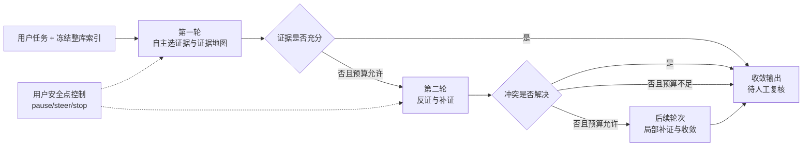

**图 6 讲解词：** 这个当前纵切保持 FORTE 原件只读，也不引入外部动作。它已经补齐有界
Observe、十二个固定本地 Act、确定性/引用 Verify、Evidence Gate、Budget & Stop、Branch
控制和顺序持久恢复；仍没有通用 Tool Gateway、多 Worker 或 Connector。运行证据见
`SCENARIO-EFFECT-GATE-EVIDENCE-20260827`。

## 七、前台反馈为什么必须逐项对应服务端事实

当前前端把页面分成三个独立区域，不是为了做视觉上的“三栏”，而是分别回答三个问题：
左侧回答“有哪些资料”，中间回答“文件里有什么、Agent 选了什么、计划和结果是什么”，右侧
回答“Agent 实际调用、采用和校验了什么”。在窄屏下这些区域改为纵向排列，功能不被删除。

关键 UI 文案必须按以下事实解释：

| 前台状态 | 用户可理解的含义 | 服务端权威 | 不能推断 |
| --- | --- | --- | --- |
| “资料可用” | HTTP 与 Workspace 投影可读取 | health/workspace 响应 | SSE 正在连接、模型已调用 |
| “安全预览” | 本次返回经过完整性和有界解析 | preview response `security` | 文件内容完整、公式或宏已执行 |
| Agent 本轮自主选择 | 本轮实际批准的证据范围 | `round.input_file_refs` 与 `plan.selection_reason` | 当前打开的预览文件等于 Agent 范围 |
| “已采用 / 未采用” | 模型返回是否通过服务端检查并进入下一步 | receipt `called/output_used` | 模型质量已经通过业务评估 |
| “服务端已校验” | 当前 Plan 通过结构、来源与政策检查 | `plan_validation` 与公开 Plan | Tool、Worker、文件写入已经执行 |
| “候选计划未采用” | 模型返回未通过服务端校验，最多进行一次预算内修复 | `plan_validation_rejected` 与模型调用计数 | 被拒计划已经执行或重试不消耗预算 |
| “已生成工作区文件” | 固定服务端适配器写入隔离文件并通过命名确定性检查 | `workspace_artifacts[]`、`effect_receipts[]` 与 Artifact 下载 | FORTE 原件已改、任意工具可执行或模型答案一定正确 |
| “外部能力未连接” | SQL/Web/cron 请求被明确阻断，没有伪造结果 | `blocked_external_boundary` 与 `scenario_effect_bounded` | 任务效果已完成或 Connector 已存在 |
| “证据仍不足，继续下一轮” | 本轮存在显式缺口且剩余预算允许 | `evidence_gate`、`evidence_gaps[]`、`next_step` | 新一轮一定能得到正确答案 |
| “暂停 / 调整下一轮 / 结束并保留” | 命令在安全点按版本与幂等语义生效 | `ControlEvent` 与返回 Snapshot | 已发出的模型请求被硬中断 |
| “只读简报已形成” | 多轮结果通过 Schema、引用范围和边界检查 | `loop_committed`、brief、`review_required=true` | 结论、算术、业务任务正确完成或确定性 Artifact 已通过 |
| 引用按钮 | 返回本轮批准范围内的业务文件 | Finding `file_refs` 与 Workspace 投影 | 被引内容必然支持结论 |
| “正在恢复” | 当前 EventSource 中断，浏览器正在对账 | transport state、GET、`after=N` | 服务端任务失败或已经完成 |

失败也必须分开呈现。API 离线时保留本地任务草稿并重试；manifest 完整性失败时不显示陈旧
目录、不调用模型；单文件预览失败时保留文件列表和任务；Run 启动结果未知时对完全相同的
指令和预算复用同一幂等 key；已知终态后再次运行则用新 key；模型或校验失败时显示安全
业务错误，不显示伪造结果。

## 八、从技术对比到 UI 影响的汇报图

### 图示区七：不是功能清单，而是因果链

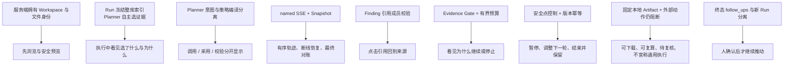

**图 7 讲解词：** 每个界面动作都来自一个明确的技术所有权。反过来也一样：没有 Tool
Gateway receipt，就不能出现“已执行”；没有 ArtifactVersion 和 Commit，就不能出现“文件已
保存”；没有语义或数值 verifier，就必须保留“待复核”。

## 九、会议与 PPT 图文规划

建议用 17 页完成从问题、主流模式、当前实现、场景、缺口到路线图的叙事。每页都要同时标注
“当前事实 / 目标设计 / 证据边界”，不要用一种颜色把它们混成同一完成度。

| 页码 | 页面结论 | 建议画面 | 主讲重点 | 证据与边界 |
| --- | --- | --- | --- | --- |
| 1 | Office Agent 从办公资料库开始 | 图 1 全景截图，裁出下一页内容提示 | 首屏不是 Demo，也不是聊天占位页 | `DR-0022`；公开基准数据，不是真实企业网盘 |
| 2 | 办公 Agent 的首要问题是来源范围不可见 | “先提问”与“先看资料”两条流程 | 不是否定聊天，而是把证据控制提前 | Stakeholder 来源；用户价值仍为 `Draft` |
| 3 | 整库、多来源、引用、暂停与知识成果已是主流基线 | Microsoft 365 Copilot、NotebookLM、deep research、Codex、Claude、OpenClaw 能力底线 | 不再把旧“代码工具/聊天工具”定位当作能力上限 | 官方资料研究，不是竞品实测 |
| 4 | 候选差异是一条可验证办公结论合同 | 图 0：模型候选 -> 服务端采用 -> Evidence Anchor -> 版本 -> 待复核 | 为什么选我们必须落到服务端保证 | 当前是差异化候选，未完成同场挑战 |
| 5 | 15 个目录、96 份文件形成固定挑战现场 | 目录、格式分布与安全预览拼图 | 111 个任务说明/输入文件共 `1,780,445` bytes；普通 UI 只见 96 inputs | FORTE 固定 commit；未公开 165 条未取得 |
| 6 | 冻结整库与逐轮最小正文范围是两层合同 | 文件管理器、合同回执、本轮采用来源 | `task.md` 不作隐藏任务；服务端冻结 96 refs，Analyst 每轮只读 1-8 份 | 不证明 Agent 选得最优 |
| 7 | 模型提出，服务端决定能否采用 | Planner/Analyst Receipt 与 Policy Compiler | `called`、`output_used`、校验拒绝分开 | 当前不执行计划中的 Tool |
| 8 | 轨迹来自 named SSE，状态来自权威 Snapshot | sequence/version、断线 GET 和 final GET 时序 | 动画不创建事实；控制有版本和幂等回执 | memory 仍会随进程丢失；PostgreSQL 只证明顺序 Runtime 恢复 |
| 9 | 每条采用 Finding 必须回到服务端验证的位置 | `DR-0029` 证据链、跨文件切换与高亮 | 引用是成果采用门，不是正确性徽章 | 只证明范围和位置，不证明 entailment/算术；PDF/DOCX 非原生坐标 |
| 10 | Evidence Gate 把任务编译成可选择 Branch | 完成分支、缺证分支与“继续此分支”截图 | 人只把预算给目标工作线，其他 Branch 保持等待 | 顺序 Controller，不是并行 Worker |
| 11 | 证据简报不可覆盖，恢复只新增 TaskCommit | v1/v2 和 rollback 指针图 | 恢复不删新版、不改源文件 | 逻辑 Artifact，不是可写 Word/Excel |
| 12 | 当前最大缺口是问题不可决断、locator 失败不可局部恢复 | 两张真实负例 + EvidenceResolution/DecisionRecord 图 | 已完成工作应保留，人的决定只恢复受影响 Branch | 新协议仍为 `Draft` |
| 13 | 八个同场挑战才能把候选升级为“竞品当前不能完成” | 未知来源、冲突、重复 quote、部分失败、完整性、恢复、混合动作、外部数据 | 固定产品版本、账户、入口、配置和截图 | 未实测前禁止排他性结论 |
| 14 | 外部任务当前正确结果是能力阻断 | SQL/Web/发送动作的“已完成/未执行”清单 | 没有 Connector receipt 就没有采集、发送或调度结果 | 本项目当前执行力不领先 |
| 15 | 工程链路已验证，结论质量和用户价值未验证 | `DR-0029` 自动化、真实 Run 与截图三列 | 当前 Python `67 passed, 1 skipped`、Harness 浏览器 `13 passed`；远端 PostgreSQL restart gate 通过 | 自动化不是质量、SLA 或用户研究 |
| 16 | 约 30% 只是实现前历史成熟度估计，当前纵切也不是完整 Loop | 历史 11 模块分值与当前 Branch/Artifact/Anchor 纵切 | 当前已有明显增量，但不编造新总分 | 无 Tool/Worker/Connector、业务 Verify、局部恢复、多实例 |
| 17 | 路线图围绕可证伪差异推进 | EvidenceResolution -> DecisionRecord -> 携证成果/未执行回执 -> 竞品挑战 -> Worker/Tool/Connector | 先闭合可信失败路径，再扩执行能力 | 未实现项保持 `Draft` |

页面设计建议：

1. 截图使用仓库 `docs/evidence/screenshots/dr-0022-*.png`，保留原始比例，不伪造运行结果。
2. 当前实现用实线和深色，部分近似用点线和尚未闭合的节点，目标设计用空心轮廓；每页图例固定。
3. 关键数字只出现一次主展示，页脚标数据 commit、Evidence 名称和当前 PR 状态，避免旧 PPT 数字混入。
4. 场景页不写抽象“能力卡”，而写触发、人的决定点、失败路径、前台输出和服务端事实。
5. 竞品页先区分市场基线、原生保证差异和固定配置实测；只有同场挑战真实失败后才使用
   “该配置当前不能完成”，不使用无边界的“做不到”或“全面领先”。
6. 演示结束停在“引用回开 + 待复核 + 没有外部动作”，不要用完成动画替代结论边界。
7. 当前问题处置与恢复截图优先使用 `dr-0031-*`、`dr-0030-*` 和 `dr-0029-*`，并在页脚绑定
   `ACTIVE-BUDGET-AND-AGENT-GAP-RECOVERY-20260826` 与
   `ACTIONABLE-REVIEW-AND-RECOVERY-20260826`；历史 `dr-0022/23-*` 只能用于说明演进。
8. TC-01 成果与审计分层页使用 `dr-0036-tc01-outcome-first-*` 和
   `dr-0036-tc01-grouped-audit-desktop.png`；同时展示 Stakeholder 原负例，明确新图是确定性
   Snapshot 回归。真实运行另使用 `dr-0036-tc01-live-run-completed.png` 与
   `dr-0036-tc01-live-run-artifact.png`，两类证据都不是用户研究。

## 十、验证证据与禁止推断

当前以 [`DR-0036-TC01-OUTCOME-EVIDENCE-LOCALIZATION-EVIDENCE-20260828`](../evidence/DR-0036-TC01-OUTCOME-EVIDENCE-LOCALIZATION-EVIDENCE-20260828.md)
和 [`SCENARIO-EFFECT-GATE-20260827`](../evidence/SCENARIO-EFFECT-GATE-20260827.md)
为最新实现证据入口，并结合
[`ACTIVE-BUDGET-AND-AGENT-GAP-RECOVERY-20260826`](../evidence/ACTIVE-BUDGET-AND-AGENT-GAP-RECOVERY-EVIDENCE-20260826.md)、
[`ACTIONABLE-REVIEW-AND-RECOVERY-20260826`](../evidence/ACTIONABLE-REVIEW-AND-RECOVERY-EVIDENCE-20260826.md)
与早期 [`AGENT-CONTROL-LOOP-BOUNDED-READONLY-20260825`](../evidence/AGENT-CONTROL-LOOP-BOUNDED-READONLY-EVIDENCE-20260825.md)。
DR-0035 的当前工程门先证明 12 条本地确定性效果通过、3 条外部依赖按边界阻断，并保留
六场真实 Provider 的首轮红灯、修复迭代和最终 `deepseek-v4-pro` 运行。六场均有真实
Planner/Analyst 调用、真实隔离 Artifact 和通过的 deterministic verifier；模型采用、Loop
终态与效果通过分开报告。准确的最终 Python、PostgreSQL、Ruff、前端 lint/build、Harness
浏览器数字以本 Evidence 的收尾记录为准。该证据不证明 Finding 语义、模型稳定性或用户价值。
DR-0036 又针对 TC-01 的真实负例补了一层：PDF Preview 版面断行可以在唯一位置下容错定位，
4 月 20 日之后的已定位候选不会阻塞当前任务，没有矛盾 Anchor 的 review 不再要求用户决定；
若历史 Snapshot 仍有审计缺口，前台先展示 5/5 成果，再把两个同源内部 Gap 合并成一个审计项。
同一用户原始指令还完成了一次真实 `deepseek-v4-pro` 纵切：第 1 轮 `completed`，真实 CSV 5/5、
三 Branch 全部完成、0 Gap、0 开放 DecisionRequest；该运行使用 memory store，只证明一次成功，
不证明重复稳定性或重启恢复。
工程全量门为本机 Python `116 passed, 3 skipped`、Harness browser `29 passed`、Ruff/lint/build 通过；
本机跳过的三个 PostgreSQL 用例已由 PR #45 的 PostgreSQL 17 workflow 补证为 `3 passed in 4.33s`。
它仍是顺序 Runtime 证据，不是多实例高可用。
竞争差异研究仍是 `Draft`；本轮不是固定配置竞品同场实测，不能据此声称主流竞品做不到。

这些证据能够支持：固定公开文件清单、安全有界预览、整库合同与逐轮来源范围、
Planner/Analyst 调用与采用回执、服务端 Plan 检查、最多二十四轮的有界推进、十二个固定
本地 Run Workspace Artifact 与 deterministic verifier、Branch Evidence Gate、安全点控制、
append-only 逻辑 ArtifactVersion/TaskCommit、配置 PostgreSQL 时的顺序 Runtime 恢复、named
SSE、Snapshot 对账、引用成员和服务端原文位置，以及当前被测前台路径。

这些证据不能支持：

- 15 类 FORTE 原任务都已正确完成，或十二个固定适配器等于通用 Agent 执行能力；
- 引用能够证明语义、算术、完整性或政策判断正确；
- Planner 中出现 Tool 或 `run_workspace_write` 就表示工具或文件写入发生；
- 当前逻辑 ArtifactVersion 或固定 Run Workspace Artifact 已等同源文件修改、通用 Tool Gateway、Demo 2 Adaptive Worker 或 Demo 3 真实动作 Gate；
- memory Run 能够跨重启恢复，或 PostgreSQL 顺序 Runtime 门已经证明多实例 lease、高可用和在途模型续跑；
- 公开 FORTE 数据等于 Lenovo 或真实客户企业数据；
- 新界面已经提升理解、信任、效率、采纳率或业务价值；
- 一次模型耗时可以代表 SLA 与成本；
- 主流竞品在未完成固定版本、账户和入口的同场挑战时“不能完成”这些任务。

### TC-01 给前台设计带来的新结论

这次负例表明，办公 Agent 不能只用一个“任务状态”概括所有事实。用户首先问的是“文件能不能
用”，其次才是“Agent 的说明能不能逐句回开”。因此前台采用两层承诺：确定性 Artifact 回答
日期、字段、规则和下载；Evidence Anchor 回答 Agent 说明来自哪里。前者通过、后者待修时，正确
输出不是一片绿色，也不是“任务失败”，而是“成果可用，审计待补充”。

这个交互反过来约束后端：定位器必须区分版面差异和真正多义，范围过滤必须基于服务端已定位的
observed 日期，人工 Gate 必须绑定 contradiction Anchor，TC-01 Verifier 必须读取 PDF 规则合同。
前台合并同源 Gap 只减少认知重复，不能删除 Branch、伪造 `completed` 或跳过 expected version/
幂等控制。该结论来自 Stakeholder 负例、当前 Run 审计和确定性回归，不是普遍用户研究。

## 十一、来源索引

- 主流方案与交互研究：[`WORKSPACE-CENTRIC-OFFICE-AGENT-INTERACTION-AND-SOURCES-20260825`](../research/WORKSPACE-CENTRIC-OFFICE-AGENT-INTERACTION-AND-SOURCES-20260825.md)。
- 可证伪竞争差异、八个同场挑战与官方来源：[`COMPETITIVE-WHITE-SPACE-AND-FALSIFIABLE-DIFFERENTIATORS-20260826`](../research/COMPETITIVE-WHITE-SPACE-AND-FALSIFIABLE-DIFFERENTIATORS-20260826.md)。
- 可处置人工决策与局部失败恢复：[`ACTIONABLE-HUMAN-DECISION-AND-FAILURE-RECOVERY-20260826`](../research/ACTIONABLE-HUMAN-DECISION-AND-FAILURE-RECOVERY-20260826.md)。
- Control Loop 历史审计与当前更新：[`AGENT-CONTROL-LOOP-IMPLEMENTATION-AUDIT-20260825`](../research/AGENT-CONTROL-LOOP-IMPLEMENTATION-AUDIT-20260825.md)。
- 当前 Loop 决策与场景：[`DR-0023`](../decisions/DR-0023-agent-control-loop.md)、[`SCENARIO-009`](../scenarios/SCENARIO-009-agent-control-loop.md)。
- 文件夹基线决策与场景：[`DR-0022`](../decisions/DR-0022-workspace-folder-and-arbitrary-task-contract.md)、[`SCENARIO-008`](../scenarios/SCENARIO-008-whole-folder-office-workspace.md)。
- 15 类任务测试目录：[`FORTE-PUBLIC-OFFICE-TASK-TEST-CASES-20260825`](../testing/FORTE-PUBLIC-OFFICE-TASK-TEST-CASES-20260825.md)。
- 当前架构：[`ARCHITECTURE.md`](../ARCHITECTURE.md)。
- 目标架构：[`TARGET_ARCHITECTURE.md`](../TARGET_ARCHITECTURE.md)。
- UI 与服务端事实：[`UI_SERVER_FACT_MATRIX.md`](../contracts/UI_SERVER_FACT_MATRIX.md)。
- 当前 Evidence：[`AGENT-CONTROL-LOOP-BOUNDED-READONLY-20260825`](../evidence/AGENT-CONTROL-LOOP-BOUNDED-READONLY-EVIDENCE-20260825.md)。
- 当前截图机器清单：[`dr-0023-agent-control-loop-live-run.json`](../evidence/manifests/dr-0023-agent-control-loop-live-run.json)。
- 当前局部恢复 Evidence：[`DR-0032-POSTGRES-DECISION-RECOVERY-EVIDENCE-20260827`](../evidence/DR-0032-POSTGRES-DECISION-RECOVERY-EVIDENCE-20260827.md)。
- 当前 TC-01 成果/审计分层 Evidence：[`DR-0036-TC01-OUTCOME-EVIDENCE-LOCALIZATION-EVIDENCE-20260828`](../evidence/DR-0036-TC01-OUTCOME-EVIDENCE-LOCALIZATION-EVIDENCE-20260828.md)。

## 十二、收束讲稿

Office Agent 当前最值得汇报的，不是它已经“自动完成了多少办公任务”，而是它开始形成一条
可验证办公结论合同：**资料从哪里来、本轮到底读什么、模型输出是否被服务端采用、每条采用
结论能否回到批准来源、成果如何留版、完成时什么仍未验证或未执行。**

我们已经用 96 份统一文件、安全预览、整库索引与逐轮最小正文范围、Planner/Analyst 回执、
服务端策略编译、named SSE、权威 Snapshot、Branch Evidence Gate、Evidence Anchor、
append-only 逻辑 ArtifactVersion/TaskCommit 和 `review_required=true` 做出了受限只读纵切。
`DR-0032` 又补齐了五态 EvidenceResolution、持久化 DecisionRequest/DecisionRecord 与
Finding/Branch 局部恢复；`DR-0035/36` 已在十二个固定场景加入真实隔离成果、确定性检查和
TC-01 的成果/审计分层。仍未完成的是通用语义/数值 Verify、任意可写 Office Artifact、
Worker、通用 Tool Gateway、Risk/Approval/Permit、真实 Connector、独立决策账本和多实例调度。

因此这版汇报的竞争结论也不是“主流竞品做不到”。更准确的说法是：**我们已经做实一组
值得同场验证的原生保证，并设计了八个固定挑战。只有竞品在注明版本、账户、入口和配置下
真实失败，我们才把某一项升级为‘该配置当前不能完成’；其余都继续诚实地写成设计差异。**
