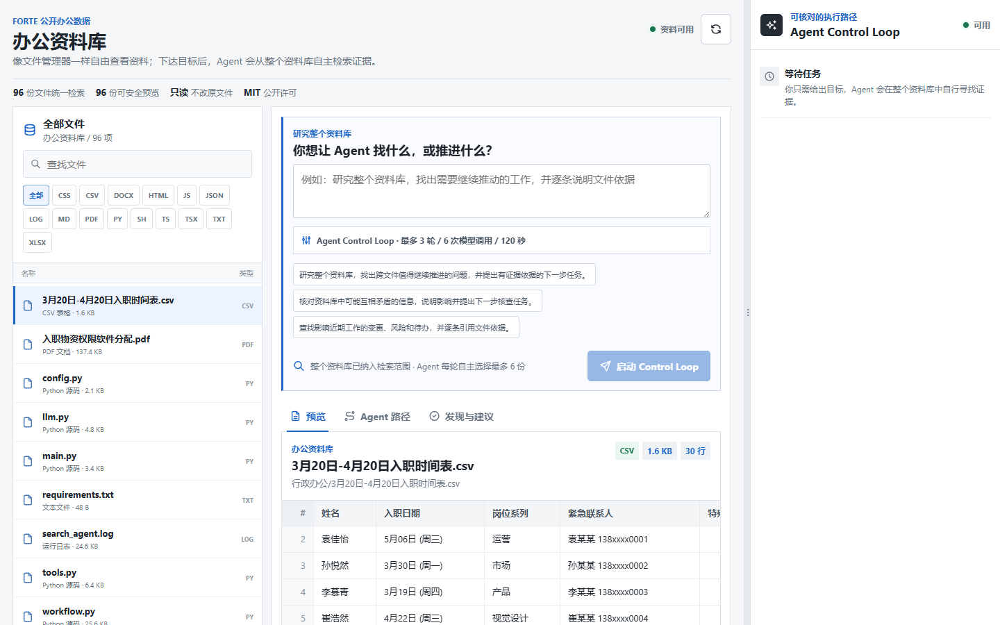
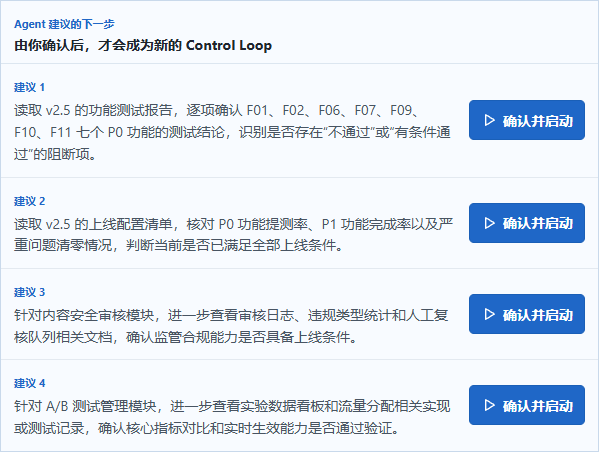
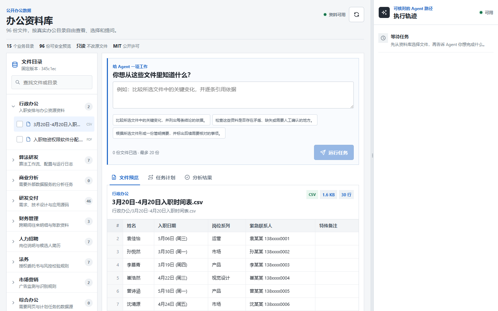
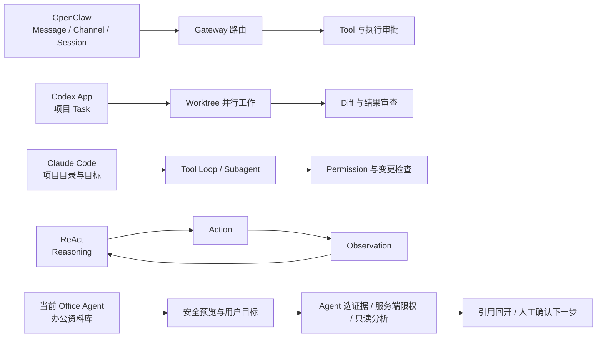
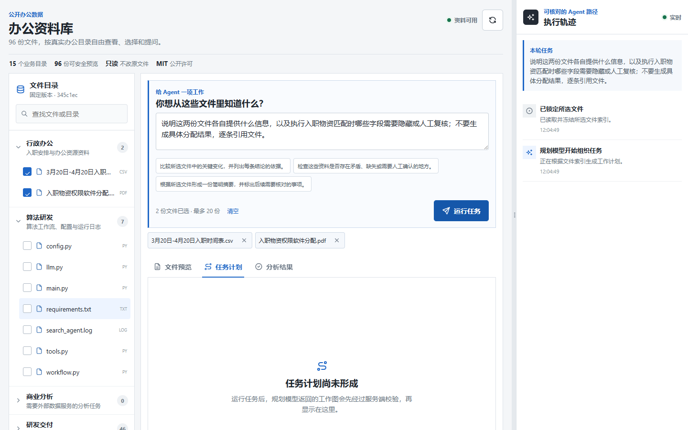
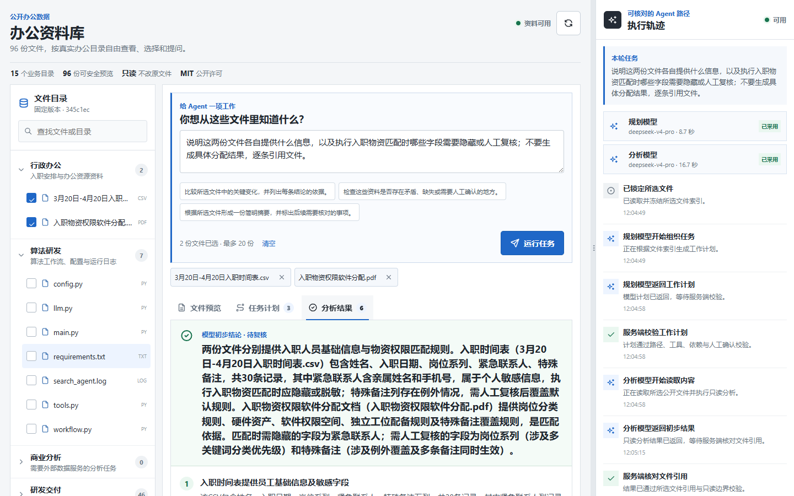
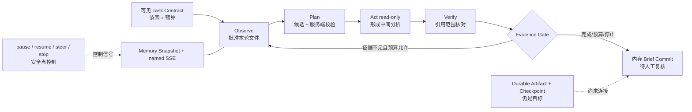
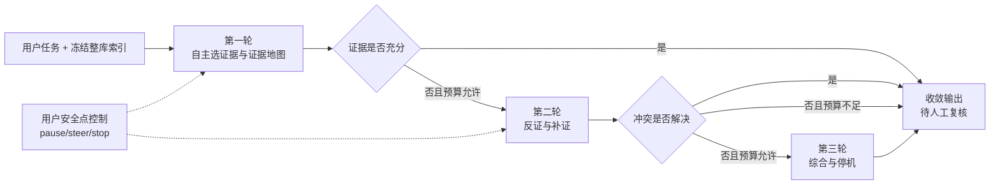
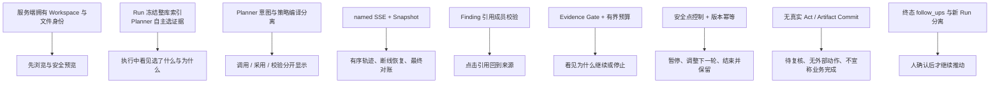

# Office Agent V0.2 详细中文汇报稿与图文规划

> 日期：2026-08-25
>
> 用途：会议主讲稿、产品评审底稿与后续 PPT 页面规划
>
> 当前结论状态：限定工程链路为 `Limited Verified`；任务正确性、生产可用性与用户价值仍未验证
>
> 当前事实基线：源码、[`ARCHITECTURE.md`](../ARCHITECTURE.md)、[`UI_SERVER_FACT_MATRIX.md`](../contracts/UI_SERVER_FACT_MATRIX.md) 与 [`DR-0024`](../decisions/DR-0024-autonomous-whole-workspace-research.md)

> 2026-08-25 最新交互修订：`DR-0024` 已取代本文早期 `DR-0022` 的“用户勾选 1-20 个文件 / selected_file_refs”方案。当前产品是一个统一文件管理器；用户只给目标，Agent 面向完整安全索引自主选择每轮证据。本文后文如引用旧勾选流程，均只表示历史设计对照，不得作为当前演示口径。

## 最新增补：从“用户先找文件”改为“Agent 找证据，人确认下一步”

这次变化不是把 checkbox 换成搜索框，而是重新分配人和 Agent 的工作。旧流程要求用户先知道答案可能藏在哪些文件里，再把这些文件交给 Agent；这对小演示可控，却违背“大文件夹办公”的真实前提。当前流程把**目标表达权、过程监督权和下一步确认权**留给人，把**检索、证据缩小和跨文件关联**交给 Agent。

```text
旧流程：浏览 -> 人工猜文件 -> 勾选范围 -> 下达任务 -> Agent 分析

当前流程：浏览整库 -> 下达目标 -> Agent 搜索安全索引
       -> 服务端限制每轮证据 -> Agent 分析并引用
       -> Agent 提出下一步 -> 人确认后启动新的 Control Loop
```



**图 A 讲解词：** 左侧不是 Demo 或职业导航，而是 96 份文件的统一文件管理器。搜索、类型筛选和预览只帮助人理解资料，不会偷偷改变 Agent 的范围。用户不再勾选文件，只提交目标和预算。



**图 B 讲解词：** 每轮轨迹公开 Agent 选了哪些文件、为什么选、模型是否被采用以及服务端如何核对引用。终态最多给四条下一步任务；建议本身不会执行，只有用户点击“确认并启动”才创建新的独立 Loop。

这会直接改变汇报中的创新点：我们不再把“显式选择文件”当作核心差异，而把核心放在**整库可浏览、Agent 自主检索可见、服务端逐轮限权、证据可回开、下一步由人确认**。它减少一次前置操作，但没有放弃控制；控制从“人替 Agent 做检索”转移到“人监督 Agent 的选证据和推进建议”。

## 一、开场：我们真正要解决的不是“再加一个聊天框”

今天汇报的核心不是做一张 OpenClaw、Codex App、Claude Code、ReAct 和
Office Agent 的功能对比表，也不是证明哪一种方案“更先进”。我们要回答的是：
当 Agent 从代码或消息场景进入办公资料场景后，用户最先需要控制和核对的对象
发生了什么变化；这种变化为什么要求我们重新安排交互顺序；当前项目究竟已经
实现到了哪一步。

主流 Agent 方案已经证明了几类重要模式：OpenClaw 把常驻 Gateway、Channel、
Session、Tool 和主机执行审批连成长期运行入口；Codex App 把项目 Task、Worktree、
并行 Agent 和变更审查组织成软件交付工作台；Claude Code 把项目目录、Tool Loop、
Subagent 和 Permission 放进开发者熟悉的 Terminal 与 IDE；ReAct 则提供了
Reasoning、Action、Observation 交替推进的通用方法。

当前 Office Agent 没有否定这些模式。它做了一个针对办公工作的刻意选择：
**先把完整资料库摆到用户面前，再让 Agent 自主找证据，同时把选择理由和边界公开。**
用户可以打开安全预览，但只需写出自己的任务；Planner 从完整安全索引中选择本轮材料，
服务端按预算和策略校验后才允许 Analyst 读取正文，最后由人复核结论并确认下一步。

这条路径目前已经在固定公开数据和单 API 进程内形成一个有界的 Agent Control Loop
工程纵切：最多三轮、有预算、服务端 Evidence Gate，并支持安全点暂停、继续、调整下一轮
和停止。它仍不能执行真实工具、修改文件、提交 Durable Artifact、恢复跨进程任务或证明
结论正确。这不是附加在演示末尾的免责声明，而是产品当前的组成部分：前台必须让用户
看见“为什么继续、为什么停止、待复核、没有外部动作”。

## 二、当前产品：一个办公资料库，一条可核对的只读路径

当前根页面不是 Scenario 或 Demo 选择器，而是唯一的 FORTE 公开办公资料库。
数据固定在 FORTE commit
`345c1ec1487139db9dd319787fa9405ba85d1869`：15 个公开任务目录、96 份
`input/` 文件，共 111 个任务说明与输入文件、`1,780,445` bytes。FORTE 官方
完整 benchmark 报告 180 条任务，但公开仓库只给出每类职业一个示例；本项目没有
取得、也不能声称取得其余 165 条未公开任务。

普通用户只看到 96 份公开输入。`task.md` 只保留为 provenance，不进入普通 UI，
不进入 Analyst 输入，也不会成为隐藏默认任务。每轮任务都必须由用户自己写
`instruction`；服务端冻结完整索引，客户端不再提交 `selected_file_refs`。

### 图示区一：历史工作台与当前文件管理器



**图 1 讲解词：** 这张 `DR-0022` 截图保留为历史对照；当前左侧已经收敛成一份统一
文件管理器，不再把职业目录或文件勾选当作产品入口。中间仍是任务输入、安全
预览、计划和结果，右侧仍是执行轨迹与模型回执。图中可见的 96 份文件、
只读状态和预览内容均来自服务端投影，不是静态演示数据。截图只能证明这一时刻的
可见界面；后端事实由 Snapshot、接口返回与自动化共同约束。

当前七条公开路径把交互分成三个层次：Workspace 接口回答“有什么资料”，文件预览
接口回答“这份资料里能安全看到什么”，Run、Control 与 named SSE 接口回答“本轮 Agent
实际走到了哪里、用户如何干预”。公开接口不挂载旧 Scenario 路径，也不挂载多 Worker Scheduler、Tool
Gateway、Connector 或外部动作路由。

当前成功路径按以下顺序发生：

1. `GET /v1/harness/workspace` 返回 15 个目录和 96 个文件的公共投影。
2. 用户打开文件，服务端重新校验 allowlist 相对路径、大小、SHA-256、非 symlink、
   压缩结构与格式边界，再返回 XLSX/CSV、PDF、DOCX、文本或代码的有界预览。
3. 用户写出 3 到 2,000 个字符的原创任务，并设置最多三轮、每轮文件数、模型调用数和 deadline；无需预选文件。
4. `POST /v1/harness/runs` 以 Owner、`idempotency_key`、`expected_version=1`、
   `instruction` 和 Loop 预算接受一个独立 Run，同时冻结完整 allowlisted 索引。
5. 每轮 Planner 从安全元数据索引自主选择证据并返回严格 JSON 业务意图；服务端拥有来源范围、副作用、人工 Gate、
   单元、依赖、工具与引用规则，并负责编译与校验公开 Plan。候选失败最多进行一次预算内修复。
6. Analyst 只接收本轮批准文件的安全内容投影，形成带引用的 Finding；这里的 Act 是只读分析，
   不调用 Tool Gateway。
7. 服务端 Verify 检查引用范围，Evidence Gate 决定完成、进入下一轮或因预算/用户命令停止。
8. 用户可在模型调用之间的安全点 pause/resume/steer/stop；浏览器只依据返回 Snapshot 更新状态。
9. 浏览器用 named SSE 展示有序变化，用 Snapshot 做最终权威对账；引用按钮重新打开
   同一份来源文件的安全预览，终态形成待复核的内存 Brief。
10. Agent 最多提出四条下一步任务。用户确认其中一条后才创建独立新 Run；未确认不会发生任何新执行。

真实封口运行完成 2 轮、8 份文件、5 次模型调用和 21 条事件，其中第一轮候选计划被
服务端拒绝后只进行一次预算内修复。`completed` 只表示 Schema、引用范围、有界循环和
只读边界检查通过，不表示答案正确、数值正确、Artifact 已写入、Tool 或 Worker 已运行，
更不表示外部业务动作已经发生。

## 三、五种方案到底在组织什么工作

### 3.1 OpenClaw：从消息、会话和常驻 Gateway 组织 Agent

OpenClaw 官方材料首先解决的是“Agent 如何常驻、如何从多个 Channel 接收消息、
如何把 Session 路由到 Agent、如何调用 Tool，以及主机执行如何进入审批”。它的
主要交互对象是 Message、Channel、Session 和 Gateway；用户通常先从消息入口发起
意图，再在任务推进中处理工具和执行边界。

这套模式对长期在线、多入口触达和主机工具控制非常重要。它带来的交互后果是：
会话连续性与 Channel 身份天然处于第一层，文件或业务资料可以成为 Tool 的输入，
但不必天然成为首屏的可见契约。

当前 Office Agent 选择不同的首要对象：不是先建立消息会话，而是先展示服务端拥有的
办公资料库。用户可以在模型调用前看文件、看格式和安全说明，但不必预先找齐材料；
Run 启动后再监督 Agent 如何从整库缩小到本轮证据。这并不证明 OpenClaw 不能实现
文件夹优先交互，只说明本项目把“选证据是否有依据”放到了默认主路径。

**来源绑定：** `OPENCLAW-OFFICIAL-20260825`，包括 [OpenClaw overview](https://docs.openclaw.ai/)、
[runtime architecture](https://docs.openclaw.ai/agent-runtime-architecture) 与
[exec approvals](https://docs.openclaw.ai/tools/exec-approvals)。这些来源支持上述官方
设计侧重点，不是竞品实测，也不能支持“OpenClaw 没有办公证据能力”的推断。

### 3.2 Codex App：从项目 Task、Worktree 和变更审查组织软件工作

Codex App 官方材料重点解决“多个软件任务如何并行推进、不同 Agent 如何在隔离
Worktree 中工作、用户如何审查代码改动，以及 Skill 和 Automation 如何进入审查
队列”。其核心交互对象是项目 Task、代码仓库、Worktree、Diff 与审查结果。

这使软件任务的结束条件很自然：用户可以检查改了哪些文件、测试是否通过、Diff 是否
可接受。交互通常从一个项目任务开始，Agent 在隔离环境中产出变更，用户随后围绕代码
结果审查。

当前 Office Agent 面对的不是代码 Diff，而是业务文件与业务结论。原始文件保持只读，
当前也没有可写 Artifact；因此它不能借用“有 Diff 可审”来代表任务完成。用户要审查的
是 Agent 本轮选择了哪些资料、Planner 和 Analyst 是否真实调用、服务端是否采用其输出、每条
结论引用了哪份文件，以及结论是否仍需人工复核。

**来源绑定：** `OPENAI-CODEX-APP-20260202`，OpenAI 官方文章
[Introducing the Codex app](https://openai.com/index/introducing-the-codex-app/)。该来源
支持并行 Task、Worktree、Skill、Automation 与变更审查等描述，不是办公任务效果比较。

### 3.3 Claude Code：从项目目录、Tool Loop 和 Permission 组织开发协作

Claude Code 官方材料重点解决“Agent 如何理解项目目录、如何在工具调用与环境反馈中
循环、如何用 Subagent 拆分工作、如何通过 Permission Mode 控制操作，并在 Terminal、
IDE 等界面中协作”。其主要交互对象是项目目录、命令、Tool 调用、代码变更与权限请求。

项目目录上下文让开发者能够以整个代码库为工作现场。交互后果是：用户可以先给出目标，
Agent 在目录和 Tool Loop 中逐步发现需要的上下文，并在敏感操作前请求权限。

当前 Office Agent 允许 Planner 检索完整的安全元数据索引，但不允许模型静默读取全部
96 份正文。服务端按每轮文件预算裁剪候选、校验来源和依赖，Analyst 只收到本轮批准文件
的安全投影。用户少做一次范围选择，却多得到“本轮选了什么、为什么选、是否被采用”的
过程监督。“这一取舍是否真的提高理解或信任”仍需用户研究，不能从架构本身推出。

**来源绑定：** `CLAUDE-CODE-OFFICIAL-20260825`，包括 [How Claude Code works](https://code.claude.com/docs/en/how-claude-code-works)、
[subagents](https://code.claude.com/docs/en/sub-agents) 与
[permissions](https://code.claude.com/docs/en/permissions)。这些来源支持项目目录、Tool
Loop、Subagent 与 Permission 的官方描述，不证明本项目更易用。

### 3.4 ReAct：从 Reasoning、Action、Observation 组织循环

ReAct 不是一个与上述产品同层级的办公 UI，而是一种 Agent 组织方法。它强调让
Reasoning、Action 与 Observation 交替出现，使下一步计划能够吸收环境反馈，而不是
一次性生成完整答案后停止。

这对 Office Agent 的启发不是把私有思维链完整展示给用户，而是把可审计的业务事实
组织成循环：当前观察了什么来源、提出了什么动作、环境或验证器返回了什么、是否需要
调整计划、何时应该停止。

当前 Office Agent 已实现最多三轮的只读近似：Workspace 观察、每轮 Planner、服务端
校验、Analyst、引用验证和 Evidence Gate，并支持预算停止与安全点控制。它仍没有真实
Tool Observation、Durable Artifact、跨进程恢复或分支级 Commit，因此不能称为完整 ReAct 执行器。普通 UI 展示
named SSE、模型回执、业务 Plan 和引用，明确不展示 Prompt、chain-of-thought 或原始
模型响应。

**来源绑定：** `REACT-ICLR-2023`，Yao 等，[ReAct: Synergizing Reasoning and Acting in Language Models](https://arxiv.org/abs/2210.03629)。
该论文支持 Reasoning、Action、Observation 交替组织的判断，不直接定义持久状态、
办公文件 UI、策略编译、Evidence Gate 或 Commit。

### 3.5 当前 Office Agent：从可检查来源组织办公分析

当前 Office Agent 解决的是一个更窄但可核对的问题：当用户面对一组混合格式办公
资料时，能否在 Agent 调用前知道有哪些文件、看见文件的安全投影，然后只给目标，
让 Agent 自己找证据，并在只读结果形成后回到同一来源复核。

它的主要交互对象依次是 Workspace、文件预览、用户任务、每轮自主选证据、Run Snapshot、
named SSE、Planner/Analyst 回执、Plan、Finding、引用与下一步建议。Demo 1、Demo 2、Demo 3
只是未来通用能力的验收视角，不是当前产品入口，也不会解锁隐藏执行器。

### 图示区二：不同首要对象如何改变默认流程



**图 2 讲解词：** 这张图比较的是“默认从什么对象开始”，不是排他性能力。前三种
产品模式都可能扩展到办公文件；Office Agent 也需要吸收它们的 Tool、并行、权限和
循环能力。当前差异只在于：我们把整库可见性置于任务之前，把选证据的理由置于执行中，
把复核与下一步确认置于终态之后。

## 四、为什么选择 Workspace-first：技术选择如何逐步改写用户流程

### 4.1 从“先提问”改为“先知道手里有什么”

服务端持有 `public-suite-manifest.json`，而不是让浏览器根据文件名拼目录，也不是让
模型临时发现未知文件。用户进入页面后先得到 15 个业务目录、96 份输入、格式、大小和
预览可用性。两类只依赖外部系统且没有本地输入的目录会明确显示能力缺口，不能伪造本地
数据。

交互结果是：调用模型之前就可以浏览与判断。Catalog 完整性失败返回受控 503，前台显示
“资料库完整性校验未通过”，不回退到静态假数据；API 离线与文件预览失败也分别呈现，
避免把所有问题都写成“Agent 正在思考”。

### 4.2 从“人先选范围”改为“Agent 选证据、服务端限权”

用户不再用 checkbox 替 Agent 做检索。Run 启动时服务端冻结 96 个稳定 `file_ref` 和
`scope_mode=whole_workspace`；Planner 只读取安全元数据，自主提出本轮最小证据集合。
服务端再按 `max_files_per_round` 限制文件数、修复依赖并校验工具与副作用，Analyst 只收到
这一小组批准正文。超范围引用会 fail closed。

交互结果是：用户少一次前置操作，但范围控制没有消失，而是从静态 checkbox 迁移为过程中的
“选择理由 + 实际采用文件 + 服务端预算 + 引用回开”。任务示例仍只填入可编辑文本，不会自动运行。

### 图示区三：整库检索与逐轮证据范围


**图 3 讲解词：** 截图展示任务文本由用户输入，左侧 96 份文件统一浏览，没有职业入口或
勾选框。真正的整库合同来自 POST 后的 Snapshot；真正进入 Analyst 的范围来自每轮
`input_file_refs`，而不是当前打开的预览文件。

### 4.3 从“模型写了计划”改为“模型提出，服务端拥有政策”

Planner 只提出业务意图。服务端编译并校验来源、依赖、环、Tool 标识、逻辑成果、副作用
与人工 Gate，再决定是否公开 Plan。`model_receipt.called` 说明是否发起模型请求，
`output_used` 说明返回内容是否被采用；两者与动画、配置中的模型名相互独立。

交互结果是：右侧回执区分“未调用”“已采用”“未采用”。“未采用”不是“没有调用”，而是
模型已经返回但服务端拒绝其输出。计划页只显示服务端接受后的业务表述；内部 effect、
gate、Prompt、chain-of-thought 与 raw provider response 默认隐藏。

### 4.4 从“进度动画”改为“named SSE 加权威 Snapshot”

当前每轮的成功事件顺序为：

```text
workspace_index -> round_started -> planning_started -> planning_completed
-> optional plan_validation_rejected and one bounded repair -> plan_validation
-> analysis_started -> analysis_completed -> result_validation -> evidence_gate
-> next round or loop_committed/loop_budget_stopped/loop_stopped
```

named SSE 是有序变更投影，Snapshot 才是状态权威。浏览器只单调应用 version 和 sequence。
非终态断线后先 GET 当前 Snapshot，再从 `after=N` 继续；终态事件后关闭流并做 final GET。
“服务可用”只表示 HTTP 可达，“轨迹实时”必须有当前 EventSource 连接。

交互结果是：用户看到的是“已锁定文件”“规划模型返回”“服务端校验计划”“分析模型返回”
等业务节点，而不是补造的百分比。中断时显示恢复状态，并保留当前 Snapshot 与最后 sequence。

### 4.5 从“引用作为脚注”改为“引用作为复核入口”

Analyst 的每条 Finding 至少要引用一个本轮批准的 `file_ref`。服务端检查成员关系，前台把
引用投影成业务文件名；用户点击后，界面选中该文件并回到安全预览。

交互结果是：复核不需要离开任务现场寻找附件。但引用成员关系只说明“引用的是允许范围内
的文件”，不证明该文件蕴含结论，也不证明检索完整、计算正确或政策判断正确。因此终态始终
显示“模型初步结论 · 待复核”。

### 图示区四：运行轨迹、模型回执与引用回看





**图 4 讲解词：** 这两张 `DR-0022` 图片保留为实现前工作现场证据。当前 Loop 应改用
`dr-0023-agent-control-loop-*` 截图：真实运行有 2 轮、5 次模型调用和 21 条事件，第一轮
候选计划被拒绝后进行一次预算内修复。这只是一次观测，不是 SLA、成本或质量结论；当前
服务端仍只核对 Schema、引用范围、显式证据缺口与只读边界。

## 五、七个办公场景：同一底座如何工作，又在哪里停下

以下场景来自固定 FORTE 公开示例和现有测试目录。它们不是七条已经完成的业务任务，
而是用同一 Workspace-first Harness 说明当前可用路径、应当停顿的位置和目标能力缺口。

### 5.1 入职物资与权限匹配

**触发：** 行政同事拿到入职人员 CSV 和物资权限分配 PDF，需要核对指定日期范围内的人员，
并识别缺失、冲突或涉及敏感字段的情况。

**用户动作：** 可以先打开 CSV 与 PDF 了解资料，也可以直接输入“研究资料库中的入职人员与
物资权限，指出缺失、冲突和需要隐藏的字段”。用户不必先知道具体文件名。

**Agent 路径：** 服务端冻结完整索引；Planner 从文件元数据中选择人员表与规则 PDF 并说明
原因；服务端编译、限额并校验；Analyst 只读批准的安全投影，生成带引用的初步 Finding。

**停顿或失败：** 文件 hash、路径或解析异常时在预览前 fail closed；模型返回越界引用或
不合规计划时显示“未采用”并安全停止。岗位规则互斥或字段缺失时，当前只能在结果中列为
待人工判断，还不能暂停某个执行分支后继续。

**前台输出：** 表格行、PDF 规则文本、安全说明、Agent 本轮选择理由、Planner/Analyst 回执、
业务 Plan、待复核结论、可回开的文件引用和人工确认的下一步任务。

**后端事实：** Workspace/preview 响应、Run `source_documents[]`、seq 1-8、两份
`HarnessModelReceipt`、结果 `file_refs` 与 `review_required=true`。

**证据来源：** `TC-01`、`SCENARIO-008`、`FORTE-PINNED-20260825`，以及当前
Evidence 中绑定的两文件真实浏览器 Run。

**当前边界：** 没有确定性日期过滤、规则匹配、敏感列删除验证或 CSV Artifact 写入；
不会创建账号、分配权限或发起采购。

### 5.2 三期财务往来与僵尸账款核对

**触发：** 财务人员需要比较三个期间的 XLSX，统计未收、未付，并找出跨三期余额不变的
往来款。

**用户动作：** 可以先查看三个工作簿的期间与字段，也可以直接写出比较口径和逐条引用要求；
Agent 负责在整库中找到对应期间的工作簿。

**Agent 路径：** 每轮包含 Planner、服务端 Plan 校验、Analyst 与引用范围检查；证据不足且
预算允许时进入下一轮。模型可以提出分期解析、归一和比较意图，并生成带来源引用的初步分析。

**停顿或失败：** 加密、超限或完整性异常的工作簿不可进入 Run；Planner 引用整库外或本轮未批准文件、
生成未允许 Tool 时拒绝。模型对科目符号、期末余额或客商映射产生歧义时，当前没有分支级
Evidence Gate，只能要求人工复核或发起新 Run。

**前台输出：** 首个可见 Sheet 的最多 30 列、120 行预览，Plan 单元、模型回执、每条 Finding
的工作簿引用与“结论和数值仍需人工复核”。

**后端事实：** Catalog 完整性检查、三个冻结 `file_ref`、Plan graph/source validation、
结果 citation membership、`status=completed` 与 `review_required=true`。

**证据来源：** `TC-05`、`SCENARIO-008`、`FORTE-PINNED-20260825`；历史 Finance
负面结果被保留为“有引用仍可能算错”的验收基线。

**当前边界：** 没有逐行公式、跨期三元组、总额与排序的确定性核验，也没有两个 CSV 的
可写 Artifact 和 Commit。当前 `completed` 不能翻译为“财务核对完成”。

### 5.3 双岗位与多份简历匹配

**触发：** 招聘人员需要把两份 JD 与五份简历逐项对照，同时保留最终招聘决定权。

**用户动作：** 输入“研究资料库中的岗位和候选人材料，逐条说明匹配证据与不确定项”；
用户可以预览文件，但不负责先配对 JD 与简历。

**Agent 路径：** 当前可以在一个 Run 内自主选择相关 JD/简历做只读分析，并用引用回到原文件。
目标架构中的多 Worker 拆分、候选人分支并行和跨 Worker 一致性核验尚未接入。

**停顿或失败：** 某份简历解析失败时前台显示文件级预览错误，文件列表和任务草稿保留；
Planner 超过每轮文件预算时由服务端限额，引用本轮范围外文件时确定性拒绝。敏感决策目前依靠 `review_required` 边界，而不是
已经实现的招聘 Decision Gate。

**前台输出：** 文档文本投影、Agent 本轮证据范围、逐轮验证 Plan、带 JD/简历文件引用的初步匹配与
人工复核提醒。

**后端事实：** preview security、Run 来源冻结、Planner/Analyst receipt、引用范围验证和
无外部副作用的终态 Snapshot。

**证据来源：** `TC-06`、`SCENARIO-008`、`FORTE-PINNED-20260825`。

**当前边界：** 没有 Adaptive Worker、跨候选人一致性验证、字段级敏感信息策略或正式招聘
审批；结果只能作为辅助材料，不能自动筛除候选人。

### 5.4 六份授权委托书风险核查

**触发：** 法务人员需要按统一规则检查六份委托书，并识别缺失条款、授权范围冲突和风险项。

**用户动作：** 输入委托书规则检查目标；可以预览 DOCX 与规则 Markdown，但不先手工圈定六份文档；
结果出来后按引用逐份回开原文。

**Agent 路径：** 当前 Harness 能从整库选择相关文件，形成只读 Plan 和带引用的 Finding。目标路径
应当把六份文档拆成独立工作单元，再做跨文档一致性复核和报告汇聚，但 Scheduler 与 Worker
Manager 尚未连接。

**停顿或失败：** 关系文件包含未允许外部资源、压缩结构越界或内容解析失败时安全停止预览；
规则互斥时当前不能只暂停一份文档分支，只能把冲突暴露给用户或结束本轮。

**前台输出：** 每份文档的有界文本、安全说明、服务端接受后的计划、引用返回按钮和
“模型初步结论 · 待复核”。

**后端事实：** 文件 manifest 校验、DOCX relationship scan、选定来源冻结、Plan source
validation、Result citation membership 与 memory Snapshot。

**证据来源：** `TC-07`、`FORTE-PINNED-20260825`、`REACT-ICLR-2023` 仅作为未来
分支观察与迭代设计启发。

**当前边界：** 没有法务规则确定性验证、风险等级校准、DOCX 报告写入或正式法律审批；
不能把草稿审查表述为法律意见。

### 5.5 上线准备与报告冲突核对

**触发：** 产品负责人需要综合 PRD、上线配置、功能测试和兼容测试报告，识别冲突并判断
是否具备上线条件。

**用户动作：** 写明需要核对的覆盖率、通过率与冲突点；可以预览 Markdown/XLSX，但不先
指定 Agent 必须读取哪些文件。

**Agent 路径：** 当前 Planner 可以提出需求、配置、测试和风险核对单元，Analyst 可以形成
引用各报告的初步结论。服务端只校验 Plan 结构、来源与结果引用，没有启动并行 Worker，也
不会因为报告冲突自动新增 reconciliation 单元。

**停顿或失败：** SSE 中断时浏览器以 Snapshot 和 `after=N` 恢复；模型输出未通过 Schema、
Plan 或引用校验时安全失败。业务报告相互矛盾时没有自动分支暂停或人工接管点。

**前台输出：** Agent 跨目录选证据的理由、有序轨迹、验证后的 Plan、每条结论的报告引用、重连状态和
待复核终态。

**后端事实：** Owner-scoped Run、幂等启动、Snapshot version/sequence 单调规则、named
SSE、Plan validation 与 `review_required=true`。

**证据来源：** `TC-11`、`SCENARIO-008`、`FORTE-PINNED-20260825`。

**当前边界：** 没有 P0 覆盖率、各等级通过率和综合通过率的确定性复算，没有动态 Worker、
共享 Artifact 或上线审批；不能把“Plan 已形成”说成“上线核验已完成”。

### 5.6 SRE 日志诊断与高风险止损建议

**触发：** SRE 在大促故障中需要从 TXT log 形成时间线、根因假设与止损建议，但任何真实
集群命令都必须由人控制。

**用户动作：** 打开日志文本预览或直接要求 Agent 给出带来源的时间线和建议，
并明确不得执行命令。

**Agent 路径：** 当前可以只读日志、规划分析步骤并生成带文件引用的建议。计划中的 Tool
标签只是业务意图，不会调用 shell、Elasticsearch 或外部集群。

**停顿或失败：** 文件不完整、引用越界或模型计划请求未允许外部动作时安全停止。当前没有
真实 Risk/Evidence/Approval/Permit 链路，因此不是“等待审批后可执行”，而是根本没有接入
执行路径。

**前台输出：** 有界日志文本、模型调用与采用状态、服务端校验事件、建议性结果、引用按钮和
“本轮没有外部动作”。

**后端事实：** text preview、冻结来源、Plan allowlist、无 Tool Gateway 路由、citation
membership 与终态 Snapshot。

**证据来源：** `TC-14`、`FORTE-PINNED-20260825`；Demo 3 只作为目标 Risk Gate 的验收视角。

**当前边界：** 没有日志行级证据定位、命令参数验证、真实审批、Permit 或 execution receipt；
绝不能演示或宣称已在本机或集群执行止损命令。

### 5.7 外部 SQL 或定时 Web 任务的能力阻断

**触发：** 用户希望分析远程 Datasette，或设置周期 Web 搜索并追加文件；对应公开任务目录
只有 provenance，没有本地 `input/`。

**用户动作：** 用户在统一资料库中找不到相关本地输入时仍可提交目标；系统不能因为存在
公开 benchmark 的 `task.md` 就把远程系统数据伪造成可读文件。

**Agent 路径：** 当前正确路径是停在能力边界，不调用模型猜测远程数据，不创建假查询结果，
也不把静态任务文案当成已设置的定时任务。

**停顿或失败：** 没有获批 SQL/Web/Scheduler Connector、查询预算、凭据范围、幂等批次和
外部动作回执时确定性阻断。未来即使接入，也应先显示影响范围和人工 Gate。

**前台输出：** Agent 只能说明当前公开资料库缺少完成该目标所需证据，并提出需要接入何种
数据的下一步；不出现虚构进度、结果或 execution receipt。

**后端事实：** 完整安全索引中没有对应输入、Evidence Gap/待复核结果，以及当前未连接的模块 5、6。

**证据来源：** `TC-03`、`TC-09`、`FORTE-PINNED-20260825`。

**当前边界：** 没有 SQL、Web、cron Connector，没有生产凭据治理、查询预算、持久调度或
撤销入口。这里的“安全停止”才是当前可辩护结果。

## 六、Agent Control Loop 模块级完成度

### 6.1 冻结历史基线：约 30% 是实现前架构成熟度估计

在实现提交 `8364b1e` 之前，按 11 个 Control Loop 模块等权估算，完整架构成熟度为
`(45+55+65+15+35+10+30+10+0+5+65) / 11 = 30.45%`，汇报时取约 30%。
这是基于当前源码事实与目标职责之间距离做出的**架构成熟度估计**，不是代码覆盖率、
需求完成率、自动化通过率、模型质量分、业务正确率或上线进度。分值的用途是帮助团队看清
结构性短板，不能替代逐项验收，也不能继续当作提交 `8364b1e` 之后的当前百分比。

当时本质是一条单次只读分析流水：初始 Observe -> 一次 Plan -> 服务端校验 -> 一次
Analyst -> 有限 Verify -> 待复核结果。它没有 Action 后的新 Observation，也没有根据
验证结果重新规划，因此不能称为反馈驱动 Loop。

下表是 `DR-0022` 文件夹工作现场封口时的历史快照，状态只使用“当时真实实现 / 部分近似 / 尚未实现”。“部分近似”表示已有相关事实，
但还不能承担该 Control Loop 模块的完整职责。百分比分值衡量面向完整目标职责的成熟度，
所以“当前真实实现”仍可能低于 100%，例如当前 Task Contract 和 Plan 都缺少目标闭环所需
的预算、完成条件或迭代重规划。

| Control Loop 模块 | 成熟度估计 | 状态 | 当前真实事实 | 还缺什么 | 对用户交互的直接影响 |
| --- | ---: | --- | --- | --- | --- |
| Task Contract | 50% | 当前真实实现 | 用户原创 `instruction`、`scope_mode=whole_workspace`、96 个服务端稳定引用、Owner、幂等键、版本与 Loop 预算 | 生产身份、数据库持久合同、任务级动态完成标准 | 用户只需表达目标；每轮资料范围由 Agent 提议、服务端限权并在前台公开 |
| Observe | 55% | 部分近似 | 15 个目录、96 份文件的安全预览；Analyst 读取冻结文件的有界投影 | Tool/环境动作后的新 Observation、字段/行级证据、增量观察与循环反馈 | 用户能核对初始输入，但看不到“执行动作后环境发生了什么”，因为当前没有 Act |
| Plan | 65% | 当前真实实现 | 一次严格 Planner 调用；服务端编译来源、依赖、工具、副作用与 Gate，并确定性校验 | 基于 Observation 的迭代重规划、动态拓扑与质量评估 | 用户能区分模型返回、输出采用和计划通过；不能把一次 Plan 当成自适应循环 |
| Act | 15% | 尚未实现 | 当前只有动作意图和逻辑成果标签，没有连接 Scheduler、Worker Manager、Tool Gateway 或 Connector | 受控文件操作、shell、Web、SQL、业务系统调用、执行幂等与 receipt | 前台只能显示业务意图和只读分析，不能显示“已执行”或“已修改” |
| Verify | 35% | 部分近似 | Plan schema/graph/source/tool 校验；Result schema、引用成员关系与只读边界校验 | 语义蕴含、算术、规则覆盖、代码测试、格式与副作用核验 | 用户得到可回看的引用，但结果仍标待复核；`completed` 不等于正确 |
| Commit | 10% | 尚未实现 | `run_workspace_write` 仅表示逻辑本轮成果，不存在 ArtifactVersion 或文件写入 | 隔离可写工作区、不可变版本、冲突检测、验证后 Commit 与回滚 | 用户当前没有可下载或可审查的正式工件版本，也不能看到提交回执 |
| Evidence Gate | 30% | 部分近似 | 整库索引冻结、Finding 必须引用本轮批准文件、`review_required=true` | 独立 Evidence 记录、充分性/冲突判断、分支级暂停和人工决策回执 | 当前引用可导航但不能证明结论；证据不足只能写进结果或让 Run 失败 |
| Budget & Stop | 10% | 部分近似 | 文件数、指令长度、预览大小、格式与 Schema 有界；校验失败安全停止 | token/时间/工具/迭代预算、可解释停止条件、分支预算与成本回执 | 当前不会无限执行，因为根本没有执行循环；也没有面向用户的任务预算控制 |
| Steer/Pause/Takeover | 0% | 尚未实现 | 开始前可修改范围和指令，终态由人复核；运行中没有控制点 | 运行中 steer、分支 pause/resume、takeover、决策版本与恢复 | 用户不能在 Planner/Analyst 之间修改本轮，只能等待、停止于失败或新建 Run |
| Durable State | 5% | 部分近似 | Snapshot、sequence、Owner-scoped 读取、同进程幂等启动与 SSE `after=N` 恢复 | 数据库、跨进程 checkpoint、重启恢复、Worker lease、多实例一致性 | 网络短断可对账；API 重启后 Run、事件和幂等记录全部丢失 |
| Trace | 65% | 当前真实实现 | named SSE、单调 Snapshot、Planner/Analyst `called/output_used/elapsed_ms`、验证事件与安全错误 | Tool/Worker/Artifact/Permit 的真实执行轨迹、长期审计存储与成本统计 | 用户能核对当前只读链路实际发生了什么；普通 UI 仍隐藏 Prompt、CoT 和 raw response |

提交 `8364b1e` 之后，以下缺口已经形成一个限定范围的当前纵切，证据状态为
`Limited Verified`，但团队没有为完整目标架构编造新的总百分比：

| 新增当前事实 | 用户现在能看到什么 | 仍然缺少什么 |
| --- | --- | --- |
| 1-3 轮 `Observe -> Plan -> Act(read-only) -> Verify -> Evidence Gate` | 当前轮次、已读文件、计划、只读分析、核对结果和为什么继续 | 文件/工具动作后的真实环境 Observation |
| 可见预算与停止条件 | 最大轮次、每轮文件、模型调用和 deadline；运行中合同冻结 | token/cost 计量、在途请求硬取消、生产 SLA |
| 服务端 Evidence Gate | 证据缺口、下一轮目的、完成/预算耗尽/停止原因 | 语义蕴含、算术、业务规则和人工真值验证 |
| 一次预算内计划修复 | 候选计划“未采用”，只有服务端校验后的计划进入执行 | 通用自适应重规划和计划质量评估 |
| `pause / resume / steer / stop` | 用户可在安全点暂停、调整下一轮或结束并保留 | 分支级控制、接管写入、跨进程恢复 |
| 内存 Brief Commit | 最终建议、引用、未解决项和“无外部动作” | ArtifactVersion、TaskCommit、可回滚文件和 Durable Checkpoint |

### 图示区五：实现前基线与当前纵切



**图 5 讲解词：** 实线是提交 `8364b1e` 后的当前只读纵切，虚线是控制或仍未连接的目标。
这里的 Act 只形成中间分析，不执行工具；Evidence Gate 只核对引用范围和显式缺口，不能代替
业务真值验证；memory Snapshot 和 Brief 也不能代替 Durable State 与 TaskCommit。

### 6.2 当前：Agent Control Loop 的三轮只读纵切

当前已经在 Workspace-first 边界上实现一个**最多三轮、只读、有预算、可停止的 Agent
Control Loop 纵切**。“三轮”是硬上限，不是要求每个任务必须消耗三轮。它只在 FORTE
公开输入、单 API 进程 memory、无外部动作范围内为 `Limited Verified`。

**第一轮：建立证据地图。** 用户写任务，服务端冻结完整安全索引。Agent 把问题拆成可核对的
研究子问题，自主选择本轮最小证据集合，输出“选择理由、已读来源、初步判断、直接引用、证据缺口和冲突”。
服务端要求每个判断绑定本轮批准文件，并记录调用、耗时和验证结果。

**第二轮：反证与补证。** 系统根据第一轮证据缺口，从完整索引中尚未核对的文件选择下一批，
并说明“为什么需要、预计改变哪个判断”。正文访问不能越过每轮预算和服务端批准范围。
第二轮优先寻找反例、跨文件冲突、数值不一致和缺失条件，而不是重复生成更长摘要。

**第三轮：收敛与停机。** 系统只基于前两轮已接受的来源和验证记录形成综合结论，逐项区分
“已有直接证据”“存在冲突”“证据不足”“需要人工判断”。达到三轮上限、预算上限、来源无
新增信息或关键事实仍冲突时必须停止；输出仍是只读研究包，不写原文件、不执行外部动作。

当前三轮 Loop 的交互合同包括：

1. 每轮开始前显示本轮问题、Agent 选择的文件、选择理由、剩余轮次和预算，不在后台静默扩张正文访问。
2. 每轮结束显示核对结果、证据缺口和下一轮目的，而不是只展示一段总结。
3. 用户可以暂停、继续、调整下一轮方向或结束并保留；每个命令使用 expected version 和幂等键。
4. 每条判断保留文件引用；当前只到文件级，表格行列和文档段落定位仍待实现。
5. 停止原因必须是服务端事实，例如 `round_limit`、`budget_exhausted`、`no_new_evidence`、
   `human_takeover` 或 `unresolved_conflict`，普通 UI 显示中文业务投影。
6. 三轮之间只在当前 API 进程内保留；在 Durable State 完成前不能宣称跨重启恢复。

### 图示区六：Agent Control Loop 三轮只读纵切目标



**图 6 讲解词：** 这个当前纵切保持原文件只读，也不引入外部动作。它已经补齐多轮 Observe、
有限 Verify、Evidence Gate、Budget & Stop 和安全点控制，但没有补齐 Durable Artifact、业务
Verifier、分支控制或真实 Act。运行证据见 `AGENT-CONTROL-LOOP-BOUNDED-READONLY-20260825`。

## 七、前台反馈为什么必须逐项对应服务端事实

当前前端把页面分成三个独立区域，不是为了做视觉上的“三栏”，而是分别回答三个问题：
左侧回答“有哪些资料”，中间回答“文件里有什么、Agent 选了什么、计划和结果是什么”，右侧
回答“Agent 实际调用、采用和校验了什么”。在窄屏下这些区域改为纵向排列，功能不被删除。

关键 UI 文案必须按以下事实解释：

| 前台状态 | 用户可理解的含义 | 服务端权威 | 不能推断 |
| --- | --- | --- | --- |
| “资料可用” | HTTP 与 Workspace 投影可读取 | health/workspace 响应 | SSE 正在连接、模型已调用 |
| “安全预览” | 本次返回经过完整性和有界解析 | preview response `security` | 文件内容完整、公式或宏已执行 |
| Agent 本轮自主选择 | 本轮实际批准的证据范围 | `round.input_file_refs` 与 `plan.selection_reason` | 当前打开的预览文件等于 Agent 范围 |
| “已采用 / 未采用” | 模型返回是否通过服务端检查并进入下一步 | receipt `called/output_used` | 模型质量已经通过业务评估 |
| “服务端已校验” | 当前 Plan 通过结构、来源与政策检查 | `plan_validation` 与公开 Plan | Tool、Worker、文件写入已经执行 |
| “候选计划未采用” | 模型返回未通过服务端校验，最多进行一次预算内修复 | `plan_validation_rejected` 与模型调用计数 | 被拒计划已经执行或重试不消耗预算 |
| “证据仍不足，继续下一轮” | 本轮存在显式缺口且剩余预算允许 | `evidence_gate`、`evidence_gaps[]`、`next_step` | 新一轮一定能得到正确答案 |
| “暂停 / 调整下一轮 / 结束并保留” | 命令在安全点按版本与幂等语义生效 | `ControlEvent` 与返回 Snapshot | 已发出的模型请求被硬中断 |
| “只读简报已形成” | 多轮结果通过 Schema、引用范围和边界检查 | `loop_committed`、brief、`review_required=true` | 结论、算术、业务任务正确完成或已形成 Artifact |
| 引用按钮 | 返回本轮批准范围内的业务文件 | Finding `file_refs` 与 Workspace 投影 | 被引内容必然支持结论 |
| “正在恢复” | 当前 EventSource 中断，浏览器正在对账 | transport state、GET、`after=N` | 服务端任务失败或已经完成 |

失败也必须分开呈现。API 离线时保留本地任务草稿并重试；manifest 完整性失败时不显示陈旧
目录、不调用模型；单文件预览失败时保留文件列表和任务；Run 启动结果未知时对完全相同的
指令和预算复用同一幂等 key；已知终态后再次运行则用新 key；模型或校验失败时显示安全
业务错误，不显示伪造结果。

## 八、从技术对比到 UI 影响的汇报图

### 图示区七：不是功能清单，而是因果链



**图 7 讲解词：** 每个界面动作都来自一个明确的技术所有权。反过来也一样：没有 Tool
Gateway receipt，就不能出现“已执行”；没有 ArtifactVersion 和 Commit，就不能出现“文件已
保存”；没有语义或数值 verifier，就必须保留“待复核”。

## 九、会议与 PPT 图文规划

建议用 17 页完成从问题、主流模式、当前实现、场景、缺口到路线图的叙事。每页都要同时标注
“当前事实 / 目标设计 / 证据边界”，不要用一种颜色把它们混成同一完成度。

| 页码 | 页面结论 | 建议画面 | 主讲重点 | 证据与边界 |
| --- | --- | --- | --- | --- |
| 1 | Office Agent 从办公资料库开始 | 图 1 全景截图，裁出下一页内容提示 | 首屏不是 Demo，也不是聊天占位页 | `DR-0022`；公开基准数据，不是真实企业网盘 |
| 2 | 办公 Agent 的首要问题是来源范围不可见 | “先提问”与“先看资料”两条流程 | 不是否定聊天，而是把证据控制提前 | Stakeholder 来源；用户价值仍为 `Draft` |
| 3 | 主流方案在组织不同的工作对象 | 图 2 五路流程 | OpenClaw、Codex App、Claude Code、ReAct 的官方侧重点 | 官方资料研究，不是竞品实测 |
| 4 | Workspace-first 是交互顺序，不是优越性口号 | 文件 -> 目标 -> Agent 选证据 -> Run -> 引用 | 用户少做检索，但需要监督选择理由和范围 | 尚无目标用户效率或信任研究 |
| 5 | 15 个目录、96 份文件形成固定演示现场 | 目录与格式分布数字、图 1 局部 | 111 个任务说明/输入文件共 `1,780,445` bytes | FORTE 固定 commit；未公开 165 条未取得 |
| 6 | 安全预览让“Agent 能读什么”可检查 | CSV、PDF、DOCX、TXT 四张现有截图拼图 | 完整性、有界解析、不执行 active content | 96/96 preview smoke；不证明内容语义完整 |
| 7 | 整库索引与逐轮证据范围是两层合同 | 图 3 文件管理器与本轮选择 | `task.md` 不作隐藏任务；服务端冻结 96 refs，Planner 每轮选小集合 | 不证明选择最优 |
| 8 | 模型提出计划，服务端拥有政策 | Planner -> compiler -> validator | called、output_used、plan_validation 分开 | 当前不执行计划中的 Tool |
| 9 | 轨迹来自 named SSE，状态来自 Snapshot | 多轮事件时序图 | 断线恢复与 final GET，动画不是事实 | 仅单进程 memory，重启丢失 |
| 10 | 引用是复核入口，不是正确性徽章 | 图 4 结果截图与点击回开箭头 | Finding 回到准确来源文件 | 只验证 membership，不验证 entailment/算术 |
| 11 | 约 30% 是实现前历史基线，不是当前完成度 | 历史模块分值与当前纵切对照 | 不为完整目标架构编造新的总百分比 | 审计基线必须和提交 `8364b1e` 后的 Evidence 分开 |
| 12 | 当前 Agent Control Loop 能分轮核对、说明为什么继续并接受安全点控制 | 图 6 + 真实两轮 Evidence Gate 截图 | Observe、只读 Act、有限 Verify、Evidence Gate、预算和控制已成纵切 | 单进程 memory、文件级引用、无 Durable Artifact |
| 13 | 单任务场景首先需要确定性业务 Verify | 财务、入职、SRE 三个场景卡片 | 算术、规则、日志行与风险命令分别核验 | 当前只有通用只读分析 |
| 14 | 多任务场景需要 Worker、共享 Artifact 与冲突汇聚 | 招聘、法务、上线准备依赖图 | 不能用一次 Planner 冒充 Adaptive Worker | 模块 5、可写模块 7 尚未连接 |
| 15 | 外部任务当前正确结果是能力阻断 | SQL/Web/cron Gate 图 | 没有 Connector receipt 就没有采集或调度结果 | `TC-03`、`TC-09` 当前无本地 input |
| 16 | 工程链路已验证，业务价值尚未验证 | 自动化、真实运行、截图三列 | 展示 `57 passed`、`10 passed` 与整库真实运行 | 数字取当前 Evidence；不是质量、SLA 或用户研究 |
| 17 | 从 Agent Control Loop 的只读纵切再走向 Durable Artifact 与受控执行 | 路线图：业务验证器 -> ArtifactVersion -> Checkpoint -> Demo 1 分支 -> Worker -> Risk Gate -> Connector | 每层都先形成 receipt 和失败路径，再扩大能力 | 未实现项保持 `Draft` |

页面设计建议：

1. 截图使用仓库 `docs/evidence/screenshots/dr-0022-*.png`，保留原始比例，不伪造运行结果。
2. 当前实现用实线和深色，部分近似用点线和尚未闭合的节点，目标设计用空心轮廓；每页图例固定。
3. 关键数字只出现一次主展示，页脚标数据 commit、Evidence 名称和当前 PR 状态，避免旧 PPT 数字混入。
4. 场景页不写抽象“能力卡”，而写触发、人的决定点、失败路径、前台输出和服务端事实。
5. 竞品页保留官方产品名和原始来源标题，不使用“做不到”“全面领先”等排他性文案。
6. 演示结束停在“引用回开 + 待复核 + 没有外部动作”，不要用完成动画替代结论边界。
7. 本轮 Loop 截图使用 `docs/evidence/screenshots/dr-0023-agent-control-loop-*.png`，并在页脚绑定实现 `8364b1e` 与 open PR #28。

## 十、验证证据与禁止推断

当前 [`AGENT-CONTROL-LOOP-BOUNDED-READONLY-20260825`](../evidence/AGENT-CONTROL-LOOP-BOUNDED-READONLY-EVIDENCE-20260825.md)
当前整库修订绑定的工程结果包括：聚焦 Runtime `20 passed`，完整 Python `57 passed`，
Ruff、前端 lint、生产 build、governance 与 diff-check 通过，Harness 浏览器 `10 passed`；
最终真实浏览器 Run 冻结 96 份文件索引，1 轮自主选择并核对 3 份文件，执行 2 次
`deepseek-v4-pro` 调用，形成 5 条发现和 4 条待确认建议；3 张截图绑定尺寸与 SHA-256。

这些证据能够支持：固定公开文件清单、安全有界预览、整库合同与逐轮来源范围、Planner/Analyst 真实
调用回执、服务端 Plan 检查、最多三轮的只读推进、Evidence Gate、安全点控制、named SSE、
Snapshot 对账、引用成员关系和当前桌面/移动被测路径。

这些证据不能支持：

- 15 类 FORTE 原任务都已正确完成；
- 引用能够证明语义、算术、完整性或政策判断正确；
- Planner 中出现 Tool 或 `run_workspace_write` 就表示工具或文件写入发生；
- 当前只读 Loop 已等同 Demo 1 Durable Artifact/Checkpoint、Demo 2 Adaptive Worker 或 Demo 3 真实动作 Gate；
- 单进程 memory Run 能够跨重启恢复或支持多实例；
- 公开 FORTE 数据等于 Lenovo 或真实客户企业数据；
- 新界面已经提升理解、信任、效率、采纳率或业务价值；
- 开放 PR 已经合并，或一次模型耗时可以代表 SLA 与成本。

## 十一、来源索引

- 主流方案与交互研究：[`WORKSPACE-CENTRIC-OFFICE-AGENT-INTERACTION-AND-SOURCES-20260825`](../research/WORKSPACE-CENTRIC-OFFICE-AGENT-INTERACTION-AND-SOURCES-20260825.md)。
- Control Loop 历史审计与当前更新：[`AGENT-CONTROL-LOOP-IMPLEMENTATION-AUDIT-20260825`](../research/AGENT-CONTROL-LOOP-IMPLEMENTATION-AUDIT-20260825.md)。
- 当前 Loop 决策与场景：[`DR-0023`](../decisions/DR-0023-agent-control-loop.md)、[`SCENARIO-009`](../scenarios/SCENARIO-009-agent-control-loop.md)。
- 文件夹基线决策与场景：[`DR-0022`](../decisions/DR-0022-workspace-folder-and-arbitrary-task-contract.md)、[`SCENARIO-008`](../scenarios/SCENARIO-008-whole-folder-office-workspace.md)。
- 15 类任务测试目录：[`FORTE-PUBLIC-OFFICE-TASK-TEST-CASES-20260825`](../testing/FORTE-PUBLIC-OFFICE-TASK-TEST-CASES-20260825.md)。
- 当前架构：[`ARCHITECTURE.md`](../ARCHITECTURE.md)。
- 目标架构：[`TARGET_ARCHITECTURE.md`](../TARGET_ARCHITECTURE.md)。
- UI 与服务端事实：[`UI_SERVER_FACT_MATRIX.md`](../contracts/UI_SERVER_FACT_MATRIX.md)。
- 当前 Evidence：[`AGENT-CONTROL-LOOP-BOUNDED-READONLY-20260825`](../evidence/AGENT-CONTROL-LOOP-BOUNDED-READONLY-EVIDENCE-20260825.md)。
- 当前截图机器清单：[`dr-0023-agent-control-loop-live-run.json`](../evidence/manifests/dr-0023-agent-control-loop-live-run.json)。

## 十二、收束讲稿

Office Agent 当前最值得汇报的，不是它已经“自动完成了多少办公任务”，而是它把办公 Agent
最容易被模糊处理的四件事放到了同一条用户路径里：**资料从哪里来、本轮到底读什么、模型
输出是否被服务端采用、结论怎样返回来源复核。**

我们已经用 96 份统一文件、安全预览、整库索引与逐轮证据选择、Planner/Analyst 回执、
服务端策略编译、named SSE、权威 Snapshot、引用回开和 `review_required=true` 做出了
可运行的只读基础。但真正的执行闭环还在前面：确定性 Verify、可写 Artifact、Commit、
Budget & Stop、Pause/Takeover、Durable State、Worker、Risk/Evidence/Approval/Permit
与真实 Connector 都必须逐层建立事实和回执。

因此这版汇报的结论不是“我们已经拥有完整 Office Agent”，而是：**我们已经把一个可检查、
可限定、可追踪、可回到证据的办公 Agent 起点做实，并且清楚知道下一步不能靠演示文案跳过
哪些工程门槛。**
