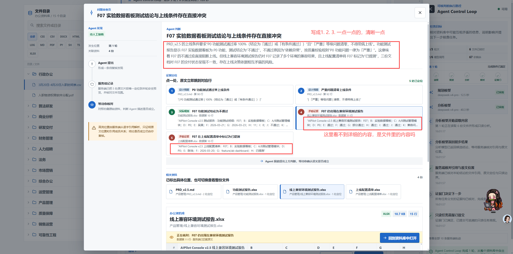
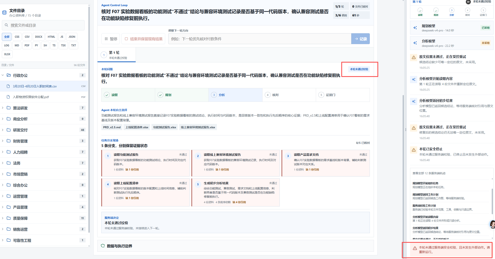
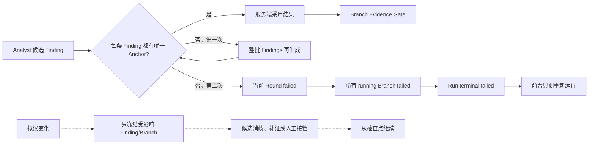
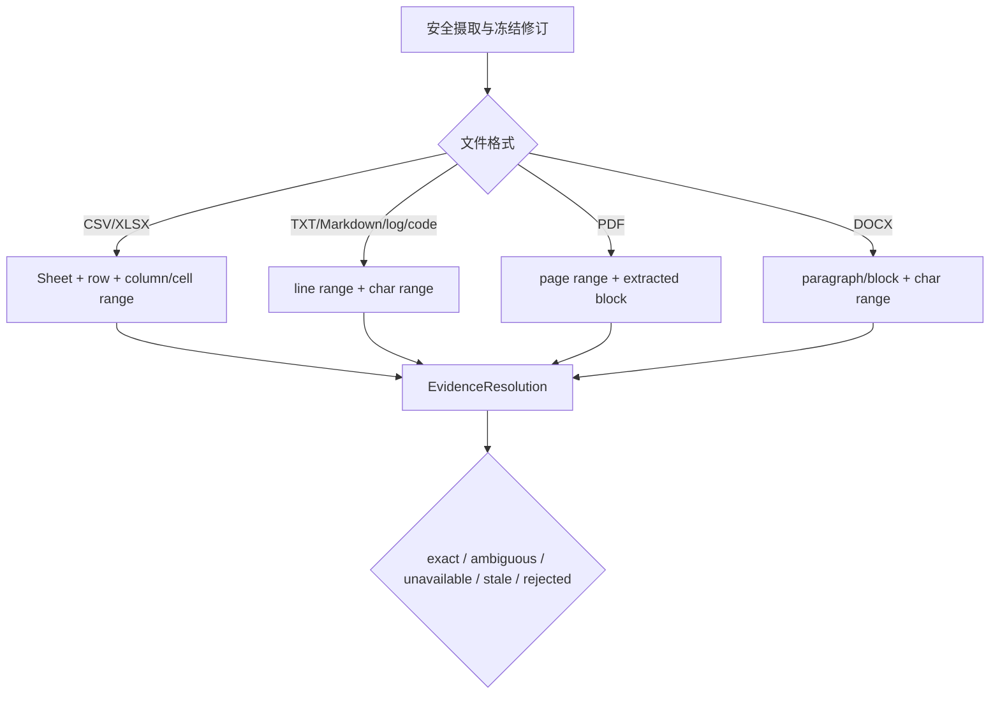
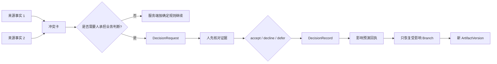
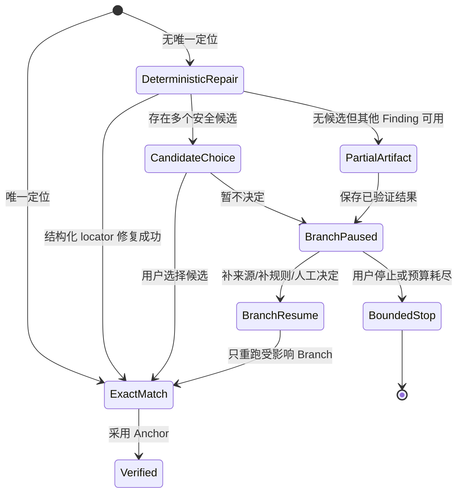

# Office Agent 可处置人工决策与失败恢复：深度研究、交互推导与实施建议

> 日期：2026-08-26
> 状态：`Research and design record / Draft`
> 目的：把最新 Stakeholder 负例、当前源码事实、官方产品实践和人机协作研究，转成可直接
> 指导现行 Agent Control Loop 的前台输出、服务端状态与办公场景。
> 边界：本文不是已实现能力、竞品实测或用户研究结论。凡使用“建议、应、拟”均表示待实现
> 设计；当前实现事实单独标注。

> 实施后记（同日）：本文保留的是 `DR-0030` 实施前的负例与设计推导。当前 Runtime 已落地
> `exact/ambiguous/unavailable`、Finding/Branch/Artifact 部分保留、accept/decline/defer
> DecisionRecord、候选消歧与目标 Branch 恢复；`stale/rejected`、可写 Artifact、Tool approval
> 和外部动作仍是目标设计。现行事实与验证数字以 [`DR-0030`](../decisions/DR-0030-actionable-review-and-recoverable-analysis.md)
> 和对应 Evidence 为准，下面“当前源码事实”应理解为研究开始时的基线。

## 一、这轮研究重新定义了什么问题

现有工作台已经把 Finding 连接到服务端验证的 Evidence Anchor，也支持 Branch、Snapshot、
named SSE、ArtifactVersion 和 TaskCommit。这解决了“Agent 的结论能否回到安全预览”的
第一层问题，却没有解决接下来的三个问题：

1. **证据有冲突时，用户到底要决定什么。** 当前长段解释把事实、推断、建议和责任混在
   一起。用户知道“有问题”，却不知道这是否必须由人决定、可选答案是什么。
2. **用户决定后，系统如何消费这个决定。** 当前控制协议能选择 Branch 继续，但没有把
   人的业务判断固化为有版本、有作用域、有后果的 DecisionRecord。
3. **证据定位失败时，为什么整条 Run 会死掉。** 当前服务端把至少一条 Finding 无法唯一
   定位升级为整轮失败，已完成工作、失败原因和下一步之间没有可操作的桥梁。

因此，这轮创新不是再增加一个“人工确认”按钮，而是在现有 Agent Control Loop 内加入一层
**可处置人工决策与分级恢复协议**：把“不确定”分成可消歧、可补证、需业务裁决、需审批和
真正不可恢复五类，让用户每次都知道“现在缺什么、为什么找我、我的选择会改变什么”。

## 二、当前真实故障链路

### 2.1 前台负例



**图 1 观察：** 当前页面已经展示 Agent 判断、证据角色、关联文件与预览，但没有把问题拆成
编号事实，也没有展示“无需人决定 / 需要人决定”的明确分类。页面没有互斥选项、决定后果、
修改对象和回写回执。这个观察只说明本轮 Stakeholder 看不懂，不可外推为所有用户结论。



**图 2 观察：** 页面停在“本轮未通过校验”，只建议重新运行。用户看不到已保留了什么、
哪个 Finding 或 Branch 失败、是否能选择候选位置、是否能只重试一条 Branch，也不能把人的
定位结果交给 Agent 继续。

原始反馈、截图尺寸与 SHA-256 已保存在
[`USER-FEEDBACK-20260826-ACTIONABLE-RECOVERY`](../sources/USER-FEEDBACK-20260826-actionable-conflict-and-recovery.md)。

### 2.2 源码事实

当前 [`harness_runtime.py`](../../services/api/app/application/harness_runtime.py) 的证据定位路径是：

1. Analyst 为每条 Finding 返回逐字 `evidence_quotes`，位置字段必须为空。
2. `_resolve_text_anchor` 把空白归一化后搜索全文，只有恰好出现一次才生成
   `locator_kind=text_lines`。
3. `_resolve_table_anchor` 在预览行中匹配整行、列名加值或单元格值，同样只有恰好匹配一行
   才生成 `locator_kind=table_rows`。
4. `_resolve_evidence_anchors` 要求每条 Finding 至少有一个 Anchor；任一 Finding 没有可用
   Anchor 就抛出 `HarnessPlanError`。
5. Runtime 允许 Analyst 在预算内修复一次。第二次仍失败时，通用异常路径把当前 Round 和
   其中所有 `running` Branch 标为 `failed`，随后把 Run 转为 terminal `failed`。
6. terminal `failed` 不再接受 `resume`、`steer` 或按 Branch 继续控制。

这条链路保障浏览器不能伪造位置，但把**位置确定性**和**结论可保留性**绑定得过紧：一条
Finding 的 locator 失败，会抹去整轮中其他 Finding 进入部分成果的机会。这里的问题不是
fail closed 本身，而是失败作用域没有缩小到最小可信单元。



## 三、调研依据与可采用结论

| Source ID | 原始来源 | 这份来源明确支持什么 | 本文可采用推导 | 不可推断什么 |
| --- | --- | --- | --- | --- |
| `MICROSOFT-HAX-2019` | Microsoft Research，[Guidelines for human-AI interaction design](https://www.microsoft.com/en-us/research/?p=564561)；[Scope services when in doubt](https://www.microsoft.com/en-us/haxtoolkit/guideline/scope-services-when-in-doubt/) | 18 条经多轮验证的 UI 指南，包括高效纠正、不确定时消歧或降级、解释原因、细粒度反馈和说明操作后果 | locator 多义时先缩小服务范围并让用户选候选，不直接结束整个任务；每个用户决定都要显示后果 | 不证明该套指南在本产品或办公任务上已经提高可用性 |
| `GOOGLE-PAIR-FAILURE-CONTROL` | Google PAIR，[Errors + Graceful Failure](https://pair.withgoogle.com/guidebook-v2/chapter/errors-failing/)；[Feedback + Control](https://pair.withgoogle.com/guidebook-v2/chapter/feedback-controls/) | AI 错误需分类、解释限制并提供前进路径；反馈要说明何时、如何改变体验；早期产品需要人工兜底，打断应少而有用 | 失败卡要展示原因类别、已保留内容、下一步和接管方式；Decision 回执要说明影响范围与生效时间 | 不证明 Google 产品采用本文的具体状态机，也不证明某种按钮布局最优 |
| `OPENAI-AGENTS-HITL-20260826` | OpenAI Agents SDK，[Human-in-the-loop](https://openai.github.io/openai-agents-python/human_in_the_loop/) | 待审批项作为 interruption 暂停；`RunState` 可序列化后 approve/reject 并恢复；未解决项可继续保持待处理 | Decision 应绑定具体 item、参数和 RunState；解决一项不必强迫其他项同时通过 | 当前 Office Agent 没有真实 Tool approval，不能把该模式写成现行执行能力 |
| `LANGGRAPH-PERSISTENCE-20260826` | LangGraph，[Persistence](https://docs.langchain.com/oss/python/langgraph/persistence)、[Interrupts](https://docs.langchain.com/oss/python/langgraph/interrupts)、[Use time-travel](https://docs.langchain.com/oss/python/langgraph/use-time-travel) | 检查点支持中断恢复、故障容错和从旧状态 replay/fork；同一 super-step 已完成写入可以保留 | 人工纠正后只重跑检查点之后的受影响节点；已成功 Branch 不应因相邻节点失败而重算 | 不证明当前顺序 Harness 等同 LangGraph，也不证明已具备任意时间旅行 |
| `MCP-ELICITATION-2025-06-18` | Model Context Protocol，[Elicitation](https://modelcontextprotocol.io/specification/2025-06-18/client/elicitation) | 通过 JSON Schema 请求结构化用户输入；明确区分 `accept`、`decline`、`cancel`，并要求说明谁在请求以及为什么 | 人的业务裁决应是结构化 DecisionRequest/DecisionRecord，而不是无法区分取消和拒绝的自由文本 | 协议不规定具体 UI；Elicitation 也不能请求敏感信息 |
| `A2A-TASK-LIFECYCLE-20260826` | Agent2Agent Protocol，[Specification](https://a2aproject.github.io/A2A/latest/specification/)；[Life of a Task](https://a2aproject.github.io/A2A/latest/topics/life-of-a-task/) | `input-required` 与 terminal `failed` 是不同状态；Task、status、Message 和 Artifact 分离 | locator 消歧、补规则和业务裁决应保持非终态；状态提示不能冒充 Artifact 结果 | 不代表本项目已实现 A2A 或多 Agent 互操作，也不证明 A2A 适合所有内部对象 |
| `ANTHROPIC-CITATIONS-20260826` | Anthropic，[Citations](https://platform.claude.com/docs/en/build-with-claude/citations)；[Messages API citation types](https://platform.claude.com/docs/en/api/typescript/messages) | 不同来源使用 `page_location`、`char_location`、`content_block_location` 等结构化位置 | 安全预览应在摄取时生成格式相关稳定 locator，而不是在结果末端只靠一段 quote 反搜全文 | 不证明 Anthropic 支持本项目所有 DOCX/XLSX 预览语义，也不构成准确率对比 |
| `MICROSOFT-COPILOT-SOURCE-REVIEW-20260826` | Microsoft Support，[Control and review sources of Microsoft Copilot Chat's responses](https://support.microsoft.com/en-US/Microsoft-365-Copilot/control-review-sources-copilot-chat) | 内联引用可悬停、在侧栏打开源文件，也可基于该来源继续提问 | Evidence 卡除了打开原文，还可以提供“以此来源纠正本 Branch”的受控动作 | 官方说明不是竞品实测；不能由未提及内容推断其做不到其他交互 |
| `BUCINCA-COGNITIVE-FORCING-2021` | Buçinca、Malaya、Gajos，[To Trust or to Think](https://www.eecs.harvard.edu/~kgajos/papers/2021/bucinca2021trust.shtml) | `N=199` 实验中，认知强制设计比简单解释更能减少过度依赖，但主观评分更低且效果因人而异 | 高影响决定不应只展示有说服力的 Agent 长解释；可先让人检查证据或形成初始判断 | 单项研究不证明“先判断后建议”适合所有办公用户，也不保证满意度提高 |
| `BANSAL-EXPLANATIONS-2021` | Bansal 等，[Does the Whole Exceed its Parts?](https://idl.uw.edu/papers/ai-explanations-team-performance) | 三个数据集的混合方法研究中，解释没有提高互补团队表现，反而提高了对 AI 建议的接受概率，不论建议正确与否 | 用可观察的证据覆盖、冲突和后果替代单一“Agent 很有信心”的说服性展示 | 不能推断所有解释都有害；结论依赖研究任务与实验条件 |
| `NOTEBOOKLM-SOURCE-CONTROL-20260826` | Google NotebookLM Help，[Add or discover new sources](https://support.google.com/notebooklm/answer/16215270?co=GENIE.Platform%3DDesktop&hl=en-GB) | 用户可选定来源、打开来源并审查研究结果；来源更新和不可访问有明确限制 | 当前 Workspace-first 可继续保留来源控制，但控制动作应下沉到具体冲突和恢复时点 | 不构成 NotebookLM 与本项目的效果对比 |

上述来源共同支持一个方向：**Agent 的解释不是最终交互对象；可定位证据、任务状态、人工
输入、后果预演和恢复检查点才是。** 这是基于多来源的产品推导，不是任一来源的原文结论。

## 四、创新一：把 Evidence Anchor 升级为 Evidence Resolution

当前 Evidence Anchor 只表达“已唯一定位”。新的前台需要知道失败为什么发生，因此建议在
Anchor 之前增加一个服务端对象 `EvidenceResolution`，状态至少分为：

| 状态 | 服务端事实 | 用户看到什么 | 可执行动作 |
| --- | --- | --- | --- |
| `exact` | 一个来源修订中只有一个确定位置 | “已定位”，显示格式化位置与原文 | 打开原文、用于核对 |
| `ambiguous` | 有 2 到 N 个合规候选，服务端不能安全替用户选 | “找到 3 处相同记录，需要你确认是哪一处” | 选择候选、补时间/版本限定、暂不采用 |
| `unavailable` | 本轮安全预览没有可匹配位置，或格式不支持更细定位 | “结论已保留，但这条依据尚未定位” | 添加来源、改写核对问题、保留为未验证 Finding |
| `stale` | Anchor 绑定的 `source_revision` 不再是当前冻结版本 | “来源已更新，旧位置不能直接沿用” | 查看修订差异、重做受影响 Branch、保留旧成果 |
| `rejected` | 候选越界、引用不在批准范围或完整性失败 | “该依据未被服务端采用” | 换来源；安全问题不开放强制采用 |

推荐的 Draft 字段如下。字段名是设计建议，不是现行公开 API：

```json
{
  "resolution_id": "resolution-...",
  "finding_id": "finding-...",
  "file_ref": "forte-...",
  "source_revision": "public-safe-revision",
  "status": "ambiguous",
  "locator_kind": "table_cells",
  "candidates": [
    {
      "candidate_id": "candidate-1",
      "sheet_label": "兼容性测试",
      "row_start": 18,
      "row_end": 18,
      "column_labels": ["代码版本", "结论"],
      "excerpt": "..."
    }
  ],
  "reason_code": "duplicate_quote"
}
```

### 格式相关 locator



核心变化是把 locator 身份放在安全摄取和预览结构中，而不是要求模型临时发明一段“全文只
出现一次”的长 quote。模型仍可提出候选语义依据，服务端仍拥有位置事实；只是服务端不再
把多义位置压扁成无信息的 `None`。

## 五、创新二：Decision Packet 代替一段“Agent 判断”

Decision Packet 不是审批弹窗的换皮，而是把人机边界变成一个可审核任务。它只在同时满足
三项条件时打断用户：决定对结果有实质影响、服务端不能从已批准事实确定答案、继续会浪费
预算或越过责任边界。

### 5.1 前台六区

1. **一句话状态：** “4 条工作线已核对；1 个版本冲突需要你决定；成果 v1 已保留。”
2. **编号事实：** 每一点只含一个可回开陈述，区分“来源事实”和“Agent 推断”。
3. **冲突对照：** 左右并列文件、位置、原文、修订时间和证据角色，不用长段落替代原文。
4. **为什么必须找人：** 明示 `source_conflict`、`policy_choice`、`missing_rule`、
   `high_impact` 或 `locator_ambiguity`。
5. **互斥选择与后果：** 每个选项说明将重开哪个 Branch、读取哪些来源、形成哪个新成果
   版本、预计再用一轮还是停止，以及当前仍不会写文件或执行外部动作。
6. **决定回执：** 展示谁在何时以哪个任务版本作出什么决定，Agent 从哪个检查点继续，
   未采用的选项仍保留在审计记录中。



### 5.2 Draft 服务端对象

```json
{
  "decision_id": "decision-...",
  "run_id": "harness:...",
  "task_version": 14,
  "branch_id": "branch-...",
  "finding_id": "finding-...",
  "reason_code": "source_conflict",
  "question": "上线结论应以功能测试阻断，还是需要先证明兼容记录来自修复后的同一版本？",
  "facts": [
    {"statement": "功能测试记录为不通过", "resolution_id": "resolution-a"},
    {"statement": "兼容测试记录为通过", "resolution_id": "resolution-b"}
  ],
  "options": [
    {
      "option_id": "block_release",
      "label": "先阻断上线",
      "effect": {
        "resume_branch_ids": ["branch-release"],
        "required_file_refs": [],
        "max_additional_rounds": 0,
        "external_action": "none"
      }
    }
  ],
  "state": "open"
}
```

人的回答要区分三种语义：`accept` 表示提交结构化选择；`decline` 表示明确拒绝当前请求或
建议；`defer` 表示现在不决定但保留任务。关闭弹窗不能偷偷解释成否决。对于本项目当前的
只读边界，DecisionRecord 只能改变 Branch 研究路径和逻辑成果，不能被描述成上线审批、
文件修改或外部动作已经执行。

### 5.3 避免“解释越多，盲从越强”

高影响场景默认采用以下顺序，而不是先放一个醒目的“Agent 推荐 A”：

```text
先看两个相互冲突的原文
  -> 用户选择判断标准或写下初步判断
  -> 再展开 Agent 建议及其依据
  -> 用户确认、拒绝或延后
```

普通低风险核对不必增加这一步。界面不显示没有校准依据的“置信度 87%”；改用可观察事实，
例如“2 份来源支持、1 份冲突、1 个位置待确认、1 条 Branch 未完成”。这既降低说服性数字
带来的误解，也与当前 `review_required=true` 的事实边界一致。

## 六、创新三：Recovery Ladder 取代“失败后重新运行”

### 6.1 失败先分类，再决定作用域

| 原因类别 | 建议状态 | 最小作用域 | 默认恢复 | 是否允许整条 Run terminal failed |
| --- | --- | --- | --- | --- |
| 重复原文、多个候选位置 | `input_required` | EvidenceResolution / Finding | 让人选候选或补限定 | 否 |
| 找不到原文但其他 Finding 已验证 | `partially_verified` | Finding / Branch | 保留部分成果，重试该 Branch | 否 |
| 来源缺失或版本不明 | `waiting_input` | Branch | 添加来源、选择权威来源或停止该 Branch | 否 |
| 模型超时、临时 Provider 错误 | `retryable` | 模型调用节点 | 从调用前检查点重试，保留相邻完成写入 | 通常否 |
| 预算耗尽 | `bounded` | Run | 提交带未解决缺口的只读成果 | 否 |
| 用户拒绝继续 | `stopped` | Branch 或 Run | 保留成果和拒绝回执 | 可终止但不是失败 |
| allowlist、hash、symlink、格式完整性失败 | `failed` | 文件或 Catalog；必要时 Run | fail closed，不能强制采用 | 是 |
| Snapshot 无法建立可信版本或任务合同损坏 | `failed` | Run | 停止并要求重新建立合同 | 是 |

### 6.2 七级恢复阶梯



对应前台动作建议为：

1. 服务端先做格式相关确定性修复，不打断用户。
2. 有多个安全候选时，展示 2 到 5 个候选原文，让用户选择。
3. 没有候选时，保留 Finding 为“尚未验证”，不把它混入已核对结论。
4. 继续处理不受影响的 Branch，并形成部分 ArtifactVersion。
5. 需要人时只问一个有边界的问题，说明反馈立即影响哪个 Branch。
6. 接到决定后，从最近可信检查点恢复，不重做已完成 Branch。
7. 只有完整性或可信状态无法维持时，才关闭整条 Run。

### 6.3 失败页面的固定输出

失败页不再以“很抱歉 + 重新运行”结束，而固定回答五件事：

```text
发生了什么：1 条证据在文件中出现 3 次，服务端无法安全替你选择
影响到哪里：仅影响“核对代码版本一致性”分支
已经保留什么：其余 4 条分支、2 个 Evidence Anchor、成果 v1
你可以怎么做：选择候选 / 补充版本记录 / 保留现有结果 / 结束此分支
继续后会发生什么：从第 1 轮验证检查点重跑该分支，最多再调用 1 次 Analyst，不执行外部动作
```

## 七、创新四：Evidence Coverage Map 代替不透明置信度

前台可以把每个结论拆成 Claim 与 Source 的小型覆盖图：

| Claim | 功能测试 | 兼容测试 | 版本记录 | 当前状态 |
| --- | --- | --- | --- | --- |
| 当前版本功能通过 | 反对 | 未涉及 | 版本未知 | 冲突 |
| 兼容记录可用于当前上线 | 未涉及 | 支持 | 缺少同版本证明 | 需要补证 |
| 可以直接上线 | 反对 | 部分支持 | 缺失 | 需要人决定 |

这里的“支持、反对、缺失”必须来自服务端绑定的 EvidenceResolution，不是浏览器对 Agent 文案
做情绪分类。Coverage Map 只表达证据关系和覆盖范围，不表示语义蕴含已经由机器证明。

## 八、对 named SSE、Snapshot 与 Artifact 的具体影响

### 8.1 建议新增的服务端事实

| UI 状态 | Snapshot Draft 字段 | named SSE Draft 事件 | Owner |
| --- | --- | --- | --- |
| 正在定位证据 | `evidence_resolutions[].status=pending` | `evidence_resolution_started` | Verifier |
| 找到多个候选 | `status=ambiguous`、`candidates[]` | `evidence_disambiguation_required` | Verifier |
| 部分成果已保留 | `round.status=partially_verified`、ArtifactVersion | `partial_artifact_saved` | Artifact Workspace & Verifier |
| 等待业务决定 | `decision_requests[].state=open`、`status=waiting_input` | `decision_requested` | Governance Control |
| 人的决定已记录 | `decision_records[]`、版本与作用域 | `decision_recorded` | Governance Control |
| 受影响分支恢复 | `active_branch_id`、检查点与剩余预算 | `branch_resumed_from_checkpoint` | Loop Controller |
| 来源已更新 | `EvidenceResolution.status=stale` | `evidence_became_stale` | Workspace Catalog & Safe Preview |

SSE 仍只是有序变化投影，Snapshot 仍是权威。断线后前端通过 GET 恢复 DecisionRequest、候选
位置、已保留 ArtifactVersion 和剩余预算，不能仅凭最后一条 toast 猜测用户决定是否生效。

### 8.2 Artifact 与 Message 必须分开

- “正在重试定位”“等待你选择”是状态消息，不是成果。
- 已验证 Findings 与未解决缺口可以形成一个 `bounded` 或 `partial` 逻辑 ArtifactVersion。
- DecisionRecord 是治理记录，不自动成为来源事实。它应标明 `human_policy_decision`、
  `human_source_selection` 或 `human_assumption`，不能把人的选择伪装成文件原文。
- 新一轮采用人的决定后，应创建新 ArtifactVersion；旧版本和被拒绝选项继续保留。

## 九、七个具体办公场景

以下场景都是设计推导。场景 1 来自本轮真实 Stakeholder 负例；其余场景以 FORTE 公开办公
文件类型和现有只读边界为载体，用于指导测试，不表示已有真实运行通过。

### 场景 1：F07 功能测试与兼容测试冲突

**触发：** 用户要求核对 F07 实验数据看板是否具备上线条件。Agent 发现功能测试为“不通过”，
兼容测试为“通过”，但无法证明两份记录基于同一代码版本。

**用户动作：** 用户打开冲突卡，逐项查看功能测试行、兼容测试行和版本记录。用户选择“先
阻断上线”“补同版本证明后再判断”或“指定其中一份记录为本轮权威”，也可以延后并交给
测试负责人。

**Agent 路径：** Planner 建立“功能结果”“兼容结果”“版本一致性”三个 Branch。前两个可
完成；版本 Branch 因来源冲突进入 `waiting_input`。用户决定后，只恢复版本 Branch。

**停顿或失败：** 同一句测试结论在日志中多次出现时，EvidenceResolution 进入
`ambiguous`，不把三条 Branch 全部标为失败。

**前台输出：** 顶部显示“2/3 已核对，1 个版本冲突待决定，成果 v1 已保留”；中部列出三点
事实和两侧原文；每个选项显示会重开哪条 Branch、是否需要新来源以及当前 `external_action=none`。

**后端事实：** `decision_id + task_version + branch_id + resolution_id`；DecisionRecord 后，
`branch_resumed_from_checkpoint` 推动新轮次；新 ArtifactVersion 记录修订后的结论。

**证据来源：** `USER-FEEDBACK-20260826-ACTIONABLE-RECOVERY`、当前 Runtime 源码、Microsoft
HAX、MCP Elicitation、LangGraph persistence。

**当前边界：** 本项目只能形成只读上线条件简报，不能真的阻断发布、修改测试记录或批准上线。

### 场景 2：重复日志让原文无法唯一定位

**触发：** 用户要求整理一次生产故障时间线。日志中“连接超时，正在重试”出现几十次，模型
给出的 quote 不能唯一定位。

**用户动作：** 页面展示按节点、时间段和前后文分开的三个候选。用户选择“16:41:23 / node-2”
这一处，或补充“只看首次失败”限定。

**Agent 路径：** Verifier 先尝试 `line range + timestamp + source revision` 的确定性定位；仍有
多个候选时生成 DecisionRequest。选择后只重新验证该 Finding，不重新调用 Planner。

**停顿或失败：** 候选过多或缺少时间字段时，Branch 暂停；其他已建立的故障事实继续进入
partial ArtifactVersion。

**前台输出：** “找到 12 处相同文本，请确认事件窗口”，每个候选显示时间、节点、前后两行
和打开原文按钮；底部显示“选择后不执行修复命令”。

**后端事实：** `EvidenceResolution.status=ambiguous`、候选 locator、用户选定的
`candidate_id` 和新 Evidence Anchor。

**证据来源：** Anthropic 结构化 citation location、Microsoft HAX 的先消歧后行动、Google
PAIR 的 failure path。

**当前边界：** 只读日志预览不能证明根因，也不能运行 shell、重启服务或修改配置。

### 场景 3：财务表中重复供应商与口径选择

**触发：** 用户要求找出重复付款。两行供应商名称相同，但币种、税前税后口径或冲销规则
不同；单个名称不能唯一定位，也不能直接判为重复。

**用户动作：** 用户在表格证据卡中查看 Sheet、行号和关键列，选择“按发票号 + 币种判断”
或补充企业冲销规则。

**Agent 路径：** Planner 分成“重复键检查”“币种换算”“冲销规则”三个 Branch；确定性表格
locator 指向行与列；缺少企业规则时才打断财务负责人。

**停顿或失败：** 规则缺失属于 `missing_rule`，不是模型错误；用户延后时提交带未解决缺口的
bounded 简报。

**前台输出：** Coverage Map 显示哪些列支持或反对“重复付款”；选项后果显示会重新计算哪些
行，但不显示未经校准的“重复概率”。

**后端事实：** `table_cells` locator、DecisionRecord 的 `human_policy_decision` 类型、受影响
行集合和新 ArtifactVersion。

**证据来源：** Anthropic citation type 作为结构化 locator 实践、Buçinca 与 Bansal 关于避免
只靠解释建立依赖的研究。

**当前边界：** 当前项目没有确定性会计计算器、付款系统 Connector 或真实账务写回。

### 场景 4：入职名单与制度条款冲突

**触发：** 人员 CSV 中某岗位需要设备，但 PDF 制度只覆盖正式员工，名单中的人员状态是外包。

**用户动作：** 用户对照名单行和制度页，选择“按外包规则处理”“作为本次例外”或“交给 HR
确认，暂不分配”。

**Agent 路径：** 名单匹配 Branch 完成，资格规则 Branch 等待业务决定。人的例外决定被标为
`human_policy_decision`，而不是冒充 PDF 中已有条款。

**停顿或失败：** PDF 只能定位到提取文本块而不能取得原生版面坐标时，前台明确“安全预览
文本位置”，不伪造页内框选。

**前台输出：** 两列证据、决策原因、三项互斥选择、影响人数和“原文件不会被修改”的说明。

**后端事实：** PDF `page/block` locator、人员表 `table_cells` locator、DecisionRecord、下一轮
只读重算范围。

**证据来源：** Microsoft Copilot 的来源侧栏审查实践、MCP Elicitation、Google PAIR feedback
impact。

**当前边界：** 不进行真实设备分配、邮件通知或 HR 系统更新；敏感人事场景仍需权限和隐私设计。

### 场景 5：合同条款解释需要专业责任人

**触发：** 两份合同附件对违约通知期限写法不同，Agent 不能确定哪份具有更高法律效力。

**用户动作：** 法务先查看两个条款和文件版本，再选择权威附件、要求补签署页或升级给合同
Owner；默认不先显示醒目的 Agent 推荐。

**Agent 路径：** 文本对照可完成，法律效力 Branch 因 `high_impact + authority_conflict` 暂停。
法务决定后，Agent 只更新证据简报中的适用前提。

**停顿或失败：** 用户关闭弹窗记录为 `defer`，不是批准或拒绝；任务保持可恢复。

**前台输出：** 先展示原文、版本和来源，再展开 Agent 的可选解释；明确“这是材料核对，不是
法律意见”。

**后端事实：** open DecisionRequest、角色与 Owner、defer 回执、Snapshot 版本和后续恢复点。

**证据来源：** Buçinca 的 cognitive forcing、Bansal 的 explanation reliance、Google PAIR 对
高风险和人工控制的建议。

**当前边界：** 不替代律师判断，不签署、不发函、不修改合同。

### 场景 6：来源在等待期间发生更新

**触发：** Agent 形成成果 v1 后，用户或上游系统更新了制度文件；旧 Anchor 指向冻结的旧修订。

**用户动作：** 用户查看“旧修订 vs 当前修订”的影响摘要，选择保留 v1、重新验证受影响 Branch
或以新文件启动独立 Run。

**Agent 路径：** Catalog 将旧 EvidenceResolution 标为 `stale`；服务端不静默移动旧 Anchor。
用户选择重验后，从旧 TaskCommit 建立新分支和新 ArtifactVersion。

**停顿或失败：** 如果当前版本无法通过完整性校验，则 fail closed；旧冻结成果继续可读，但不
冒充当前来源结论。

**前台输出：** “来源已更新，v1 仍基于 16:20 的冻结版本”；列出受影响 Findings 和重验成本。

**后端事实：** `source_revision`、旧新修订标识、`evidence_became_stale`、新 TaskCommit。

**证据来源：** LangGraph 的 checkpoint/fork 思路、Microsoft Support 对旧来源需要确认的提醒、
A2A Task 与 Artifact 分离。

**当前边界：** 现有 FORTE 数据集是固定清单；通用来源变更监听与原生文档 Diff 尚未实现。

### 场景 7：任务需要当前不存在的 Connector 或真实动作

**触发：** 用户要求“核对异常后给供应商发邮件并更新采购系统”。当前 Agent 只能读公开文件。

**用户动作：** 用户选择“只生成证据简报”“导出交接问题包”或“申请连接能力”；不能点击一个
看似可用的发送按钮。

**Agent 路径：** 只读核对 Branch 可以完成；外部动作 Branch 在 Admission 阶段以
`capability_missing` 阻断，不进入虚假执行动画。

**停顿或失败：** 这是能力边界，不是整条研究失败。系统保存已验证 Findings，并把未执行动作
单独列为 handoff。

**前台输出：** “分析已完成，发送与系统更新未执行”；显示所需系统、权限、审批和可交接材料。

**后端事实：** `external_action=none`、Capability admission 结果、bounded ArtifactVersion；未来
真实能力必须另有 Approval/Permit/Receipt。

**证据来源：** OpenAI Agents SDK approval 流、A2A status/artifact 分离、Google PAIR manual
fallback。

**当前边界：** Scheduler & Worker Manager、Tool Gateway、Connector、真实 Artifact 写入和 Permit
仍属于目标架构。

## 十、对当前开发任务的落地优先级

### P0：本轮就应修正的状态语义

1. 不再把“至少一条 Finding 无唯一 Anchor”直接升级为所有 running Branch 的 terminal
   `failed`。
2. 保留已成功解析的 Finding 和 Evidence Anchor；失败对象携带 `reason_code` 与候选数。
3. 将可消歧问题投影为 `waiting_input`，提供至少“选择候选、只重试本分支、保留现有结果、
   结束”四条路径。
4. 失败页固定显示影响作用域、已保留成果、恢复位置和 `external_action=none`。
5. 用户决定必须经 expected version 与幂等键提交，回执返回前不改变前台事实。

### P1：下一纵切加入结构化 Decision Packet

1. 为 Finding 建立稳定 `finding_id`，避免用标题和正文猜身份。
2. 新增 DecisionRequest/DecisionRecord，区分 accept、decline、defer。
3. 为每个 option 生成服务端编译的 effect preview：受影响 Branch、所需来源、剩余轮次和无外部
   动作边界。
4. named SSE 增加 decision requested/recorded 和 branch resumed from checkpoint；Snapshot 为
   最终权威。
5. 高影响场景试验“先核对/初判，再展开 Agent 建议”，但保持可关闭，不强迫所有任务增加步骤。

### P2：按格式建立稳定 locator 与来源修订

1. 表格从整行唯一 quote 升级为 Sheet + row + column/cell range。
2. PDF、DOCX、文本分别保留 page/block、paragraph/block、line/char 身份。
3. Anchor 绑定 `source_revision`，来源更新后进入 `stale`，不得静默漂移。
4. 允许 partial ArtifactVersion 和 Branch 局部 replay，验证未受影响 Branch 不重复调用模型。

## 十一、验证设计

自动化首先验证事实契约，而不是“看起来更好”：

| Gate | 必测内容 | 能证明什么 | 不能证明什么 |
| --- | --- | --- | --- |
| Unit | 0/1/多候选、跨格式 locator、stale revision、失败作用域 | 状态机与确定性校验符合契约 | 用户看得懂、语义正确 |
| Runtime | 一条 Finding 失败时其他 Finding/Branch/Artifact 保留；决定后只重跑目标 Branch | 部分恢复和预算没有被整轮重置 | 生产级并发或多实例可靠性 |
| API | expected version、幂等回执、accept/decline/defer、Owner 隔离 | 控制命令有版本和身份边界 | 真实企业身份系统 |
| E2E | 候选消歧、Decision Packet、关闭后恢复、断线 GET 对账、移动端不重叠 | DOM 与服务端字段映射 | 信任、效率和业务价值 |
| Live model | F07 冲突与重复日志至少各跑一次；保留失败案例 | 当前模型适配器在固定样本的真实行为 | 泛化质量、准确率或成本收益 |
| User study | 任务完成率、错误接受率、定位时间、恢复成功率、主观负担 | 特定样本用户的可用性趋势 | 所有用户和生产环境普遍结论 |

建议把关键指标设为“用户能否做对下一步”，而不是点击率：

- 冲突分类正确率；
- 从问题卡打开正确证据位置的时间；
- locator 失败后成功恢复且未重算已完成 Branch 的比例；
- 用户能否准确说出其决定会影响什么、不会发生什么；
- 错误 Agent 建议被用户接受的比例；
- 中断次数、defer 比例和认知负担。

## 十二、最终结论

本轮最重要的新判断是：**Workspace-first 不能停在“让用户看见文件和引用”，还要把文件中的
冲突变成可承担的决定，把失败变成可继续的状态。**

对当前 Office Agent 而言，下一步不是让 Agent 写更长的解释，而是建立四个服务端事实：

1. EvidenceResolution 告诉用户位置是确定、多义、缺失、过期还是被拒绝；
2. DecisionRequest 告诉用户为什么现在必须找他、有哪些互斥选择；
3. DecisionRecord 告诉系统人的回答是什么、作用于哪条 Branch 和哪个版本；
4. Recovery Checkpoint 保证只重跑受影响工作，已核对 Branch 和 ArtifactVersion 不丢失。

这四项会把前台从“Agent 给结论，人找证据，失败就重来”改成“系统列清事实与冲突，人作有
边界的决定，Agent 从可信检查点继续”。它仍是一条受控只读 Agent Control Loop 的演进，
不是完整执行器、不是多 Worker Swarm，也不是对模型正确性的保证。

正在开发的 Codex 任务：
[`codex://threads/019fe97b-43a7-7760-a481-3498c2aeb678`](codex://threads/019fe97b-43a7-7760-a481-3498c2aeb678)。
