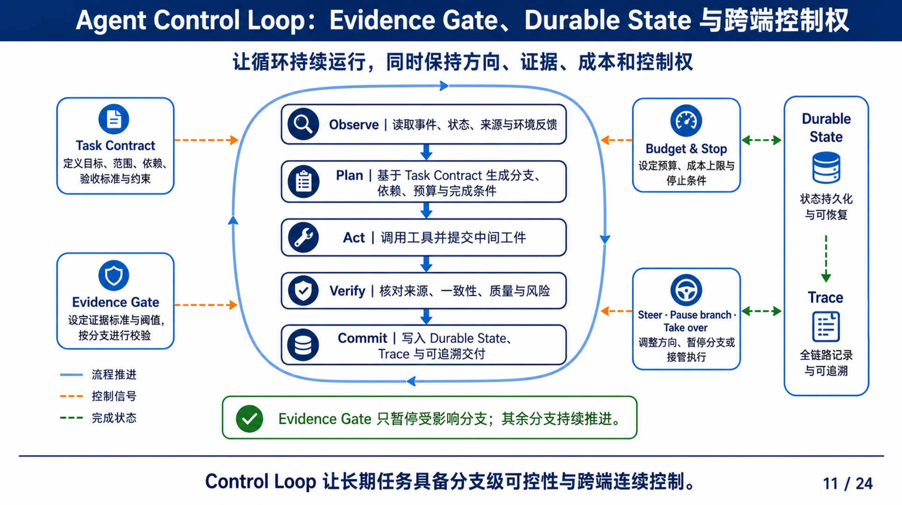

# Agent Control Loop 实现审计、基线与纵切更新

> 版本说明：本文最初审计的是提交 `3ca0163` 之前的单次只读流水，约 `30%` 是该历史
> 基线的架构成熟度估计。实现 `8364b1e` 已完成三轮只读纵切；不要继续把 `30%` 当作
> 当前完成度。当前可验证事实见下方 1.1 与
> [`AGENT-CONTROL-LOOP-BOUNDED-READONLY-20260825`](../evidence/AGENT-CONTROL-LOOP-BOUNDED-READONLY-EVIDENCE-20260825.md)。

## 1. 结论

按用户参考图中的 11 个组成部分等权评估，实现前的完整 Agent Control Loop
大约完成 **30%**。这个数字是历史架构成熟度估计，不是测试覆盖率或模型质量指标。

当时已经形成的是一条有证据约束的**单次只读分析流水线**：

`用户任务与选定文件
-> 冻结文件索引
-> Planner 生成计划
-> 服务端编译和校验计划
-> Analyst 只读分析
-> 服务端校验引用范围
-> memory Snapshot 标记 completed / review_required`

它还不是参考图中的长期 Control Loop。该判断促成了后续纵切：先把 Verify、Evidence
Gate、Budget、Control 和跨轮反馈做成真实主路径，再推进 Durable State 与可写 Artifact。

### 1.1 2026-08-25 纵切更新

实现 `8364b1e` 已在严格限定范围内完成：

- `AgentControlLoopContract` 冻结目标、1-20 份允许文件、最多 3 轮、每轮最多 8 份文件、
  最多 6 次模型调用和 20-300 秒 deadline；
- 每轮真实经过 Observe、Plan、Act(read-only)、Verify 与 Evidence Gate；第一轮缺口能触发
  第二轮，上一轮 Snapshot 不被覆盖；
- 用户能以 expected version 和幂等键 pause、resume、steer、stop；控制只在安全点生效；
- Planner 候选只有通过服务端文件范围、工具、依赖和副作用校验才标为“已采用”；失败候选
  最多进行一次预算内修复，拒绝尝试进入有序 Trace；
- 真实运行完成 2 轮、8 份 FORTE 文件、5 次模型调用、21 条事件；第一轮首次计划被拒绝
  后重试通过；
- 当前 Commit 只是 memory 中的只读 Brief，Durable State、不可变 ArtifactVersion、
  TaskCommit、跨进程恢复、多 Worker 与外部动作仍未实现。

因此应采用“**有界只读 Control Loop 纵切 Limited Verified，完整目标架构仍未完成**”
的口径，而不是把历史 30% 机械改成一个新的总百分比。各模块下一次统一重估应在
Durable State 与 Artifact Commit 纵切后进行。

## 2. 评分口径

- `0%`：当前没有协议或可达行为；
- `25%`：只有协议字段、固定规则或局部占位；
- `50%`：存在有界、自动化覆盖的工程纵切，但尚未进入完整循环；
- `75%`：已经进入真实循环和前台主路径，仍缺生产持久化或完整异常恢复；
- `100%`：达到参考图的目标能力并有运行、恢复、用户和生产证据。

## 3. 模块级完成度（实现前历史基线）

> 下表冻结当时为什么选择本纵切，不能用来描述 `8364b1e` 之后的当前产品状态。

| 模块 | 当前完成度 | 当前真实实现 | 仍缺什么 |
| --- | ---: | --- | --- |
| Task Contract | 45% | 用户提供 3-2000 字任务，显式选择 1-20 个 `file_ref`；服务端拥有 Owner、幂等键、version 和只读边界 | 结构化目标、交付物、验收条件、预算、截止时间、依赖与可编辑契约版本 |
| Observe | 55% | Catalog 校验 15 个文件夹/96 份文件；Run 冻结来源；安全解析所选文件并产生 `workspace_index` 事件 | 循环中的新环境反馈、工具观察、跨轮增量来源、变化检测 |
| Plan | 65% | Planner 真实模型调用；严格 Schema；服务端编译 side effect/human gate 并校验依赖、工具和来源 | 基于 Verify 结果重新规划、多个候选计划、用户调整后续轮次 |
| Act | 15% | Analyst 对安全文件投影做一次只读分析；`artifact.write` 只映射逻辑 `run_workspace_write` | Scheduler、真实 Tool Gateway、Worker、隔离可写工作区和可恢复动作执行 |
| Verify | 35% | 校验 Plan 图、工具、来源、引用 membership、Schema 和只读边界 | 语义蕴含、确定性数值、跨文件一致性、格式、风险和工件质量核验 |
| Commit | 10% | 结果写入当前进程内 Run Snapshot，并进入 `completed/review_required` | 不可变 ArtifactVersion、TaskCommit、digest、lineage、持久化和回滚 |
| Evidence Gate | 30% | manifest/hash/安全解析、来源范围、引用范围和人工复核标记 | 证据阈值、分支级暂停、补证循环、冲突记录和 Gate 恢复动作 |
| Budget & Stop | 10% | 有文件数、内容长度、工作单元数、HTTP/模型超时等实现上限 | Task 级 step/tool/time/cost budget、deadline、收敛判断和可解释停止原因 |
| Steer / Pause / Take over | 0% | 当前公共 Harness 无对应路由、Snapshot 字段或 UI 动作 | 指令记录、暂停/恢复、分支接管、版本冲突与安全提交点 |
| Durable State | 5% | 有 version、sequence、Snapshot 和幂等语义，但全部位于单 API 进程 memory | PostgreSQL 状态、Checkpoint、API 重启恢复、多实例通知和分布式 lease |
| Trace | 65% | named SSE、单调 sequence、Planner/Analyst 回执、采用状态、失败和最终 GET 对账 | Tool/Worker/Artifact/Control 全链路事件、持久审计和跨进程重放 |

等权平均约为 `30%`。如果只问“文件选择、一次规划、一次只读分析、引用回开”
这条当前演示链路，完成度更高；如果问参考图中的长期任务、分支控制和跨端恢复，
则不能用这条成功路径代替完整 Loop。

### 3.1 实现前事实锚点

- [`harness_runtime.py`](../../services/api/app/application/harness_runtime.py)：
  当时的 Run、幂等记录和任务句柄存于进程内字典；`_run()` 依次完成索引、规划、
  校验、分析、引用核验和终态写入。
- [`harness_routes.py`](../../services/api/app/api/harness_routes.py)：
  当时公共路径只有 Workspace 查询、文件预览、Run 创建、Snapshot 查询和事件流，
  没有 Pause、Resume、Steer、Take over 或 Commit 命令。
- [`harness_models.py`](../../packages/contracts/harness_models.py)：
  当时前后端契约拥有 version、sequence、模型回执、计划和引用，但没有 Round、
  Evidence Gap、Loop Budget、Control Event 或 Durable Checkpoint。
- [`harness-workbench.tsx`](../../apps/web/app/harness-workbench.tsx)：
  当时前台能展示资料范围、模型调用、服务端计划、只读分析、失败和来源回开，
  但没有轮次画布、预算、继续条件或中途控制动作。

## 4. 为什么实现前还不是 Loop

### 4.1 当时没有反馈驱动的第二轮

当时 `HarnessRuntime._run()` 是单向流水：
`indexing -> planning -> validating -> analyzing -> verifying -> completed`。
Verify 不会产生新的 Evidence Gap，也不会让 Planner 基于缺口生成第二轮计划。

### 4.2 Act 仍是只读模型分析

计划中的 `artifact.write` 会被服务端翻译为 `run_workspace_write`，表示“结果
只属于本轮工作空间”。至今仍没有真正创建 ArtifactVersion，也没有 Tool Gateway
执行。因此它不能作为“已经 Act 或 Commit”的证据。

### 4.3 完成状态至今仍不耐久

Snapshot、Event 和 Idempotency 都在一个 API 进程内。浏览器可以按 sequence
恢复 SSE，但 API 重启后 Run 消失。这里实现的是传输恢复，不是 Durable State。

### 4.4 当时用户没有中途控制权

当时用户只能在开始前选择文件和任务。开始后没有 Steer、Pause、Resume、
Take over 或“只继续某个研究方向”的动作。

## 5. Agent Control Loop 纵切设计与当前实现

当前目标和实现都不是把 96 份文件一次性塞进 Prompt，而是让 Agent 在有界预算内循环决定：
下一轮需要研究什么、为什么、读取哪些文件、得到了什么、还缺什么。

`Task Contract
-> Observe 目录与已有证据
-> Plan 本轮研究问题和文件范围
-> Act 调用安全读取/表格检查工具
-> Verify 来源、覆盖率、数值与冲突
-> Evidence Gate
   -> 证据足够：Commit Agent Control Loop Brief
   -> 需要人：等待确认
   -> 证据不足且预算允许：进入下一轮
   -> 预算耗尽：停止并说明未完成项`

### 5.1 已实现契约

`AgentControlLoopContract` 当前包含：

- `goal`：用户希望 Agent 研究的问题；
- `workspace_id` 与初始允许文件范围；
- `max_rounds`：用户可设 1-3；
- `max_files_per_round`：用户可设 1-8；
- `max_model_calls`：用户可设 2-6；
- `deadline_seconds`：用户可设 20-300 秒；
- `completion_criteria`：必须产出有来源的推进建议和未解决问题；
- `external_action=none`：第一版严格只读。

### 5.2 每轮状态

`AgentControlLoopRound` 记录：

- 本轮问题与假设；
- 为什么选择这些文件；
- 实际读取的 `file_ref`；
- 实际模型回执与服务端校验过的只读操作意图；
- 新证据、冲突和 Evidence Gap；
- 验证结果；
- 下一轮建议及其理由；
- 剩余预算和停止条件。

### 5.3 最终输出

不要只生成一段“下一步建议”。服务端应拥有结构化
`NextStepProposal`：

- `proposal_id`；
- 中文标题和“为什么现在做”；
- 支撑它的 `evidence_refs`；
- 预期产物；
- 尚存风险或不确定性；
- 下一轮候选文件必须仍属于开始时冻结的允许范围；
- 用户可以选择“调整下一轮方向 / 暂停 / 继续 / 结束并保留”。

最终 `AgentControlLoopBrief` 还应包含已覆盖目录、未覆盖目录、关键发现、
相互矛盾的证据、确定性验证结果和明确边界。

## 6. 前台交互设计

### 左侧：证据地图

- 完整文件夹仍可自由浏览；
- 文件显示“未查看 / 本轮已读取 / 已被引用 / 存在冲突”；
- Agent 的下一轮候选只能来自冻结范围；运行中不能自动扩大范围。

### 中间：研究画布

- 显示当前研究目标、完成条件和剩余预算；
- 按 Round 展示“本轮问题 -> 文件 -> 发现 -> 核验 -> 决定”；
- 新旧结论发生变化时显示差异，而不是覆盖旧内容；
- 最终输出使用可点击来源的推进建议卡。

### 右侧：Control Loop 轨迹

- 区分模型调用、工具读取、服务端校验和人工决定；
- 显示“为什么继续下一轮”和“为什么停止”；
- 不展示 Prompt、思维链、原始 provider response 或内部路径；
- 等待人时固定显示唯一主动作，避免信息过载。

## 7. 已实现的第一条纵切

PR [#28](https://github.com/Dickey007s/lenovo_agent/pull/28) 按以下范围实现 Agent Control
Loop 的三轮、只读、可暂停纵切：

1. 增加 `AgentControlLoopContract`、`AgentControlLoopRound`、
   `AgentControlLoopEvidenceGap`、`AgentControlLoopNextStep` 和 `AgentControlLoopBudget`；
2. 把现有 Catalog/Preview 作为只读文件事实；Plan 中的 `file.read`、
   `table.inspect` 和 `evidence.verify` 仍是服务端校验的业务意图，不冒充真实 Tool Gateway 回执；
3. 新增服务端 Loop Controller，只能从 Verifier 结果决定 commit、wait 或 next round；
4. 增加 `pause / resume / steer / stop` 命令及 expected version/幂等语义；
5. 先使用 memory Store，但协议和 Evidence 明确不称 Durable；
6. 前台增加研究轮次、证据缺口、剩余预算和下一步建议卡；
7. E2E 必须证明至少两轮真实发生、旧 Snapshot 不回退、模型回执不伪造、
   未选文件不进入上下文、预算或人工停止能够终止循环。

## 8. 完成门槛与结果

以下门槛已在限定工程范围内由实现、自动化、真实模型运行和桌面/移动证据满足，因此可称
“Agent Control Loop 三轮只读纵切 Limited Verified”：

- 至少一个 Run 由 Verify 产生 Evidence Gap 并真实触发第二轮；
- 每轮文件范围、只读操作意图、模型回执、验证和预算都来自服务端事实；
- 用户能暂停、调整方向、恢复或停止；
- 最终建议逐项绑定来源，并列出未覆盖范围；
- API/浏览器测试覆盖断线、迟到 Snapshot、预算停止、人工暂停和模型校验失败；
- 文档明确 memory 状态不等于 Durable State；
- 形成性用户测试之前，不宣称界面更清晰或建议更有价值。

## 9. 当前推进建议

1. 下一条纵切把每轮结果写成不可变 ArtifactVersion，并用 PostgreSQL/Checkpoint 证明 API 重启恢复。
2. 把引用 membership 校验扩展为格式、确定性数值、跨文件一致性与明确 ConflictRecord。
3. 在同一 Contract/Event/Artifact 协议上加入 Demo 2 Scheduler/Worker，而不是另造 Demo 专用 Runtime。
4. 再接 Demo 3 Risk/Evidence/Approval/Permit；真实 Connector 必须最后单独验收。
5. 以至少 5 人无引导形成性测试验证“为什么继续/为什么停/如何干预”是否真的更易理解。

当前纵切已经让前台出现“Agent 为什么继续、为什么停、哪次模型结果未采用、下一步需要
什么”的可见影响；下一阶段的重点是让这些状态在进程重启后仍可信，并让 Commit 从内存
Brief 变成可恢复、可追溯、可继续消费的业务工件。
