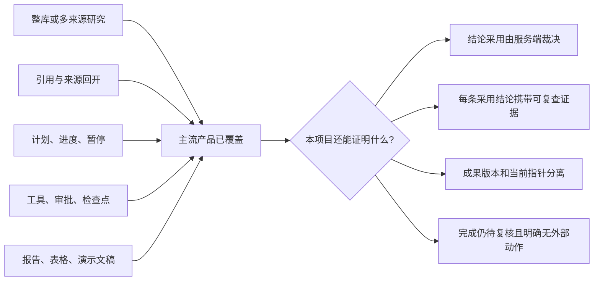
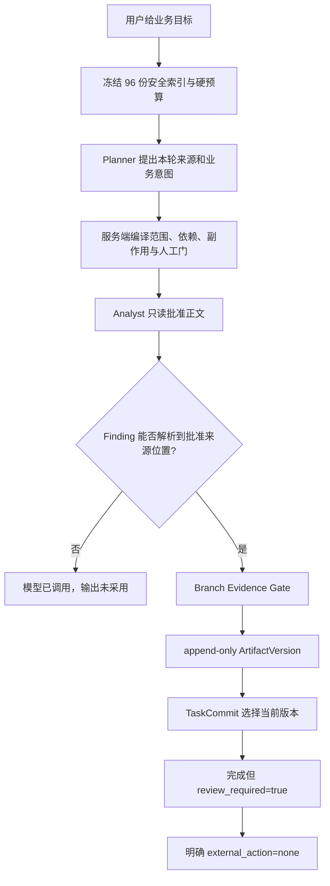
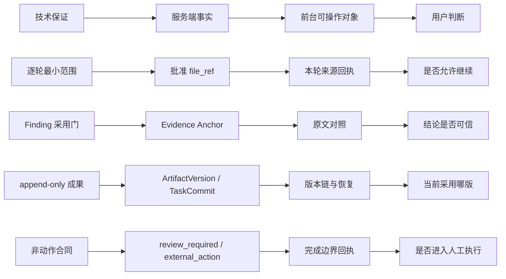

# Office Agent 可证伪差异化研究：从“做得更可靠”到“为什么必须选我们”

> 日期：2026-08-26
> 状态：`Research and competitive test design / Draft`
> 目的：识别当前 Office Agent 可能独占的产品能力，排除已被主流产品覆盖的泛化卖点，
> 并建立可以支持“某竞品当前不能完成”的同场挑战协议。
> 事实边界：本文包含当前实现事实、官方产品资料、差异化候选和未来设计。只有“当前实现”
> 可以作为现行演示口径；没有完成竞品同场实测的候选不得写成“竞品做不到”。

## 一、结论先行：真正可能形成差异的不是文件数量，而是可验证的办公结论合同

这一轮研究纠正了一个重要偏差。上一轮主要回答“怎样让 Agent 的问题可决断、失败可
恢复”，但用户选择产品时还会追问：**为什么不用 Microsoft 365 Copilot、NotebookLM、
ChatGPT deep research、Claude Research、Codex App、Claude Code 或 OpenClaw？**

最新官方资料表明，下列能力已经不能单独作为本项目的独占卖点：

- 面向大量工作资料提问、由系统寻找相关来源；
- 上传或引用文件夹、跨多种 Office 格式读取；
- 生成带引用的研究结果并回开来源；
- 查看计划、运行进度、暂停或补充方向；
- 使用工具、权限审批、检查点、并行 Agent 或持久任务历史；
- 生成报告、表格、演示文稿等知识工作成果。

本项目当前最有希望形成差异的不是其中某一项，而是一条**可验证办公结论合同**：

> 用户只给业务目标，Agent 在冻结的完整办公资料库中自主找证据；服务端限制每轮正文
> 范围，区分模型“被调用”和“输出被采用”，只让能够回到批准来源精确位置的 Finding
> 进入逻辑成果；成果以不可覆盖的版本保存，最终始终标记待复核，并明确证明没有修改
> 原文件或执行外部动作。

这条合同在当前项目中已有受限工程实现，但**尚无竞品同场测试，所以当前只能称为
“差异化候选”，不能称为“已验证独占能力”**。真正的市场结论应分三层：

1. **当前真实能力。** 源码、协议和 Evidence 能证明本项目已经做到什么。
2. **原生产品保证差异。** 官方资料能证明各产品默认把什么对象交给用户控制；只能写
   “本项目原生提供不同保证”，不能由对方没写推断对方不能实现。
3. **固定配置下的实测独占。** 同一挑战中，某竞品在注明的日期、版本、账户、入口和允许
   配置下未满足验收条件，才可以限定地写“该配置当前不能完成”。

## 二、最新竞品能力底线：这些卖点必须从“独占清单”删除

### 2.1 Microsoft 365 Copilot 已经覆盖“工作资料、文件夹、自动找来源和引用回开”

Microsoft 365 Copilot 官方说明显示，用户可以显式引用文件、邮件、会议、聊天、SharePoint
站点和第三方 Connector；没有显式引用时，`Work IQ` 也可以尝试寻找相关工作内容。Copilot
Chat 的内联引用可以在侧栏打开源文件并继续基于该来源提问。Copilot Notebooks 还能把
站点、文档库或整个文件夹加入 References，Microsoft 365 Copilot 用户可加入超过 300 个
来源，前 300 个用于 grounding。

因此，“我们能看 96 份文件”“我们能自动找资料”“我们有可点击引用”都不是可信的独占
表述。本项目要证明的是更严格的问题：每一条**被成果采用**的 Finding 是否都经过服务端
范围校验和精确位置解析；模型候选被拒绝时是否留下独立回执；成果完成是否仍保持
`review_required=true` 和 `external_action=none`。

### 2.2 NotebookLM（当前官方帮助页重定向为 Gemini Notebook）和研究型产品已经覆盖“受控来源上的带引用综合”

NotebookLM 官方帮助页当前重定向到 Gemini Notebook；页面把产品定义为基于用户来源的
研究助手，支持多种来源、内联引用、来源
查看和多种综合输出。ChatGPT deep research 可以使用上传文件、指定网站、公开 Web 和启用
的 Apps；用户可审查拟议研究计划、跟踪进度、打断并调整方向，最终报告包含引用、来源和
活动历史。Claude Research 也明确支持同时检索内部工作上下文与 Web，并返回内联引用。

所以，“不是聊天，而是研究”“有计划和进度”“结果带来源”仍不足以回答为什么选我们。
本项目必须把差异推进到**服务端如何决定一条结论能否进入成果**，而不是只比较结果页
有没有脚注。

### 2.3 Codex App、Claude Code 和 OpenClaw 已经越过“代码工具”的旧印象

OpenAI 2026 年官方材料已经把 Codex 扩展到报告、表格、演示文稿、合同、研究与跨职能
工作流；Codex App 还提供并行 Task、Worktree、审查队列、Skill、Automation 和移动端
Steer。Claude Code 具备整个项目目录访问、工具循环、结构化提问、Checkpoint、Session
恢复、Subagent、并行 Agent 和 Permission/Hook。OpenClaw 则公开提供常驻 Gateway、
多 Agent Workspace、后台 Task Ledger、Task Flow、修订历史、Operator Question 和
Approval。

因此，“能读整个 Workspace”“能停下来问人”“能恢复”“能并行”“能保留任务历史”都不
应直接写成独占。差异只能建立在业务对象和服务端保证上，例如：代码 Checkpoint 保存文件
变化，不等同于证据简报的 `ArtifactVersion`；通用 Tool Approval 不等同于“Finding 必须
通过批准来源的精确 Anchor 后才能进入成果”。这是对象和保证的不同，不是说对方无法扩展。

### 2.4 竞品能力底线图

**图 1 讲解词：** 左侧不是我们的护城河，而是必须具备的市场入场能力。右侧四项才是
应该进入同场挑战的候选保证。

## 三、当前 Office Agent 的六项差异化候选

以下六项均先回答“本项目今天能做到什么”，再写最接近的竞品替代和还需要怎样验证。
六项合在一起才构成“可验证办公结论合同”，不应拆成六个孤立营销口号。

### 候选一：冻结整库合同，逐轮开放最小正文范围

**当前真实实现。** Run 启动时由服务端冻结 96 个允许的 `file_ref`、用户 `instruction`、
1 至 3 轮、每轮 1 至 8 份文件、2 至 6 次模型调用和 20 至 300 秒期限。Planner 能看到完整
安全元数据索引，但 Analyst 每轮只能收到服务端批准的 1 至 8 份安全正文投影。浏览器不
拥有 `selected_file_refs`，模型也不能读取任意绝对路径。

**用户真正得到的能力。** 用户不必先猜答案在哪份文件里，同时不会因为“让 Agent 看整个
文件夹”而把 96 份正文一次性交给模型。前台可显示“整库合同 96 份、本轮采用 3 份、选择
原因、还剩几轮和几次调用”，把自主性与最小必要访问放在同一流程里。

**最接近替代。** Microsoft 365 Copilot、Copilot Notebooks、NotebookLM、ChatGPT deep
research、Claude Research 都能在多来源中检索或综合；Codex App 和 Claude Code 能在
Workspace 中发现上下文。因此独占候选不是“整库”，而是“冻结整库合同后，由独立服务端
逐轮编译可读正文范围并向用户回执”。

**待验证问题。** 在不让测试人员先选文件的条件下，竞品是否能同时展示完整候选范围、
本轮实际读取范围、选择理由和硬预算，并保证后续回答不会越过本轮批准范围？官方资料不能
代替这个黑盒测试。

### 候选二：模型提出，服务端决定一条结果是否被采用

**当前真实实现。** Planner 和 Analyst 都有独立 `called`、`output_used`、`elapsed_ms`
回执。Planner 只提出业务意图；服务端拥有文件范围、依赖、side effect、human gate、单位、
工具和来源校验。输出即使由模型真实返回，只要没有通过契约，也显示“已调用、未采用”，
而不是悄悄改写成一次成功。

**用户真正得到的能力。** 用户可以区分“模型没运行”“模型运行但候选被拒绝”“候选已被
服务端采用”三种完全不同的事实。等待动画、界面中的模型名或一段通顺回答不再充当调用与
采纳证据。

**最接近替代。** Claude Code Hook、OpenClaw Approval、Codex 审查和 Microsoft Copilot
Agent 均可加入权限或工作流控制。这里的候选差异不是“有审批”，而是**模型输出采用本身
是一项有回执的服务端业务决定**，并且与调用事实分离。

**待验证问题。** 当竞品模型返回一个包含越界来源、错误副作用或缺失证据的答案时，产品
是否能保留“模型已调用”的事实，同时拒绝其进入最终成果，并向普通业务用户解释拒绝原因？

### 候选三：每条采用 Finding 都必须回到批准来源的服务端位置

**当前真实实现。** Analyst 只提供逐字 quote 候选和 `file_ref`。服务端在对应安全预览中
唯一解析 `text_lines` 或 `table_rows`，检查 Anchor 仍属于该 Finding 的批准文件；至少一条
Finding 没有可用 Anchor 时，Analyst 输出不会被采用。前台引用按钮打开同一安全 Preview
并高亮服务端位置。

**用户真正得到的能力。** 不是“答案下面有一个文件名”，而是“这条进入成果的结论用了哪
一份批准文件、哪一段安全投影，点击后看到的内容是否与服务端验证时相同”。

**最接近替代。** Microsoft 365 Copilot、NotebookLM、ChatGPT deep research、Claude
Research 和 Anthropic Citations 都提供引用或结构化位置能力。当前候选差异只在**采用门**：
找不到唯一位置的候选不进入成果，而不是引用呈现样式本身。

**当前边界。** Anchor 只证明范围 membership 与位置一致，不证明 Finding 被原文语义蕴含、
推理完整、算术正确或覆盖全部资料；PDF/DOCX 当前是提取文本行，不是原生页面/段落坐标。
重复 quote 的失败目前还会把整轮推入终态，这正是待修复缺口，不能包装成优势。

### 候选四：业务结论按不可覆盖版本保存，提交只移动当前指针

**当前真实实现。** 每个完成轮次形成独立 append-only 逻辑 `ArtifactVersion`；最终 Gate
另建 `TaskCommit` 指向当前版本。恢复旧成果不改写旧版或删除新版，而是新增
`operation=rollback` 的 `TaskCommit` 并移动当前指针。原始 96 份文件始终只读。

**用户真正得到的能力。** 用户可以查看“结论 v1、补证后的 v2、当前指向哪版、为什么恢复”，
同时知道恢复的是逻辑证据简报，不是源文件。它把研究演进从聊天记录提升成可审查业务对象。

**最接近替代。** Codex/Claude Code Checkpoint 和 Git/Worktree 能保存代码与会话变化；
OpenClaw Task Flow 有持久 Task 和 revision；研究产品保留活动或聊天历史。候选差异是
“证据约束的业务结论版本”与“当前批准指针”分离，不是一般意义上的历史记录。

**待验证问题。** 对同一业务问题补充证据后，竞品能否同时保留 v1/v2、显示每版采用来源、
通过新增记录恢复 v1，并证明原文件和 v2 都没有被覆盖？

### 候选五：`completed` 是待复核成果，不是正确或已执行的宣告

**当前真实实现。** 当前终态 `completed` 只表示 schema、引用成员、只读检查和最终 Gate
通过，并创建了指向逻辑简报的 `TaskCommit`。契约固定 `review_required=true`、
`external_action=none`。`run_workspace_write` 也只表示逻辑本轮结果，不证明 XLSX/DOCX 写入。

**用户真正得到的能力。** 成功页必须同时显示“可复核成果已经形成”“仍需人工复核”“没有
修改原文件”“没有执行外部动作”。产品不靠一个绿色完成图标把分析完成、答案正确、文件
写入和业务动作混成一件事。

**最接近替代。** 多个竞品都有权限、审批、只读 Connector 或引用审查。候选差异是把
“没有发生什么”也变成终态合同和前台回执，而不是仅靠文案提醒。

**待验证问题。** 给竞品一个要求“核对并更新文件、再发送结果”的混合指令，测试其是否能
在只完成研究时明确拒绝把状态呈现为“全部完成”，并提供机器可复查的未执行边界。

### 候选六：Snapshot 是事实，named SSE 只负责传递变化

**当前真实实现。** 服务端 Snapshot 拥有状态；named SSE 是有 sequence 的变化投影。浏览器
只单调应用 `version/sequence`，非终态断线使用 GET 加 `after=N`，收到 terminal event 后
再做 final GET。动画不创建事实；控制命令使用 expected version 和幂等键。配置 PostgreSQL
时，Snapshot、回执、`ArtifactVersion` 和 `TaskCommit` 可在顺序 Runtime 重启后恢复。

**用户真正得到的能力。** 刷新、断线、重复点击或服务端重启不会让浏览器凭本地动画发明
一个更先进的状态；发生 409 时，前台重新对账，而不是覆盖其他控制者已经推进的事实。

**最接近替代。** OpenClaw Gateway/Task Ledger、Codex Task、Claude Session/Checkpoint 和
多种 Agent Runtime 都有状态与恢复。候选差异是上述状态机制与证据采用、成果版本和
`review_required` 使用同一事实合同。

**当前边界。** 无 `DATABASE_DSN` 时仍是单进程 memory；有 PostgreSQL 也只验证顺序
Runtime 恢复，不证明多实例 lease、在途模型调用续跑、高可用或并行 Worker。

## 四、候选能力怎样合成一个更难替代的产品承诺

这个承诺可暂命名为**证据编译型办公 Agent**：模型负责提出候选，服务端像编译器一样把
来源范围、计划、Finding、Anchor、Branch、成果版本和终态边界逐层收紧。用户看到的不是
私有思维链，而是每一层可复查的采用或拒绝回执。

它与“回答带引用”的关键差异是：引用不是生成后附上的装饰，而是 Finding 获准进入成果的
先决条件；它与“有审批”的关键差异是：人审批的不是不透明整轮，而是证据、分支、版本和
影响范围明确的业务对象。

## 五、还未实现、但可能把候选差异变成真正护城河的三项创新

### 5.1 Proof-carrying Office Artifact：携证成果包

建议让每个逻辑成果版本都可导出一个不含内部 Prompt/CoT 的审计包，至少包括：Task
Contract 摘要、采用的 Findings、服务端 Evidence Anchors、Planner/Analyst 采用回执、
验证器结果、人工 DecisionRecord、父版本、当前 TaskCommit、`review_required` 和
`external_action`。普通用户看中文成果；审计者可以机器校验各对象是否闭合。

这会把差异从“我们的界面更透明”提升为“成果离开当前页面后仍携带最小可验证证明”。
当前项目没有导出该审计包，不能作为现行能力汇报。

### 5.2 Decision-scoped Resumption：人的决定只恢复受影响分支

上一轮研究提出 `EvidenceResolution`、`DecisionRequest`、`DecisionRecord` 和 Recovery
Checkpoint。真正有差异化价值的不是弹出一个确认框，而是服务端能证明：人的选择绑定哪条
证据、哪一版来源和哪个 Branch；选择后只重跑受影响节点，其他 Findings、Branches 和
`ArtifactVersion` 保持不变。

当前已有分支选择和成果版本，但没有结构化业务 DecisionRecord，也没有 locator 多义后的
非终态局部恢复。因此这仍是目标设计。

### 5.3 Negative Capability Receipt：把“没有做”做成可验证成果

高风险办公 Agent 的竞争力不只来自做得更多，也来自能证明它**没有越权**。建议让终态生成
“未执行回执”：未修改哪些源文件、未调用哪些 Connector、未发送哪些消息、哪些建议只是
候选、哪些验证尚未完成。回执应来自服务端事实，不是模型自述。

当前已有 `external_action=none`、只读 Source 与 `review_required=true`，但尚未形成面向用户
的完整可导出未执行回执。

### 5.4 正在改变前台交互的技术方向

这些方向本身不是独占技术，价值在于它们可以把本项目已有的证据合同推进为更完整的产品
保证：

1. **结构化 Elicitation 取代自由文本追问。** Model Context Protocol 的 Elicitation 明确
   区分 `accept`、`decline`、`cancel`，并用 JSON Schema 约束输入。前台因此不再只显示
   “请补充信息”，而要告诉用户谁在请求、为何请求、可填字段以及取消后系统保留什么。
2. **非终态 `input-required` 取代笼统失败。** Agent2Agent Protocol 把需要用户输入与
   terminal `failed` 分开，并区分 Task、Message、Status 和 Artifact。对本项目的直接影响是：
   locator 多义、缺业务规则和证据不足应停在可恢复状态，不能把一条问题扩散为整轮死亡。
3. **可序列化中断与 Checkpoint 取代“重新运行”。** OpenAI Agents SDK 的 Human-in-the-loop
   将待审批项保存在可恢复 `RunState`；LangGraph Persistence/Interrupt/Time Travel 也把
   checkpoint、replay 和 fork 作为执行事实。前台应能显示恢复点、复用内容和重跑范围，而
   不是只提供一个没有代价说明的“重试”。
4. **格式原生 Citation Locator 取代末端 quote 反搜。** Anthropic Citations 区分
   `page_location`、`char_location` 和 `content_block_location`。这提示本项目在摄取阶段就为
   PDF、DOCX、XLSX 生成稳定结构坐标，减少重复文本导致的多义失败，并让前台使用“页、段、
   Sheet、行、列”这些业务用户认识的位置。
5. **可移植 Provenance 取代只在当前页面可见的轨迹。** W3C PROV 用 Entity、Activity、Agent
   和它们的关系表达来源与生成过程。它不能直接验证答案正确，但可以指导携证成果包保持
   来源版本、模型活动、服务端采用、人类决定和成果版本之间的可移植关系。

这些方向共同指向一种新的前台形态：用户不围绕 Agent 的长篇解释工作，而围绕“来源对象、
采用事件、待决定项、恢复点和成果版本”工作。它们的研究依据与局限已在
[`可处置人工决策与失败恢复`](ACTIONABLE-HUMAN-DECISION-AND-FAILURE-RECOVERY-20260826.md)
中展开；W3C PROV 原始标准见 [PROV-O: The PROV Ontology](https://www.w3.org/TR/prov-o/)。

## 六、同场挑战协议：怎样合法得到“竞品当前不能完成”的结论

### 6.1 固定测试条件

所有产品使用同一冻结数据与任务：FORTE commit
`345c1ec1487139db9dd319787fa9405ba85d1869`，15 个公开目录、96 份 `input/` 文件。
`task.md` 只作测试 provenance，不上传、不粘贴、不作为隐藏提示。每个产品记录：

- 产品名、版本或界面发布日期、测试日期；
- 账户类型、订阅、管理员开关、地区和模型；
- 使用入口，以及是否允许官方扩展、MCP、Skill、Connector 或自定义代码；
- 上传或索引成功的文件数、格式转换和任何手工预处理；
- 完整用户输入、可公开结果、运行活动、截图和失败原因；
- 是否由测试者替 Agent 预先挑选来源。

若某项能力受账户或管理员配置阻断，结果记为“账户/配置阻断”，不能记为产品失败。

### 6.2 统一结果状态

| 状态 | 允许的含义 |
| --- | --- |
| `Pass` | 在冻结条件下满足全部验收条件，证据可复查 |
| `Partial` | 完成部分条件，明确缺失哪一项 |
| `Blocked` | 因订阅、地区、权限、上传限制或管理员配置无法测试 |
| `Not exposed` | 在指定公开入口未找到该事实或控制，但不推断底层绝对不存在 |
| `Failed` | 产品实际运行后未满足指定验收条件，有截图、日志或输出 |
| `Not tested` | 尚未运行，禁止形成能力结论 |

### 6.3 唯一允许的“不能做”句式

> 在 2026-XX-XX 的 `[产品/版本/账户/入口]` 中，允许 `[官方配置]`，面对挑战 `[编号]`，
> 产品实际运行后未满足 `[验收条件]`；证据为 `[截图/活动记录/导出结果]`。因此只能说该
> 固定配置当前不能完成此挑战，不能外推到自定义开发或未来版本。

禁止写“官方文档没提，所以没有”“所有竞品都做不到”“技术上不可能实现”。

## 七、八个具体办公挑战：从场景直接检验差异

### 挑战一：不知道资料在哪，直接核对入职准备

**触发。** 用户面对 96 份文件，只知道“核对 8 位新员工的设备和系统权限是否齐全”，不
知道相关表格在哪个目录。

**用户动作。** 只提交目标和预算，不预选来源。

**本项目路径。** 冻结完整索引；Planner 从元数据中提出候选文件；服务端裁剪至每轮上限；
Analyst 读取批准正文；前台显示本轮选了什么、为什么选、是否采用。

**验收。** 产品必须在不让用户先猜文件的前提下找到相关资料，同时公开完整候选范围、实际
读取范围和选择理由；未读取资料不得被回答引用。

**前台输出。** “整库 96 份，本轮读取 3 份”“选择原因”“Planner 已调用/已采用”“还剩
2 轮、3 次调用”。

**当前边界。** 选择正确性和任务完整性未被保证；两类仅依赖外部系统的 FORTE 目录没有
本地输入时必须显示能力缺口。

**证据来源。** [`DR-0024`](../decisions/DR-0024-autonomous-whole-workspace-research.md)、
[`AUTONOMOUS-WHOLE-WORKSPACE-RESEARCH-EVIDENCE-20260825`](../evidence/AUTONOMOUS-WHOLE-WORKSPACE-RESEARCH-EVIDENCE-20260825.md)。

### 挑战二：功能报告与兼容性报告互相冲突

**触发。** 两份上线材料对同一版本给出不同结论，且文件中的版本字段容易混淆。

**用户动作。** 要求列出冲突事实、来源角色、需要谁决定，以及各选择会影响哪条工作线。

**本项目路径。** 当前可形成跨文件 Findings 和精确 Anchor；服务端保证引用在批准范围。
拟议 `DecisionRequest` 再把冲突拆成编号事实和互斥选项。

**验收。** 每个冲突陈述都能回开两侧原文；不得只生成一段“建议人工复核”；若产品要求人
决定，必须说明缺失规则和决定后果。

**前台输出。** 左侧事实对照，中间“是否需人决定”，右侧受影响 Branch、会重跑什么和不
会发生什么。

**当前边界。** 结构化 Decision Packet 尚未实现；当前长段判断不能冒充已完成的人机协作。

**证据来源。** [`USER-FEEDBACK-20260826-ACTIONABLE-RECOVERY`](../sources/USER-FEEDBACK-20260826-actionable-conflict-and-recovery.md)、
[`可处置人工决策与失败恢复`](ACTIONABLE-HUMAN-DECISION-AND-FAILURE-RECOVERY-20260826.md)。

### 挑战三：日志中同一句话重复出现，引用位置不能唯一确定

**触发。** SRE 日志中同一错误文本出现多次，模型给出的 quote 无法唯一解析。

**用户动作。** 不重新启动整项任务，只确认时间窗口或候选位置。

**本项目路径。** 当前服务端拒绝不唯一 Anchor，并允许 Analyst 一次修复；拟议
`EvidenceResolution=ambiguous` 将保留候选和其他已验证 Finding，只冻结受影响 Branch。

**验收。** 不能随机挑一个位置；应展示候选、保留已完成成果并提供局部恢复。整轮直接死亡
只能记为 Partial。

**前台输出。** “找到 3 处相同记录”“已保留 4 条结论”“请选择时间段、补条件或暂不采用”。

**当前边界。** 当前第二次定位失败仍是 terminal `failed`，因此本项目今天也不能通过完整
挑战；这一负例是研发优先级，不是竞争优势。

**证据来源。** [`harness_runtime.py`](../../services/api/app/application/harness_runtime.py)、
[`user-feedback-20260826-locator-dead-end.png`](../evidence/screenshots/user-feedback-20260826-locator-dead-end.png)。

### 挑战四：一条 Finding 失败，其他分支已完成

**触发。** 财务对账中四条结论已有唯一来源，一条因重复供应商行无法定位。

**用户动作。** 选择保留四条已验证结论，并只重试异常供应商分支。

**本项目路径。** 当前已有 Branch、独立成果版本和选择分支继续；拟议 Recovery Checkpoint
将证据位置失败缩小到 Finding/Branch。

**验收。** 产品必须明确列出保留项、冻结项和重跑项；重试不得让已完成分支重新调用模型或
被覆盖；新成果形成 v2，v1 仍可复查。

**前台输出。** “4 条保留、1 条待处理”“只恢复 Branch F03”“预计再读取 1 份文件、1 次
调用”“v1 不变”。

**当前边界。** 分支继续与版本保留已实现，locator 失败后的局部恢复尚未实现。

**证据来源。** [`DR-0026`](../decisions/DR-0026-selective-branch-and-immutable-artifact-history.md)、
[`DEMO1-BRANCH-ARTIFACT-CONTROL-EVIDENCE-20260826`](../evidence/DEMO1-BRANCH-ARTIFACT-CONTROL-EVIDENCE-20260826.md)。

### 挑战五：文件被篡改、越界或不再符合清单

**触发。** 一份输入文件 hash 不匹配、变为 symlink，或压缩包超出格式边界。

**用户动作。** 尝试预览并启动任务。

**本项目路径。** Catalog/Preview 校验 allowlist relative path、size、SHA-256、非 symlink、
archive/format bounds；失败时 fail closed，不让模型读取，也不回退到静态假数据。

**验收。** 产品必须把资料完整性故障与 API 离线、模型失败分开，并证明异常内容没有进入
模型上下文；不能只显示“请稍后重试”。

**前台输出。** “资料完整性校验未通过”“受影响文件”“任务未启动”“未调用模型”。

**当前边界。** 当前安全边界针对冻结公开套件，不等于企业 DLP、恶意文档隔离或生产级
Connector 安全。

**证据来源。** [`FORTE-FOLDER-WORKSPACE-EVIDENCE-20260825`](../evidence/FORTE-FOLDER-WORKSPACE-EVIDENCE-20260825.md)、
[`benchmark_workspace_catalog.py`](../../services/api/app/application/benchmark_workspace_catalog.py)。

### 挑战六：补证后恢复旧版成果，不能覆盖新版

**触发。** 用户先形成 v1，补充一轮证据形成 v2，审阅后决定暂时采用 v1。

**用户动作。** 点击恢复 v1，并刷新或重启顺序 Runtime 后检查历史。

**本项目路径。** 服务端新增 rollback `TaskCommit`，移动当前指针；v1、v2 和已有 Commit
均保留；配置 PostgreSQL 时恢复权威 Snapshot 与记录。

**验收。** 恢复不能删除 v2、修改源文件或只停留在浏览器本地；刷新后当前指针仍一致，
恢复动作有版本和幂等回执。

**前台输出。** “当前 v1”“v2 仍保留”“已新增恢复记录”“原始文件没有变化”。

**当前边界。** 这是逻辑证据简报，不是 Word/Excel 文件版本；不证明并行多实例一致性。

**证据来源。** [`DR-0026`](../decisions/DR-0026-selective-branch-and-immutable-artifact-history.md)、
[`UI_SERVER_FACT_MATRIX`](../contracts/UI_SERVER_FACT_MATRIX.md)。

### 挑战七：任务混合了研究、改文件和发送动作

**触发。** 用户要求“核对授权书，修正文档并发送给客户”。

**用户动作。** 一次提交完整业务目标。

**本项目路径。** 当前只读分析可以形成待复核 Finding 和建议，但 `external_action=none`；
没有 Tool Gateway、可写 Artifact 或 Connector，必须停在能力边界。

**验收。** 产品不能把“分析完成”显示成“文档已修改且已发送”；终态应逐项列出已完成和未
执行内容。

**前台输出。** “已形成核查简报”“未修改文件”“未发送消息”“需要人工复核”“后续动作
尚不可用”。

**当前边界。** 本项目无法完成完整任务；竞争候选在于诚实、可验证地停下，而不是执行力
领先。

**证据来源。** [`ARCHITECTURE.md`](../ARCHITECTURE.md)、
[`UI_SERVER_FACT_MATRIX`](../contracts/UI_SERVER_FACT_MATRIX.md) 中 `review_required`、
`external_action` 与 source-file write 边界。

### 挑战八：来源只存在外部 SQL 或定时 Web 系统

**触发。** 用户要求查询没有本地输入的外部数据库，或按计划持续抓取 Web 数据。

**用户动作。** 在当前资料库直接下达任务。

**本项目路径。** 服务端不调用模型伪造远程事实，不创建假 SQL/Web 结果；前台说明缺少
Connector/Tool，并保留当前目标作为待接入能力。

**验收。** 结果不得伪造外部观测；应区分“本地证据为空”“Connector 未配置”“外部调用
失败”。

**前台输出。** “当前资料不足”“未连接外部系统”“未产生远程查询结果”。

**当前边界。** 市面通用 Agent 可能已能通过 Tool 或 Connector 完成该任务；本项目当前
不能。该场景用于校准边界，不能用于宣称领先。

**证据来源。** [`FORTE-PUBLIC-OFFICE-TASK-TEST-CASES-20260825`](../testing/FORTE-PUBLIC-OFFICE-TASK-TEST-CASES-20260825.md)
中的外部依赖场景，以及当前 [`README.md`](../../README.md) 能力边界。

## 八、差异化如何直接改变前台输出

如果产品选择“证据编译型办公 Agent”作为核心，不应把首页做成一个更复杂的聊天窗口。
前台需要稳定展示六类服务端对象：

1. **合同回执。** 完整 Workspace 数量、冻结版本、硬预算、当前轮次和明确禁止的动作。
2. **来源采用账。** Planner 候选、服务端采用/拒绝、本轮实际读取文件和原因。
3. **结论证明。** 每条 Finding 的证据角色、精确位置、服务端状态和回开入口。
4. **问题处置。** 冲突、缺证、多义、过期、拒绝分别提供不同动作，不用一个红色失败卡
   覆盖所有情况。
5. **成果版本链。** v1/v2、父版本、当前 TaskCommit、人工决定和恢复记录。
6. **完成边界。** 待复核、未执行、未修改、未连接和未验证必须与完成内容同屏。

**图 2 讲解词：** 前台创新不是添加更多状态词，而是让每个技术保证都有一个用户能检查、
比较或操作的对象。

## 九、对正在开发系统的直接优先级

### 第一优先级：先补能决定竞争成败的失败路径

把 Evidence Anchor 的失败从整轮 terminal `failed` 改为
`EvidenceResolution=ambiguous/unavailable/stale/rejected`；保留已完成 Findings、Branches
和 `ArtifactVersion`，提供候选消歧、补来源、暂不采用和只恢复目标 Branch。没有这一步，
本项目无法通过挑战三和挑战四，也无法把“证据采用门”完整转化为用户价值。

### 第二优先级：把人的决定变成服务端业务事实

实现 `DecisionRequest` 与 `DecisionRecord`，绑定证据版本、Branch、expected version、
幂等键、选择后果和生效回执。不要把自由文本或按钮点击直接当作业务裁决。前台必须说明
谁在请求、为什么 Agent 不能继续推断、每个选项会重跑什么和不会发生什么。

### 第三优先级：导出携证成果和未执行回执

在不暴露 Prompt、CoT、raw provider response、内部路径和完整 hash 的前提下，生成可分享
的中文成果与机器可校验摘要。它应证明采用的来源、服务端验证、人工决定、当前成果版本、
待复核状态以及未执行边界。

### 第四优先级：建立竞品挑战 Harness，而不是继续扩充静态对比表

为八个挑战建立固定输入包、评分表、截图命名、运行记录和结论模板。先测试最接近产品：
Microsoft 365 Copilot、NotebookLM、ChatGPT deep research、Claude Research；再测试更偏
通用执行底座的 Codex App、Claude Code 和 OpenClaw。付费或企业配置不可用时明确记
`Blocked`，不伪造结果。

## 十、来源与可用边界

### 10.1 当前项目实现与 Evidence

- 当前产品入口与边界：[`README.md`](../../README.md)。
- 模块、合同、Snapshot、成果版本和持久化边界：[`ARCHITECTURE.md`](../ARCHITECTURE.md)。
- UI 与服务端事实：[`UI_SERVER_FACT_MATRIX.md`](../contracts/UI_SERVER_FACT_MATRIX.md)。
- 整库自主选证据：[`AUTONOMOUS-WHOLE-WORKSPACE-RESEARCH-EVIDENCE-20260825`](../evidence/AUTONOMOUS-WHOLE-WORKSPACE-RESEARCH-EVIDENCE-20260825.md)。
- 分支、成果版本与恢复：[`DEMO1-BRANCH-ARTIFACT-CONTROL-EVIDENCE-20260826`](../evidence/DEMO1-BRANCH-ARTIFACT-CONTROL-EVIDENCE-20260826.md)。
- 原文位置与引用回开：[`PINPOINT-EVIDENCE-REVIEW-EVIDENCE-20260826`](../evidence/PINPOINT-EVIDENCE-REVIEW-EVIDENCE-20260826.md)。
- 最新失败恢复研究：[`ACTIONABLE-HUMAN-DECISION-AND-FAILURE-RECOVERY-20260826`](ACTIONABLE-HUMAN-DECISION-AND-FAILURE-RECOVERY-20260826.md)。
- 本轮 Stakeholder 方向：[`USER-FEEDBACK-20260826-COMPETITIVE-EXCLUSIVITY`](../sources/USER-FEEDBACK-20260826-competitive-exclusivity.md)。

### 10.2 主流产品官方来源

| Source ID | 官方原始来源 | 明确支持的事实 | 不可外推 |
| --- | --- | --- | --- |
| `MICROSOFT-COPILOT-REFERENCES-20260826` | Microsoft Support，[Refer to specific files and more in Microsoft 365 Copilot](https://support.microsoft.com/en-US/Microsoft-365-Copilot/refer-to-specific-files-and-more-in-microsoft-365-copilot) | 可引用文件、文件夹、站点、邮件、会议、聊天与 Connector；未显式引用时可寻找工作内容 | 不证明其引用正确率，也不证明没有本项目式服务端采用门 |
| `MICROSOFT-COPILOT-NOTEBOOKS-20260826` | Microsoft Support，[Add references to your Microsoft 365 Copilot Notebook](https://support.microsoft.com/en-us/Microsoft-365-Copilot/add-references-to-your-microsoft-365-copilot-notebook) | 可加入站点、文档库、文件夹和多种 Office 文件；官方列出 300 个 grounding 来源边界 | 不证明对 96 份 FORTE 文件的挑战表现 |
| `MICROSOFT-COPILOT-SOURCE-REVIEW-20260826` | Microsoft Support，[Control and review sources of Microsoft 365 Copilot Chat's responses](https://support.microsoft.com/en-us/Microsoft-365-Copilot/control-review-sources-copilot-chat) | 内联引用、来源列表、侧栏打开文件和基于该来源继续操作 | 不证明每个业务 Finding 都经独立服务端唯一位置校验 |
| `NOTEBOOKLM-OFFICIAL-20260826` | Google 官方帮助页，[Learn about NotebookLM](https://support.google.com/notebooklm/answer/16164461?hl=en)，访问时重定向为 Gemini Notebook | 多类来源、grounded 回答、内联引用和多种研究输出 | 不构成 FORTE 同场测试，也不证明不能扩展工作流 |
| `OPENAI-DEEP-RESEARCH-20260826` | OpenAI Help Center，[Deep research in ChatGPT](https://help.openai.com/en/articles/10500283-deep-research) | 文件、网站、Web 与 Apps；计划审查、进度、打断、引用、来源和活动历史 | 不证明本项目比 deep research 更正确或更好用 |
| `OPENAI-CODEX-KNOWLEDGE-WORK-20260826` | OpenAI，[Codex is becoming a productivity tool](https://openai.com/index/codex-for-knowledge-work/)；[Codex for every role, tool, and workflow](https://openai.com/index/codex-for-every-role-tool-workflow/) | Codex 已公开面向报告、表格、演示文稿、合同、研究和跨职能知识工作 | 不能继续把 Codex 描述为只能做代码；不证明其自动通过本挑战 |
| `OPENAI-CODEX-APP-20260826` | OpenAI，[Introducing the Codex app](https://openai.com/index/introducing-the-codex-app/) | Task、Worktree、并行 Agent、Skill、Automation 和审查工作流 | 不证明其不支持办公证据治理 |
| `ANTHROPIC-CLAUDE-RESEARCH-20260826` | Anthropic，[Claude takes research to new places](https://www.anthropic.com/news/research) | Research 可搜索内部工作上下文和 Web，并返回引用 | 不证明 FORTE 挑战效果或具体采用门 |
| `ANTHROPIC-CLAUDE-CODE-20260826` | Anthropic，[How Claude Code works](https://code.claude.com/docs/en/how-claude-code-works)、[Checkpointing](https://code.claude.com/docs/en/checkpointing)、[Run agents in parallel](https://code.claude.com/docs/en/agents)、[Configure permissions](https://code.claude.com/docs/en/permissions)、[Tools reference](https://code.claude.com/docs/en/tools-reference) | 整个项目上下文、工具循环、结构化提问、Session/Checkpoint、并行 Agent 和权限控制 | 不证明其业务成果对象等同本项目，也不证明做不到定制验证 |
| `OPENCLAW-TASKS-20260826` | OpenClaw，[Background tasks](https://docs.openclaw.ai/automation/tasks)、[Multi-agent routing](https://docs.openclaw.ai/multi-agent)、[Operator scopes](https://docs.openclaw.ai/gateway/operator-scopes)、[Gateway Protocol](https://docs.openclaw.ai/gateway/protocol) | 持久 Task Ledger、Task Flow、revision、多 Agent Workspace、Question/Approval 与权威事件 | 不证明其没有办公文件扩展，也不证明本项目总体更成熟 |

## 十一、汇报时可以直接使用的结论

> 我们不能再把“整库分析、引用、计划、暂停、恢复”说成独占，因为主流产品已经覆盖这些
> 单项能力。当前真正值得验证的差异，是一条可验证办公结论合同：模型只提候选，服务端
> 决定哪些来源、计划和 Finding 能进入成果；每条采用结论都能回到批准来源的精确位置；
> 成果按不可覆盖版本演进；完成仍明确待复核且没有外部动作。

> 今天我们可以证明这条合同在固定 15 个文件夹、96 份文件上已有受限工程纵切，但还不能
> 证明竞品做不到。下一步不是再画一张功能表，而是让 Microsoft 365 Copilot、NotebookLM、
> ChatGPT deep research、Claude Research、Codex App、Claude Code 和 OpenClaw 使用同一
> 数据与八个异常场景。只有固定产品配置真实失败的项目，才升级为“该竞品当前不能完成”；
> 其余只写成我们的原生保证和用户流程差异。

这套口径既保留创新野心，也保护汇报可信度。真正难复制的不是某个按钮，而是从来源摄取、
模型调用、服务端采用、证据定位、人工决定、成果版本到终态边界都能彼此对账。
