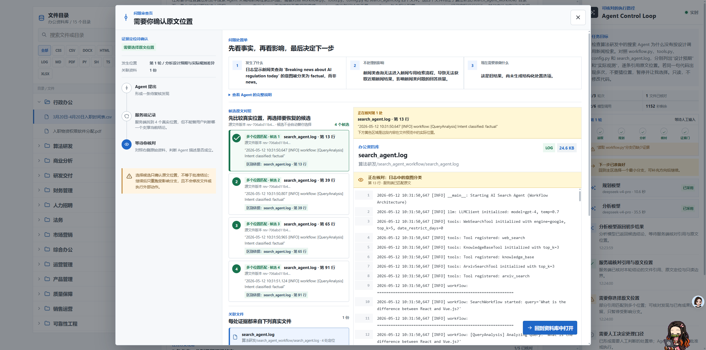
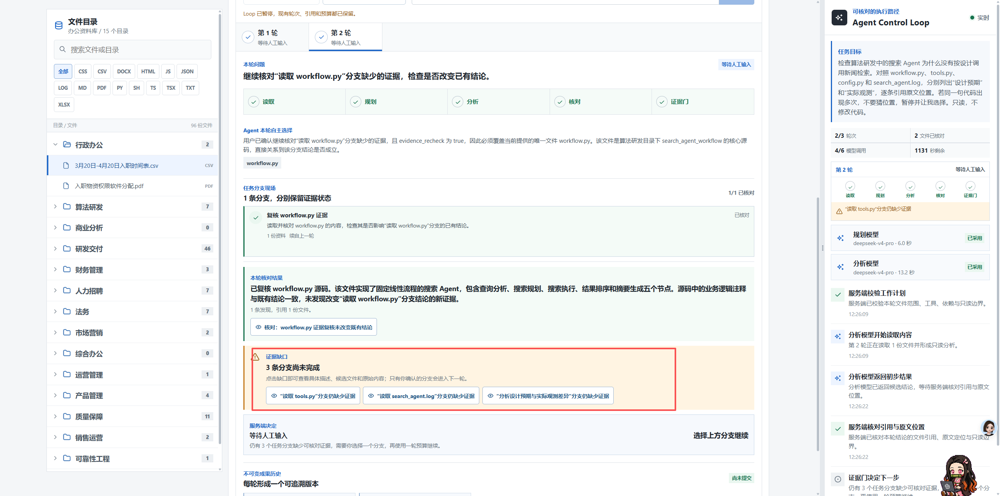
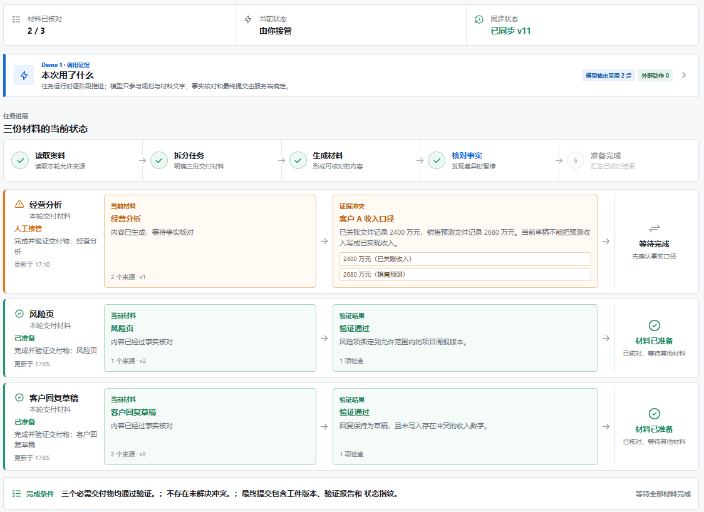

# USER-FEEDBACK-20260827-CLOSABLE-REVIEW-AND-BRANCH-LANES

## 来源

- 类型：Stakeholder 形成性交互反馈
- 日期：2026-08-27，Asia/Shanghai
- 触发页面：真实本地 `http://localhost:3000/` Agent Control Loop
- 关联决策：[`DR-0033`](../decisions/DR-0033-closable-review-and-branch-lanes.md)
- 关联场景：[`SCENARIO-019`](../scenarios/SCENARIO-019-close-review-and-handle-one-branch.md)

## 原始反馈留痕

1. 问题审查页的关闭按钮无法让用户退出。
2. Evidence Gap 已经是 Branch 级事实，不应继续表现为一排扁平按钮；只把这一块改回类似旧设计的分支路径，保留当前页面其他结构。

| 文件 | 尺寸 / 字节 | SHA-256 |
| --- | --- | --- |
| `user-feedback-20260827-review-close-failure.png` | `2560 x 1271` / `555570` | `B69EAFBDB3B1BC89C74BB2D5A78166AABDAACB4E6B8CF08A539A93D40A8E9995` |
| `user-feedback-20260827-flat-gap-list.png` | `2560 x 1271` / `412042` | `013EA1583C15D64B07B383460662D826DE970350036F42DD140CD7C6180D3BEB` |
| `user-feedback-20260827-branch-layout-reference.png` | `1124 x 818` / `120708` | `C0310C5B8CEEDDBD519542F36D8C9B2FC0B10D512B9D92ED476326E0DBB7188A` |

## 支持判断

- 关闭是界面可达性的底线。`defer` 回执失败可以保留待决状态并显示错误，但不能把用户困在模态页。
- Branch 级 Gap 应在同一行显示分支身份、当前材料、Evidence Gate 原因和下一步动作，使用户在点开前就能判断“只影响哪条路径”。
- 本次只重构 Gap 区域，不恢复旧 Demo 页面，也不改变 Workspace、轮次、成果和轨迹结构。

## 局限

这是单一 Stakeholder 对真实页面的形成性反馈，不是目标用户研究；它支持修复范围和设计方向，不证明新布局必然提高理解、效率、信任、任务成功率或业务价值。
