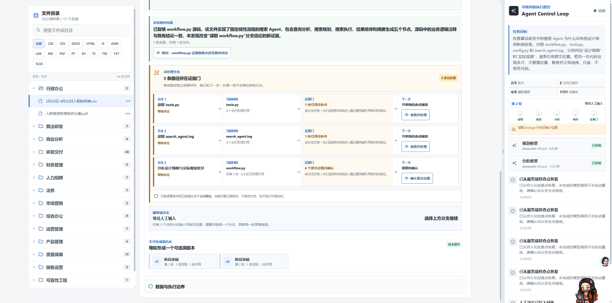
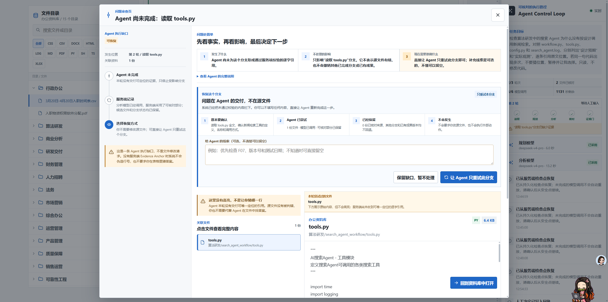

# USER-FEEDBACK-20260827-ONE-ACTION-RECOVERY

## 来源

- 类型：Stakeholder 形成性交互反馈
- 日期：2026-08-27，Asia/Shanghai
- 触发页面：真实本地 `http://localhost:3000/` Agent Control Loop
- 关联决策：[`DR-0034`](../decisions/DR-0034-one-action-recovery-and-explicit-source-choice.md)
- 关联场景：[`SCENARIO-020`](../scenarios/SCENARIO-020-retry-or-select-one-source.md)

## 原始反馈留痕

1. 页面同时展示恢复原因、文件、输入框和多个动作，用户仍不知道“现在要我干嘛”。对于
   `source_location/analysis_output`，用户不需要修改文件或填写答案，只需要明确选择是否让
   Agent 重试当前分支。
2. 待处理分支不能把“直接重试”和“从多个真实原文位置中选择”混成同一种人工任务。
3. 普通重试首屏只保留一个推荐动作，可选线索、停下原因、技术回执和文件预览应渐进披露；
   ambiguous 状态必须先由人从候选位置中选一个，系统不得默认选择。

| 文件 | 尺寸 / 字节 | SHA-256 |
| --- | --- | --- |
| `user-feedback-20260827-recovery-choice-overload.png` | `2560 x 1271` / `407355` | `C3551E434452CA7F3735AEF1725BDD9DD30CB5C8F20E782057FEB8D94109B400` |
| `user-feedback-20260827-retry-modal-overload.png` | `2560 x 1271` / `464536` | `50E18BFE9ACEE7B93974EFD14610AC12067ACF280FC5F0357827148F802324D5` |

## 支持判断

- 人机协作应先判断用户面对的是“授权 Agent 继续”还是“提供只有人能给出的判断”。两者需要
  不同首屏和不同动词，不能仅靠统一的“缺少证据”卡片承载。
- 普通恢复的默认路径是空反馈也可执行的 Branch resume；线索输入不能表现为必填。
- ambiguous 的最低安全交互是无默认选择、候选可比较、选择后主按钮才启用，并明确只恢复绑定
  Branch、保留其他成果且不执行外部动作。

## 局限

这是单一 Stakeholder 对真实页面的形成性反馈，不是目标用户研究。它支持本轮问题定位与交互
约束，不证明新界面必然在 3 秒内被理解，也不证明效率、信任、任务成功率或业务价值提升。
